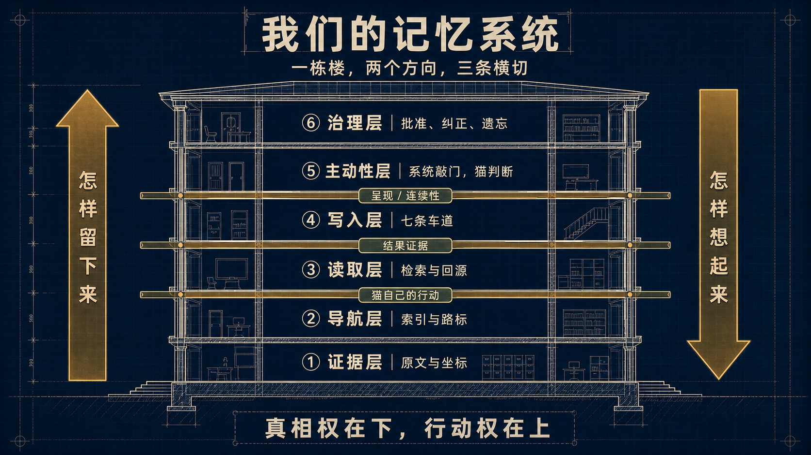

# Memory Architecture Atlas｜记忆系统多视图图谱

> **这是 Clowder AI 记忆系统的唯一导航入口：迷路回这里。**
>
> 本文不复制各 feature 的运行状态，也不取代任何合同。它只负责把同一个系统压缩成可讲述、
> 可查阅的模型，并登记“什么问题由哪份文档拥有”。当前文档保留原路径；第一阶段不批量搬迁，
> 以免破坏历史 thread 中不可变的文件坐标。

## 一分钟讲清楚

Clowder AI 的记忆系统不是一个数据库，也不是“把旧聊天自动塞回 prompt”。它是一条有权力边界的
循环：先保存能回到原文的证据；把值得长期保留的内容交给对应车道治理；用可重建的索引、画像、
卡片和摘要加速理解；让猫主动搜索，或在明确判断点收到一次有界的 recall/write opportunity；再按
当前 invocation 的连续性把 directive、state 或 source pointer 送到猫眼前。最后，纠正、遗忘和权限
变化必须从 canonical owner 传播到所有派生读面，而“被展示”“被打开”“真的采用”“帮助了结果”
始终是四种不同证据。

一句话：

> 我们在造的不是更会存东西的数据库，而是一套“什么值得被想起、谁有权定义、错了怎样撤回”的关系系统。

## 先认坐标：六层、八模块、九面都对

家里曾用三套坐标描述同一个系统。它们用途不同，不应争夺“唯一分层”：

| 坐标 | 回答的问题 | 用途 | 不应该被拿来做什么 |
|---|---|---|---|
| **六层大厦** | 我怎样把它讲给第一次听的人？ | EP04、口播、逐层点亮 | 冒充完整工程 ownership |
| **八个端到端模块** | 一段经历在 runtime 中经过哪些职责边界？ | 架构、实现、故障定位 | 当作演讲目录逐个念名词 |
| **九个观察面** | 我现在想查某类问题，该从哪张图进入？ | 本 Atlas、文档导航、claim 产权登记 | 当作串行 pipeline 或九个 service |

### 六层大厦：给耳朵的叙事

```text
证据层 → 导航层 → 读取层 → 写入层 → 主动性层 → 治理层
```

- **证据层**保存原文、原件和 source coordinate；它可以被纠正或遗忘，但不靠摘要维持真相。
- **导航层**用索引、别名、图和指纹告诉猫去哪里找；导航产物可重建，不拥有内容。
- **读取层**让猫按任务主动搜索、下钻、回源；给坐标，不把候选喂成结论。
- **写入层**包含 Entity、Taste、Profile、Event、Person、Diary 等产品车道，也包含 LL、ADR、
  Method、feedback/episode 等 durable 文件习俗；每一面都要说明从哪里感知、怎样提案、谁裁决、谁消费。
- **主动性层**提供一次“现在是否值得判断”的机会；detector 只报事实，猫给 disposition。
- **治理层**负责批准、拒绝、纠正、遗忘、权限和派生视图失效。

公众叙事图见 EP04 正式主图。



逐层内部结构见 [记忆架构逐层正式图集](./memory-architecture-diagrams.md)；每张图的可维护信息结构与
重画约束保留在 [低保真设计源](./memory-architecture-diagrams-lofi.md)。两者共同回答“导航与读取怎样
分工、每一层里面有什么”，但 current truth 仍由本 Atlas 的 claim registry 所指向的文档持有。

### 八个模块：给实现者的端到端链

```text
[Evidence] ──▶ [Write Opportunity] ──▶ [Governance + Canonical Truth]
     │                                          │
     │                                          ▼
     └────────────▶ [Pull Recall] ◀──── [Projection / Derived View]
                           ▲                      │
                           │                      ▼
                    [Recall Opportunity] ──▶ [Context Presentation]
                                                   │
                                                   ▼
                                            [Current Cat]
                                               │      │
                                               │      └──▶ [Cat seed / action]
                                               ▼
                                      [Outcome observation]
                                               │
                                               ▼
                                [Correction / Forget / Invalidation]
```

完整 current truth + target-state 拓扑由
[Memory System Overview](../memory-system-overview.md) 持有；本图只保留职责关系，不复制它的状态账本。

## 九个观察面：给查阅者的地图

九面成立必须同时满足三条：回答一个不能被其他面替代的问题；至少有一份真实产物或权威文档；
至少有一个明确读者。仅仅“有人写过一篇文档”不足以出生第十面。

| 观察面 | 它只回答什么 | 稳定入口 | 证据、快照或相邻 owner |
|---|---|---|---|
| **原则面** | 记忆为何存在，哪些事无论实现怎样变化都不能做？ | [Memory Philosophy](../memory-philosophy.md) | 写入触发再思考、prior-art source audit |
| **拓扑面** | 当前有哪些职责模块，它们怎样连接、谁不拥有谁？ | [Memory System Overview](../memory-system-overview.md) | [Memory ownership cell](../ownership/cells/memory.md)、[Proactive Relationship Loop](../ownership/cells/proactive-relationship-loop.md)、Research-First roadmap |
| **真相与投影面** | 什么是 canonical truth，什么只是可重建 view；过期怎样可见？ | [Derived View Contract](../memory-derived-view-contract.md) | [Derived View Census](../memory-derived-view-census.md)、[ADR-020](../../decisions/020-f102-memory-system-architecture.md) |
| **读取面** | 猫怎样搜索、融合、重排、下钻并回到原文？ | [Retrieval Pipeline Deep Dive](../retrieval-pipeline-deep-dive.md) | [Memory Cue Source Map](../memory-cue-source-map.md)、[F200](../../features/F200-memory-recall-eval.md)、[F287](../../features/F287-memory-cue-plane.md) |
| **写入面** | 哪些产品 lane 与文件习俗能改变未来判断；感知、提案、裁决、消费是否闭环？ | [Write Surface Census](../memory-write-lane-census.md) | 各 lane/claim-family owner；[Write-Side Autopsy](../memory-write-side-autopsy-2026-07.md) 只作历史基线 |
| **主动性面** | 什么时候值得让猫判断 `propose / defer / abstain` 或浮现旧记忆？ | [Standing Reflex Contract](../memory-standing-reflex-contract.md) | [Context Injection & Reflex Source Map](../context-injection-reflex-source-map.md)、[F282](../../features/F282-proactive-memory-pipeline.md)、[F276](../../features/F276-people-relationship-memory.md)、[F287](../../features/F287-memory-cue-plane.md) |
| **呈现面** | 已经 admitted 的内容怎样按 carrier、continuity、epoch 和 tier 进入当前 context？ | [F296 Context Presentation](../../features/F296-continuity-aware-context-injection.md) | [Context Injection & Reflex Source Map](../context-injection-reflex-source-map.md) |
| **治理面** | 谁能批准、纠正、遗忘、retire、改变 ACL；失效怎样传播？ | lane-owned feature specs + 两份 frozen contract | [Memory ownership cell](../ownership/cells/memory.md)、ADR-028 |
| **结果面** | 某条记忆是被展示、检视、采用，还是帮助/伤害了结果？我们能证明到哪一层？ | [Outcome & Attribution Source Map](../memory-outcome-attribution-source-map.md) | [F200](../../features/F200-memory-recall-eval.md)、[F263](../../features/F263-memory-lifecycle-repair-and-metrics.md) |

### 六层与九面的映射

| 六层叙事 | 主要观察面 | 被六层故意压缩掉、但工程上必须单列的部分 |
|---|---|---|
| 证据层 | 真相与投影面、治理面 | owner、ACL、revision、forget |
| 导航层 | 读取面、真相与投影面 | index/view 的 lineage 与 invalidation |
| 读取层 | 读取面、结果面 | presented ≠ inspected ≠ used |
| 写入层 | 写入面、治理面 | durable surface 各有 canonical authority，不共享审批语义 |
| 主动性层 | 主动性面、呈现面 | why/when/disposition 与“本 epoch 怎样送达”属于不同权力域 |
| 治理层 | 治理面、结果面 | outcome observation 不能直接获得纠错或 truth authority |

原则面与拓扑面是整栋楼的解释框架；呈现面和结果面贯穿多层，因此不会被硬塞进某一层。
F255/F272 的 owned seed、intent 与行动是记忆循环的下游主体边界，不是第十个“记忆处理面”；
其 ownership 由 [Proactive Relationship Loop](../ownership/cells/proactive-relationship-loop.md) 持有。

表中的“稳定入口”只表示这个问题的首个路由目标，不替文档提升成熟度。比如 Memory Philosophy
当前仍是 `draft`；若它与已冻结 ADR/contract 冲突，后者优先，Atlas 必须显式登记分歧而不是替它升权。

## Claim 产权登记：一条事实只在一个地方说现在时

产权按 **claim family** 分配，不按观察面强迫“一面一文档”。同一观察面可以有多个 owner，
但同一条 current-state claim 只能有一个 owner。

| Claim family | Canonical owner | Atlas 可以说什么 | 何时要重新登记 |
|---|---|---|---|
| 记忆系统总体 current/target 拓扑 | [Memory System Overview](../memory-system-overview.md) | 只描述其职责，不复制闭环账本 | 新增/移除模块、权力边界或 opportunity plane |
| 长期原则与否定式判据 | [Memory Philosophy](../memory-philosophy.md) | 一句话摘要 + 链接 | operator/ADR 改变原则，或原则被正式 supersede |
| Pull recall 的真实执行管线 | [Retrieval Deep Dive](../retrieval-pipeline-deep-dive.md) | 说明它横跨导航、读取、证据回源 | 检索阶段、排序权力或输出 envelope 改变 |
| Durable 写入面的四拍 census（产品 lane + 文件习俗） | [Write Surface Census](../memory-write-lane-census.md) | 明示其中 counts 是 as-of snapshot；不复制单 lane current state | census universe/authority map 变化；单 lane 当前状态仍回 feature spec |
| WriteOpportunity 与 durable-surface closure 的共享 invariant | [Standing Reflex Contract](../memory-standing-reflex-contract.md) | 解释四拍与 why/when/disposition 边界 | 合同版本变化 |
| Derived view 的 lineage/invalidation | [Derived View Contract](../memory-derived-view-contract.md) | 解释 truth/view 边界 | 合同版本变化 |
| RecallOpportunity catalog 与 cue 生命周期 | [F287](../../features/F287-memory-cue-plane.md) | 指向 feature 与 [source map](../memory-cue-source-map.md) | producer catalog、authority 或 lifecycle contract 改变 |
| Context presentation / continuity | [F296](../../features/F296-continuity-aware-context-injection.md) | 不复制 carrier 支持矩阵和运行状态 | presentation authority、epoch 或 carrier contract 改变 |
| outcome/attribution 的认识论 ceiling | [Outcome Source Map](../memory-outcome-attribution-source-map.md) | 只保留 presented→inspected→used→outcome 不可互相代证 | 新 typed observation 改变可证明层级 |
| phase、AC、landed/live/UAT/verdict | 对应 feature doc；全局顺序见 roadmap | 不复写详细状态 | owner 或真相源迁移 |

## 我想知道什么？从这里走

| 你的问题 | 第一站 | 何时继续下钻 |
|---|---|---|
| “整套系统到底是什么？” | 本 Atlas 的一分钟版和三套坐标 | 需要 current/target 细节时进 overview |
| “为什么不直接抽取、自动写、自动相信？” | Memory Philosophy | 需要争论过程与外部证据时进 rethink/source audit |
| “一次 search 到底经历什么？” | Retrieval Pipeline Deep Dive | 需要召回健康/行为反馈时进 F200/F256 |
| “已有记忆为什么会在此刻浮现？” | F287 + Memory Cue Source Map | 需要 provider 怎样送达时进 F296 |
| “一件新事怎样变成长期记忆或行为规则？” | Write Surface Census | 找到产品 lane 或文件 claim family 后进入对应 authority owner |
| “谁决定现在值得提议写入？” | Standing Reflex Contract | 查实际注入面与 owner 时进 injection/reflex source map |
| “画像、摘要、索引过期了怎么办？” | Derived View Contract | 查现有 11 类 view 的病灶时进 census |
| “代码合入后猫真的看到了吗？” | F296 | 查 outcome 能证明到哪时进 outcome source map |
| “它到底有没有帮助任务？” | Outcome Source Map | 只有明确 keep/tune/sunset consumer 才进入 eval 设计 |
| “搜到了以后，这轮最多允许怎么用？” | Claim / Use Admission 讨论收敛 | 当前仍回 Philosophy、F287、F296、Derived View Contract 与 Outcome Source Map 分别查边界；讨论稿不是 frozen contract |
| “一条 cue 怎样成为猫自己的 seed、意图和行动？” | [F255](../../features/F255-auto-dream.md) + [F272](../../features/F272-cat-jumps-on-the-table.md) | 查跨 owner 边界时进 Proactive Relationship Loop cell |
| “现在做到哪了？” | 对应 feature doc + Research-First roadmap | 不从历史 discussion 或旧聊天卡片推断 |
| “为什么会长成这样？” | rethink、autopsy、postmortem | 历史材料不能反向覆盖 current truth |

## 文档类型不是可信度等级：它们拥有不同时间语义

| 类型 | 它拥有的东西 | 怎样更新 | 常见误用 |
|---|---|---|---|
| **Atlas** | 心智模型、路由、claim owner | 观察面/owner/路径变化时更新 | 复制各 feature 的实时状态，自己先腐烂 |
| **Overview** | current + target 拓扑、系统级边界 | 架构职责变化时更新 | 被当成所有 feature 的状态数据库 |
| **Contract / ADR** | 稳定 invariant 与否决边界 | 显式 version/supersede | 用实现暂缺否定合同，或用合同冒充运行证据 |
| **Feature spec** | phase、AC、current state、owner | 由 feature owner 持续维护 | 让 Atlas/roadmap 复制整段现状 |
| **Census / source map** | 某个 `as_of` 的取证快照 | 不静默改历史；错误要 correction，新快照要 supersede | 因为有日期就宣称“永不腐烂” |
| **Discussion / research** | 推理、分歧、prior art、出处 | 保留论证史，结论回流 canonical owner | 把探索中的假说当 current contract |
| **Postmortem / autopsy** | 历史事故与 failure mode | 追加修正和后续处置 | 用已修事故描述当前 runtime |

### 开放设计接缝：Claim / Use Admission（尚未冻结）

2026-08-24 的两篇思辨稿没有发现“缺了一个中央 Judge 服务”，而是给既有接缝命了名：
`retrieved / presented / inspected` 之后，当前 consumer 仍需决定候选只可用于导航、soft context，还是
足以支撑 factual claim / action basis。现有 owner 分散在 Philosophy（主权）、F287（cue lifecycle）、
F296（presentation ceiling）、Derived View Contract（source/view 上限）与 Outcome Source Map（可观测
层级）；在明确 consumer 与 trial 前，Atlas 只负责导航，不替它们拼出第二套 contract。

同轮还登记了一个可能的合同 delta：现有 `sourceRefs/revisions` 能回源，但未显式表达多个 derived
views 是否共享同一 evidence ancestor。**同祖后代不能冒充独立佐证**；具体字段与归属仍开放，不先
实现 lineage registry 或 detector。

优先级不因此改写：Claim / Use Admission 修的是读侧污染，Standing Reflex / trigger 修的是“材料根本
没有获得判断机会”。黄挺案即使读侧合同满分，也救不回一只没有响过的门铃。Scout 的带路权同样
需要 query→candidate provenance 与多路 coverage，但不另建中央 Judge。

历史入口：

- [2026-07 Write-Side Autopsy](../memory-write-side-autopsy-2026-07.md)
- [Cloud Memory Stance Collapse Postmortem](../cloud-memory-stance-collapse-postmortem-2026-07.md)
- [2026-05 Architecture Views](../2026-05-05-architecture-views.md)
- 2026-08-02 Closure Plan

## Atlas 自己的 Derived View Envelope

| 字段 | 本 Atlas 的值 |
|---|---|
| `sourceRefs` | 上述 claim registry 中的 canonical docs |
| `sourceRevision` | 初版取证基线 `main@3a5d1aa433853b3a98bdea152ceae8bad8e1d52e`；v1.1 语义增量回源 2026-08-24 discussion；运行状态仍回当前 feature truth，不在 Atlas 复制 |
| `constructedAt / asOf` | 初版 2026-08-18；v1.1 重验 2026-08-24 |
| `validTime` | 直到下列 invalidator 命中；时间流逝本身不是失效证明 |
| `ACL intersection` | 只引用 workspace 内公开共享文档；不复制 owner-private payload |
| `constructorVersion` | `memory-atlas-v1.2` |
| `state` | `fresh`；命中 invalidator 后必须先标 `suspect`，不能继续冒充当前入口 |

### Invalidators

以下变化会使 Atlas 至少进入 `suspect`：

1. 新增一份声称拥有 memory architecture current truth 的文档；
2. 新增/删除观察面，或六层↔九面映射变化；
3. canonical claim owner、文件路径或 supersession 关系改变；
4. opportunity、truth、view、presentation、governance、outcome 的权力边界改变；
5. Atlas 内部链接失效，或一份 memory architecture 文档没有登记到任何观察面。

普通 feature 状态从 `landed` 变成 `live` 不自动使 Atlas 失效，因为该状态由 feature doc/roadmap
拥有；只有 Atlas 复制了那条状态，才产生同步义务。

## 防腐合同：机器查确定性，人审语义

### 新文档出生

新的 memory architecture 文档必须回答四问：

1. 它挂在哪个观察面？
2. 它拥有哪个 claim，还是只提供某时点证据？
3. 它的 `truth mode` 是 current、target、contract、snapshot 还是 historical？
4. 哪些变化会使它 suspect/invalidated，谁负责处置？

答不出来就不应成为新的 architecture truth；discussion/research 可以继续保留探索身份。

### 确定性 guard 的目标合同

执行 guard 应当检查：

- 所有内部 Markdown 链接可解析；
- 声明 `architecture_domain=memory` 的非历史文档都已在 Atlas 挂号；
- 同一 `canonical_for` 不出现两个 current owner；
- snapshot 带 `as_of`，被替代后带 correction/supersedes 关系；
- Atlas 的 envelope 字段与 claim registry 齐全；
- 旧路径若未来迁移，必须先有可验证 redirect/alias，不靠裸字符串替换宣称兼容。

本 v1 冻结的是 guard **合同**，不是声称 executable guard 已经存在。当前已有 docs-discovery index
drift 能力，但这里列出的 memory-domain 挂号、duplicate owner 与全链接检查仍待独立执行面；是否需要
Eval Hub，要等出现明确 keep/tune/sunset consumer 后再决定。

### 冷读验收

一只没有参与建设的猫，只读本 Atlas，应能在五分钟内：

1. 画出“证据→治理真相→派生 view→召回/呈现→结果/失效”的循环；
2. 解释六层、八模块、九面为什么不冲突；
3. 为“搜索管线”“写入判断”“派生视图失效”“是否帮助结果”各指出第一份权威文档；
4. 不把 `main / live / UAT / verdict`、`presented / inspected / used / helped` 混为一谈。

这个验收先作为低成本 dogfood，不默认创建 eval。记忆域经历至少两次真实变更仍能通过后，再把
“领域 Atlas + claim registry + invalidator + guard + cold-read”提炼成 eval 与 self-evolution 的共同模板。

---

*Memory Atlas v1 · as-of 2026-08-18 · 小太阳·Maine Coon/GPT-5.6 Sol*
