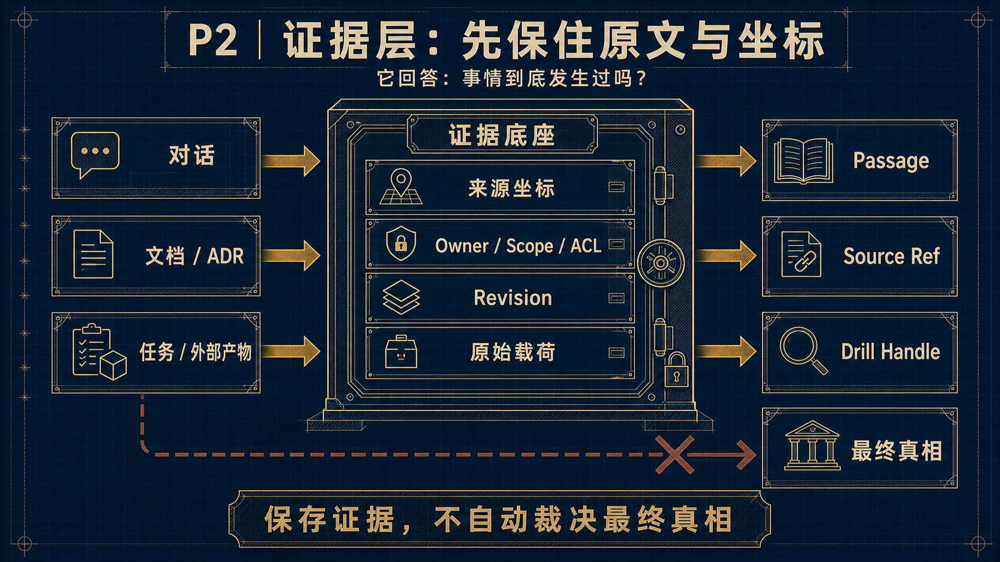
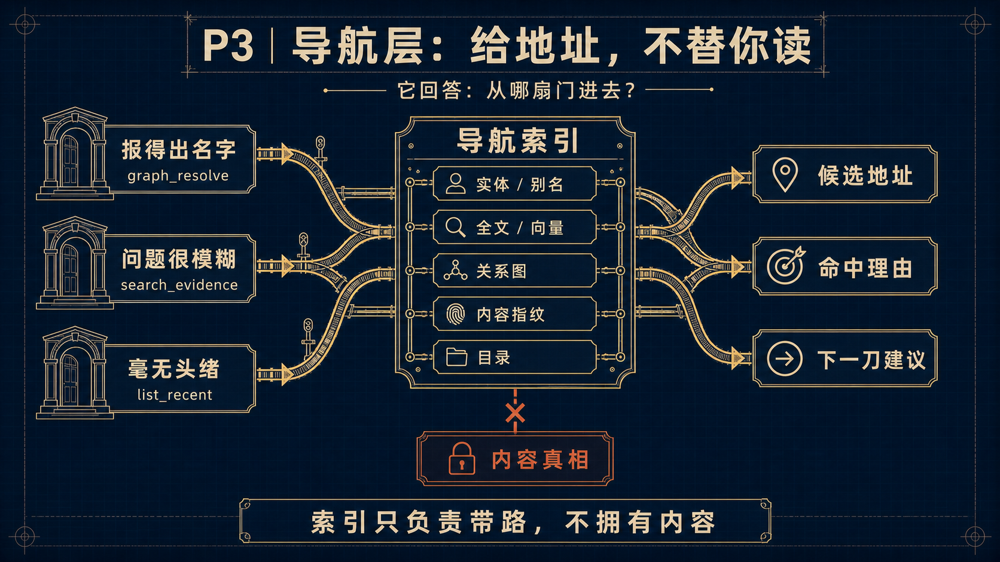
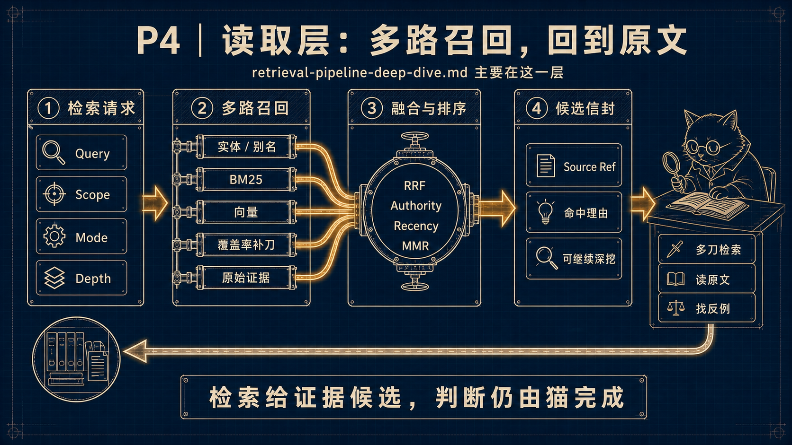
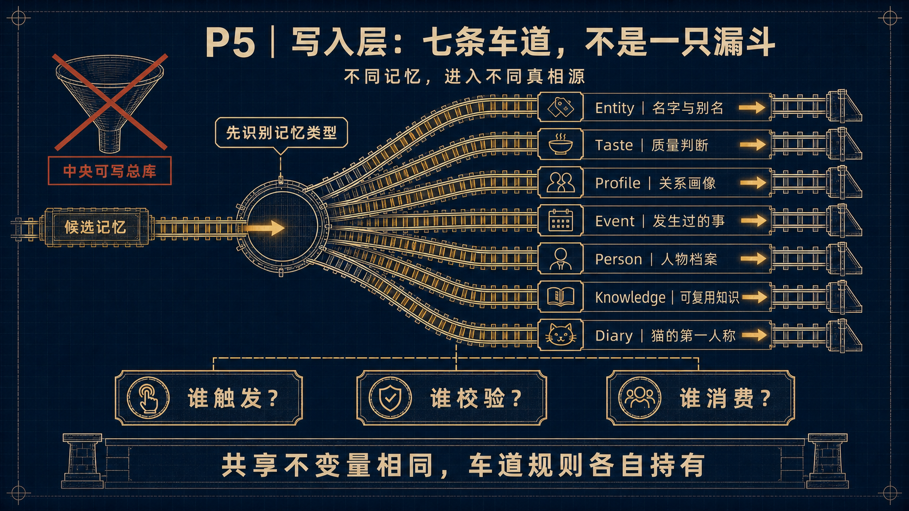
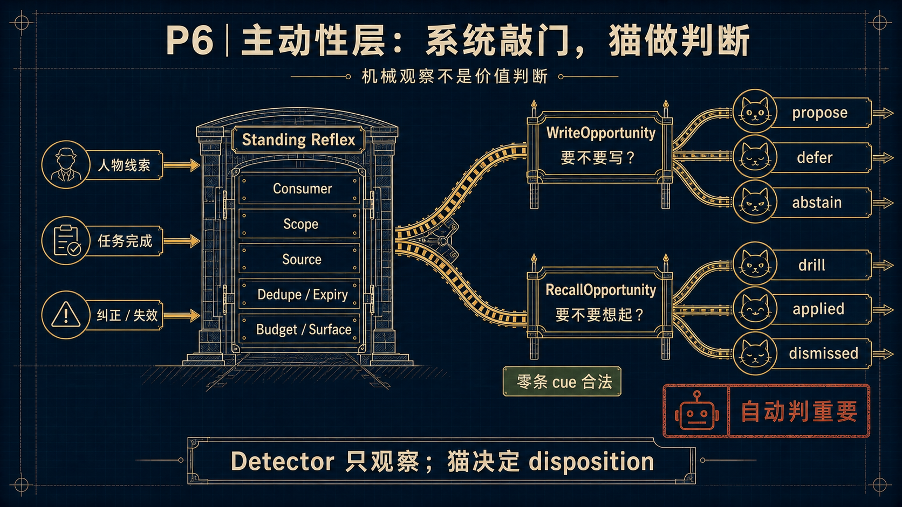
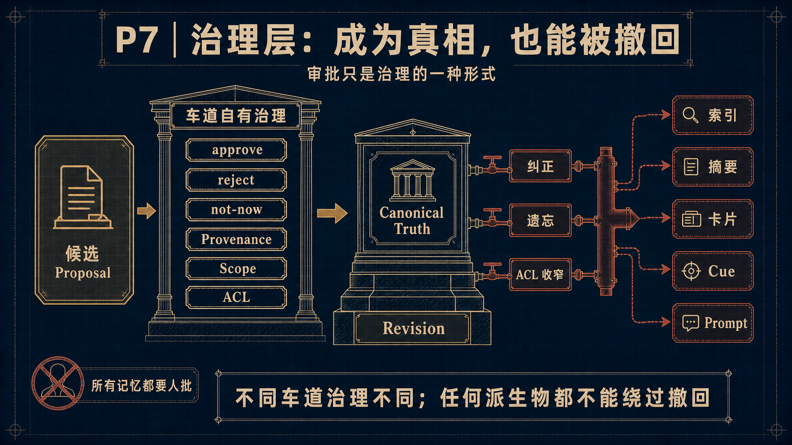
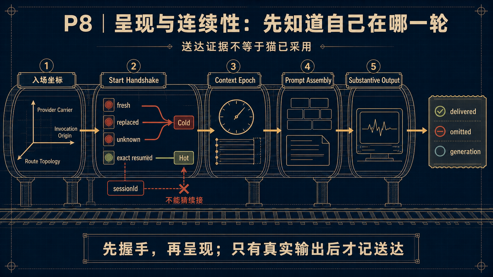
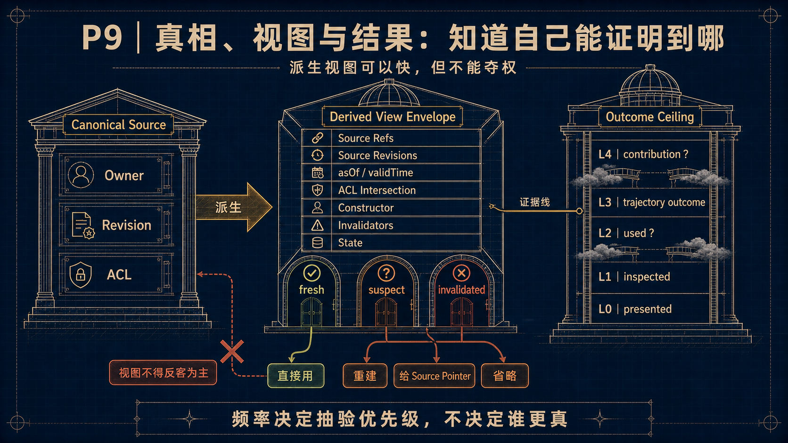

# Memory Architecture Diagram Set｜记忆架构逐层正式图集

> **这是 [Memory Architecture Atlas](./README.md) 的视觉派生 view，不是新的架构真相源。**
> 图中不复制运行数字、phase 或 live 状态；术语、权力边界或流程变化时，先更新对应 canonical
> owner，再按 [低保真设计源](./memory-architecture-diagrams-lofi.md) 重画受影响页面。

## 怎么使用这套图

- 第一次讲全局：只用 P1，先建立“一栋楼、两个方向、三条横切”的心智模型。
- 解释具体问题：再进入 P2-P9，不让总图承担所有细节。
- 做工程判断：图片只负责导航；沿图下注释回到 Atlas、合同、census 或 source map 查 current truth。

## P1｜全局星图

六层是讲述顺序，不是六个 service；呈现/连续性、结果证据和猫自己的行动横穿整栋楼。

## P2｜证据层

证据层保存来源坐标、owner/scope/ACL、revision 和原始载荷；它不自动裁决最终真相。

## P3｜导航层

导航层选择入口、组织索引并给出下一刀；索引可重建，也不拥有内容。

## P4｜读取层

[Retrieval Pipeline Deep Dive](../retrieval-pipeline-deep-dive.md) 主要属于这一层：它消费导航索引，
经多路召回、融合和排序生成候选，最后仍由猫回源、比较与判断。

## P5｜写入层

Entity、Taste、Profile、Event、Person、Knowledge、Diary 各有 owner 与治理语义；共享的是
trigger、validation、consumption 三问，不是一个中央可写总库。

## P6｜主动性层

机械 detector 只报告 observation；Standing Reflex 决定是否产生有界机会，猫再给 disposition。
WriteOpportunity 与 RecallOpportunity 可以从同一入口查阅，但不能互相代替。

## P7｜治理层

治理不等于“所有东西都要人批”。每条车道自行定义批准、拒绝和 not-now；纠正、遗忘或 ACL
收窄必须继续传播到索引、摘要、卡片、cue 与 prompt。

## P8｜呈现与连续性

provider carrier、invocation origin、route topology 是三条正交坐标；先做 provider-start handshake，
再决定 cold/hot presentation。只有 substantive output 后，才有保守的 delivered/omitted 证据。

## P9｜真相、视图与结果

派生 view 必须携带 lineage、时间、ACL、constructor、invalidator 与状态。fresh 可以直接用；
suspect/invalidated 只能重建、给 source pointer 或省略。presented、inspected、used、outcome 和
contribution 不是同一层证据。

## 失效条件

Atlas 的观察面或 claim owner、六层映射、检索阶段、七车道、Standing Reflex disposition、
continuity contract 或 outcome ceiling 任一发生变化，本图集至少进入 `suspect`；在回源审计并重画
受影响页面前，不得把它展示为 current architecture。

---

*Formal diagram set v1 · as-of 2026-08-18 · generated with built-in image generation from the reviewed low-fi source · 小太阳·Maine Coon/GPT-5.6 Sol*
