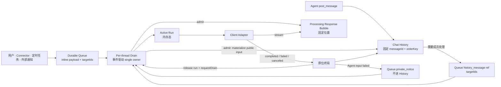

# A2A 消息投递、处理与交接生命周期架构

## 1. 我们重新设计的是什么

一个 thread 同时容纳用户、Agent、Connector 与系统消息。消息可能需要等待、投给一个或多个成员、由用户追加到正在执行的成员，或者由用户 Steer 立即纠正方向。

当前实现的问题不是缺少状态，而是同一件事有太多状态源：Queue、receipt、attempt、InvocationTracker、thread pause 和恢复任务都在回答“这条消息现在归谁”。局部补丁又让普通排队与 Steer 竞争，最终出现 client 已失败但 Queue 停住、消息已经显示却没有结果、或者没有 Agent 执行但 Queue 仍静默积压。

本文只回答一条消息从出现到结果的生命周期：

> 输入何时只存在于 Queue、何时进入共同时间线、队首何时必然被调度、输入如何交给 client、回复如何原位终局，以及失败或重启后用户看到什么。

### 1.1 设计目标

1. Queue Panel 与聊天面板职责分离；进入 Chat History 后，前端流式气泡、最终内容与 Agent 上下文使用同一顺序；
2. Queue 的物理顺序是唯一调度顺序；兼容输入可以共用一次 dispatch，但消息与 entry 身份永不合并，也不隐藏插队；
3. 所有正常 dispatch 经过一个事件驱动的 per-thread drain；
4. 稳定状态下不可能出现“Queue 非空、没有 Active Run、也没有 drain owner”；
5. 每次被接受的运行先有固定响应气泡，成功、失败、取消、重启都原位终局；
6. Steer、Append 与 Cancel 是用户对具体 entry/run 的显式操作，不是正常调度的补救机制；
7. 复用现有未读 cursor 与上下文投影，不再发明第二套 coverage 或 receipt 账本。

### 1.2 非目标

本文明确不设计：

- 持久化 Active Run、重建 provider client 或重启后自动重放；
- per-target attempt history、递归任务树、DAG 或 `all_of` / `any_of`；
- 将多条消息拼成一条正文、覆盖消息边界，或绕过 Queue 顺序的 batching；
- Queue entry 的 `queued / processing / handled / failed` 状态机；
- priority、parked head、thread-wide pause 或无对象的 Continue；
- hold ball、PR/CI wait 与人工审批的完整协议；
- 每种 provider 的具体 append、steer、cancel RPC。

外部等待和 callback principal 可以引用本生命周期中的 exact invocation，但不能反向扩张 Queue。

## 2. 最小模型与单一真相源

系统只有三个业务对象：

| 对象 | 持久化 | 唯一职责 |
|---|---:|---|
| Queue Entry | 是 | 保存一个有序待处理输入、enqueue 时已解析的 targets，以及 Queue UI 回显所需 payload；仍在 Queue 就表示尚未开始正常 dispatch |
| Chat History Message | 是 | 保存已经进入聊天面板的输入、Agent 消息与响应气泡；拥有全 thread 的固定 `orderKey` |
| Active Run | 否 | 表示 target 当前正在处理哪些 exact Queue inputs，并关联唯一响应气泡 |

client adapter 是执行边界，不是第四本账。Scheduler 只是驱动器，不拥有另一份 lifecycle 状态。



三条真相规则：

- Queue membership 是“尚未开始 dispatch”的唯一真相；外部输入在 Queue 中不提前复制为 History message；
- Active Run presence 是 target occupancy 的唯一真相；
- 响应气泡的 `processing / completed / failed / canceled / interrupted` 是输出结果，不是 dispatch acceptance 状态。

## 3. 最小数据契约

### 3.1 Queue Entry：有序待处理输入

```ts
type QueuePayload =
  | {
      kind: 'pending_input'
      source: 'user' | 'connector' | 'scheduled' | 'system'
      authorId: string
      body: MessageContent
      routingWarnings?: RoutingWarning[]
    }
  | {
      kind: 'history_message'
      messageId: string
    }
  | {
      kind: 'private_notice'
      source: 'system'
      body: MessageContent
      relatedMessageIds: string[]
    }

type QueueEntry = {
  id: string
  threadId: string
  targetIds: string[]
  payload: QueuePayload
  enqueuedAt: number
}
```

`targetIds` 是 enqueue 时从结构化 mention 得到、当时有效的成员集合：

- 能解析到成员时保存 exact ids；Queue UI、队首 busy 检查、多目标 admission 与显式操作都直接使用它；
- public `pending_input` 无 mention、mention 解析失败或没有有效成员时保存空数组；空数组明确表示需要在实际出队时选择 fallback；
- entry 到达队首时仍要按当前 thread membership 重新验证；只有 public `pending_input` 在验证后集合变空时按 targetless 处理，Agent history ref 与 private notice 走各自的 typed failure；
- target 相同是共用一次 dispatch 的必要条件，但不是“把消息合成一条”的许可。只有队首开始的兼容输入，或已被同一次未读投影精确覆盖的 wake ref，才可一并取走；每条消息与 entry 的身份、正文和顺序仍然独立。

`pending_input` 用于用户、Connector、定时任务等尚未进入聊天面板的外部输入。它保存 Queue row 完整回显所需的正文、附件与来源元数据，不提前生成 `messageId`。`history_message` 用于已经完整写入 Chat History 的 Agent 消息；Queue 只引用它的 `messageId`，不复制正文。`private_notice` 用于把失败证据交回直接发起 Agent：它只在目标 Agent 的 exact input / situation packet 中可见，永不进入 Chat History，也不在普通 Queue Panel 对用户回显。

Queue Entry 不保存 priority、attempt、receipt 或运行状态。物理顺序就是调度顺序。

每条输入对应一个独立 Queue Entry：

- 每次用户或 Connector 输入是一条 inline payload + 一条 entry；
- 每次 `post_message` 是一条独立 History message；需要成员处理时再建一条 history ref entry；
- 相邻且路由形状、解析后 target set 都相同的 public pending inputs 可以共用一次 dispatch，但会分别 materialize 为独立 History message；
- 多条 wake 可以由同一次未读投影精确覆盖，但不拼正文、不丢 message/entry 边界；
- 拖动重排或删除 entry 是显式用户操作，修改后的物理顺序立即成为新真相。

### 3.2 Chat History Message：进入聊天面板时固定位置

```ts
type LifecycleMessageMetadata = {
  orderKey: string
  source: 'user' | 'connector' | 'scheduled' | 'agent' | 'system'
  authorId: string
  targetRefs?: string[]
  producerInvocationId?: string
}

type ResponseBubble = {
  id: string
  threadId: string
  orderKey: string
  invocationId: string
  targetId: string
  inputEntryIds: string[]
  inputMessageIds: string[]
  body: MessageContent
  status: 'processing' | 'completed' | 'failed' | 'canceled' | 'interrupted'
  startedAt: number
  completedAt?: number
  reason?: string
}
```

`orderKey` 在消息或响应气泡首次进入 History 时分配，之后永不改变。外部输入在 Queue 阶段没有 `messageId/orderKey`；正常 dispatch admission 才把它写入 History，并紧接着写入对应的 processing response bubble。`completedAt` 只用于耗时与诊断，不能重新排序。

进入 Chat History 就表示已经进入聊天面板并成为公开对话事实。只给某个 Agent 的内部通知不能靠隐藏 visibility 状态塞进 History；它必须留在 Queue 的 `private_notice` payload，dispatch 时只进入该 Agent 的 exact input / situation packet。

### 3.3 Active Run

```ts
type ActiveRun = {
  threadId: string
  targetId: string
  invocationId: string
  responseMessageId: string
  inputEntryIds: readonly string[]
  inputMessageIds: readonly string[]
  privateInputEntryIds: readonly string[]
  startedAt: number
}
```

Active Run 保存本轮 exact entry IDs；公开输入另有 `inputMessageIds`，私有通知只列在 `privateInputEntryIds`。需要公开输入的作者、来源或因果信息时从 History 回读；`private_notice` 的来源恒为 system，因此失败时不会递归生成另一条失败通知。正常 dispatch 在调用 provider 前登记 Active Run，同一结构承担 admission 后的 occupancy 与显式操作定位。

provider 只需返回是否接受以及 exact execution handle；动作类型由调用方确定。

## 4. 消息入口

### 4.1 用户、Connector、定时任务与外部通知：先入 Queue，dispatch 时进入聊天面板

```text
收到输入
  → 解析结构化 mention，得到 targetIds（可为空）
  → 创建 QueueEntry(pending_input payload, targetIds)
  → Queue Panel 直接回显 entry payload
  → Queue commit 后 requestDrain(threadId)
  → admission 时才生成 messageId + orderKey 并写入 Chat History
```

Queue Panel 是 public pending input 的唯一用户可见位置，聊天面板只展示已经开始 dispatch 的消息。entry 仍在 Queue 时，输入既不属于 Chat History，也不进入任何 Agent 普通上下文；admission 原子移除 entry、创建 History input 和 response bubble 后，它才同时出现在聊天面板并成为本轮 exact Agent input。`private_notice` 不在普通 Queue Panel 或聊天面板展示，只在被投递目标的 exact input 中可见。

Queue commit 自身就是外部输入的持久边界。排队阶段不需要先写 History，也不存在“为了 Queue 回显而生成 messageId”的双写。

### 4.2 Agent 输出与 `post_message`：每次调用都是独立消息

```text
Agent final / post_message
  → 写一条独立 History message
  → 解析结构化 mention，得到 targetIds
  → 若需要成员处理，创建 QueueEntry(history_message ref, targetIds)
  → requestDrain(threadId)
```

Agent 消息本身已经是完整的聊天内容，因此立即进入 History。没有有效目标时只公开给用户，不创建 Queue entry，也不猜测下一只 Agent。消息若由 live invocation 产生，携带 `producerInvocationId`；它只是因果元数据。

### 4.3 target 在 enqueue 时记录、在队首按 payload kind 确认

入口解析结构化 mention 并把当时有效的 exact `targetIds` 写入 Queue Entry，但不在 enqueue 时猜默认成员。entry 成为队首后必须区分来源：

- `pending_input`：按当前 thread membership 重新验证 stored targets；若结果为空，只有当该 thread 没有任何 Active Run 时才从 Chat History 反向找到最近一条 `status='completed'` 响应气泡的回复成员，并确认该成员当前仍可用；`processing / failed / canceled / interrupted` 都不能成为 fallback 候选。没有历史成员时才使用服务端默认成员；默认成员也不可用时，把该输入 materialize 为可见 failure，不永久卡住队首。
- `history_message`：它只因 Agent 的显式结构化 target 才进入 Queue。target 在 head 时失效必须产生 typed target failure，并通知原 Agent 决定改投或上升；不能 fallback 到最近成员。
- `private_notice`：target 必须 exact-match。目标失效时只记录内部 terminal diagnostic 并结束该 notice；不能写入 History、不能递归通知，更不能把私有内容 fallback 给其他成员。

用户/Connector/定时任务等 pending input 中的裸 `@`、代码片段、未知成员或解析失败只产生 routing warning，并让 `targetIds=[]`；warning 在 Queue row 中即可见，输入进入 History 时继续随消息保留。

因此只有 public pending input 能走 targetless fallback。它不会在其他成员仍运行时猜目标，也不会被后面的显式 target entry 越过。

### 4.4 一条消息的主链：单目标、多目标与失败

```mermaid
sequenceDiagram
    participant I as User / Connector / Agent
    participant Q as Durable Queue
    participant S as Scheduler
    participant H as Chat History
    participant B as Client B
    participant C as Client C

    alt public pending input
        I->>Q: enqueue payload + targetIds
        Note over H: 尚无 input messageId
    else Agent output
        I->>H: publish one message
        I->>Q: enqueue history_message ref + targetIds
    end
    S->>Q: peek exact head; wait until all targets admissible
    Note over Q,H: one admission transaction
    S->>Q: take exact entry / compatible pending prefix
    S->>H: materialize pending inputs + create processing bubble(s)
    par target B
        S->>B: dispatch exact inputs
        B-->>H: update B bubble in place
    and optional target C
        S->>C: dispatch the same exact inputs
        C-->>H: update C bubble in place
    end
    opt a target fails and an input author is Agent
        S->>Q: enqueue private_notice to that exact author
    end
```

单 target 与 multi-target 共用这条主链：一条 `@B @C` 消息仍只有一个 Queue entry 和一份公开 input；admission 后才分别拥有 B/C 的 run 与 response bubble。某个 target 失败不会回滚已经被 sibling 接受的运行。

双入口只在 admission 汇合：public pending input 是 `Queue → History`；Agent output 是 `History → Queue ref`。这两条路径不能被抽象成“所有消息先写 History”，也不能被抽象成“所有消息正文都放 Queue”。

## 5. 事件驱动 Scheduler

### 5.1 目标不变量

目标设计必须满足：

> 不可能稳定停留在“Queue 非空、队首可执行、没有 Active Run、也没有 drain owner”的状态。

Scheduler 不是 timer，也不由“任意 History write”触发。只有四类事件可能改变队首可执行性：

1. Queue Entry enqueue；
2. Queue Entry remove 或 reorder；
3. Active Run 终局并被删除；
4. 进程启动发现 durable Queue 非空。

每个事件在自身提交成功后调用 `requestDrain(threadId)`。所有正常调度、Append、Steer、Cancel 与 Queue 重排都经过同一个 per-thread mutation coordinator。

### 5.2 `requestDrain` 的 dirty-bit 语义

```ts
function requestDrain(threadId: string): void {
  const state = drains.getOrCreate(threadId)
  state.dirty = true

  if (!state.owner) {
    state.owner = runDrain(threadId)
  }
}

async function runDrain(threadId: string): Promise<void> {
  const state = drains.get(threadId)

  while (true) {
    state.dirty = false
    await drainExecutableHeads(threadId)

    if (state.dirty) continue

    // “确认 clean + 释放 owner”必须是同一个内存临界区。
    if (state.releaseOwnerIfStillClean()) return
  }
}
```

drain 已运行时，新事件不能被“已有任务”简单吞掉；它必须置 `dirty=true`，迫使 owner 再检查一轮。owner 只有在原子确认没有新 dirty event 后才能释放。

### 5.3 严格 FIFO drain

```ts
async function drainExecutableHeads(threadId: string): Promise<void> {
  while (true) {
    const head = await queue.peek(threadId)
    if (!head) return

    const resolution = await resolveHead(threadId, head)

    if (resolution.kind === 'wait_for_idle') return
    if (resolution.kind === 'terminal') {
      await terminalizeExactHead(head, resolution.reason)
      continue
    }
    if (resolution.targetIds.some(target => activeRuns.has(threadId, target))) {
      return
    }

    const entries = head.payload.kind === 'pending_input'
      ? await queue.collectCompatiblePendingPrefix({
          head,
          routingClass: resolution.routingClass,
          resolvedTargetIds: resolution.targetIds,
          fallbackSnapshot: resolution.fallbackSnapshot,
        })
      : [head]
    const admitted = await admitExactBatch(entries, resolution.targetIds)
    if (!admitted) continue // 被显式操作或另一 owner 先取走

    await launchAll(admitted)
    // 只等 provider 接受或明确拒绝，不等完整回复。
  }
}
```

正常调度绝不跳过队首：

```text
A 正在运行

Queue:
  M1 → A
  M2 → B

M1 阻塞时 B 不启动。
A 终局 → 删除 Active Run → requestDrain → M1 被处理 → M2 随后启动。
```

FIFO 约束 dispatch 顺序，不要求所有 client 串行执行。M1 被 provider 接受后，drain 可以继续启动 M2；A 与 B 可以并发运行。

Queue 没有 priority。失败通知和普通消息一样追加到队尾；如果用户需要改变顺序，就在 Queue UI 显式拖动、删除或 Steer。

### 5.4 兼容队首批次：一次 dispatch，不合并消息

只有 public `pending_input` 参加队首批次；Agent `history_message` 依靠 §7.3 的实际未读投影消除重复 wake，`private_notice` 始终单独 admission。`collectCompatiblePendingPrefix` 只取得从当前队首开始的最长兼容前缀：

1. 每个 entry 仍是独立消息，顺序连续且没有被用户显式操作；
2. routing class 相同：要么都是显式 targets，要么都是 targetless；不能仅因为 fallback 恰好等于某条显式 target 就混批；
3. 按队首时刻解析后的 exact target set 完全相同；连续 targetless entries 使用同一个 fallback 快照；
4. 所有目标都可 admission；遇到第一个非 pending input、不同 routing class、不同 target set、不可解析项或操作边界立即停止；
5. pending inputs 分别生成 History message，不拼正文；
6. 每个 target 只创建一个 Active Run 和一个 response bubble，`inputEntryIds/inputMessageIds` 保存完整独立列表。

因此连续三条 `M1/M2/M3 → B` 可以一次拉起 B，但 History 中仍是三条输入，Queue UI 仍可在 admission 前分别重排、删除或 Steer。batch 是一次 client 调用的输入集合，不是新领域对象，也不改变“一条输入一个 entry”。

### 5.5 为什么不会静默积压

- enqueue、remove、reorder 后都有 post-commit `requestDrain`；
- 可执行 head 会在 drain 循环中被处理，直到 Queue 空或 head 确实被 Active Run 阻塞；
- 若 head 被阻塞，至少存在一个阻塞它的 Active Run；该 run 终局时必然再次 `requestDrain`；
- targetless head 只等到最后一个 Active Run 删除，同一个终局事件会立即重新触发；
- drain 运行期间到达的新事件置 dirty bit，不会落在 owner 退出窗口；
- 持久提交后、调用 `requestDrain` 前进程退出，由启动扫描重新触发。

因此“消息挤压但没人执行”不是靠 watchdog 定期补救，而是在目标模型中被状态转移本身排除。当前仓库散落的 `tryAutoExecute`、`onInvocationComplete`、pause recovery timer 与 stuck log 需要收敛到这一入口，不能拿现状当作已经满足该不变量的证据。

### 5.6 多目标消息

一条 `@B @C` 仍是一个 Queue Entry。只有 B、C 都空闲时才 admission；若兼容前缀包含多条 pending input，则每条分别创建 History input，再为 B、C 各创建一个 Active Run 与响应气泡，并发调用 provider。

这是严格 FIFO 下的 all-or-none admission。某个 target 启动失败不会取消已经被其他 target 接受的 sibling；每个 target 的响应气泡独立终局。

## 6. Admission、响应气泡与运行终局

### 6.1 Admission 是唯一 cutover

`admitExactBatch` 在 per-thread coordinator 内完成：

1. 再次确认 exact entry 列表仍是从当前队首开始的兼容前缀；
2. 重新确认 stored targets 或同一 targetless fallback 快照，并为每个 target 生成 `invocationId + responseMessageId + startedAt`；
3. 持久化尚未激活的 exact callback principal；principal mint/persist 失败时整批 entries 保持 Queue 中，不能报告 accepted；
4. 一个持久事务原子完成：exact take 整个前缀；每条 pending input 分别生成 `messageId/orderKey` 并写入 History；每条 history ref 分别验证并复用已有 message；private notice 不写 History，只返回 exact 私有输入；随后为每个 target 写一条引用完整 `inputEntryIds/inputMessageIds` 的 `processing` ResponseBubble；激活 callback principals；
5. 在调用 provider 前创建 Active Run；
6. 调用 provider，明确得到 accepted 或 failure。

第 4 步的 processing bubble 是最小的 durable `accepted, result outstanding` witness。它属于 Chat History，不是持久 Active Run，也不是第四个业务状态面。

callback principal 只有在第 4 步 admission commit 成功时才激活。若 exact-prefix take 失败，尚未激活的 principal 可以直接丢弃；它从未授权 client callback，也不算一次 accepted run。

```ts
async function admitExactBatch(entries, targets) {
  const prepared = await prepareAdmissions(targets, entries)
  await principals.persistAll(prepared)

  const admission = await stores.takePrefixAndMaterializeAdmission({
    expectedEntryIds: entries.map(entry => entry.id),
    payloads: entries.map(entry => entry.payload),
    targetIds: targets,
    responses: prepared.map(toProcessingBubble),
    activatePrincipalIds: prepared.map(item => item.principalId),
  })
  if (!admission) return null

  return prepared.map(item => {
    const run: ActiveRun = {
      threadId: entries[0].threadId,
      targetId: item.targetId,
      invocationId: item.invocationId,
      responseMessageId: item.responseMessageId,
      inputEntryIds: admission.inputEntryIds,
      inputMessageIds: admission.inputMessageIds,
      privateInputEntryIds: admission.privateInputEntryIds,
      startedAt: item.startedAt,
    }
    activeRuns.add(run)
    return run
  })
}
```

所有会启动运行的入口都必须复用该 cutover。provider side effect 只能发生在事务 winner 创建好全部公开输入与 processing bubble、并固定好私有 exact inputs 之后。

### 6.2 流式与最终内容原位更新

provider stream 使用 admission 时确定的 `responseMessageId`。前端可以只在内存中渲染增量 chunk，但气泡身份和位置不能变化：

```text
processing bubble（固定 id/orderKey）
  → stream chunk 更新同一气泡
  → completed / failed / canceled / interrupted 原位更新
```

成功但没有 CLI 正文时，也必须把同一气泡终局为可理解的“处理完成但没有额外回复”，不能留下永久空气泡。

### 6.3 终局顺序

```ts
async function onRunTerminal(run, terminal): Promise<void> {
  const privateNotices = isFailureLike(terminal)
    ? await buildFailureNoticesForAgentAuthors(
        run.inputMessageIds,
        terminal,
      )
    : []

  const finalized = await stores.finalizeResponseAndEnqueueNotices({
    responseMessageId: run.responseMessageId,
    expectedInvocationId: run.invocationId,
    terminal,
    privateNotices,
  })
  if (!finalized) return 'stale'

  activeRuns.deleteIfInvocation(
    run.threadId,
    run.targetId,
    run.invocationId,
  )

  requestDrain(run.threadId)
}
```

failed/interrupted bubble 与给 exact Agent authors 的 `private_notice` entries 必须在同一个持久事务中提交；否则进程可能在两次写入之间退出，留下“用户看到了失败，但直接来源永远没被唤醒”的半终局。事务成功后，顺序必须是“删除 exact Active Run → requestDrain”。若先触发 drain 再释放 run，drain 会看到 busy 后退出且可能再也没有信号。

launch failure 走同一终局路径：把已经存在的 response bubble 更新为 `failed`，原子追加所需 private notices，删除 run，再 requestDrain。结果不会因为 client 没有输出而静默消失。

### 6.4 一跳终局与直接来源

每个 target 的 response bubble 独立终局；它只闭合当前 input → target 这一跳，不递归等待目标后来又发起的工作：

```text
A → B

B completed  → 当前一跳闭合，不重新唤醒 A
B canceled   → 当前一跳闭合，不重新唤醒 A
B failed     → 公开 failed bubble，再私下唤醒 exact Agent author 决定改投或上升
B interrupted→ 公开 interrupted bubble；因系统不重放，按 failure-like 规则私下唤醒 author

B completed 后又 post_message @D
              → 新建独立的 B → D history message + Queue ref
```

一条 input 同时投给 B/C 时，B completed 与 C failed 可以同时成立：B 的结果保持 completed，C 的 failed 独立通知来源，不能用 aggregate failure 覆盖 sibling。一次 run 同时消费来自 A/C 的多个 Agent inputs 时，失败通知按 exact author 去重，各通知一次。

### 6.5 失败通知

失败输入的直接来源可以从 `run.inputMessageIds` 回读：

- source 是用户、Connector、scheduled 或 system public input：公开 failure bubble 已经通知用户；
- source 是 Agent：系统在 Queue 尾部追加一条 `private_notice` entry，`targetIds=[authorId]`，正文带 exact input/failure 证据；它不进入 Chat History，只在 author Agent 被 dispatch 时进入 exact input / situation packet；
- 多条 input 来自同一 Agent 时，本轮只通知一次；
- `private_notice` 再次失败时，因为 source 是 system，不会递归通知。

失败通知和其他输入一样排在 Queue 尾部，不获得隐藏插队通道。

## 7. Agent 未读上下文与顺序一致性

当前系统已经有 per-cat × per-thread 的持久 delivery cursor、可见性过滤、token/window 裁剪，以及本轮实际 `projectedMessageIds / exposedMessageIds`。新模型直接复用这条链路。

### 7.1 同一个顺序贯穿三处

Queue Panel 是 admission 前的 staging view，不属于 Chat History 排序。输入一旦进入聊天面板，所有消费者都按 History `orderKey`：

- 前端用它确定输入与流式气泡的位置；
- 最终 History 只原位更新，不按完成时间重排；
- Agent 未读上下文也按它推进 cursor。

如果 A 先开始、B 后开始、B 先完成，最终顺序仍是 A bubble → B bubble，而不是完成先后。不能再让 UI 按 `startedAt`、Agent 却按终局写入时才分配的 `visibilitySeq` 看到 B→A。

### 7.2 ordering barrier

`status=processing` 的 response bubble 是 cursor barrier。Queue 中的 pending input 尚未进入 History，因此不参与 cursor，也不需要伪造一个“前端可见、Agent 不可见”的 History 状态。

Agent 可以在 UI/上下文摘要中知道“成员正在处理”，但持久 cursor 不能越过 processing bubble 并把它当作正文已读。气泡终局后，下一次上下文在原位置读取完整正文，再推进 cursor。

当前被 dispatch 或显式 Append/Steer 的 public pending input 会先 materialize 为 History message；history ref 复用已有消息；private notice 不 materialize，只作为 exact private input 注入 provider。即使普通 cursor 被更早的 processing barrier 挡住，public exact input 或 private exact input 仍可注入；这不越过 barrier，也不把窗口外消息误标为已读。

### 7.3 wake 覆盖：避免重复唤起，不合并消息

每条 Agent `post_message` 都保持独立 History message 与 Queue Entry。target 被拉起时：

1. 走现有未读 cursor 取得可见上下文；
2. 将本次 admission 的 `inputMessageIds` 作为必选 exact inputs；
3. 记录每个 target 本轮实际 `projected/exposed` 的 message IDs；
4. 对仍在 Queue 中的 `history_message` wake 做精确覆盖检查：只有该 entry 的所有 target 都在本次 admission 中，且各 target 的实际投影都包含其 `messageId`，它才是 fully covered；
5. 在 client side effect 前，用一个持久事务原子完成：take 所有 fully covered wakes，并把每条 wake 的 `entryId/messageId` 附到各 target 当前 processing bubble；事务 winner 再把相同 refs 加入对应 Active Runs；
6. pending input 与 private notice 不在 History，绝不能靠未读覆盖提前删除。

例如 A→B、C→B 的两条消息都已公开，B 的本轮未读投影同时包含两者时，两条 wake 都可被同一次运行覆盖，B 不重复启动；两条 History message 仍然独立，且 B 失败时 A/C 都能从 durable bubble 的 `inputMessageIds` 被准确通知。窗口外或未被所有 target 覆盖的 wake 继续留在原队列位置，不能凭“可能读过”猜测清理。

混合 wake 与 public pending input 时仍只用这一条规则，不按排列另加分支：

- `wake(A→B), pending(user→B)`：队首 wake 可以先启动 B；后面的 pending input 尚未进入 History，继续留在 Queue；
- `pending(user→B), wake(A→B)`：pending input admission 后，若 B 的实际投影包含 A→B，则同一运行附上 A→B 的 exact refs 并移除该 wake；
- `wake(C→B), pending(user→B), wake(A→B)`：若由队首 wake 启动的 B 实际投影同时包含 C→B 与 A→B，则两条 wake 都附到本轮并移除，中间的 pending input 仍留在原位。

最后一种不是后项绕过队首 dispatch，而是删除一条已经被当前运行实际满足的 wake。pending input 没有进入 History，不能被同一规则顺带取走。

这项覆盖是 Queue wake 的已满足判定，不是把消息正文合并，也不允许后面的 pending input 绕过队首进入本轮。禁止“只删 wake、不附 input refs”的半结算；否则后续 terminal 无法知道哪些 Agent 来源必须收到失败通知。

## 8. Append、Steer 与 Cancel

| 用户动作 | Queue 操作 | Active Run / client 结果 |
|---|---|---|
| 正常等待 | 只由 drain 处理队首 | target busy 时等待终局事件 |
| Append | coordinator 取出选中的 public entry | 追加给 exact target set 的现有 Active Runs，不新建 run |
| Steer / Immediate | coordinator 取出选中的 public entry | 取消 exact target set 中仍 live 的旧 runs；若 entry 是 live producer invocation 产生的 Agent wake，也精确取消该 source run；随后为完整 target set admission 新 runs |
| Cancel queued | coordinator 删除选中 entry | 不影响任何 Active Run |
| Cancel running | Queue 不参与 | exact run 气泡终局为 canceled，释放 run，触发 drain |

所有用户可见的 `pending_input/history_message` Queue rows 都可以提供 Immediate/Steer 与 Append；`private_notice` 不对用户显示，只走正常 drain。显式操作先赢得 Queue entry 的 exact take，再产生 client 副作用；不能先 cancel/steer，随后才发现 entry 已被正常 drain 取走。

显式操作也保持“一条 multi-target message 是一个 entry”的边界：

- entry 已有 targets 时，操作对象是重新验证后的完整 exact target set；不能只取走其中一个 target、把其余 target 留成隐式残片；
- targetless entry 选择 Append/Steer 时，由用户选择一个 exact target，并在 take transaction 中固定；
- multi-target Append 只有在每个 target 都有 expected Active Run 时才可 take；multi-target Steer 对每个 target 的当前快照做一次 all-or-none cutover，idle target 不需要取消，busy target 原位 canceled；
- 若用户只想作用于 multi-target entry 的一部分，必须显式取消并以新的 target set 重发；协议层不偷偷拆 entry。

Append 与 Steer 的持久 cutover 分别是：

```ts
async function appendSelected(entryId, expectedRuns) {
  return coordinator.runExclusive(threadId, async () => {
    const entry = await queue.requirePublicSelectable(entryId)
    const targetIds = resolveActionTargets(entry, expectedRuns)
    const taken = await stores.takeSelectedMaterializeAndAttachInputToRuns({
      entryId,
      expectedRuns: expectedRuns.map(exactRunRef),
      targetIds,
    })
    if (!taken) return 'stale'

    activeRuns.addExactInput(expectedRuns, taken.exactInput)
    const outcomes = await dispatchToExistingRuns(
      expectedRuns,
      taken.exactInput,
      { force: false },
    )

    for (const outcome of outcomes.filter(item => !item.accepted)) {
      activeRuns.removeExactInput(outcome.run, taken.exactInput)
      await history.detachResponseInputIfProcessing(
        outcome.run.invocationId,
        taken.inputMessageId,
      )
      await history.appendDispatchFailure({
        inputMessageId: taken.inputMessageId,
        targetId: outcome.run.targetId,
        reason: outcome.reason,
      })
    }
    return outcomes
  })
}

async function steerSelected(entryId, selectedTargetIds) {
  return coordinator.runExclusive(threadId, async () => {
    const entry = await queue.requirePublicSelectable(entryId)
    const targetIds = resolveActionTargets(entry, selectedTargetIds)
    const targetRunSnapshot = activeRuns.snapshotForTargets(threadId, targetIds)
    const sourceRun = await activeRuns.findExactProducer(
      entry.payload.kind === 'history_message'
        ? await history.producerInvocationId(entry.payload.messageId)
        : undefined,
    )
    const prepared = await prepareAdmissions(targetIds, [entry])
    await principals.persistAll(prepared)

    const cutover = await stores.takeSelectedMaterializeAndCutoverResponses({
      entryId,
      targetIds,
      expectedTargetRuns: targetRunSnapshot.map(exactRunRefOrIdle),
      cancelTargetResponseIds: targetRunSnapshot.flatMap(responseIdIfRunning),
      cancelSourceIfStillProcessing: sourceRun && {
        invocationId: sourceRun.invocationId,
        responseMessageId: sourceRun.responseMessageId,
      },
      createProcessingResponses: prepared.map(toProcessingBubble),
      activatePrincipalIds: prepared.map(item => item.principalId),
    })
    if (!cutover) {
      await principals.discardAll(prepared.map(item => item.principalId))
      return 'stale'
    }

    const canceledRuns = dedupeExactRuns([
      ...targetRunSnapshot.filter(isRunning),
      ...(cutover.canceledSourceInvocationId ? [sourceRun] : []),
    ])
    activeRuns.deleteAllExact(canceledRuns)
    const newRuns = buildRuns(prepared, cutover.exactInput)
    activeRuns.addAll(newRuns)

    await cancelAllBestEffort(canceledRuns)
    return launchAll(newRuns, { force: true })
  })
}
```

`takeSelectedMaterializeAndAttachInputToRuns` 的原子范围是“验证 exact selected entry、完整 target set 与所有仍为 processing 的 expected invocations + 移除 entry + 把 pending input 写入 History，或验证并复用 history ref + 把 input entry/message ids 持久附到每个现有 processing bubble”。Append 不创建新 response bubble；现有 bubbles 已是 outstanding witnesses。只有该事务 winner 才能调用 adapters。某个 target 拒绝时，系统只从该 target 仍为 processing 的 bubble/run 移除 input，保持原 run，并为该 target 写独立 failure result；其他已经接受的 target 不回滚。若事务后进程退出，startup 会把所有被附加的 processing bubbles 收敛为 interrupted，不会丢掉一次可能已经发生的 client side effect。

`takeSelectedMaterializeAndCutoverResponses` 的原子范围是“验证 exact selected entry、完整 target set 与各 target 的 running/idle 快照 + 移除 entry + materialize public input + target 旧 bubbles 原位 canceled + 若 History message 的 exact `producerInvocationId` 仍 live，则 source bubble 也原位 canceled + 为每个 target 创建新 processing bubble + 激活 principals”。只有该事务 winner 才能更新 Active Runs 并产生 cancel/`dispatch(force=true)` side effects；进程在事务后退出时，新 bubbles 仍由 startup 收敛为 interrupted，旧 providers 的迟到 callbacks 只会命中已终局的旧 invocations。

Append 不会自动发生，也不会把两条 History message 合成一条。它只是把新 exact input 加入选定 target set 的现有 Active Runs；已有 response bubbles 继续保持原位置。

普通 `post_message @B` 只会入队，绝不自动取消发送者。只有用户对该 Agent wake 显式 Steer，且消息携带的 exact `producerInvocationId` 此刻仍 live，才同时取消 source run 与完整 target set 中仍 live 的 old runs；不能按 `authorId` 猜测并取消发送者的较新 invocation。用户 Steer 一条普通用户/Connector 输入时没有 source run，只取消 targets 中仍 live 的 old runs；thread 内其他非目标 run 继续执行。

无 target 输入选择 Append/Steer 时，用户在 UI 中选择 exact target；这个选择只在原子 take 中固定，不需要在 Queue Entry 中提前持久化一个稍后绑定的 target override。

### 8.1 client capability 边界

Append 与 Steer 仍走同一个 client dispatch contract，`force` 只是行为提示：正常 dispatch/Append 使用 `force=false`，Steer 使用 `force=true`。provider 最终只返回 accepted（含 exact execution handle）或 typed failure，不返回另一套持久 lifecycle 状态。

- 支持运行中追加的 client 把 `force=false` exact input 交给 expected existing invocation；Append 不能取消该 run；
- 支持 steer 的 client 在 `force=true` 时中断或干扰 exact old invocation，并接受新 input；
- client 不支持某个提示时，可以使用自身明确声明的默认投递语义，或返回 typed failure；“忽略提示”绝不能表示静默丢消息；
- UI 可以只在 target capability 满足时展示操作，也可以始终展示并在不支持时给出明确结果；这是展示策略，不改变 Queue take/cutover。

## 9. 失败与重启

### 9.1 失败分类

| 位置 | 必须留下的结果 | Queue 行为 |
|---|---|---|
| pending input 无有效 target 且 default 也不可用 | materialize public input + visible typed failure | exact entry 被处理，继续下一条 |
| history ref 的显式 target 在 head 时失效 | 保留原 Agent message + public typed target failure + private notice 给原 Agent | exact entry 被处理；绝不 fallback |
| private notice 的 exact target 失效 | internal terminal diagnostic；不写 History、不递归通知 | exact entry 被处理；绝不 fallback 或泄露 payload |
| callback principal mint/persist 失败 | 未 accepted；对应 Queue view 显示诊断 | exact entry 留在 Queue，可重试 |
| provider launch 失败 | 原 processing bubble → failed | 释放 run，继续下一条 |
| provider 执行失败 | 原 processing bubble → failed | 释放 run，继续下一条 |
| provider 被取消 | 原 processing bubble → canceled | 释放 run，继续下一条 |
| pending Queue entry 被取消 | Queue row 消失或显示已取消；不创建 Chat History message | 删除 entry，不调用 provider |
| history ref entry 被取消 | 已发布的 Agent message 保持不变 | 删除 entry，不调用 provider |

failure bubble 至少携带 `targetId + invocationId + inputEntryIds + inputMessageIds + typed reason`。这些是结果自身的因果元数据，不组成 receipt ledger。

### 9.2 重启收敛

启动恢复做两件确定的事：

1. 先对每条仍为 `processing` 的 response bubble，从其 `inputMessageIds` 重建 exact Agent authors，并在一个持久事务中把 bubble 原位终局为 `interrupted / runtime_restart`、追加所需 `private_notice` entries；
2. 上一步全部提交后，再对 durable Queue 非空的 thread 调用 `requestDrain`。

Active Runs 从空内存开始，不重建、不猜 target、不自动重放。必须先收敛旧 processing bubbles，才能让 drain 启动新运行；否则空内存会把旧 target 误判为 idle。`interrupted` 是 failure-like terminal：用户看见中断，Agent 来源被唤醒决定改投或上升；private notice 自身作为 system input 不递归通知。三种 crash window 都有明确结果：

- admission transaction 前退出：entry 仍在 Queue，启动后继续调度；
- Queue take / exact inputs + processing bubble commit 后、provider launch 前退出：public inputs 已 materialize、private input 已固定；同一 bubble 变为 interrupted；
- provider accepted 后、terminal callback 前退出：同一 bubble 变为 interrupted。

exact callback principal 在 canonical terminal 前不能因静默 TTL 变成 `unknown_invocation`。API 重启后迟到 callback 必须能识别 exact invocation；若 bubble 已被 startup 原位终局，则回调按幂等 terminal/stale 处理，而不是生成第二条结果或复活 Active Run。principal 的 durable lifetime 与 tombstone 由 runtime durability 边界负责，Queue/History 只消费其结论。

## 10. 用户可见模型

前端只展示四个直接事实：

```text
Queue row                  → 输入已收到，等待 dispatch
History input              → 输入已进入聊天面板并开始 dispatch
processing response bubble → exact member 正在处理
terminal response bubble   → 已完成、失败、取消或被重启中断
```

- public pending input 由 Queue row 直接渲染；它还没有 History message id；
- private notice 只作为目标 Agent 的 Queue input，不在普通 Queue Panel 或 History 渲染；
- admission 后 Queue row 消失，输入与 processing bubble 一起进入聊天面板；
- 已经发布的 Agent/post_message 保持原 History 位置，Queue row 只是它的待 dispatch 引用；
- response bubble 在运行开始时出现，stream 与 final 使用同一 id；
- Active Runs 提供 Cancel/Append/Steer 的 exact 操作目标；
- 拖动 Queue row 是显式改变 FIFO，不存在隐藏 priority；
- 不展示 receipt processing、attempt aggregate、thread-wide paused 或无对象 Continue。

### 10.1 用户与 Agent 共用同一工作状态投影

“某成员正在工作”不能由 Queue row、旧对话文本或仍为 `processing` 的气泡单独猜出。它只由当前进程的 exact Active Run presence 得出；用户 UI 与 Agent situation/context summary 必须读取同一份 thread snapshot。History 中的 processing bubble 是 durable outstanding-result witness，只有与 live Active Run 对应时才代表成员此刻仍在执行。

API 启动时必须先完成 §9.2 的 interrupted 收敛，才能把 thread 标为 ready、提供新的 Agent context 或接受新的 dispatch。重启后 Active Runs 为空，旧 processing bubbles 会先原位 interrupted，因此用户和 Agent 都不会继续看到“B 正在工作”的虚假事实。`hold_ball` 或已注册外部等待可以在没有任何 Active Run 时合法存在；它是独立的结构化等待事实，不得伪装成成员正在工作，也不需要为此新增持久责任账本。

## 11. 实现责任面

| 责任 | 主要代码位置 | 目标改造 |
|---|---|---|
| 输入持久化 | `packages/api/src/routes/messages.ts` | 用户/Connector/定时任务/外部通知先写 durable Queue payload；不提前 append History；commit 后 requestDrain |
| Queue | `packages/api/src/domains/cats/services/agents/invocation/InvocationQueue.ts` | durable ordered payload/ref/private notice + enqueue-time targetIds；保留 entry 边界并支持兼容队首批次；删除正文拼接、priority 与 attempt/lifecycle 字段 |
| Scheduler | `packages/api/src/domains/cats/services/agents/invocation/QueueProcessor.ts` | 唯一 requestDrain、dirty-bit single owner、严格队首、启动恢复 |
| Agent 路由 | `packages/api/src/domains/cats/services/agents/routing/AgentRouter.ts` | enqueue 时解析 exact targets；targetless fallback 留到 head execution |
| 未读上下文 | `packages/api/src/domains/cats/services/agents/routing/route-helpers.ts` | 复用 delivery cursor、visibility/window 与 projected/exposed ids；processing barrier + exact input |
| admission / 响应发布 | `packages/api/src/domains/cats/services/agents/routing/route-serial.ts` | take 时 materialize input + 固定 response bubble；stream/final 原位更新 |
| History 顺序 | `packages/api/src/domains/cats/services/stores/redis/redis-message-append.ts`<br/>`packages/api/src/domains/cats/services/stores/redis/RedisMessageStore.ts` | admission 为 pending input 与 bubble 连续分配 orderKey；更新不重排 |
| Active Runs | `packages/api/src/domains/cats/services/agents/invocation/InvocationTracker.ts` | 只保存 exact run + responseMessageId + inputEntryIds/inputMessageIds/privateInputEntryIds |
| Agent wake | `packages/api/src/routes/callback-a2a-trigger.ts` | 每条 post_message 独立写 History；需要成员处理时建立 history ref entry |
| Queue 控制 | `packages/api/src/routes/queue.ts` | Append/Steer/Cancel 进入同一个 per-thread coordinator，先 exact take 后 client effect |
| Provider | `packages/api/src/domains/cats/services/agents/providers/CodexAppServerClient.ts` 及 adapters | 明确 accepted/failure；使用 exact invocation 与 durable callback principal |
| UI | `packages/web/src/components/QueuePanel.tsx` 及消息气泡 | Queue row 直接渲染 pending payload 或 history preview；聊天面板只渲染 History；stream/final 同一气泡 |

现有 Queue receipt、per-target attempt、thread-wide pause、reconciliation 与多层 fallback 不能继续作为目标模型。实施时先确认哪些仍被其他 feature 独立拥有；本生命周期的读写迁移完成后再删除，不通过兼容层并行维持两套真相。

## 12. 实施顺序

1. 先用行为测试锁定固定顺序、严格 FIFO、targetless fallback、drain dirty bit 与响应气泡终局；
2. 把 QueueEntry 收敛为 ordered payload/ref/private notice + targetIds，保留消息边界并实现兼容前缀批次，删除正文拼接与 priority；
3. 调整用户/Connector 入口为 Queue-first；Agent/post_message 直接写 History 并用 ref 排队；targetless fallback 留到队首；
4. 建立 admission transaction：take exact head + materialize input + processing bubble + callback principal；
5. 把 Active Run 收敛为 exact invocation、responseMessageId 与三组 exact input IDs；
6. 把所有调度触发收敛到 `requestDrain`，删除 timer 型正确性兜底；
7. 接通现有未读 cursor 的 processing barrier 与 exact input；
8. 统一 stream/final 原位更新及 failed/canceled/interrupted 终局；
9. 接入显式 Append/Steer/Cancel，并验证先 take 后 side effect；
10. 删除本生命周期中的 receipt/attempt/pause/reconciliation fallback；
11. 在隔离环境跑完整验收矩阵后一次切换，不并行运行两套 lifecycle。

迁移不得删除现有 Chat History。旧 Queue 记录若已经绑定 History message，转换为 history ref；尚未发布的记录转换为 pending payload。不能可靠转换的运行投影保留诊断但不恢复成 Active Run。

## 13. 已知异常如何闭合

| 异常 | 根因 | 本设计的闭环 |
|---|---|---|
| Queue 有消息但没有 Agent 执行 | 分散 trigger 丢失或在 busy 检查后无再触发 | 四类事件统一 requestDrain；run release 是 mandatory trigger；dirty bit 封闭退出窗口 |
| 正常消息与 Steer 竞争失败 | 正常推进和用户控制使用不同调度入口 | 全部 Queue mutation 进入同一 per-thread coordinator，只有 exact take winner 产生 side effect |
| Queue row 被误当作聊天消息 | 为了回显而在 enqueue 时提前写 History | Queue 直接持有 payload；pending input 只在 admission 时 materialize |
| 前端 A→B，Agent 却读成 B→A | response 在 final append 时才分配位置 | input/bubble 在 admission 时固定 orderKey；processing 是 cursor barrier；final 原位更新 |
| client 失败但没有回复 | final 才创建 message，失败路径没有共同出口 | admission 先创建 processing bubble，所有 terminal 原位更新 |
| 重启后 accepted work 静默消失 | Active Run 只在内存且没有 durable witness | History processing bubble 是 outstanding witness；startup 收敛为 interrupted |
| targetless 消息错误投给忙碌成员 | ingest 时过早猜 fallback | entry 保存空 targetIds；到队首且 thread idle 后才选择最近活跃成员/default |
| 连续消息被拼成一条，无法单条操作 | Queue 把 dispatch batching 误实现成正文/entry 合并 | 一 message 一 entry；兼容前缀只共用一次 dispatch，History 与 Queue 身份不合并 |
| failure notification 插队阻塞全局 | 隐藏 priority queue | 删除 priority；通知正常排到队尾，用户可显式重排 |

## 14. 验收矩阵

| ID | 场景 | 必须满足 |
|---|---|---|
| A1 | 用户发送 `@B`，B 繁忙 | Queue entry 保存完整 payload + `targetIds=[B]`；Queue Panel 回显；History 中尚无该输入 |
| A2 | A `post_message @B`，B 繁忙 | 独立消息立即公开；一个 entry 留在 Queue；A 不被自动取消 |
| A3 | 队首 `M1→A`、次条 `M2→B`，A 繁忙 | 不跳过 M1；B 不提前启动 |
| A4 | A 终局释放最后一个 blocker | 同一终局路径 requestDrain；M1 随即被处理，不依赖 timer |
| A5 | M1 被 provider 接受后 M2 可执行 | drain 继续启动 M2，不等待 M1 完整回复 |
| A6 | 一条用户消息 `@B @C` | 一个 entry 保存 `[B,C]`；B/C 全空闲后 atomically 创建一条 input + 两个独立 response bubble |
| A7 | B 启动成功、C 启动失败 | B 继续；C 原位 failed；两者不相互覆盖 |
| A8 | 连续三条相同 target 用户消息 | 三条独立 entry 作为兼容队首前缀一次 dispatch；分别生成三条 History input，不拼正文 |
| A9 | 用户显式 Append 第二条 | 选中 entry 先 materialize，再加入 exact run；两条 History message 仍独立 |
| A10 | A→B 与 C→B 的独立消息都在 B 本轮实际未读投影 | 两条 History message/entry 身份独立；两条 wake 被原子移除并附到 B bubble/run；B 只启动一次 |
| A11 | 用户消息无 target，thread 有 Active Run | targetless head 等待，后续显式 target entry 不越过 |
| A12 | 最后一个 Active Run 终局 | targetless head 只选择最近一条 `completed` 响应的当前可用回复成员；排除 processing/failed/canceled/interrupted；没有则 default |
| A13 | public pending input 的 mention 无效或成员已删除 | Queue row 保留 warning；按仍有效 targetIds 或 targetless fallback 继续，不永久卡 head |
| A14 | 普通正文包含 `@` | 不产生结构化 target |
| A15 | 两个调度事件同时到达 | 一个 drain owner；第二个只置 dirty；不会重复 dispatch |
| A16 | 事件在 drain 退出窗口到达 | release-owner 临界区观察 dirty，至少再运行一轮 |
| A17 | Queue commit 后、requestDrain 前进程退出 | startup scan 重新触发，消息不静默积压 |
| A18 | admission 前 principal persist 失败 | entry 与 pending payload 仍在 Queue；History 无 ghost input；没有 client side effect |
| A19 | crash after Queue take before provider launch | input 与 processing bubble 已原子写入；startup 将 bubble 原位 interrupted，并原子通知 Agent authors；不重放 |
| A20 | crash after provider accepted before final | 同一 bubble 原位 interrupted，并原子通知 Agent authors；不追加第二条结果 |
| A21 | detached exact run 长时间静默并跨 API restart | callback principal 不因静默 TTL 变 unknown；迟到 terminal 幂等识别 |
| A22 | provider launch 抛错 | processing bubble 原位 failed；run 删除；requestDrain |
| A23 | provider 执行失败且没有正文 | processing bubble 原位 failed；不能永久留空 |
| A24 | provider 成功但没有额外文本 | bubble 原位 completed，并显示可理解的完成说明 |
| A25 | 用户 Cancel run | exact bubble 原位 canceled；删除 exact run；requestDrain |
| A26 | 用户 Cancel pending queued entry | exact entry 删除；不创建 History input；不调用 provider |
| A27 | 用户 Steer 与正常 drain 竞争同一 entry | exact persistent cutover 同时 take、materialize input、cancel target 旧 bubbles、创建新 bubbles；只有 winner 调 clients |
| A28 | 用户 Steer 一条 live A invocation 产生的 `A→B` wake | 原子 cutover 后取消 B 的 exact old run 与消息记录的 exact A source run；不按 author 猜测较新的 A run |
| A29 | multi-target Append 中一个 adapter 拒绝 | 已接受 target 保留 input；拒绝 target 的原 run 保持并移除该 input，写独立 failure result；消息不丢 |
| A30 | A 先开始、B 后开始、B 先完成 | UI、最终 History、Agent context 都保持 A bubble → B bubble |
| A31 | cursor 遇到 processing bubble | 不越过；terminal 后在原位置读正文再推进 |
| A32 | admission input 位于更早 processing barrier 之后 | materialize 后作为 exact input 注入；不错误推进普通 cursor |
| A33 | Agent-authored input 的 run 失败 | 公开 failed；向原 author 追加一条 Queue-only `private_notice`；通知不进入 History，只进该 Agent 的 exact input |
| A34 | 上述系统失败通知再次失败 | 不递归创建通知树 |
| A35 | Queue reorder/remove | commit 后 requestDrain；新的物理队首立即成为调度真相 |
| A36 | 用户/Connector 输入仍在 Queue | Queue API/UI 能从 inline payload 完整回显正文与附件；`messageId` 不存在 |
| A37 | 两条相邻 public pending inputs 的 routing class 与 targetIds 相同 | 可共用一次 dispatch，但仍是两个独立 entry/message；target 相同不能触发正文拼接 |
| A38 | private failure notice 仍在 Queue | 用户 Queue Panel 与 Chat History 都不可见；target Agent dispatch 时从 exact situation packet 读取 |
| A39 | Connector/定时任务输入仍在 Queue | Queue payload 可完整回显且没有 messageId；admission 才进入 History |
| A40 | Agent history ref 的 target 在队首前被删除 | 保留原 Agent message；写 public typed target failure 并给原 Agent 排 private notice；绝不投给 fallback |
| A41 | private notice 的 exact target 被删除 | entry 以 internal diagnostic 结束；不写 History、不通知其他成员、不 fallback |
| A42 | pending input 后紧跟相同 target 的 history ref/private notice | pending batch 在类型边界停止；history wake 只按实际未读覆盖，private notice 单独 admission |
| A43 | 用户 Steer 一条 `@B @C` entry，B/C 都在运行 | 一个原子 cutover take 整条 entry、终局 B/C 旧 bubbles、为 B/C 建新 bubbles；不拆出 per-target Queue 残片 |
| A44 | 用户 Append 一条 `@B @C` entry，但 C 没有 Active Run | 事务拒绝且 entry 留在 Queue；不能只 Append 给 B 后静默丢掉 C |
| A45 | B completed 后又 `post_message @D` | A→B 当前一跳保持闭合；另建 B→D 独立 History message 与 Queue ref |
| A46 | B completed、C failed，二者来自同一 multi-target input | B bubble 保持 completed；C bubble 独立 failed；只为 C 的失败通知 exact Agent author |
| A47 | target client 不支持 Append/Steer 提示 | 明确使用已声明的默认投递语义或返回 typed failure；Queue input 不能静默丢失 |
| A48 | failed/interrupted bubble 与 Agent author notice 提交之间进程退出 | 两者属于一个持久事务，只能同时出现或都不出现；不会留下不可恢复的半终局 |
| A49 | startup 同时发现 processing bubbles 与非空 Queue | 先把旧 bubbles 原位 interrupted 并提交 notices，再 requestDrain；不能因 Active Runs 为空而提前启动冲突 run |
| A50 | B 一轮精确覆盖 A→B 与 C→B 后失败 | durable bubble 同时引用两条 input；failed terminal 原子给 A/C 各排一次 private notice；不能只通知队首来源 |
| A51 | Queue 为 `wake(A→B), pending(user→B)` | B 本轮只能精确处理已公开的 A→B；pending input 继续留在 Queue，不能提前进入 History |
| A52 | Queue 为 `pending(user→B), wake(A→B)`，或 `wake(C→B), pending(user→B), wake(A→B)` | 只移除本轮实际投影覆盖并附到 bubble/run 的 wakes；中间 pending input 不被跨越 materialize，Queue 物理顺序保持 |
| A53 | API 重启前 B 有 processing bubble，重启后用户或 Agent 查询工作状态 | startup 收敛完成前 thread 不对外 ready；之后 B bubble 为 interrupted、Active Run 不存在，两边都不得宣称 B 仍在工作 |

## 15. 必须保持不可能的状态

- pending input 在 Queue 中却缺少可回显的完整 payload 或显式 `targetIds` 数组；
- 用户/Connector pending input 在 admission 前已经生成 History `messageId`；
- history ref entry 指向不存在或不属于同一 thread 的 message；
- Queue 非空、队首可执行、没有 Active Run，也没有 drain owner；
- 后面的 entry 在正常调度中绕过被 busy target 阻塞的队首；
- 两个 owner 从同一个 Queue Entry 启动两次 provider；
- dispatch batching/coalesce 改写、拼接或覆盖两条独立消息的身份；
- targetless input 在其他 Active Run 尚存时提前猜成员；
- client side effect 已发生，但 History 中没有固定 response bubble；
- stream 与 final 使用不同 message id 或完成时重新插入位置；
- UI 与 Agent context 对同一组消息使用不同排序键；
- 用户 UI 与 Agent situation/context summary 对同一成员是否正在工作给出不同结论；
- Agent cursor 越过 processing bubble 后永远读不到其终局正文；
- covered Agent wake 已从 Queue 删除，却没有被附到 current bubble/run 的 exact input refs；
- provider launch/execution 失败但 response bubble 永久 processing；
- failed bubble 已终局，但 exact Agent author 的必要 private notice 因半提交永久缺失；
- run 已释放却没有触发下一轮 drain；
- Steer 先取消 client，随后才竞争 Queue take；
- Append 自动取消旧 run，或 Steer 按 author 猜测并取消不是消息 exact `producerInvocationId` 的 source run；
- multi-target entry 被显式操作拆成未持久化的 per-target Queue 残片；
- private notice 在被目标 Agent 处理前进入 Chat History 或普通 Queue Panel；
- B 后续发起 B→D 时，重新打开已经终局的 A→B 当前一跳；
- 重启后 accepted work 没有 completed/failed/canceled/interrupted 任一结果；
- callback principal 在 canonical terminal 前因静默失效；
- failure notice 通过 hidden priority 插队或递归生成责任树；
- 为修复上述问题再增加一套平行 lifecycle ledger 或 timer 型正确性 fallback。

最终判断标准不是“覆盖了多少状态”，而是：普通读者沿一条输入从 Queue row 走到 History input，再走到一个 terminal bubble 时，每一步只有一个 owner、一个顺序和一个下一触发。
