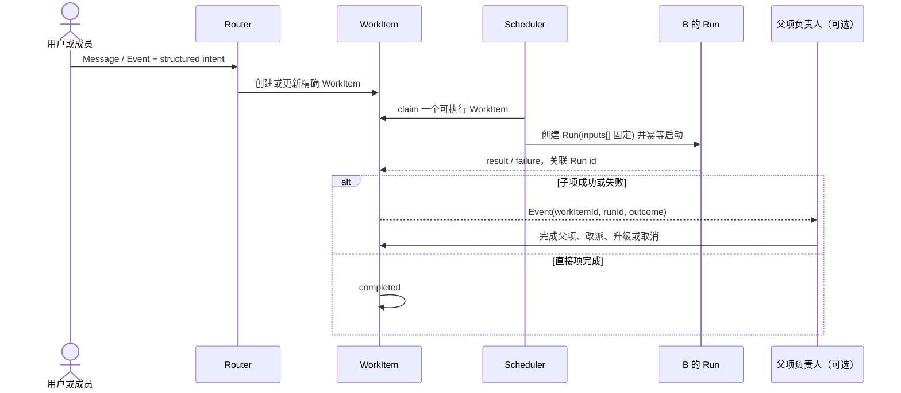

# Thread 消息生命周期 RFC

## 先说结论

#1354 不是 QueuePanel 的数字或文案问题。它暴露的是：系统不知道**哪一件工作**失败了、谁该决定下一步，以及哪个动作确实可以恢复它。于是一个失败 Run 能被投影成整个 thread 的暂停，空面板还能给出会挑到无关工作的 Continue。

本文不用“消息是否已投递”“某人是否正在处理”“任务是否已闭环”拼成一条状态链。它只建立三个领域对象：

1. **Message / Event**：一条人或系统发生过的输入事实；
2. **WorkItem**：一件有明确负责人、目标和下一步的工作；
3. **Run**：一次实际执行，永久记录它精确看了哪些输入。

Queue、receipt、callback、hold、chat history 和 UI 都是这三件事的实现或视图；它们不再各自发明“当前 thread 正在处理”的结论。设计先由下面的场景验证，现有字段只在文末映射，不反向决定产品模型。

---

## 先看场景：系统究竟要保证什么

### 场景 0：用户不写 `@` 的普通消息

用户在 B 的对话输入框里写“可以”“继续”或一个新请求，不需要先写 `@B`。**composer 在提交前负责把用户当前可见的对话目标写成结构化 `target`**：用户选 B 就写 B；从某张 WorkItem 卡片回复时，同时写精确 `workItemId` 和用户选择的动作；普通输入默认写 `next_work`。服务端只校验这些结构化字段是否有效，不从最近回复者、在线成员、可用猫或默认猫推断目标。

因此，同一句“继续”有两种可见且可审计的去处：带 WorkItem 卡片引用时，只推进该项；只有目标时，是交给该目标的一件新工作。没有已选对话目标或卡片引用时，composer 要求用户先选择，而不是发出一条会静默消失的“无目标工作消息”。绕过 composer 的无 target 工作/控制请求由服务端拒绝；只有明确 `fyi` 才可无 target 地单纯记录。正文里的 `@` 可以帮助 composer 填写 target，但入库后的正文并不自行路由。

agent 的普通输出若没有结构化 target，只发布给用户的时间线，不创建 WorkItem。agent 要交给另一位成员处理时，必须使用结构化 handoff 并写 target；这样“给用户看的话”和“要求成员行动的话”不会混在一起。

### 场景 1：一条消息交给 B

用户或 A 把一条请求交给 B。系统保存 Message，创建一个交 B 执行、由明确负责人处置的 WorkItem。调度器挑中该 WorkItem 后创建 Run；这个 Run 写下它会给 B 的 `inputs[]`，再启动 B。

之后才到达的消息绝不能悄悄插进这个 Run。它要么成为另一个 WorkItem，要么由用户明确选择 append / steer；无论哪种，都留下自己的输入和去处。B 的 Run 成功或失败都回写到**这个** WorkItem，而不是改变整个 thread 的状态。

### 场景 2：B 正在运行时，用户又发给 B

用户的第二条消息先成为独立的 Message；是否新建 WorkItem 取决于用户选择：

| 选择 | 含义 |
|---|---|
| 正常排队（默认） | 新建第二个 WorkItem，等 B 当前 Run 结束后调度它 |
| append | 把这条 Message 记为原 WorkItem 的 `pendingInputs[]`；绝不改写当前 Run，当前 Run 终局后才可创建原 WorkItem 的下一次 Run |
| steer | 终止当前 Run 并留下原因；把新 Message 记为原 WorkItem 的 `pendingInputs[]`，待终局确认后才为该 WorkItem 创建新的 Run |

append 不是“已经塞进模型上下文”；它也不创建一个会与原 Run 争夺结算权的第二 WorkItem。steer 不是“只运行新消息”。用户的选择只决定新输入怎样等待或打断，不能抹掉既有工作或让它无证据消失。

### 场景 3：A 同时委托 B 和 C

A 的原始请求是父 WorkItem，A 仍对最终答复负责。A 分别创建两个独立子 WorkItem：一个交 B，一个交 C。它们可并行，各自产生自己的 Run 和结果。

若 B 成功而 C 失败，系统把 B 的结果保留，把 C 的失败事件精确交还 A。**A 决定**改派 C 的工作、上升给 co-creator、缩小范围或取消；系统不以 `all_of`、`any_of`、`quorum` 之类的通用策略替 A 作产品判断。父 WorkItem 在 A 作出结论前不会自动完成。

这既覆盖多委托，也避免把“同时 @ 两人”误读成一套需要泛化分支完成规则的工作流引擎。

### 场景 4：A 需要人的批准

A 如果需要 co-creator 批准，不是把 `@co-creator` 文本当成推断。它创建一个显式的 human-approval WorkItem，写明：批准什么、谁可以批准、关联哪个父 WorkItem、过期后谁处理。任何必须等待该批准的 WorkItem（例如交 B 的子项）都写 `blockedBy=approvalWorkItemId`。

approval WorkItem 等人，不创建 agent Run；调度器也不得为受 `blockedBy` 约束的 B 创建 Run。人的 approve / reject 是带 WorkItem 引用的 Event：approve 才解除 B 的阻塞，reject / expire 则让 B 从未启动并唤醒 A 处置。多个待批准项时，回复必须选择引用，不能猜“这句可以”是在答哪一项。

### 场景 5：评审、CI 或外部回调到达

“PR 已批准”“等待 CI”“外部回调成功”首先是 Event。路由器根据其显式来源和引用，更新已有的 PR-tracking / event-wait WorkItem，或记为终局通知。

它**不会**仅因出现在 thread 中就创建猫的 Run。只有 Event 被某个明确的 WorkItem 需要处理，且该 WorkItem 有下一位执行者，才会唤起 agent。

### 场景 6：managed hold 回来时结算失败

一个 WorkItem 在等待 callback / hold 时，保存精确来源、等待条件和恢复负责人。callback 到达后，系统只能用同一份来源绑定恢复该 WorkItem。

若来源、generation 或所需 disposition 不匹配，系统在创建后继 Run 前失败关闭：保留失败证据，并把**这一项**标为需要负责人处置。它不会把普通 queue body 重新塞回去，也不会暂停同 thread 的其他 WorkItem。UI 只能展示这项的负责人、失败 Run、可用处置和下一次检查，不能给 thread 级 Continue。

### 场景 7：进程崩溃后恢复

重启只从 durable WorkItem 和 Run 恢复：某 Run 是否已经启动、它的 `inputs[]` 是什么、是否已经有终局结果。若执行结果无法确认，系统把该 WorkItem 交给其负责人处置或按其显式重试规则创建新的 Run；它不把旧输入默默重放，也不从最近发言者推断谁该接手。

---

## 三个对象

### 1. Message / Event：输入事实，不自动等于工作

Message 是用户或成员写下的内容；Event 是系统、外部服务或已有 Run 产生的结构化事实，例如“CI 完成”“B 的 Run 失败”“human approval 已拒绝”。两者都可以进入 chat history，也都可以只作为系统可见的来源记录。

每个输入至少有稳定 id、来源、时间、内容或结构化 payload，以及可选的 target / WorkItem 引用。用户普通输入的 target 由 composer 在提交前写入；输入本身仍不代表“谁必须处理”：

- `fyi` 只是 Message / Event。默认不创建 WorkItem，也不会单独唤起谁；
- 无引用的 `done-notify` 是完成通知，不猜测它结算哪项工作；
- 带精确 `workItemId` 的 `done-notify` 只在有结算权限时可结算那个已有 WorkItem；
- Message 或 Event 只有带明确 `next_work`、`handoff`、`approval`、`wait` 等意图时，才建立或推进 WorkItem。

这让系统通知不需要一套特殊“事件投递对象”：它和普通消息都是 Run 可引用的输入；区别仅在有无聊天正文、是否需要出现在 history。

### 2. WorkItem：谁还要把哪件事处理到底

WorkItem 是唯一承载责任的对象。它不是 thread 的常驻状态，也不是所有消息的账本；只有确实需要行动、等待或裁决的事项才有它。

| 字段 | 含义 |
|---|---|
| `id`、`parentId` | 精确标识，以及可选的父 WorkItem |
| `goal` | 可验证的请求、子问题、批准或等待条件 |
| `requester` / `assignee` / `responsible` | 谁提出、下一步交谁执行、谁负责决定完成或失败后的处置。根项通常由执行者负责；A 委托 B/C 时，B/C 是 assignee，A 是两个子项的 responsible，父项责任不会自动转移 |
| `sourceInputs[]` | 它从哪些 Message / Event 得来 |
| `pendingInputs[]` | append / steer 后或子项 `parentId` Event 到达后，属于本 WorkItem、尚未进入任何 Run 的 Message / Event；前一 live Run 终局后才成为下一次 Run 的成熟输入 |
| `activeRunId` | 可选的当前 Run 引用；live execution 只由这个 Run 的状态证明，不把 `running` 复制进 WorkItem |
| `status` | `open`、`waiting`、`needs_decision`、`completed` 或 `canceled`；都只描述这一个 WorkItem |
| `blockedBy` | 可选的精确前置 WorkItem；未完成前调度器不得创建本项 Run。human approval 用这一项表达，不从同时 @ 推断 |
| `waitingFor` | 人、外部事件或精确 callback；human approval 必须在这里显式表达 |
| `recovery` | 失败 Run、可重试条件、下一次检查与负责处置的人 |

一个子 WorkItem 完成或失败时，产生带 `parentId` 的 Event，并原子记入父 WorkItem 的 `pendingInputs[]` 后交给父项 responsible。父项的下一次 Run 显式引用该 Event；responsible 再依据结果完成、继续、改派、升级或取消。不存在默认的“所有子项成功就完成”规则。

### 3. Run：一次不可变的实际执行

Run 只在 agent 真正要执行 WorkItem 时创建。它关联一个 WorkItem、一个执行者和一个不可变 `inputs[]`：Message / Event 的精确 id、顺序及必要版本。Run id 也是调用 provider、回调和重启恢复的幂等键。

Run 可以尚未启动、正在运行或已有终局结果；这些是**执行记录**，不是 WorkItem 的整体状态，更不能直接说某条 Message 已被阅读或工作已完成。实现层仍须保存真正的 prompt/body exposure 证据；产品层只要求它能回答“这一次 Run 精确拿到了什么”。

同一 WorkItem 可以有多个 Run，例如受控重试或改派后的新执行；每个 Run 都保留自己输入集和结果。旧 Run 失败，不会因为无关 Message 到达而自动重放。

### 关系与基数

```text
Message / Event × N ──sourceInputs──> WorkItem
WorkItem ──parentId──> WorkItem（可选）
WorkItem 1 ──has──> Run × N
Run 1 ──records──> inputs[]（Message / Event refs）
Run outcome ──creates──> Event（可推进本项或父项）
```

Queue entry、receipt 和 callback 不在图中充当第四个产品对象：它们是调度、投递或来源绑定所需的实现记录，必须能落回某个 WorkItem 或 Run。

---

## 主流程

### 1. 分类输入，再决定是否有工作

收到 Message / Event 时，路由器先读结构化 intent 和精确引用：

| 输入 | 结果 |
|---|---|
| 用户普通输入（composer 已写入 target，默认 `next_work`） | 为该 target 创建 WorkItem；带 WorkItem 引用的控制输入只推进被引用项 |
| A 委托 B、C | 为 B、C 建独立子 WorkItem；父项仍由 A 负责 |
| human approval / external wait | 创建或更新显式 waiting WorkItem，不创建 agent Run；若它是其他工作的前置条件，后者写 `blockedBy` |
| `fyi`、无引用 `done-notify`、agent 无 target 的普通输出 | 只记录或发布输入；默认不创建 WorkItem |
| 有精确引用的结果 / 回调 | 推进被引用 WorkItem；必要时把 Event 交给其负责人 |
| PR review、CI、外部 gate | 路由给已有 tracking/wait WorkItem 或终局记录，不制造 agent 工作 |

正文内的 `@` 仍只是正文；它只能在 composer 提交前帮助填写结构化 target。服务端收到没有结构化 target / intent 的输入时，不得回看最近发言或使用默认猫猜测路由。

### 2. 调度一个 WorkItem，建立 Run 的输入快照

调度器只从可执行 WorkItem 中选择，而不是扫描“这个 thread 是否还有任何队列消息”。在开始一次执行时，它原子地：

1. 确认 WorkItem 没有未完成的 `blockedBy`，未被另一 live Run 占用，且同一 assignee 在同一 thread 没有另一 live Run；不同 assignee 的 WorkItem 仍可并行；
2. 令本次 `inputs[]` **恰为**该 WorkItem 的 `sourceInputs[]` 与已经成熟的 `pendingInputs[]` 的并集；不从该 WorkItem 之外扫描、遗漏或带入任何 Message / Event；
3. 创建 Run，并把这组精确引用写进 `inputs[]`；
4. 以 Run id 作为幂等键启动执行者；
5. 启动确认后，写 `activeRunId` 并把实际输入暴露证据关联到这个 Run；WorkItem 不另存 `running` 状态。

第 3 步之后到达的输入不属于当前 Run。正常排队创建自己的 WorkItem；append / steer 只能进入原 WorkItem 的 `pendingInputs[]`，待该 Run 终局后才成为成熟输入并建立下一次 Run。子项的 `parentId` Event 也以同一方式进入父项的下一次 Run。这样并发边界是 `Run.inputs[]`，不需要另造批次或投递尝试对象。



### 3. 结果、失败与恢复

Run 的结果只改变它所属 WorkItem，并产生可追踪的 Event。失败时，系统必须把失败绑定到 `workItemId + runId + assignee + 具体原因`：

- 若是子 WorkItem，带 `parentId` 的事件原子写入父项 `pendingInputs[]`，并由父项 responsible 在下一次 Run 中处理；
- 若是根 WorkItem，按其 `recovery` 指向的负责人处置；
- 若可安全重试，负责人显式创建下一次 Run；
- 若要换人，负责人创建新的子 WorkItem 或更新该项 assignee，并保留旧 Run；
- 若需要人或外部条件，WorkItem 进入 `waiting`，写明 `waitingFor` 和下一次检查；
- 若状态不一致，进入 `needs_decision`，而非整个 thread paused。

重试不是调度器的默认行为。任何重试都必须能解释“为什么这次副作用安全、由谁批准、对应哪一次失败”。

### 4. 可见性与恢复控制

用户可以看到：Message 的发言者可见时间线、WorkItem 的目标与负责人、Run 的结果以及该项是否有可用恢复动作。这些视图必须分开回答问题：

- “B 收到正文了吗？”只由精确的 body-exposure / provider 证据回答；
- “B 现在在做什么？”由 B 的 live Run 回答；
- “谁还要负责把这件事收口？”由 WorkItem 的 `responsible` 回答；
- “我能恢复什么？”只能显示当前 WorkItem 的精确 recovery action。

因此不存在 thread-wide `failed` 或无目标的 Continue。某 WorkItem 没有可恢复动作时，UI 应说明它正等待哪位负责人 / human / external event，而不是找同 thread 的其他待办顶替。

---

## 关键规则

### 人工批准必须成为显式依赖

human approval 是 `waitingFor.human`，含 approver、父 WorkItem 和允许的 approve / reject 结果。人在线、被 @，或说了自然语言“可以”均不足以结算；回复要有精确引用。这样不会因为多个并行审批而误结算，也不会把人当 provider Run。

### 凭引用结算也要有权限

`workItemId` 是定位，不是任意成员的关单权限。只有三种输入可以改变 WorkItem 的终局：该项 assignee 产生且带同一 `runId` 的 Run 结果、该项 responsible 的显式处置、或该项允许 approver 对 human-approval WorkItem 的精确回复。其他成员即使引用 `workItemId`，也只能作为输入 Event 被记录，不能把该项标为完成、取消或失败。

### managed hold 与 callback 只恢复原来的工作

`waitingFor.callback` 保存 source、generation、关联 Run 和允许的后继动作。回调不匹配时，不创建后继 WorkItem / Run，也不回放原 queue body；只留下可见的 `needs_decision`。这让 custody、queue 与 Run 对同一次结算说同一种事实。

### 取消和 steer 留下事实

取消 queue 中尚未执行的 WorkItem，或 steer 中断 live Run，都保留发起者、原因和关联 Run。取消只影响目标 WorkItem；已写出的 Message、已有结果和其他 WorkItem 不会被伪装成从未发生。

### 重启不靠猜测

恢复器核对每个非终局 WorkItem 与 Run：已确认启动的 Run 继续等其终局；未确认且无副作用证明的 Run 交 recovery；已满足的 callback / human / external Event 只推进精确引用项。没有证据就不重放，也不从参与者、最近消息或 thread 级队列推断负责人。

---

## 对现有实现的映射（只在概念稳定后处理）

下表是实施起点，不是“必须保留现有八态”的承诺。现有对象能承载哪项事实、不能承载什么，须以三个核心对象为准重构。

| 现有区域 | 未来承载 | 不得再承担 |
|---|---|---|
| composer / `messages` 路由入口 / `AgentRouter` | composer 提交前的结构化 target 与 WorkItem 引用；服务端校验而非最近回复者 / 默认猫 fallback | 从无目标正文猜测目标或把 agent 普通输出变成工作 |
| `MessageStore` / `RedisMessageStore` | Message 的正文、作者、发言者可见时间线与来源关系 | 判断谁仍负责、某次执行是否已完成 |
| queue receipt / `queued-message-receipt` | 某 Message 对目标的调度与可见性投影；body exposure 的实现证据 | 充当 WorkItem 或 Run 的通用状态机 |
| `InvocationQueue` / `QueueProcessor` | 选择可执行 WorkItem、创建 Run、保持 slot 与 Run id 幂等 | 用 thread 有无队列项决定所有 slot 是否 paused |
| F194 / `TurnExecution` | Run 的 live invocation、终局和执行证据 | 代替 WorkItem 的责任或 human/external wait |
| `ActionSuccessor` / `AwaitState` / F233 custody | `waitingFor.callback` 的精确来源、generation 与回归路径 | 失败后回放无绑定的 queue body |
| 结构化 message intent、PR tracker、event wait | Message / Event 分类，以及对应 WorkItem 的推进 | 把 review/CI/wait 自动转为 agent Run |
| QueuePanel / 状态卡 | 对一个 WorkItem / Run 的可见恢复与归因 | thread-wide 暂停和无目标 Continue |

实现可以替换或收敛现有 receipt 状态；禁止为了兼容旧投影再新建一条平行生命周期。迁移时须将每个非终局旧记录归入一个 WorkItem、一个 Run 或一个显式待处置项；无法归属的记录只能进入受负责人约束的 reconciliation，不能被泛化重试。

### 实施顺序

1. 先定义 WorkItem、Run 与其 source / parent / recovery 关系，写状态转换和并发恢复测试；
2. 让入站 Message / Event 先分类，再决定创建、推进或仅记录 WorkItem；
3. 把 QueueProcessor 改为 item-scoped 调度和 Run 输入快照，移除 thread-wide pause / Continue 语义；
4. 接入 human approval、external wait、managed hold 与 callback 的精确引用；
5. 最后把 receipt、QueuePanel、气泡和现有历史读法迁成这三个对象的视图，并做一次性数据切换。

---

## 验收矩阵

| ID | 场景 | 必须证明 |
|---|---|---|
| A0 | 用户在 B 的对话输入框写“继续”，不带 `@` | composer 写结构化 `target=B`；若来自 WorkItem 卡片也写精确引用；服务端不回看最近回复者或默认猫。无已选目标时要求用户选择，不静默投递 |
| A1 | 用户或 A 明确交 B 一件事 | 创建一个带 source Message、assignee=B、responsible 的 WorkItem；Run 只引用自己的 `inputs[]` |
| A2 | Run 创建后又来一条消息 | 新输入不进入既有 Run；正常排队建独立 WorkItem，append / steer 只写原 WorkItem 的 `pendingInputs[]` |
| A3 | queued 消息被取消 | 该 WorkItem 取消，Message 不进入猫 prompt；其他项不受影响 |
| A4 | B 正运行时用户选择 append / steer | append 不伪称已读且只在当前 Run 终局后进入原项的下一次 Run；steer 留下取消原因并不抹掉原项 |
| A5 | A 同时委托 B、C | 两个独立子 WorkItem / Run；父项仍由 A 负责；B/C 可并行 |
| A6 | B 成功、C 失败 | B 结果保留；C 的精确 failure Event 进入父项 `pendingInputs[]`，由 A 的下一次 Run 处理；A 显式改派、升级、继续或取消 |
| A7 | Run 启动或执行失败 | 失败绑定精确 `workItemId + runId`；不会因无关输入自动重放 |
| A8 | managed-hold callback 完整匹配 | 原 WorkItem 恢复并以同一来源结算，无重复后继 Run |
| A9 | managed-hold callback 缺失或不匹配，且同 thread 有其他待办 | 只有该项进入 `needs_decision`；其他 WorkItem 仍可调度 |
| A10 | 用户看到失败 | UI 显示失败 Run、WorkItem、负责人和该项可用 recovery；没有 thread-wide Continue |
| A11 | PR approval / CI / external wait 到达 | 更新 tracking/wait WorkItem 或终局记录；不创建无负责人的 agent Run |
| A12 | `fyi`、无引用 done-notify、有引用 done-notify | 前两者不新建工作；有引用者仅当作者是同一 Run 的 assignee、该项 responsible 或允许 approver 时才结算精确已有 WorkItem |
| A13 | A 请求 human approval 后才可交 B | B 写 `blockedBy=approvalWorkItemId`；approve 前 B 不启动，reject / expire 后 B 从未启动且 A 被唤醒；多个待办时必须引用 |
| A14 | 重启发生在 Run 启动前、启动后或结果前 | 以 WorkItem / Run 证据恢复；不猜负责人、不盲目重放 |
| A15 | 一次性切换 | 所有非终局旧记录都有 WorkItem、Run 或受负责人约束的 reconciliation 归属；不保留旧/新运行时 fallback |
| A16 | 用户正文仅含 `@` | 无结构化 intent 不路由、不生成“成员不存在”的系统气泡 |
| A17 | 同一 B 在同一 thread 有两个可执行 WorkItem | B 的 live Run 只允许一个；另一个等待该 Run 终局，不影响 C 等其他 assignee 的并行 Run |

---

## 不变量与非目标

以下情况在正确实现中不可能发生：

- 一个 live Run 没有精确 `inputs[]`，或新输入静默混进已创建 Run；
- 一个 Run 从所属 WorkItem 以外的 Message / Event 扫入输入，或忽略该项已经成熟的 `pendingInputs[]`；
- append 输入既改写已创建 Run，又生成与原项竞争结算权的第二个 WorkItem；
- 带未完成 `blockedBy` 的 WorkItem 创建了 Run；
- WorkItem 另存与 `activeRunId` 所指 Run 相矛盾的 `running` 状态；
- 同一 assignee 在同一 thread 有两个 live Run；
- 一个失败 Run 没有对应 WorkItem、负责人和可见处置路径；
- 一个 WorkItem 的失败暂停同 thread 无关 WorkItem；
- 无精确 WorkItem 的 Continue / retry 动作；
- review、CI、approval 或等待事件因只是 thread message 而制造 agent Run；
- human approval 从同时 @、在线状态或自然语言猜测；
- 用户无结构化 target 的普通输入由最近回复者、可用猫或默认猫猜测路由；
- 任意成员仅凭 `workItemId` 就结算不属于自己的 WorkItem；
- callback 失配后回放无来源绑定的 queue body；
- 子项结果自动替父项负责人作最终判断。

非目标：不建设通用 workflow engine；不引入 `all_of` / `any_of` / `quorum` 完成策略；不将所有消息强行变成 WorkItem；不让成员常驻监听 thread；不把投递、正文已读、执行结果和责任混成一个状态机；不为保留旧实现而加入永久兼容分支。

实现锚点：

- `packages/shared/src/types/queue-receipt.ts`：现有消息目标投影与 `continue_current` 的 exposure-only 契约；
- `packages/api/src/domains/cats/services/agents/invocation/InvocationQueue.ts` / `QueueProcessor.ts`：当前 slot、queue 与 thread-wide pause 入口；
- `packages/api/src/domains/cats/services/agents/invocation/QueuedMessageCustodyCoordinator.ts`：managed-hold 精确 disposition 合同；
- F194 / `TurnExecution`：Run live / terminal 的执行证据；
- `ActionSuccessor`、`AwaitState`、PR tracking / event wait：显式 callback、human 与外部事件来源；
- [#1354](https://github.com/zts212653/clowder-ai/issues/1354)：本 RFC 的可见失败、精确恢复与独立调度入口证据。

确认这份对象和场景模型后，才拆实现 PR。任何实现若重新形成 thread-wide pause、无目标 Continue，或让输入/责任/执行混为一体，都不符合本 RFC。
