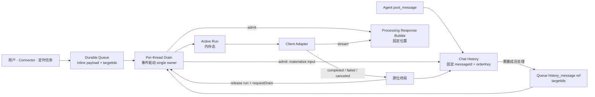

# A2A 消息投递、处理与交接生命周期架构

## 1. 我们重新设计的是什么

一个 thread 同时容纳用户、Agent、Connector 与系统消息。消息可能需要等待、投给一个或多个成员、由用户追加到正在执行的成员，或者由用户 Steer 立即纠正方向。

当前实现的问题不是缺少状态，而是同一件事有太多状态源：Queue、receipt、attempt、InvocationTracker、thread pause 和恢复任务都在回答“这条消息现在归谁”。局部补丁又让普通排队与 Steer 竞争，最终出现 client 已失败但 Queue 停住、消息已经显示却没有结果、或者没有 Agent 执行但 Queue 仍静默积压。

本文只回答一条消息从出现到结果的生命周期：

> 输入何时只存在于 Queue、何时进入共同时间线、队首何时必然被调度、输入如何交给 client、回复如何原位终局，以及失败或重启后用户看到什么。

### 1.1 设计目标

1. Queue Panel 与聊天面板职责分离；进入 Chat History 后，前端流式气泡、最终内容与 Agent 上下文使用同一顺序；
2. Queue 的物理顺序是唯一调度顺序，不自动合并、不隐藏插队；
3. 所有正常 dispatch 经过一个事件驱动的 per-thread drain；
4. 稳定状态下不可能出现“Queue 非空、没有 Active Run、也没有 drain owner”；
5. 每次被接受的运行先有固定响应气泡，成功、失败、取消、重启都原位终局；
6. Steer、Append 与 Cancel 是用户对具体 entry/run 的显式操作，不是正常调度的补救机制；
7. 复用现有未读 cursor 与上下文投影，不再发明第二套 coverage 或 receipt 账本。

### 1.2 非目标

本文明确不设计：

- 持久化 Active Run、重建 provider client 或重启后自动重放；
- per-target attempt history、递归任务树、DAG 或 `all_of` / `any_of`；
- 自动 batching、coalesce 或将多条消息拼成一条正文；
- Queue entry 的 `queued / processing / handled / failed` 状态机；
- priority、parked head、thread-wide pause 或无对象的 Continue；
- hold ball、PR/CI wait 与人工审批的完整协议；
- 每种 provider 的具体 append、steer、cancel RPC。

外部等待和 callback principal 可以引用本生命周期中的 exact invocation，但不能反向扩张 Queue。

## 2. 最小模型与单一真相源

系统只有三个业务对象：

| 对象 | 持久化 | 唯一职责 |
|---|---:|---|
| Queue Entry | 是 | 保存一个有序待处理输入、enqueue 时已解析的 targets，以及 Queue UI 回显所需 payload；仍在 Queue 就表示尚未开始正常 dispatch |
| Chat History Message | 是 | 保存已经进入聊天面板的输入、Agent 消息与响应气泡；拥有全 thread 的固定 `orderKey` |
| Active Run | 否 | 表示 target 当前正在处理哪些 History 输入，并关联唯一响应气泡 |

client adapter 是执行边界，不是第四本账。Scheduler 只是驱动器，不拥有另一份 lifecycle 状态。



三条真相规则：

- Queue membership 是“尚未开始 dispatch”的唯一真相；外部输入在 Queue 中不提前复制为 History message；
- Active Run presence 是 target occupancy 的唯一真相；
- 响应气泡的 `processing / completed / failed / canceled / interrupted` 是输出结果，不是 dispatch acceptance 状态。

## 3. 最小数据契约

### 3.1 Queue Entry：有序待处理输入

```ts
type QueuePayload =
  | {
      kind: 'pending_input'
      source: 'user' | 'connector'
      authorId: string
      body: MessageContent
      routingWarnings?: RoutingWarning[]
    }
  | {
      kind: 'history_message'
      messageId: string
    }

type QueueEntry = {
  id: string
  threadId: string
  targetIds: string[]
  payload: QueuePayload
  enqueuedAt: number
}
```

`targetIds` 是 enqueue 时从结构化 mention 得到、当时有效的成员集合：

- 能解析到成员时保存 exact ids；Queue UI、队首 busy 检查、多目标 admission 与显式操作都直接使用它；
- 无 mention、mention 解析失败或没有有效成员时保存空数组；空数组明确表示需要在实际出队时选择 fallback；
- entry 到达队首时仍要按当前 thread membership 重新验证；成员已删除或失效后若集合变空，按 targetless 处理；
- target 相同只说明路由兼容，不代表消息可以自动合并。作者、来源、意图、顺序与用户选择都可能不同，本模型始终一条输入一个 entry。

`pending_input` 用于用户、Connector、定时任务等尚未进入聊天面板的外部输入。它保存 Queue row 完整回显所需的正文、附件与来源元数据，不提前生成 `messageId`。`history_message` 用于已经完整写入 Chat History 的 Agent 消息；Queue 只引用它的 `messageId`，不复制正文。

Queue Entry 不保存 priority、attempt、receipt 或运行状态。物理顺序就是调度顺序。

每条输入对应一个独立 Queue Entry：

- 每次用户或 Connector 输入是一条 inline payload + 一条 entry；
- 每次 `post_message` 是一条独立 History message；需要成员处理时再建一条 history ref entry；
- 不自动合并连续用户消息；
- 不把多条 wake 合成一条正文；
- 拖动重排或删除 entry 是显式用户操作，修改后的物理顺序立即成为新真相。

### 3.2 Chat History Message：进入聊天面板时固定位置

```ts
type LifecycleMessageMetadata = {
  orderKey: string
  source: 'user' | 'connector' | 'agent' | 'system'
  authorId: string
  targetRefs?: string[]
  producerInvocationId?: string
  visibilityPolicy: 'public' | 'target_only'
}

type ResponseBubble = {
  id: string
  threadId: string
  orderKey: string
  invocationId: string
  targetId: string
  inputMessageIds: string[]
  body: MessageContent
  status: 'processing' | 'completed' | 'failed' | 'canceled' | 'interrupted'
  startedAt: number
  completedAt?: number
  reason?: string
}
```

`orderKey` 在消息或响应气泡首次进入 History 时分配，之后永不改变。外部输入在 Queue 阶段没有 `messageId/orderKey`；正常 dispatch admission 才把它写入 History，并紧接着写入对应的 processing response bubble。`completedAt` 只用于耗时与诊断，不能重新排序。

`visibilityPolicy` 是消息的静态发布策略，不是 Queue 状态副本：

- dispatch 后的用户/Connector 输入、Agent 普通输出与 `post_message` 使用 `public`；
- 只给某个 Agent 的通知使用 `target_only`，仍是普通 History message；需要唤起该 Agent 时再创建 history ref entry。

### 3.3 Active Run

```ts
type ActiveRun = {
  threadId: string
  targetId: string
  invocationId: string
  responseMessageId: string
  inputMessageIds: readonly string[]
  startedAt: number
}
```

admission 已确保每个实际输入都有 History message，因此 Active Run 只保存本轮 exact `inputMessageIds`。需要作者、来源或因果信息时从 History 回读。正常 dispatch 在调用 provider 前登记 Active Run，同一结构承担 admission 后的 occupancy 与显式操作定位。

provider 只需返回是否接受以及 exact execution handle；动作类型由调用方确定。

## 4. 消息入口

### 4.1 用户与 Connector：先入 Queue，dispatch 时进入聊天面板

```text
收到输入
  → 解析结构化 mention，得到 targetIds（可为空）
  → 创建 QueueEntry(pending_input payload, targetIds)
  → Queue Panel 直接回显 entry payload
  → Queue commit 后 requestDrain(threadId)
  → admission 时才生成 messageId + orderKey 并写入 Chat History
```

Queue Panel 是待处理输入的唯一用户可见位置，聊天面板只展示已经开始 dispatch 的消息。entry 仍在 Queue 时，输入既不属于 Chat History，也不进入任何 Agent 普通上下文；admission 原子移除 entry、创建 History input 和 response bubble 后，它才同时出现在聊天面板并成为本轮 exact Agent input。

Queue commit 自身就是外部输入的持久边界。排队阶段不需要先写 History，也不存在“为了 Queue 回显而生成 messageId”的双写。

### 4.2 Agent 输出与 `post_message`：每次调用都是独立消息

```text
Agent final / post_message
  → 写一条独立 History message（visibilityPolicy=public）
  → 解析结构化 mention，得到 targetIds
  → 若需要成员处理，创建 QueueEntry(history_message ref, targetIds)
  → requestDrain(threadId)
```

Agent 消息本身已经是完整的聊天内容，因此立即进入 History。没有有效目标时只公开给用户，不创建 Queue entry，也不猜测下一只 Agent。消息若由 live invocation 产生，携带 `producerInvocationId`；它只是因果元数据。

### 4.3 target 在 enqueue 时记录、在队首执行时确认

入口解析结构化 mention 并把当时有效的 exact `targetIds` 写入 Queue Entry，但不在 enqueue 时猜默认成员。entry 成为队首后：

1. 按当前 thread membership 重新验证 entry 中的 `targetIds`；
2. 若仍有有效 target，按该 exact set 调度；
3. 若结果为空，只有当该 thread 没有任何 Active Run 时才从 Chat History 反向找到最近一次参与对话且当前仍可用的成员；
4. 没有历史成员时使用服务端默认成员；默认成员也不可用时，把该输入 materialize 为可见 failure，不永久卡住队首。

裸 `@`、代码片段、未知成员或解析失败只产生 routing warning，并让 `targetIds=[]`；warning 在 Queue row 中即可见，输入进入 History 时继续随消息保留。

因此 targetless entry 不会在其他成员仍运行时猜目标，也不会被后面的显式 target entry 越过。

## 5. 事件驱动 Scheduler

### 5.1 目标不变量

目标设计必须满足：

> 不可能稳定停留在“Queue 非空、队首可执行、没有 Active Run、也没有 drain owner”的状态。

Scheduler 不是 timer，也不由“任意 History write”触发。只有四类事件可能改变队首可执行性：

1. Queue Entry enqueue；
2. Queue Entry remove 或 reorder；
3. Active Run 终局并被删除；
4. 进程启动发现 durable Queue 非空。

每个事件在自身提交成功后调用 `requestDrain(threadId)`。所有正常调度、Append、Steer、Cancel 与 Queue 重排都经过同一个 per-thread mutation coordinator。

### 5.2 `requestDrain` 的 dirty-bit 语义

```ts
function requestDrain(threadId: string): void {
  const state = drains.getOrCreate(threadId)
  state.dirty = true

  if (!state.owner) {
    state.owner = runDrain(threadId)
  }
}

async function runDrain(threadId: string): Promise<void> {
  const state = drains.get(threadId)

  while (true) {
    state.dirty = false
    await drainExecutableHeads(threadId)

    if (state.dirty) continue

    // “确认 clean + 释放 owner”必须是同一个内存临界区。
    if (state.releaseOwnerIfStillClean()) return
  }
}
```

drain 已运行时，新事件不能被“已有任务”简单吞掉；它必须置 `dirty=true`，迫使 owner 再检查一轮。owner 只有在原子确认没有新 dirty event 后才能释放。

### 5.3 严格 FIFO drain

```ts
async function drainExecutableHeads(threadId: string): Promise<void> {
  while (true) {
    const head = await queue.peek(threadId)
    if (!head) return

    const targets = await resolveTargetsAtHead(threadId, head.targetIds)

    if (!targets) return // targetless 且仍有 Active Run
    if (targets.some(target => activeRuns.has(threadId, target))) return

    const admitted = await admitExactHead(head, targets)
    if (!admitted) continue // 被显式操作或另一 owner 先取走

    await launchAll(admitted)
    // 只等 provider 接受或明确拒绝，不等完整回复。
  }
}
```

正常调度绝不跳过队首：

```text
A 正在运行

Queue:
  M1 → A
  M2 → B

M1 阻塞时 B 不启动。
A 终局 → 删除 Active Run → requestDrain → M1 被处理 → M2 随后启动。
```

FIFO 约束 dispatch 顺序，不要求所有 client 串行执行。M1 被 provider 接受后，drain 可以继续启动 M2；A 与 B 可以并发运行。

Queue 没有 priority。失败通知和普通消息一样追加到队尾；如果用户需要改变顺序，就在 Queue UI 显式拖动、删除或 Steer。

### 5.4 为什么不会静默积压

- enqueue、remove、reorder 后都有 post-commit `requestDrain`；
- 可执行 head 会在 drain 循环中被处理，直到 Queue 空或 head 确实被 Active Run 阻塞；
- 若 head 被阻塞，至少存在一个阻塞它的 Active Run；该 run 终局时必然再次 `requestDrain`；
- targetless head 只等到最后一个 Active Run 删除，同一个终局事件会立即重新触发；
- drain 运行期间到达的新事件置 dirty bit，不会落在 owner 退出窗口；
- 持久提交后、调用 `requestDrain` 前进程退出，由启动扫描重新触发。

因此“消息挤压但没人执行”不是靠 watchdog 定期补救，而是在目标模型中被状态转移本身排除。当前仓库散落的 `tryAutoExecute`、`onInvocationComplete`、pause recovery timer 与 stuck log 需要收敛到这一入口，不能拿现状当作已经满足该不变量的证据。

### 5.5 多目标消息

一条 `@B @C` 仍是一个 Queue Entry。只有 B、C 都空闲时才 admission；若是 pending input，先创建一条共享 History input，再分别创建 B、C 的 Active Run 与响应气泡，并发调用 provider。

这是严格 FIFO 下的 all-or-none admission。某个 target 启动失败不会取消已经被其他 target 接受的 sibling；每个 target 的响应气泡独立终局。

## 6. Admission、响应气泡与运行终局

### 6.1 Admission 是唯一 cutover

`admitExactHead` 在 per-thread coordinator 内完成：

1. 再次确认 exact entry 仍是当前队首；
2. 重新确认 stored targets 或 targetless fallback，并为每个 target 生成 `invocationId + responseMessageId + startedAt`；
3. 持久化尚未激活的 exact callback principal；principal mint/persist 失败时 entry 保持 Queue 中，不能报告 accepted；
4. 一个持久事务原子完成：exact take Queue Entry；若 payload 是 pending input，则生成 `messageId/orderKey` 并写入 History，若是 history ref 则验证并复用已有 message；紧接着为每个 target 写一条 `processing` ResponseBubble；激活 callback principals；
5. 在调用 provider 前创建 Active Run；
6. 调用 provider，明确得到 accepted 或 failure。

第 4 步的 processing bubble 是最小的 durable `accepted, result outstanding` witness。它属于 Chat History，不是持久 Active Run，也不是第四个业务状态面。

callback principal 只有在第 4 步 admission commit 成功时才激活。若 exact-head take 失败，尚未激活的 principal 可以直接丢弃；它从未授权 client callback，也不算一次 accepted run。

```ts
async function admitExactHead(head, targets) {
  const prepared = await prepareAdmissions(targets, head)
  await principals.persistAll(prepared)

  const admission = await stores.takeHeadAndMaterializeAdmission({
    expectedHeadId: head.id,
    payload: head.payload,
    targetIds: targets,
    responses: prepared.map(toProcessingBubble),
    activatePrincipalIds: prepared.map(item => item.principalId),
  })
  if (!admission) return null

  return prepared.map(item => {
    const run: ActiveRun = {
      threadId: head.threadId,
      targetId: item.targetId,
      invocationId: item.invocationId,
      responseMessageId: item.responseMessageId,
      inputMessageIds: [admission.inputMessageId],
      startedAt: item.startedAt,
    }
    activeRuns.add(run)
    return run
  })
}
```

所有会启动运行的入口都必须复用该 cutover。provider side effect 只能发生在事务 winner 创建好输入消息与 processing bubble 之后。

### 6.2 流式与最终内容原位更新

provider stream 使用 admission 时确定的 `responseMessageId`。前端可以只在内存中渲染增量 chunk，但气泡身份和位置不能变化：

```text
processing bubble（固定 id/orderKey）
  → stream chunk 更新同一气泡
  → completed / failed / canceled / interrupted 原位更新
```

成功但没有 CLI 正文时，也必须把同一气泡终局为可理解的“处理完成但没有额外回复”，不能留下永久空气泡。

### 6.3 终局顺序

```ts
async function onRunTerminal(run, terminal): Promise<void> {
  await history.finalizeResponseBubble(
    run.responseMessageId,
    terminal,
  )

  if (terminal.kind === 'failed') {
    await enqueueFailureNoticeForAgentAuthors(run.inputMessageIds, terminal)
  }

  activeRuns.deleteIfInvocation(
    run.threadId,
    run.targetId,
    run.invocationId,
  )

  requestDrain(run.threadId)
}
```

顺序必须是“气泡终局 → 删除 exact Active Run → requestDrain”。若先触发 drain 再释放 run，drain 会看到 busy 后退出且可能再也没有信号。

launch failure 走同一终局路径：把已经存在的 response bubble 更新为 `failed`，删除 run，再 requestDrain。结果不会因为 client 没有输出而静默消失。

### 6.4 失败通知

失败输入的直接来源可以从 `run.inputMessageIds` 回读：

- source 是用户或 Connector：公开 failure bubble 已经通知用户；
- source 是 Agent：系统写一条 `visibilityPolicy='target_only'`、`targetRefs=[authorId]` 的独立失败通知 message，并在 Queue 尾部创建引用它的 entry；
- 多条 input 来自同一 Agent 时，本轮只通知一次；
- 系统生成的失败通知再次失败时，因为作者不是 Agent，不会递归通知。

失败通知和其他输入一样排在 Queue 尾部，不获得隐藏插队通道。

## 7. Agent 未读上下文与顺序一致性

当前系统已经有 per-cat × per-thread 的持久 delivery cursor、可见性过滤、token/window 裁剪，以及本轮实际 `projectedMessageIds / exposedMessageIds`。新模型直接复用这条链路。

### 7.1 同一个顺序贯穿三处

Queue Panel 是 admission 前的 staging view，不属于 Chat History 排序。输入一旦进入聊天面板，所有消费者都按 History `orderKey`：

- 前端用它确定输入与流式气泡的位置；
- 最终 History 只原位更新，不按完成时间重排；
- Agent 未读上下文也按它推进 cursor。

如果 A 先开始、B 后开始、B 先完成，最终顺序仍是 A bubble → B bubble，而不是完成先后。不能再让 UI 按 `startedAt`、Agent 却按终局写入时才分配的 `visibilitySeq` 看到 B→A。

### 7.2 ordering barrier

`status=processing` 的 response bubble 是 cursor barrier。Queue 中的 pending input 尚未进入 History，因此不参与 cursor，也不需要伪造一个“前端可见、Agent 不可见”的 History 状态。

Agent 可以在 UI/上下文摘要中知道“成员正在处理”，但持久 cursor 不能越过 processing bubble 并把它当作正文已读。气泡终局后，下一次上下文在原位置读取完整正文，再推进 cursor。

当前被 dispatch 或显式 Append/Steer 的 Queue input 会先 materialize 为 History message，再作为 exact input 注入 provider。即使普通 cursor 被更早的 processing barrier 挡住，exact input 仍可注入；这不越过 barrier，也不把窗口外消息误标为已读。

### 7.3 wake message 不做自动合并

每条 Agent `post_message` 都保持独立。target 被拉起时：

1. 走现有未读 cursor 取得可见上下文；
2. 将 admission 返回的 input message 作为必选 exact input；
3. 记录本轮实际 projected/exposed ids；
4. 只移除当前被 admission 的 entry。

不再按“最近 N 条覆盖了哪些 wake”批量删除其他 Queue Entry。后续 entry 仍按 FIFO 独立 admission；用户若希望把某条显式追加给当前 run，使用 Append。

## 8. Append、Steer 与 Cancel

| 用户动作 | Queue 操作 | Active Run / client 结果 |
|---|---|---|
| 正常等待 | 只由 drain 处理队首 | target busy 时等待终局事件 |
| Append | coordinator 取出选中 entry | 追加给用户选定的 exact Active Run，不新建 run |
| Steer / Immediate | coordinator 取出选中 entry | 将目标旧 run 原位终局为 canceled，再 admission 新 run |
| Cancel queued | coordinator 删除选中 entry | 不影响任何 Active Run |
| Cancel running | Queue 不参与 | exact run 气泡终局为 canceled，释放 run，触发 drain |

所有显式操作先赢得 Queue entry 的 exact take，再产生 client 副作用；不能先 cancel/steer，随后才发现 entry 已被正常 drain 取走。

Append 与 Steer 的持久 cutover 分别是：

```ts
async function appendSelected(entryId, expectedInvocationId) {
  return coordinator.runExclusive(threadId, async () => {
    const taken = await stores.takeSelectedMaterializeAndAttachInput({
      entryId,
      expectedInvocationId,
    })
    if (!taken) return 'stale'

    activeRuns.addInput(expectedInvocationId, taken.inputMessageId)
    const accepted = await client
      .append(expectedInvocationId, taken.inputMessage)
      .catch(() => false)
    if (accepted) return 'accepted'

    activeRuns.removeInput(expectedInvocationId, taken.inputMessageId)
    await history.detachResponseInputIfProcessing(
      expectedInvocationId,
      taken.inputMessageId,
    )
    await history.appendDispatchFailure(taken.inputMessageId, 'append_rejected')
    return 'failed'
  })
}

async function steerSelected(entryId, oldRun) {
  return coordinator.runExclusive(oldRun.threadId, async () => {
    const next = prepareAdmission(oldRun.targetId, entryId)
    await principals.persistPending(next)

    const cutover = await stores.takeSelectedMaterializeAndCutoverResponse({
      entryId,
      expectedOldInvocationId: oldRun.invocationId,
      cancelOldResponseId: oldRun.responseMessageId,
      createProcessingResponse: next.responseBubble,
      activatePrincipalId: next.principalId,
    })
    if (!cutover) {
      await principals.discardPending(next.principalId)
      return 'stale'
    }

    const newRun = buildRun(next, cutover.inputMessageId)
    activeRuns.replaceExact(oldRun, newRun)
    try {
      await client.dispatch(newRun, {
        force: true,
        expectedOldInvocationId: oldRun.invocationId,
      })
      return 'accepted'
    } catch (error) {
      await onRunTerminal(newRun, classifyDispatchFailure(error))
      return 'failed'
    }
  })
}
```

`takeSelectedMaterializeAndAttachInput` 的原子范围是“验证 exact selected entry 与仍为 processing 的 expected invocation + 移除 entry + 把 pending input 写入 History，或验证并复用 history ref + 把 input message id 持久附到现有 processing bubble”。Append 不创建新 response bubble；现有 bubble 已是 outstanding witness。只有该事务 winner 才能调用 adapter。adapter 拒绝时，系统从仍为 processing 的 bubble 移除该 input id，保持旧 run，并为已 materialize 的输入写独立 failure result；若事务后进程退出，startup 会把包含该 input id 的 bubble 收敛为 interrupted，不会丢掉一次可能已经发生的 client side effect。

`takeSelectedMaterializeAndCutoverResponse` 的原子范围是“验证 exact selected entry 与旧 processing invocation + 移除 entry + materialize input + 旧 bubble 原位 canceled + 新 processing bubble 创建 + 新 principal 激活”。只有该事务 winner 才能 `replaceExact` 并调用 `dispatch(force=true)`；进程在事务后退出时，新 bubble 仍由 startup 收敛为 interrupted，旧 provider 的迟到 callback 只会命中已终局的旧 invocation。

Append 不会自动发生，也不会把两条 History message 合成一条。它只是把新 input message id 加入现有 Active Run，并把 exact message 交给同一 invocation；已有 response bubble 继续保持原位置。adapter 若拒绝 Append，现有 run 不受影响，系统为该 input 写独立失败结果。

Steer 只取消用户明确选择的 target run，不因 wake message 的 `authorId` 猜测并取消发送者的较新 run。若用户还要停止 source run，应对 source run 单独执行 Cancel。

无 target 输入选择 Append 时，用户在 UI 中选择 exact Active Run；这个显式操作给出 target，不需要在原 Queue Entry 中持久化一个稍后绑定的 target override。

## 9. 失败与重启

### 9.1 失败分类

| 位置 | 必须留下的结果 | Queue 行为 |
|---|---|---|
| target 解析后不存在且无 fallback | materialize input + typed system failure | entry 被处理，继续下一条 |
| callback principal mint/persist 失败 | 未 accepted；Queue row 显示诊断 | exact entry 留在 Queue，可重试 |
| provider launch 失败 | 原 processing bubble → failed | 释放 run，继续下一条 |
| provider 执行失败 | 原 processing bubble → failed | 释放 run，继续下一条 |
| provider 被取消 | 原 processing bubble → canceled | 释放 run，继续下一条 |
| pending Queue entry 被取消 | Queue row 消失或显示已取消；不创建 Chat History message | 删除 entry，不调用 provider |
| history ref entry 被取消 | 已发布的 Agent message 保持不变 | 删除 entry，不调用 provider |

failure bubble 至少携带 `targetId + invocationId + inputMessageIds + typed reason`。这些是结果自身的因果元数据，不组成 receipt ledger。

### 9.2 重启收敛

启动恢复做两件确定的事：

1. 对 durable Queue 非空的 thread 调用 `requestDrain`；
2. 将仍为 `processing` 的 response bubble 原位终局为 `interrupted / runtime_restart`。

Active Runs 从空内存开始，不重建、不猜 target、不自动重放。三种 crash window 都有明确结果：

- admission transaction 前退出：entry 仍在 Queue，启动后继续调度；
- Queue take / input + processing bubble commit 后、provider launch 前退出：已 materialize 的输入保留，同一 bubble 变为 interrupted；
- provider accepted 后、terminal callback 前退出：同一 bubble 变为 interrupted。

exact callback principal 在 canonical terminal 前不能因静默 TTL 变成 `unknown_invocation`。API 重启后迟到 callback 必须能识别 exact invocation；若 bubble 已被 startup 原位终局，则回调按幂等 terminal/stale 处理，而不是生成第二条结果或复活 Active Run。principal 的 durable lifetime 与 tombstone 由 runtime durability 边界负责，Queue/History 只消费其结论。

## 10. 用户可见模型

前端只展示三个直接事实：

```text
Queue row                  → 输入已收到，等待 dispatch
History input              → 输入已进入聊天面板并开始 dispatch
processing response bubble → exact member 正在处理
terminal response bubble   → 已完成、失败、取消或被重启中断
```

- pending input 由 Queue row 直接渲染；它还没有 History message id；
- admission 后 Queue row 消失，输入与 processing bubble 一起进入聊天面板；
- 已经发布的 Agent/post_message 保持原 History 位置，Queue row 只是它的待 dispatch 引用；
- response bubble 在运行开始时出现，stream 与 final 使用同一 id；
- Active Runs 提供 Cancel/Append/Steer 的 exact 操作目标；
- 拖动 Queue row 是显式改变 FIFO，不存在隐藏 priority；
- 不展示 receipt processing、attempt aggregate、thread-wide paused 或无对象 Continue。

## 11. 实现责任面

| 责任 | 主要代码位置 | 目标改造 |
|---|---|---|
| 输入持久化 | `packages/api/src/routes/messages.ts` | 用户/Connector 先写 durable Queue payload；不提前 append History；commit 后 requestDrain |
| Queue | `packages/api/src/domains/cats/services/agents/invocation/InvocationQueue.ts` | durable ordered payload/ref + enqueue-time targetIds；删除自动 merge、priority 与 attempt/lifecycle 字段 |
| Scheduler | `packages/api/src/domains/cats/services/agents/invocation/QueueProcessor.ts` | 唯一 requestDrain、dirty-bit single owner、严格队首、启动恢复 |
| Agent 路由 | `packages/api/src/domains/cats/services/agents/routing/AgentRouter.ts` | enqueue 时解析 exact targets；targetless fallback 留到 head execution |
| 未读上下文 | `packages/api/src/domains/cats/services/agents/routing/route-helpers.ts` | 复用 delivery cursor、visibility/window 与 projected/exposed ids；processing barrier + exact input |
| admission / 响应发布 | `packages/api/src/domains/cats/services/agents/routing/route-serial.ts` | take 时 materialize input + 固定 response bubble；stream/final 原位更新 |
| History 顺序 | `packages/api/src/domains/cats/services/stores/redis/redis-message-append.ts`<br/>`packages/api/src/domains/cats/services/stores/redis/RedisMessageStore.ts` | admission 为 pending input 与 bubble 连续分配 orderKey；更新不重排 |
| Active Runs | `packages/api/src/domains/cats/services/agents/invocation/InvocationTracker.ts` | 只保存 exact run + responseMessageId + inputMessageIds |
| Agent wake | `packages/api/src/routes/callback-a2a-trigger.ts` | 每条 post_message 独立写 History；需要成员处理时建立 history ref entry |
| Queue 控制 | `packages/api/src/routes/queue.ts` | Append/Steer/Cancel 进入同一个 per-thread coordinator，先 exact take 后 client effect |
| Provider | `packages/api/src/domains/cats/services/agents/providers/CodexAppServerClient.ts` 及 adapters | 明确 accepted/failure；使用 exact invocation 与 durable callback principal |
| UI | `packages/web/src/components/QueuePanel.tsx` 及消息气泡 | Queue row 直接渲染 pending payload 或 history preview；聊天面板只渲染 History；stream/final 同一气泡 |

现有 Queue receipt、per-target attempt、thread-wide pause、reconciliation 与多层 fallback 不能继续作为目标模型。实施时先确认哪些仍被其他 feature 独立拥有；本生命周期的读写迁移完成后再删除，不通过兼容层并行维持两套真相。

## 12. 实施顺序

1. 先用行为测试锁定固定顺序、严格 FIFO、targetless fallback、drain dirty bit 与响应气泡终局；
2. 把 QueueEntry 收敛为 ordered payload/ref + targetIds，删除自动 merge 与 priority；
3. 调整用户/Connector 入口为 Queue-first；Agent/post_message 直接写 History 并用 ref 排队；targetless fallback 留到队首；
4. 建立 admission transaction：take exact head + materialize input + processing bubble + callback principal；
5. 把 Active Run 收敛为 exact invocation、responseMessageId 与 inputMessageIds；
6. 把所有调度触发收敛到 `requestDrain`，删除 timer 型正确性兜底；
7. 接通现有未读 cursor 的 processing barrier 与 exact input；
8. 统一 stream/final 原位更新及 failed/canceled/interrupted 终局；
9. 接入显式 Append/Steer/Cancel，并验证先 take 后 side effect；
10. 删除本生命周期中的 receipt/attempt/pause/reconciliation fallback；
11. 在隔离环境跑完整验收矩阵后一次切换，不并行运行两套 lifecycle。

迁移不得删除现有 Chat History。旧 Queue 记录若已经绑定 History message，转换为 history ref；尚未发布的记录转换为 pending payload。不能可靠转换的运行投影保留诊断但不恢复成 Active Run。

## 13. 已知异常如何闭合

| 异常 | 根因 | 本设计的闭环 |
|---|---|---|
| Queue 有消息但没有 Agent 执行 | 分散 trigger 丢失或在 busy 检查后无再触发 | 四类事件统一 requestDrain；run release 是 mandatory trigger；dirty bit 封闭退出窗口 |
| 正常消息与 Steer 竞争失败 | 正常推进和用户控制使用不同调度入口 | 全部 Queue mutation 进入同一 per-thread coordinator，只有 exact take winner 产生 side effect |
| Queue row 被误当作聊天消息 | 为了回显而在 enqueue 时提前写 History | Queue 直接持有 payload；pending input 只在 admission 时 materialize |
| 前端 A→B，Agent 却读成 B→A | response 在 final append 时才分配位置 | input/bubble 在 admission 时固定 orderKey；processing 是 cursor barrier；final 原位更新 |
| client 失败但没有回复 | final 才创建 message，失败路径没有共同出口 | admission 先创建 processing bubble，所有 terminal 原位更新 |
| 重启后 accepted work 静默消失 | Active Run 只在内存且没有 durable witness | History processing bubble 是 outstanding witness；startup 收敛为 interrupted |
| targetless 消息错误投给忙碌成员 | ingest 时过早猜 fallback | entry 保存空 targetIds；到队首且 thread idle 后才选择最近活跃成员/default |
| 连续消息被自动拼接，无法单条操作 | Queue 自动 batching/coalesce | 一 message 一 entry；只允许显式 Append |
| failure notification 插队阻塞全局 | 隐藏 priority queue | 删除 priority；通知正常排到队尾，用户可显式重排 |

## 14. 验收矩阵

| ID | 场景 | 必须满足 |
|---|---|---|
| A1 | 用户发送 `@B`，B 繁忙 | Queue entry 保存完整 payload + `targetIds=[B]`；Queue Panel 回显；History 中尚无该输入 |
| A2 | A `post_message @B`，B 繁忙 | 独立消息立即公开；一个 entry 留在 Queue；A 不被自动取消 |
| A3 | 队首 `M1→A`、次条 `M2→B`，A 繁忙 | 不跳过 M1；B 不提前启动 |
| A4 | A 终局释放最后一个 blocker | 同一终局路径 requestDrain；M1 随即被处理，不依赖 timer |
| A5 | M1 被 provider 接受后 M2 可执行 | drain 继续启动 M2，不等待 M1 完整回复 |
| A6 | 一条用户消息 `@B @C` | 一个 entry 保存 `[B,C]`；B/C 全空闲后 atomically 创建一条 input + 两个独立 response bubble |
| A7 | B 启动成功、C 启动失败 | B 继续；C 原位 failed；两者不相互覆盖 |
| A8 | 连续三条相同 target 用户消息 | 三条独立 entry，正常 FIFO 三次处理，不自动合并 |
| A9 | 用户显式 Append 第二条 | 选中 entry 先 materialize，再加入 exact run；两条 History message 仍独立 |
| A10 | A→B 与 C→B 连续排队 | 两条 wake 独立；B 第一轮结束触发第二条，不做隐式 coverage merge |
| A11 | 用户消息无 target，thread 有 Active Run | targetless head 等待，后续显式 target entry 不越过 |
| A12 | 最后一个 Active Run 终局 | targetless head 从 History 选择最近一次参与对话且当前可用的成员；没有则 default |
| A13 | mention 无效或成员已删除 | Queue row 保留 warning；按仍有效 targetIds 或 targetless fallback 继续，不永久卡 head |
| A14 | 普通正文包含 `@` | 不产生结构化 target |
| A15 | 两个调度事件同时到达 | 一个 drain owner；第二个只置 dirty；不会重复 dispatch |
| A16 | 事件在 drain 退出窗口到达 | release-owner 临界区观察 dirty，至少再运行一轮 |
| A17 | Queue commit 后、requestDrain 前进程退出 | startup scan 重新触发，消息不静默积压 |
| A18 | admission 前 principal persist 失败 | entry 与 pending payload 仍在 Queue；History 无 ghost input；没有 client side effect |
| A19 | crash after Queue take before provider launch | input 与 processing bubble 已原子写入；startup 将 bubble 原位 interrupted；不重放 |
| A20 | crash after provider accepted before final | 同一 bubble 原位 interrupted；不追加第二条结果 |
| A21 | detached exact run 长时间静默并跨 API restart | callback principal 不因静默 TTL 变 unknown；迟到 terminal 幂等识别 |
| A22 | provider launch 抛错 | processing bubble 原位 failed；run 删除；requestDrain |
| A23 | provider 执行失败且没有正文 | processing bubble 原位 failed；不能永久留空 |
| A24 | provider 成功但没有额外文本 | bubble 原位 completed，并显示可理解的完成说明 |
| A25 | 用户 Cancel run | exact bubble 原位 canceled；删除 exact run；requestDrain |
| A26 | 用户 Cancel pending queued entry | exact entry 删除；不创建 History input；不调用 provider |
| A27 | 用户 Steer 与正常 drain 竞争同一 entry | exact persistent cutover 同时 take、materialize input、cancel 旧 bubble、创建新 bubble；只有 winner 调 client |
| A28 | 用户 Steer B | 只取消 B 的 exact run；不按 producer author 猜测取消其他 run |
| A29 | Append adapter 拒绝 | 原 run 保持；选中 input 有独立 failure result；消息不丢 |
| A30 | A 先开始、B 后开始、B 先完成 | UI、最终 History、Agent context 都保持 A bubble → B bubble |
| A31 | cursor 遇到 processing bubble | 不越过；terminal 后在原位置读正文再推进 |
| A32 | admission input 位于更早 processing barrier 之后 | materialize 后作为 exact input 注入；不错误推进普通 cursor |
| A33 | Agent-authored input 的 run 失败 | 公开 failed；向原 author 追加一条 `target_only` system message + 普通 entry |
| A34 | 上述系统失败通知再次失败 | 不递归创建通知树 |
| A35 | Queue reorder/remove | commit 后 requestDrain；新的物理队首立即成为调度真相 |
| A36 | 用户/Connector 输入仍在 Queue | Queue API/UI 能从 inline payload 完整回显正文与附件；`messageId` 不存在 |
| A37 | 两条输入 targetIds 相同 | 仍是两个独立 entry；相同 target 不触发自动 merge/batch |

## 15. 必须保持不可能的状态

- pending input 在 Queue 中却缺少可回显的完整 payload 或显式 `targetIds` 数组；
- 用户/Connector pending input 在 admission 前已经生成 History `messageId`；
- history ref entry 指向不存在或不属于同一 thread 的 message；
- Queue 非空、队首可执行、没有 Active Run，也没有 drain owner；
- 后面的 entry 在正常调度中绕过被 busy target 阻塞的队首；
- 两个 owner 从同一个 Queue Entry 启动两次 provider；
- 自动 batching/coalesce 改写两条独立消息；
- targetless input 在其他 Active Run 尚存时提前猜成员；
- client side effect 已发生，但 History 中没有固定 response bubble；
- stream 与 final 使用不同 message id 或完成时重新插入位置；
- UI 与 Agent context 对同一组消息使用不同排序键；
- Agent cursor 越过 processing bubble 后永远读不到其终局正文；
- provider launch/execution 失败但 response bubble 永久 processing；
- run 已释放却没有触发下一轮 drain；
- Steer 先取消 client，随后才竞争 Queue take；
- Append 自动取消旧 run，或 Steer 取消未被用户选择的 source run；
- 重启后 accepted work 没有 completed/failed/canceled/interrupted 任一结果；
- callback principal 在 canonical terminal 前因静默失效；
- failure notice 通过 hidden priority 插队或递归生成责任树；
- 为修复上述问题再增加一套平行 lifecycle ledger 或 timer 型正确性 fallback。

最终判断标准不是“覆盖了多少状态”，而是：普通读者沿一条输入从 Queue row 走到 History input，再走到一个 terminal bubble 时，每一步只有一个 owner、一个顺序和一个下一触发。
