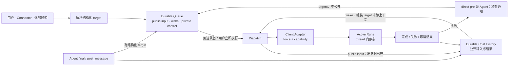
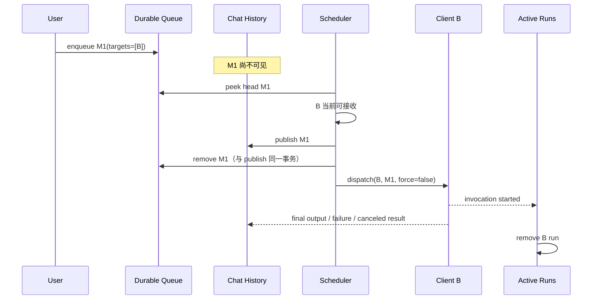
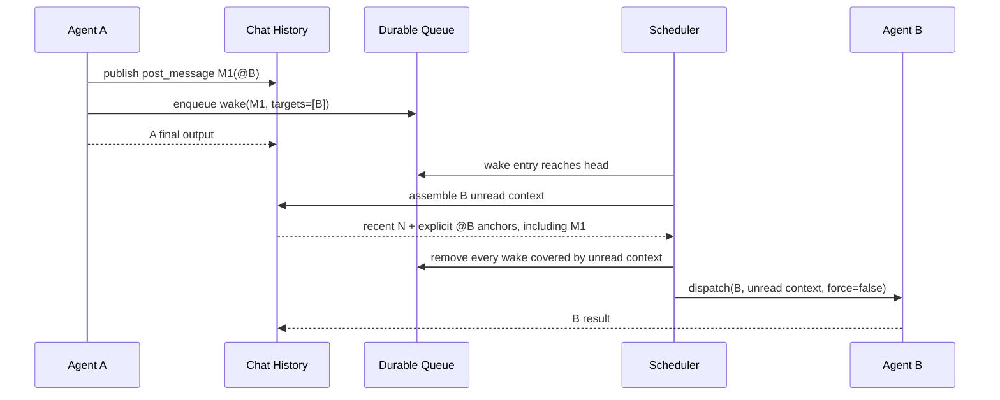
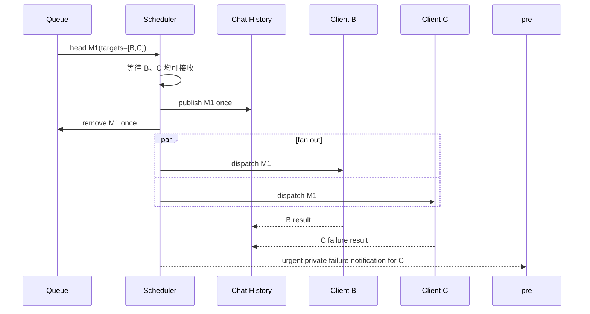

# A2A 消息投递、处理与交接生命周期架构

## 1. 背景、目标与范围

### 1.1 我们重新设计的是什么

一个 thread 同时容纳用户、Agent、Connector 与系统通知。消息可能需要等待当前成员结束、投给一个或多个成员、追加给正在执行的成员，或者由用户要求立即执行。当前实现把消息可见性、Queue 状态、运行状态和责任交接揉在一起，产生了四类直接问题：

- 消息尚未真正投递，却已经进入 Chat History，被其他成员提前读取或重复处理；
- client 拉起失败或执行失败后没有结果消息，用户只看到输入消失或 Queue 卡住；
- Queue、receipt、execution 和 thread-wide pause 各自保存一套状态，无法解释哪一个才是真的；
- 为了解决局部竞态不断增加 attempt、fence、reconciliation 和 fallback，最终掩盖了本来简单的投递流程。

Issue #1354 与 #1371 暴露的是同一设计边界：系统没有把“消息排队”“消息公开”“client 被拉起”和“client 处理结束”放在一条清晰的生命周期中。

本文重建的不是语义任务树，也不是可靠工作流引擎。它只管理：

> 一条消息何时排队、何时公开、按什么顺序投给谁、运行结果如何留下，以及投递或执行失败时通知谁决定下一步。

### 1.2 设计目标

实现者读完本文后，应当可以直接回答：

1. 用户、通知和 Agent 消息分别何时进入 Queue 与 Chat History；
2. Queue 中下一条消息何时可以出队，为什么不能跳过队首；
3. 一条消息同时 `@B @C` 时如何投递；
4. 连续消息与 Agent wake message 如何合并，怎样避免重复唤醒；
5. Append、Immediate、Steer 与 Cancel 对 Queue 和现有运行分别做什么；
6. client 不存在、拉起失败、执行失败或被取消时，用户会看到什么；
7. `pre` 有什么用，为什么它不是递归的语义责任树；
8. 进程重启后哪些数据仍在，哪些运行责任明确放弃恢复。

### 1.3 非目标

本文明确不设计：

- 持久化的 per-target receipt、attempt history 或统一 lifecycle ledger；
- 递归的父子任务、DAG、`all_of` / `any_of` 语义结算；
- 为每个 Queue entry 保存 `queued / processing / handled / failed` 状态机；
- 重启后自动重建运行责任或猜测哪只 Agent 应继续；
- hold ball、PR/CI wait、人工批准等外部等待的完整协议；
- 每个 client 的具体中断与追加 RPC。

外部等待以后可以与 Active Runs 对接，但不能反过来扩大 Queue 的职责。

## 2. 设计摘要

整个系统只有三个状态面：

| 状态面 | 是否持久化 | 唯一职责 |
|---|---:|---|
| Queue | 是 | 保存尚未完成 dispatch 的有序消息；“仍在 Queue 中”本身就表示 queued |
| Chat History | 是 | 保存已经公开的输入、Agent 输出以及成功、失败、取消结果 |
| Active Runs | 否，thread 内存态 | 记录当前哪些 client 正在运行，以及本轮 input refs 与各自 direct `pre` |

client adapter 是执行边界，不是第四本账：它接收 `dispatch(target, messages, force)`，按自身能力启动、追加或中断运行，并返回本次调用结果。



最重要的边界是：

- Queue 是有序消息容器，不是投递账本；
- Chat History 是用户和成员共同看到的事实，不是调度器；
- Active Runs 是进程内控制状态，不是需要恢复的用户数据；
- `pre` 只处理一次直接投递失败，不承担下游语义任务；
- 失败结果公开写入 Chat History；给 Agent `pre` 的 urgent 控制消息只进入 Queue，不进入 Chat History。用户作为 `pre` 时直接看公开结果，不再收到一份私有副本。

## 3. 核心概念

| 名词 | 定义 |
|---|---|
| queued message | 尚未完成 dispatch 的消息；是否存在于 Queue 就是它唯一的 queued 表达 |
| public message | 已进入 Chat History、所有后续被唤起成员都可能看到的消息 |
| wake entry | Agent 消息已经在 Chat History 后，为唤起目标成员而创建的 Queue 引用 |
| target set | 一条消息需要同时投递的成员集合；`@B @C` 是一个 Queue entry 的 `{B,C}`，不是两个 receipt |
| dispatch | 消息离开 Queue，并尝试交给目标 client 的动作 |
| `force` | dispatch 给 client 的行为提示；`true` 表示 Immediate/Steer，`false` 表示普通投递或 Append |
| Active Run | 某个 client 当前在这个 thread 中的运行；同一成员正常情况下只有一个 |
| `pre` | 本次运行的直接发起方；仅在投递或执行失败时接收通知并决定重投或上升 |
| terminal result | `completed`、`failed` 或 `canceled`；必须由一条 Chat History 结果体现 |
| unread context | 目标成员本次被拉起时读取的最近消息与锚点消息集合 |
| input ref | 本次运行真正由哪些 Queue message 触发，以及每条输入的 direct `pre`；只存在于 Active Run 内存态，不是 receipt |

### 3.1 最小数据契约

Queue 不持久化 attempt 或 processing 状态，只需要能够表达消息本身与调度顺序：

```ts
type DirectPre =
  | { kind: 'user'; id: string }
  | { kind: 'agent'; id: string }

type QueueMessageBase = {
  id: string                           // public_input 发布后继续作为稳定 message id
  threadId: string
  source: 'user' | 'connector' | 'agent' | 'system'
  authorId: string
  targets: string[]                 // 一个 entry 可以有多个 target
  createdAt: number
  priority: 'urgent' | 'normal'     // urgent 只用于直接失败通知等控制消息
  directPre: DirectPre               // system/connector 未指定 owner 时回退 user
}

type QueueMessage = QueueMessageBase & (
  // 用户输入或公开通知：dispatch 时才公开。
  | { kind: 'public_input'; pendingBody: MessageContent }

  // Agent 输出：正文已经公开，Queue 只保存唤醒引用。
  | { kind: 'agent_wake'; historyMessageId: string }

  // 给 direct pre 的失败通知：只对目标可见，永不写入 Chat History。
  | { kind: 'private_control'; privateBody: MessageContent }
)
```

运行关系只保存在内存。一轮可能合并多条输入，因此不能把 `pre` 压成一个值：

```ts
type RunInputRef = {
  queueMessageId: string
  sourceMessageId?: string
  directPre: DirectPre
}

type ActiveRun = {
  threadId: string
  targetId: string
  invocationId: string
  inputs: RunInputRef[]
  startedAt: number
}

type DispatchAcceptance = {
  mode: 'started' | 'appended' | 'steered'
  invocationId: string
}

type DispatchOutcome =
  | { kind: 'dispatched'; invocationId?: string }
  | { kind: 'dispatch_failed'; reason: string }
  | { kind: 'canceled'; reason: string }
```

`DispatchAcceptance` 只告诉 Active Runs 是新增运行，还是把 input refs 并入已有运行。`DispatchOutcome` 是一次调用的分支结果；二者都不是要写回 QueueMessage 的持久状态。

`public_input.id` 从 Queue 延续为 Chat History 的稳定 message id；`agent_wake` 和 `private_control` 的 `id` 只标识 Queue entry，前者另以 `historyMessageId` 引用已公开消息。

### 3.2 target 解析

target 必须来自结构化引用，而不是扫描正文里所有 `@` 字符：

- composer 中选择成员后，输入携带不可见的稳定 member id；
- 显示文本仍可渲染 `@成员名`，但服务端以 member id 为准；
- 裸 `@`、代码片段和普通标点不会被当成 target；
- 明确选择的成员已不存在时，进入正常的 delivery-failure 分支并产生可见结果；
- 只有用户消息允许无显式 target：使用最近正常回复者，再回退到服务端默认成员；
- Agent 无 target 输出表示公开给用户，不再自动猜另一只 Agent。

## 4. 消息何时进入 Queue 与 Chat History

### 4.1 用户消息与公开通知：先 Queue，dispatch 时公开

```text
用户或外部通知发送消息
  → 解析 targets
  → 持久化为 QueueMessage（此时不进入 Chat History）
  → 等待它成为可 dispatch 的队首
  → 在 dispatch 边界写入 Chat History 并从 Queue 移除
  → 拉起一个或多个目标 client
  → client 最终写入正常结果、失败结果或取消结果
```

这样做保证尚未投递的用户输入不会被其他正在运行的成员提前读取，也不需要额外标记“某成员是否应该忽略这条已公开消息”。

### 4.2 Agent 消息：先公开，再按需创建 wake entry

Agent 消息在两种时机成为公开事实：

- Agent CLI final output 显示到聊天面板时；
- Agent 调用 `post_message`，消息回显到聊天面板时。

如果消息还显式指向其他成员，再创建一个只负责唤醒的 Queue entry：

```text
A 执行中调用 post_message("@B 请复审")
  → 写入 Chat History
  → 创建 QueueMessage(historyMessageId, targets=[B])
  → A 继续运行并正常结束
  → Queue 以后按顺序唤起 B
```

普通 `post_message @B` 不会立即打断 A，也不会绕过 Queue。只有用户对该 Queue entry 明确执行 Immediate/Steer，才进入强制投递流程。

### 4.3 私有失败通知：只进入 Queue，不进入 Chat History

client 不存在、拉起失败或执行失败时，系统先把失败结果写入 Chat History。若 direct `pre` 是 Agent，再创建一条 `priority=urgent` 的 `private_control` QueueMessage；它只用于唤醒这个 Agent，并把失败事实作为私有输入交给它，不再公开一遍。若 direct `pre` 是用户，公开失败结果已经足够。

```text
B failed while handling inputs from A and C
  → Chat History: 一条公开的 B execution_failed 结果，引用本轮 inputs
  → Queue: private_control → A（urgent，不公开）
  → Queue: private_control → C（urgent，不公开）
```

同一个 Agent `pre` 在一轮中出现多次时只通知一次。通知本身若无法投递，仍产生公开失败结果，让用户自然看见；系统不递归持久化一棵责任树。

### 4.4 写历史与移除 Queue 的原子边界

用户/通知消息在 dispatch 时必须通过一个存储操作完成：

```ts
publishQueuedInputs(entryIds): {
  append each pendingBody to Chat History by stable message id
  remove the same Queue entries
  return exactly the entries removed by this caller
}
```

这一步必须在同一持久化事务中完成，不能先删 Queue 再写 History。稳定 message id 同时保证重放不会产生重复历史消息。并发调度器可以同时看到同一个 head，但只有原子移除成功、拿到非空返回值的一方可以调用 client；这就是 Queue 容器的 `take` 语义，不需要增加 `processing` 状态。

Agent wake entry 不重复写历史；它只在未读上下文已经覆盖对应 `historyMessageId` 后原子移除。`private_control` 也通过原子 `take` 移除，但正文只交给目标 client。

如果进程在原子 take 之后、client 接受之前崩溃，本次输入已经公开但不会自动重放；第 9.2 节定义由用户根据 Chat History 主动恢复。这是本设计明确接受的边界。

### 4.5 双入口主链伪代码

```ts
async function ingest(message): Promise<void> {
  const targets = resolveStructuredTargets(message)

  if (message.source === 'agent') {
    const historyMessage = await history.publish(message)
    if (targets.length > 0) {
      await queue.enqueue({
        ...queueEnvelope(message),
        kind: 'agent_wake',
        historyMessageId: historyMessage.id,
        targets,
        directPre: { kind: 'agent', id: message.authorId },
      })
    }
    return
  }

  await queue.enqueue({
    ...queueEnvelope(message),
    kind: 'public_input',
    id: message.id,
    pendingBody: message.body,
    targets,
    directPre: resolveDirectPre(message),
  })
}
```

因此用户/外部输入是“Queue → dispatch 时 History”，Agent 输出是“History → 有 target 才建 wake”。两条路径只在 dispatch 汇合，不共享错误的“所有消息先入 History”或“所有消息先入 Queue”前提。

## 5. Happy Path：一条消息的完整流程

### 5.1 用户投给单个成员



### 5.2 Agent A 投给 Agent B



B 正常结束后，A→B 这一跳就结束。即使 B 的输出又 `@D`，那也是 B→D 的一条新 QueueMessage，不会让 A 递归等待 D。

### 5.3 一条消息投给多个成员



一条多目标消息只有一个 Queue entry、一次出队和一条公开输入。出队后，每个 client 独立运行；某个目标失败不会取消已经成功启动的 sibling。

## 6. Queue 调度规则

### 6.1 正常调度：严格处理队首

普通消息按全局顺序处理。调度器不能因为后面的目标空闲就跳过一个暂时无法投递的队首。

```text
A 正在运行

Queue:
  M1 → A
  M2 → B

错误：跳过 M1，先拉起 B
正确：等待 A 可接收 → M1 出队并投给 A → M2 成为队首并投给 B
```

M1 一旦完成出队和 dispatch，Queue 对它的责任就结束；A 的新运行与随后启动的 B 可以并发。FIFO 约束的是 dispatch 顺序，不是要求所有 client 串行执行。

直接失败通知属于 `urgent` 控制消息，可以排在 normal 消息之前；每个优先级内部仍保持 FIFO。除此以外不增加动态 fairness、parked head 或 paused slot。

### 6.2 连续用户/通知消息批量出队

当队首开始的一段连续消息同时满足以下条件时，可以一次投递：

- 都是尚未公开的用户消息或公开通知；
- 解析后的 target set 完全相同；
- 中间没有投给其他目标的消息；
- 所有目标当前都可接收，或者用户选择了对应的强制操作。

```text
M1(user)   → {B}
M2(notify) → {B}
M3(user)   → {B}
M4(user)   → {C}

本轮可以一起 dispatch M1..M3；M4 留到下一轮。
```

这只是连续前缀优化，不产生 batch receipt 或新的持久化对象。

### 6.3 Agent wake 的未读清理

Agent wake entry 的正文已经在 Chat History。目标被拉起前，分别为每个 target 组装上下文：

```text
target 的未读上下文 = 最近 N 条消息
                      + 当前 head 引用的必选锚点
                      + 更早的显式 @target 锚点消息
```

当前 head 的 `historyMessageId` 必须成为每个 target 的必选锚点；否则 head 可能永远无法被覆盖并反复唤醒。最近 N 条只是背景信息，只有实际被 Queue wake 指向的消息才成为本轮 input ref。

然后按每个 target 实际收到的 message ids 计算 coverage：

```ts
for (const wake of queue.agentWakeEntries()) {
  const fullyCovered = wake.targets.every(target =>
    dispatchedTargets.has(target)
    && contextByTarget[target].messageIds.has(wake.historyMessageId)
  )

  if (fullyCovered) {
    removableWakeIds.add(wake.id)
  }
}
```

因此 A→B、C→B 的多条 wake 可以由 B 的一次运行共同消费；如果 B 失败，Active Run 中的两个 input refs 会分别把 A、C 识别为 direct `pre`。多目标 wake 只有在所有 target 都实际收到对应消息时才整体移除，不把 Queue entry 改造成 per-target 状态机。

极端情况下，更早的非 head wake 超出某个 target 的上下文窗口而残留，可能导致一次冗余唤醒；它概率低、没有数据破坏性，不为此建立精确 coverage ledger。

### 6.4 调度伪代码

```ts
async function processQueue(threadId: string): Promise<void> {
  const head = await queue.peek(threadId)
  if (!head) return

  // 正常调度绝不跳过队首。
  // 不存在的 client 可立即进入失败分支，不能让 head 永久卡住。
  const busyTargets = head.targets.filter(target =>
    clientRegistry.exists(target) && activeRuns.has(threadId, target)
  )
  if (busyTargets.length > 0) return

  if (head.kind === 'public_input') {
    const batch = await queue.peekCompatiblePublicPrefix(head)
    const taken = await stores.publishInputsAndRemoveQueueEntries(batch)
    if (!taken.some(entry => entry.id === head.id)) return processQueue(threadId)

    const plans = buildPublicDispatchPlans(taken)
    await fanOut(plans, { force: false })
    return processQueue(threadId)
  }

  if (head.kind === 'private_control') {
    const taken = await queue.takeExactHead(head.id)
    if (!taken) return processQueue(threadId)

    await fanOut(buildPrivateControlPlans(taken), { force: false })
    return processQueue(threadId)
  }

  const plans = await buildAgentWakePlansPerTarget(head, {
    mandatoryAnchorId: head.historyMessageId,
  })
  const takenWakes = await queue.takeAgentWakesFullyCoveredBy(plans)
  if (!takenWakes.some(entry => entry.id === head.id)) {
    return processQueue(threadId)
  }

  attachTakenWakeInputRefs(plans, takenWakes)
  await fanOut(plans, { force: false })
  return processQueue(threadId)
}
```

`buildPublicDispatchPlans` 为每个 target 生成相同的公开输入，但保留 batch 内每条 QueueMessage 的 input ref 与 direct `pre`。`buildAgentWakePlansPerTarget` 则分别生成每个 target 的上下文；最近消息可以不同，不能把 B 的 anchors 原样交给 C。

`processQueue` 只等待消息被 client 接受或明确拒绝，不等待 LLM 完整回复。client 拉起或 append 被接受后，下一条 Queue message 就可以继续 dispatch。

## 7. Dispatch、Active Runs 与结果

### 7.1 多目标扇出

```ts
type DispatchPlan = {
  threadId: string
  targetId: string
  contextMessages: MessageContent[]
  inputs: RunInputRef[]
}

async function fanOut(plans: DispatchPlan[], options): Promise<void> {
  await Promise.all(
    plans.map(plan => dispatchOne(plan, options)),
  )
}

async function dispatchOne(plan, { force }): Promise<void> {
  if (!clientRegistry.exists(plan.targetId)) {
    await recordFailureResult(plan, 'client_not_found')
    await notifyDirectPres(plan.inputs, plan, 'client_not_found')
    return
  }

  try {
    const accepted = await clientRegistry.dispatch(
      plan.targetId,
      plan.contextMessages,
      { force },
    )

    if (accepted.mode === 'appended') {
      activeRuns.addInputs(
        plan.threadId,
        plan.targetId,
        accepted.invocationId,
        plan.inputs,
      )
      return
    }

    activeRuns.set(plan.threadId, plan.targetId, {
      threadId: plan.threadId,
      targetId: plan.targetId,
      invocationId: accepted.invocationId,
      inputs: plan.inputs,
      startedAt: Date.now(),
    })
  } catch (error) {
    const reason = classifyDispatchFailure(error)
    await recordFailureResult(plan, reason)
    await notifyDirectPres(plan.inputs, plan, reason)
  }
}
```

`notifyDirectPres` 对 `plan.inputs` 中的 Agent `pre` 去重后，各创建一条 urgent 私有 QueueMessage；用户 `pre` 不重复通知。`dispatch_failed` 不把消息放回原 Queue，也不暂停 thread。输入已经公开，失败已经成为结果；下一步由每条输入的 direct `pre` 决定。

### 7.2 运行终局

只要 client 已经被拉起，这次运行就必须在同一个结果位置留下结论：

```ts
async function onRunTerminal(run, terminal): Promise<void> {
  activeRuns.deleteIfInvocation(
    run.threadId,
    run.targetId,
    run.invocationId,
  )

  switch (terminal.kind) {
    case 'completed':
      await ensureFinalOutputMessage(terminal)
      break
    case 'failed':
      await ensureFailureResultMessage(run, terminal.reason)
      await notifyDirectPres(run.inputs, run, terminal.reason)
      break
    case 'canceled':
      await ensureCanceledResultMessage(run, terminal.reason)
      break
  }

  await processQueue(run.threadId)
}
```

- 正常 Agent final output 本身就是 `completed` 结果；
- client 拉起失败时由服务端合成 failure result；
- client 已启动但执行失败且没有输出时，由服务端合成 execution-failed result；
- 被用户或 Steer 取消时留下 canceled result；
- 不允许“client 没有产生消息，所以这次输入静默消失”。

每条结果消息至少引用 `targetId + invocationId + inputMessageIds`。这些是消息自身的因果元数据，方便用户从输入看到结果；它们不组成另一套 receipt 或 Queue 状态账。

### 7.3 `pre` 的直接失败回退

`pre` 只表示当前这一跳是谁发起的。一轮只处理一条输入时：

```text
A → B

B completed  → 本跳闭合，不再唤醒 A
B canceled   → 本跳闭合，不再唤醒 A
B failed     → 写失败结果，再以 urgent 私有系统消息唤醒 A
```

A 被唤醒后可以选择其他成员、上升给用户或结束。若 A 自己也拉起失败，同样写失败结果；用户从 Chat History 自然看到失败。系统不需要持久化或递归遍历一棵责任树。

如果 B 的一轮同时覆盖 A→B、C→B 两条 wake，Active Run 只是在内存里带两个 input refs。B failed 时 A、C 各收到一次私有通知；B completed 或 canceled 时两条直接投递都闭合，不通知任何 `pre`。

如果 B 的正常输出又 `@D`：

```text
A → B 已经闭合
B → D 是新的 QueueMessage，pre=B
```

## 8. Append、Immediate、Steer 与 Cancel

这些不是四套生命周期，而是同一个 dispatch 的不同入口：

| 用户动作 | Queue 操作 | client 调用 | 对已有运行的影响 |
|---|---|---|---|
| 正常等待 | 到队首后出队 | `dispatch(..., force=false)` | 目标繁忙时继续等待 |
| Append | 立即取出选中的 entry | `dispatch(..., force=false)` 到已有 client | 不取消现有运行 |
| Immediate / Steer | 立即取出选中的 entry | `dispatch(..., force=true)` | client 按能力取消/干扰直接相关运行 |
| Cancel queued | 删除选中的 entry | 不调用 client | 不影响现有运行 |
| Cancel running | Queue 不参与 | client cancel | 当前 Active Run 以 canceled 结束 |

用户手动选择 Append 或 Immediate/Steer 时，顺序仍然是“先原子取出，再产生 client 副作用”：

```ts
async function dispatchSelected(entryId, mode): Promise<void> {
  const entry = await queue.read(entryId)
  if (!entry) return

  const plans = await materializeAndTakeSelectedEntry(entry)
  if (!plans) return // 已被正常调度或另一个用户动作取走

  await fanOut(plans, { force: mode === 'immediate_or_steer' })
}
```

`materializeAndTakeSelectedEntry` 复用第 6 节的 per-target dispatch plan：对 `public_input` 原子执行“写 History + 移除 Queue”，对 `agent_wake` 组装各 target 的未读上下文后移除引用，对 `private_control` 只取出私有正文。只有 take winner 能调用 client；因此不会重现“先 preempt，后发现 Queue 状态已经变化”的半提交顺序。

### 8.1 capability 边界

`force` 是 client adapter 的行为提示：

- 支持 append 的 client 把 `force=false` 消息发送到现有运行；
- 支持 steer 的 client 在 `force=true` 时中断旧 turn 并接受新输入；
- 不支持某种能力的 client 可以忽略该行为提示并使用自己的默认投递语义；
- “忽略提示”不能表示丢弃消息，client 仍必须明确接受或返回失败。

当前 Codex App Server 可以实现运行中 append/steer；其他 provider 通过同一 capability 接口声明支持范围。

adapter 返回 `started / appended / steered`。`appended` 只把新 input refs 追加到同一个 Active Run；`steered` 先让被替代运行产生 canceled result，再登记新运行。Queue 不保存这两种关系。

### 8.2 UI 的两个合法方案

协议允许 UI 独立选择：

1. 只有用户显式选择了目标、且目标支持 append 时才展示 Append；
2. 用户消息始终展示 Steer 与 Append；没有显式 target 时，点击 Append 再列出可追加的 Active Runs。

两种方案都使用相同的 Queue 与 dispatch API，不需要改变后端生命周期。

### 8.3 Immediate 的隔离范围

Immediate 只影响这次操作直接涉及的 client，不做 thread-wide cancel：

- A 正在运行，用户把一条无关的 `M2→B` 立即投给 B：A 继续运行；
- B 正在运行，用户把 `M2→B` Steer 给 B：只取消 B 的旧 run；
- A 运行中产生 `post_message @B`：默认只排队，A 正常完成；
- 用户随后对这条 A 产生的 Queue entry 执行 Immediate 时，provider 可以终止与该强制交接直接相关的 source/target run，但必须分别留下 canceled 结果。

Queue entry 一旦被取出，后面的 cancel、append 或 steer 全是 client/Active Run 行为，Queue 不再保存它的状态。

## 9. 失败、取消与重启

### 9.1 失败分类

| 失败位置 | 持久结果 | 后续动作 |
|---|---|---|
| 结构化 target 已不存在 | 原输入 + `target_not_found` 结果进入 Chat History | 通知直接 pre；若 pre 是用户则只需可见结果 |
| client 拉起失败 | `dispatch_failed` 结果消息 | direct pre 是 Agent 时发 urgent 私有通知；Queue 继续下一条 |
| client 执行失败 | `execution_failed` 结果消息 | direct pre 是 Agent 时发 urgent 私有通知；Queue 继续下一条 |
| client 被取消 | `canceled` 结果消息 | 本跳闭合，不自动回到 pre |
| Queue entry 被取消 | 从 Queue 删除 | 未公开用户输入不进入 Chat History；Agent 原消息仍保留 |

所有运行期失败路径都必须 best-effort 写结果；进程突然退出是唯一无法在退出前保证补写的边界。

### 9.2 重启语义

重启后的行为刻意简单：

- 尚未出队的 durable QueueMessage 保留，恢复后继续按顺序调度；
- 已经进入 Chat History 的消息永久保留；
- Active Runs、`pre`、谁正在等待谁等内存关系全部清空；
- 已经出队但尚未得到结果的运行不自动重建、不猜测恢复目标；
- 用户根据 Chat History 中最后可见事实，主动选择重试、Immediate 或重新发送。

这避免残留 owner、stale fence 和错误自动重跑。它是明确的产品取舍，不是缺少 recovery fallback。

## 10. 用户可见模型

Timeline 与 Queue 表达不同阶段：

- 用户/通知输入 dispatch 前只在 Queue；dispatch 后只在 Timeline；
- Agent 输出始终在 Timeline；若它还需要唤醒目标，Queue 展示的是带目标的 wake 引用，而不是第二条消息正文；
- Active Runs 展示 thread 中当前运行成员，提供对应的 Cancel/Steer/Append 操作；
- 正常输出、拉起失败、执行失败和取消结果都出现在原输入之后。

Queue 不再展示 `receipt processing`、`attempt failed`、thread-wide paused 或没有对象的 Continue。用户可以从三个直接事实判断现场：

```text
还在 Queue      → 尚未 dispatch
出现在 Timeline → 已经公开并尝试 dispatch
成员在 Active   → client 当前仍在执行
后面出现结果    → 本次运行已完成、失败或取消
```

## 11. 实现责任面

| 责任 | 主要代码位置 | 目标改造 |
|---|---|---|
| 输入与结构化 target | `packages/api/src/routes/messages.ts` | 用户/通知先入 Queue；只接受结构化 member id；Agent 无 target 直接公开 |
| durable Queue | `packages/api/src/domains/cats/services/agents/invocation/InvocationQueue.ts` | 从内存且带大量 attempt 字段的 QueueEntry，收敛为持久的最小 QueueMessage |
| Queue 调度 | `packages/api/src/domains/cats/services/agents/invocation/QueueProcessor.ts` | 队首阻塞、连续同目标批量、Agent wake 未读清理、dispatch 后立即推进下一条 |
| 历史消息 | `packages/api/src/domains/cats/services/stores/ports/MessageStore.ts`<br/>`packages/api/src/domains/cats/services/stores/redis/RedisMessageStore.ts` | 提供稳定 message id 的幂等 append，并与用户 Queue 出队形成原子存储操作 |
| 未读上下文 | `packages/api/src/domains/cats/services/context/MessageBundlePromptResolver.ts` | 最近 N 条 + 当前 head 必选锚点 + 显式目标锚点；按 target 返回实际覆盖的 message ids |
| Agent wake | `packages/api/src/routes/callback-a2a-trigger.ts` | Agent 输出先公开，只把 historyMessageId + targets 放入 Queue |
| Active Runs | `packages/api/src/domains/cats/services/agents/invocation/InvocationTracker.ts` | thread 内存态；记录当前 client、input refs 与各自 direct pre，不承担重启恢复 |
| Queue 控制 API | `packages/api/src/routes/queue.ts` | Cancel、Append、Immediate/Steer 统一为取出 entry 后调用 dispatch(force) |
| client capability | `packages/api/src/domains/cats/services/agents/providers/CodexAppServerClient.ts` 及各 provider adapter | 统一 start、append、steer、cancel 的接受/失败返回 |
| Queue/Timeline UI | `packages/web/src/components/QueuePanel.tsx` 及消息气泡 | Queue 只显示尚未 dispatch 的消息或 wake；Timeline 显示公开事实与结果 |

现有 `QueuedMessageCustodyCoordinator`、per-target attempt、receipt projection、ActionSuccessor/AwaitState 与 Queue 生命周期的耦合不能继续作为目标模型。实施时应先确认它们是否仍被其他 feature 独立需要；Queue 所需部分迁移到上述最小契约后，删除本生命周期中的读写与兼容 fallback。

## 12. 实施顺序

1. 先为本文伪代码写纯行为测试，锁定输入可见性、FIFO、多目标、失败结果和 `pre` 回退；
2. 建立 minimal durable QueueMessage，并把 `queued` 定义为容器成员关系；
3. 调整消息入口：用户/通知先入 Queue，Agent 输出先入 History 再创建 wake；
4. 重写 QueueProcessor：严格队首、连续批量、未读覆盖清理、一次出队多目标扇出；
5. 统一 provider dispatch capability，接通 Append 与 `force=true` 的 Immediate/Steer；
6. 把所有 launch/run failure 接到同一个结果消息出口，并实现不会进入 History 的 urgent `pre` 通知；
7. 用 Active Runs 驱动 UI occupancy 与控制动作；
8. 删除 per-target attempt、thread-wide pause、reconciliation 和旧 Queue receipt fallback；
9. 在隔离环境跑完整验收矩阵后一次切换，不并行运行两套生命周期。

迁移不得删除现有 Chat History。旧 Queue 数据需要一次性转换为 minimal QueueMessage；不能可靠转换的旧运行状态只保留历史诊断，不恢复成 Active Run。

## 13. Issue 异常对照

### 13.1 Issue #1354

| 异常 | 根因 | 本设计的闭环 |
|---|---|---|
| “队列已暂停 · 0 · 当前调用失败” | thread-wide pause 与具体消息、client 脱节 | 不再保存 paused；失败写结果，Queue 继续 |
| Continue 不知道继续什么 | 恢复动作没有对象 | 用户只对具体 Queue entry 或 Active Run 操作 |
| client 拉起失败后消息消失 | 失败没有统一结果出口 | dispatch failure 与 run failure 都写 Chat History |
| Timeline/Queue 看似两条消息 | 用户输入提前公开；Agent wake 没有被解释为引用 | 用户输入 dispatch 前只在 Queue；Agent Queue row 明确引用已公开消息 |

### 13.2 Issue #1371

| 异常 | 本设计的处理 |
|---|---|
| failed primary 永久阻塞后续消息 | 失败结果产生后 entry 已出队，不会重新占队首 |
| 成功 child 被 aggregate failure 改写 | 没有持久 child receipt 可被覆盖；每个 client 的结果消息独立保留 |
| busy target mention 被 `dedup_active` 丢弃 | 新消息始终创建 durable QueueMessage，繁忙只让队首等待 |
| Steer 先取消再 CAS，留下半提交 | 先原子 take 选中 entry，只有 winner 才能 `dispatch(force=true)`；失败成为终局结果，不回滚为旧 queued 状态 |
| scheduler occupancy 对用户不可见 | Active Runs 是唯一运行态投影，任何启动来源都必须登记 |
| hold ball 改写无关 A2A holder | Queue 与 Active Runs 不使用 thread-global holder；后续 wait 集成不得修改正在运行的 client 关系 |
| 用户无法确认 source 实际投给谁 | Queue 保存结构化 target set；Active Run 与结果消息携带 `targetId + invocationId + inputMessageIds` |

## 14. 验收矩阵

| ID | 场景 | 必须满足 |
|---|---|---|
| A1 | 用户发送 `@B`，B 繁忙 | 消息持久留在 Queue，不进入 Chat History |
| A2 | A 输出 `@B`，B 繁忙 | 输出立即在 History；一个 wake entry 留在 Queue；A 正常完成 |
| A3 | 队首 `M1→A`、次条 `M2→B`，A 繁忙 | 不跳过 M1；B 不被提前拉起 |
| A4 | M1 出队投给 A | M2 随即成为队首并可投给 B；不等待 A 完整回复 |
| A5 | 一条消息 `@B @C` | 一个 entry、一次公开、同时扇出 B/C |
| A6 | B 启动成功、C 启动失败 | B 继续；C 失败结果可见并通知直接 pre |
| A7 | 连续三条用户/通知消息 target set 相同 | 可以一次公开并作为同一次 client 输入 |
| A8 | 连续消息中间出现不同 target | 批量在边界停止，不跨越该消息 |
| A9 | A→B 与 C→B 的 wake 都在 B 未读集合 | B 一次被拉起；两个 wake 都删除 |
| A9a | 上述合并运行在 B 处失败 | 一个公开结果引用两条 input；A、C 各收到一次私有 urgent 通知 |
| A10 | 旧 wake 超出最近 N + 锚点窗口 | 允许以后冗余唤醒；不重复插入 History |
| A11 | 用户对 B 选择 Append | entry 立即出队；B 旧 run 不取消；消息进入 History |
| A12 | 用户对 B 选择 Steer | entry 立即出队；只取消直接相关旧 run；新消息投递 B |
| A13 | A 正在运行，用户 Immediate 一条无关 `M→B` | A 保持运行 |
| A14 | 普通 `post_message @B` | 不立即取消 A，不绕过 Queue |
| A15 | client id 已失效 | 原输入和失败结果可见；Queue 继续；通知直接 pre |
| A16 | provider 拉起抛错 | 必须有 launch-failed 结果，不能静默消失 |
| A17 | provider 启动后执行失败且没有正文输出 | 服务端补 execution-failed 结果，并通知 pre |
| A18 | run 被用户取消 | 有 canceled 结果；不自动把职责退回 pre |
| A19 | B 正常结束后输出 `@D` | A→B 已闭合；新建独立 B→D QueueMessage |
| A20 | 进程重启 | 未出队 Queue 保留；History 保留；Active Runs 清空；不自动重跑已出队工作 |
| A21 | 正文包含普通 `@` 字符 | 不产生 target 或“不存在成员”提示 |
| A22 | composer 选择了已删除成员 | 产生明确 target-not-found 结果 |
| A23 | Queue entry 在公开前被取消 | 从 Queue 删除，不把未投递用户输入写入 History |
| A24 | 同一 target 的 client 不支持 append/steer | 不能丢消息；明确接受默认投递或返回失败结果 |
| A25 | direct pre 是 Agent | failure result 进入 History；私有失败通知只进入该 Agent 的 Queue，不在 Timeline 重复 |
| A26 | 两个 scheduler 同时读到同一 head | 只有原子 take winner 调用 client；另一方继续扫描，不产生第二次 dispatch |
| A27 | 多目标 agent wake | 每个 target 使用自己的 unread context；只有所有 target 都覆盖 source 时才整体移除 wake |

## 15. 必须保持不可能的状态

- 用户消息既未留在 Queue，也未进入 Chat History；
- 用户消息尚在 normal Queue，却已被其他成员从 History 读取；
- 同一条多目标消息被拆成多个互相独立的持久 receipt；
- client 拉起或执行失败，但 Chat History 没有任何结果；
- 给 Agent `pre` 的私有失败通知被再次公开到 Chat History；
- 一个 Queue failure 产生 thread-wide pause 或没有对象的 Continue；
- 后面的 normal 消息绕过无法 dispatch 的队首；
- 普通 Agent `post_message` 自动取消发送者或立即绕过 Queue；
- Append 取消已有运行，或 Steer 取消无关成员；
- B 正常结束后因为 B 又 `@D` 而让 A→B 继续悬挂；
- 合并多条输入的一轮失败后，只通知其中一个 direct `pre`；
- 两个调度器从同一个 Queue head 拉起两次 client；
- 重启后根据旧内存投影猜测并自动恢复执行责任；
- 为修复上述任一问题重新增加第二本 Queue 状态账或多层 fallback。

本文的最终判断标准不是“覆盖了多少状态”，而是：普通读者沿一条消息从输入走到结果时，每一步只有一个 owner、一个可见时机和一个下一动作。
