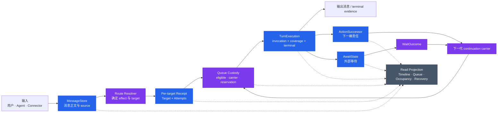
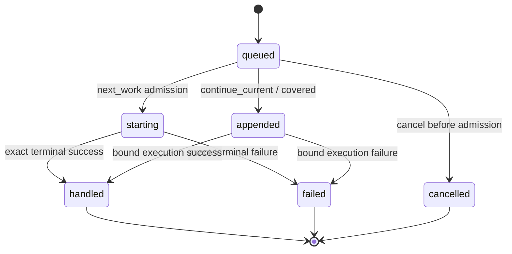
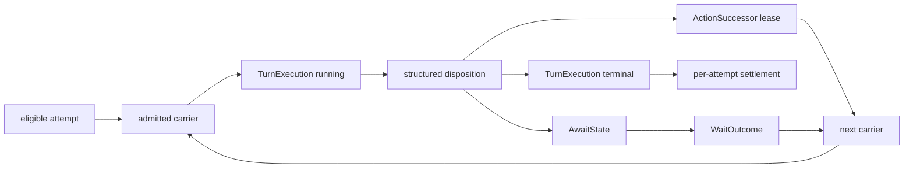
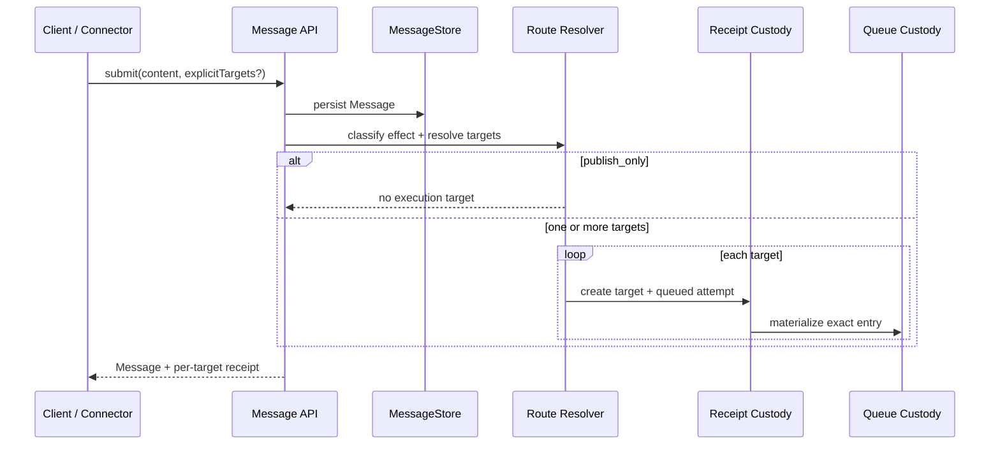
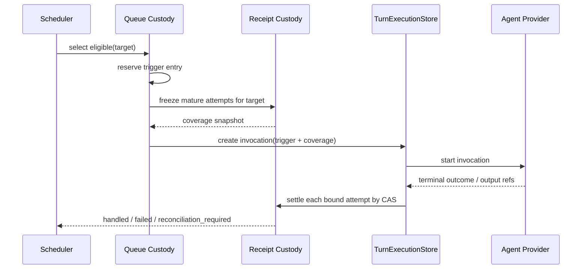
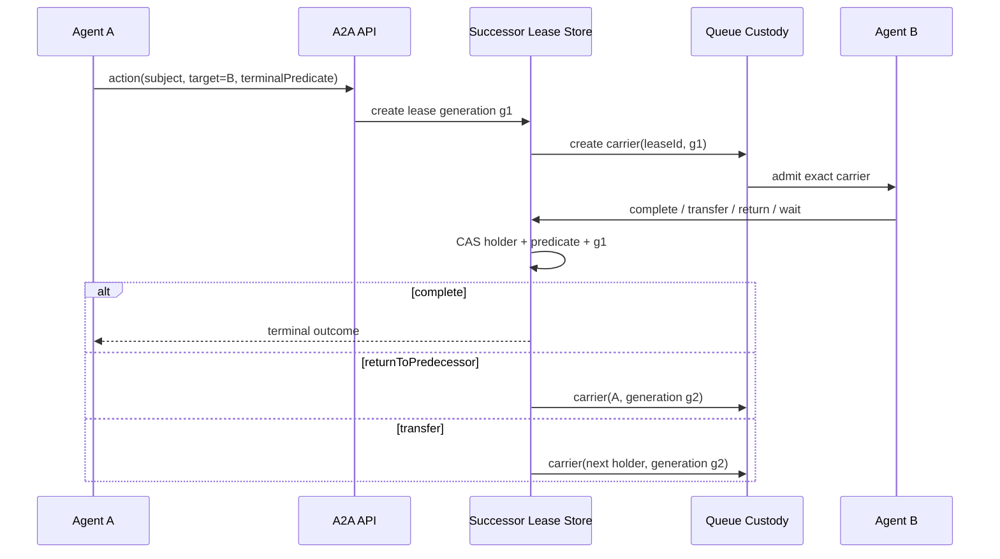
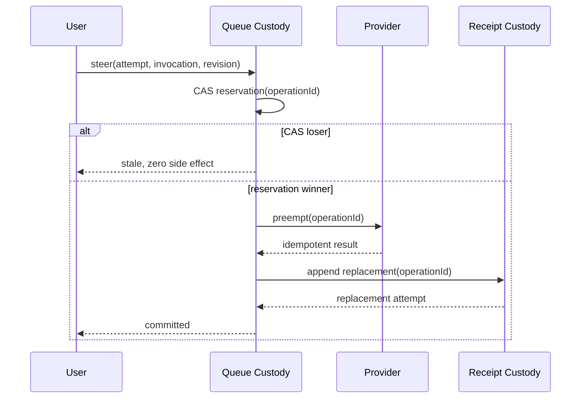

# A2A 消息投递、处理与交接生命周期架构

## 1. 背景、目标与范围

### 1.1 要重新设计的是什么

Clowder AI 的消息不是一次 HTTP 请求。一个输入可能来自用户、另一只 Agent、Connector、定时器、CI 或 GitHub；它可能投递给一个或多个目标，在目标繁忙时排队，在一次执行中合并读取多条消息，执行后继续交给另一只 Agent，或等待外部事件后恢复。

因此，本设计处理的是一条完整生命周期：

> 输入进入 → 确定目标 → 为每个目标持久化投递责任 → 取得执行权 → Agent 读取并执行 → 产出或交接/等待 → 精确结算 → 失败恢复 → 用户可见终局。

Issue #1354 的“队列已暂停 · 0 · 当前调用失败”只是入口症状：系统知道某处失败了，却无法说明是哪条消息、哪个目标、哪次尝试、哪次执行失败，也无法证明“继续”会推进正确的工作。Issue #1371 又证明，同一缺口还会表现为队头阻塞、重复执行、Steer 半提交、无关 hold 破坏 A2A 结算和成功 child 被改写成失败。

这不是 QueuePanel 的单点修复，而是消息投递、执行与责任交接协议的端到端重构。

### 1.2 目标状态

设计完成并实现后，系统必须满足：

1. 每条需要 Agent 处理的消息，都有按目标隔离、可持久恢复的投递记录；
2. 每次执行都能回答“由哪条 carrier 触发、实际覆盖了哪些消息、产生了什么终局”；
3. 普通 A2A 投递、行动交接和外部等待各有精确 owner，不靠 thread 最近说话者或一段正文猜责任；
4. 一个目标或一次尝试失败，不暂停 sibling target，也不把整个 thread 变成含义不明的 paused；
5. 重试、Steer、return、wait resume 和 terminal settlement 都由同一 source 与 owner fence 授权；
6. 没有 live execution 且存在可执行工作时，调度器必须推进、明确 park，或证明无工作，不能无状态返回；
7. 用户能从一条 source message 展开看到 target → attempt → execution → output / failure，而不是在 Timeline 与 Queue 看到两条似乎无关的消息；
8. 历史消息与任务默认永久保留；迁移不得删除用户数据，也不得长期运行两套生命周期。

### 1.3 范围

本文覆盖：

- 浏览器、Connector、用户和 Agent 输入的统一入口；
- 无 @ 路由、显式 target、多目标投递和普通 A2A；
- per-target receipt、attempt、Queue admission 与合并唤醒；
- TurnExecution、正文暴露、输出与逐 child 终局结算；
- ActionSuccessor、returnToPredecessor、扇出与 join；
- PR、CI、人工批准、timer、webhook 和 managed hold；
- failure、retry、Steer、reconciliation、restart recovery；
- Timeline、Queue、occupancy 和 recovery action 的统一读模型；
- 一次性数据补齐、切换和旧路径删除。

本文不规定每个 UI 像素，也不把所有协作编排成 DAG；它定义实现必须共同遵守的数据所有权、状态迁移、并发 fence 和验收边界。

### 1.4 设计结论

系统复用四个既有真相源，不新增第五本生命周期总账：

1. **Message receipt**：一条消息对每个目标投递到哪一步；
2. **Queue custody**：哪个 target attempt 获得本次执行准入；
3. **TurnExecution**：哪次 invocation 真正运行、看过什么、如何结束；
4. **ActionSuccessor / AwaitState**：行动交接或外部等待期间，责任由谁、哪一代 fence 持有。

四个 owner 之间通过不可变因果引用连接；跨 owner 写入使用 fenced saga 和精确 reconciliation。Timeline、QueuePanel 和 thread 摘要是可丢弃重建的联结投影，不能反向成为写入真相源。

## 2. 系统总览

### 2.1 端到端架构



主链只有一个方向：输入先成为 durable Message，再形成 per-target receipt；Queue 只准入已经存在的 target attempt；TurnExecution 只消费准入 carrier；terminal、handoff 或 wait 只推进与该 execution 绑定的 owner fence。

### 2.2 四个真相源的职责

| 真相源 | 唯一回答的问题 | 不能回答的问题 |
|---|---|---|
| MessageStore + QueuedMessageCustody / QueueReceiptTarget / Attempt | 这条消息投给了谁，每个目标经历了哪些尝试，当前用户应看到什么投递结果 | Agent 是否真正启动；下一棒当前归谁 |
| Queue custody / queue entry | 哪个 target attempt 当前有资格执行，哪个 carrier 已被准入，Steer reservation 属于谁 | 长期任务状态；外部等待是否满足 |
| TurnExecutionStore | 哪次 invocation 启动，触发输入与覆盖输入是什么，何时以及如何终止 | 消息的重试策略；行动责任应该交给谁 |
| ActionSuccessorLeaseStore / AwaitState | 行动交接或外部等待的 subject、holder、predicate 和 generation | 复制 Message、Queue 或 execution 的完整生命周期 |

### 2.3 为什么不建立统一 WorkItem

统一 WorkItem 若同时保存 `status`、`responsible`、`activeRunId`、`blockedBy`、`waitingFor` 和 `recovery`，就会分别复制 receipt、TurnExecution、successor lease 与 AwaitState 的事实。跨存储更新无法成为一个真实原子事务，最终会出现两个“当前状态”和两个“当前 owner”。

因此本架构明确不新增：

- WorkItem / LifecycleRecord 表；
- thread 级统一 status；
- blockedBy / waitingFor 依赖图；
- 独立 recovery ledger；
- 第二套 Queue、scheduler 或 lifecycle reducer。

跨层一致性靠“精确引用 + owner-local CAS + operation/outcome identity + reconciliation”获得，不靠复制一份汇总状态。

### 2.4 一个贯穿示例

假设用户消息 M1 和 Agent 消息 M2 都投给 B：

1. M1、M2 各自创建 B 的 receipt 与 attempt；
2. Scheduler 以 M1 的 entry 取得 trigger carrier；
3. admission 在 provider 启动前冻结 coverage snapshot，将已成熟的 M1、M2 都绑定到 invocation E1；
4. E1 启动后到达的 M3 不进入该快照，继续 queued；
5. E1 成功并产生 source-linked output，M1、M2 的 attempts 分别 CAS 为 handled；
6. M3 由下一次 carrier 唤醒；
7. 如果 M2 的结算写入短暂失败，reconciler 根据 `attemptId + invocationId` 补齐，不重跑 E1。

这说明“一次唤醒读取多条消息”与“每条消息有独立投递责任”并不冲突。

## 3. 核心概念与名词

| 名词 | 含义 | 真相 owner / 终局证据 |
|---|---|---|
| A2A | Agent-to-Agent；一只 Agent 向另一只 Agent 投递消息或移交行动责任 | per-target receipt；需要责任时再加 successor lease |
| custody | 某个精确 subject 当前由谁保管、允许做什么、用哪个 fence 推进；不是泛指“thread 在谁手里” | 对应 receipt、Queue、lease 或 AwaitState |
| owner | 对某类事实拥有唯一写入权的组件；其他组件只能引用或投影它 | owner 自己的 durable store |
| CAS | Compare-And-Set；只有当前版本仍等于预期值时才提交，用于拒绝 stale writer | attemptId / revision / generation |
| terminal | 本次 attempt、execution、lease 或 wait 已到不可再自动推进的终局 | exact terminal evidence |
| eligible / runnable | 已满足准入条件、可以被 selector 选中执行的 Queue 工作 | Queue custody |
| Message | 一条持久化输入或输出；正文只描述内容，不自动代表行动责任 | MessageStore |
| target | 该 Message 需要交付给的 Agent；多目标必须逐目标隔离 | per-target receipt |
| QueueReceiptTarget | 某条 Message 对某个 target 的用户可见聚合状态 | 由 QueuedMessageCustody 与 attempts 单向派生 |
| QueueTargetAttempt | 对一个 target 的一次投递/追加尝试；retry 产生新 attempt，不复活旧记录 | append-only attempt history |
| queue entry | Queue 中承载一个 target attempt 的可调度项 | Queue custody |
| carrier | 一次被授权进入 execution 的精确载体；普通 Queue、successor 和 wait carrier 的身份不同 | 各自 owner fence |
| TurnExecution | 一次真实 Agent invocation，记录触发输入、覆盖输入、liveness 与 terminal | TurnExecutionStore |
| coverage snapshot | execution 启动前冻结的、该 invocation 可读取的成熟消息集合 | TurnExecution causal refs + per-attempt binding |
| ActionSuccessor lease | A 把某个 subject 的下一步责任交给 B 的 versioned lease | leaseId + generation CAS |
| AwaitState | 对 PR、CI、人工批准、timer 等外部条件的持久等待 | waitId + generation + predicate |
| WaitOutcome | AwaitState 命中后形成的不可变结果 | outcomeId + owner fence |
| WaitContinuationCarrier | 把一个 WaitOutcome 一次性送入下一次 execution 的 carrier | waitId + outcomeId；只能消费一次 |
| owner fence | 防止旧 owner、错 target 或错 generation 推进状态的 CAS 条件 | attemptId，或 lease/wait generation |
| operationId | Steer 等跨存储/外部副作用操作的幂等 reservation identity | Queue owner 的 operation record |
| RecoveryCandidate | 从当前失败事实派生出的精确恢复能力，不是新 ledger | 底层事实变化即失效 |
| read projection | 联结真相源生成 Timeline、Queue、occupancy、recovery UI | 可重建，不得写回业务事实 |

### 3.1 因果坐标

| 坐标 | 用途 |
|---|---|
| messageId | 用户可见 source / output Message |
| targetCatId | 每目标隔离边界 |
| entryId | Queue custody carrier |
| attemptId | 一次 delivery / append / retry 尝试 |
| invocationId | 一次 TurnExecution |
| parentInvocationId | Agent 触发 Agent 时的执行因果 |
| triggerMessageId | 本次 execution 的 trigger 输入 |
| coveredMessageIds | 本次 execution 冻结覆盖的输入集合 |
| freshnessSupplementId | 独立 supplement execution 的因果身份 |
| subjectRef | PR、issue 或其他行动对象 |
| leaseId / waitId | successor 或 wait identity |
| generation | lease / wait 的 owner fence 版本 |
| outcomeId / evidenceRef | 可幂等消费的 terminal evidence |
| operationId | 跨副作用操作的 reservation identity |
| outputMessageId / replyTo | child 成功结果与 source 的 durable 输出关联 |

完整因果脊柱是：

```text
Message
  → targetCatId
  → QueueReceiptTarget
  → QueueTargetAttempt(attemptId)
  → queue entry(entryId)
  → TurnExecution(invocationId, trigger, coverage)
  → output / terminal evidence
    或 ActionSuccessor(leaseId, generation)
    或 AwaitState(waitId, generation)
  → 下一代 exact carrier
```

`threadId` 只是容器。单独持有 threadId，不能授权 terminal、retry、Continue、handoff、wait resume 或 execution admission。

## 4. 状态、一致性与并发模型

### 4.1 Per-target attempt 状态机



attempt 历史只追加。retry 创建新 attempt，并以 `retryOf` 指向旧 attempt。`QueueReceiptTarget.state` 由同一 receipt owner 内的 attempts 与 custody facts 单向派生，不能成为另一个独立 writer。

### 4.2 一次 execution 的状态关系



每个 execution 最终都必须 terminal。结构化 disposition 可以在结算当前 execution 的同时创建 successor lease 或 AwaitState；无论走哪条分支，都必须产生结构化状态迁移。普通文本 ACK、命令退出码、消息已发布或“看起来回答了”都不是 custody 终局。

### 4.3 四条系统不变量

- **Safety**：任何不可逆副作用前，必须先在事实 owner 内提交唯一 reservation；CAS loser 不得产生副作用；terminal 必须消费相同 source、target、attempt/invocation 或 generation。
- **Liveness**：没有 live execution 且存在 eligible work 时，调度必须 admission、明确 park 并记录 owner + next check，或证明无 eligible work；不得 bare-return。
- **Monotonicity**：exact child 已提交的 terminal truth 不得被 parent aggregate、later retry、restart 或 projection 降级。
- **Non-interference**：一个 target、dispatch、successor 或 wait domain 的 hold、failure、recovery 与 generation 变化，不得改写另一个 domain 的 owner fence。

### 4.4 原子边界与跨 owner 提交

| 操作 | owner 内原子提交 | 外部/跨 owner 动作 | 中断后的恢复键 |
|---|---|---|---|
| 消息入队 | Message + per-target receipt/attempt | Queue entry materialization | messageId + targetCatId + attemptId |
| execution admission | Queue carrier reservation | 创建 TurnExecution、调用 provider | entryId + attemptId + invocationId |
| execution terminal | TurnExecution terminal evidence | 逐 attempt receipt settlement | invocationId + attemptId |
| successor transfer | lease generation CAS | 创建 successor carrier | leaseId + generation |
| wait resume | AwaitState outcome CAS | 创建 continuation carrier | waitId + outcomeId + generation |
| Steer | steering reservation CAS | provider preempt + replacement attempt | operationId + captured revisions |

不追求不存在的跨存储大事务。正确协议是：先在真正 owner 内赢得 reservation，再执行幂等副作用，最后以同一 identity 完成后续 owner 写入；中断时由精确 reconciler 续完。

### 4.5 Queue progress obligation

所有 new-arrival、execution-terminal、retry 和 restart 扫描使用同一 eligible selector。当目标没有 live execution 时，每轮判定必须产生以下一种 durable 结果：

1. admission 一个 eligible entry；
2. 当前 entry 因更高优先级 entry 延后，同时 admission 被保护的 entry；
3. 当前 entry 被明确 park 到 runnable head 之外，并记录 reason、recovery owner、allowed action 与 next check；
4. 证明不存在 eligible entry。

failed、cancelled、withdrawn 或 paused-awaiting-advance 可以保留在历史与 UI 中，但不能继续占住 runnable FIFO head。fairness gate 若因 user entry 延后 agent entry，必须启动该 user entry，或持久化它为何尚不能启动；不能同时阻塞两类工作。

## 5. 主要业务流程

### 5.1 输入、路由与逐目标入队



路由规则：

- 有结构化 target 时，以结构化 target 为准；
- 无 @ 的用户输入继续使用 F078 服务端路由：当前对话偏好 / 最近有效回复者 → 服务端默认猫；
- composer 可以提示目标，但不能是唯一真相源；其他合法客户端必须得到相同服务端结果；
- Agent 输出先分类为 `publish_only`、`admit_exact_target` 或 `advance_existing_custody`；
- 正文中的 @ 只是可读运输提示，不能代替结构化 target 或结算责任。

必要伪代码：

```ts
function ingestMessage(input): MessageReceipt {
  const message = messageStore.create(input.content, input.source)
  const effect = classifyEffect(input)
  if (effect.kind === 'publish_only') return receiptForPublished(message)

  const targets = resolveTargetsOnServer(effect, input.context)
  for (const targetCatId of targets) {
    const attempt = receiptCustody.createQueuedAttempt({ message, targetCatId })
    queueCustody.materialize({ messageId: message.id, targetCatId, attemptId: attempt.id })
  }
  return projectReceipt(message.id)
}
```

多目标投递为每个 target 建独立 attempt。B 的失败、等待或 retry 不修改 C 的 receipt，也不暂停整个 thread。

### 5.2 Queue admission、合并唤醒与繁忙目标



Queue 操作语义：

- `next_work`：目标无 live execution 时，以一个 entry 作为 trigger，并在 provider dispatch 前冻结 coverage snapshot；
- `continue_current`：仅在 adapter 支持增量正文暴露时，把输入绑定到 live invocation；
- `steer`：先 reservation，后 preempt，再以同一 operationId 建 replacement；
- `cancel`：只取消尚未 admitted 的 exact target attempt。

一次 `next_work` 仍然只有一个 trigger carrier 和一个 TurnExecution，但可覆盖快照时该 target 的多条成熟消息。每个 covered attempt 都以自身 `attemptId + invocationId` CAS，快照后到达的消息保持 queued。

```ts
function admitNext(targetCatId): AdmissionResult {
  assert(noCanonicalLiveExecution(targetCatId))
  const trigger = queueCustody.selectEligible(targetCatId)
  if (!trigger) return proveNoEligibleWork(targetCatId)

  const reservation = queueCustody.reserve(trigger.attemptId)
  const coverage = receiptCustody.freezeMatureAttempts(targetCatId, reservation)
  const execution = turnExecutions.create({
    entryId: trigger.entryId,
    attemptId: trigger.attemptId,
    triggerMessageId: trigger.messageId,
    coveredMessageIds: coverage.map((item) => item.messageId),
  })
  receiptCustody.bindCoverage(coverage, execution.invocationId)
  return dispatchProvider(execution)
}
```

目标繁忙时，新输入仍先建立 durable receipt / attempt。adapter 支持 supplement 时记录 exact `invocationId + seenAt`；不支持时保留 queued，等待下一次 carrier，不能以 `dedup_active` 静默丢失。

### 5.3 Execution terminal、输出与逐 child 结算

一次 execution 的 terminal 分两层：

1. TurnExecutionStore 记录该 invocation 自己的成功、失败或取消；
2. receipt owner 按 execution 绑定的每个 attempt 分别提交 handled / failed。

```ts
function settleExecution(execution): void {
  const terminal = turnExecutions.requireTerminal(execution.invocationId)

  for (const attempt of receiptCustody.boundAttempts(execution.invocationId)) {
    if (terminal.succeeded && hasDurableSourceLinkedOutput(terminal, attempt)) {
      receiptCustody.markHandledCAS(attempt.id, execution.invocationId)
    } else if (terminal.failedOrCancelledFor(attempt)) {
      receiptCustody.markFailedCAS(attempt.id, execution.invocationId, terminal.reason)
    }
  }
}
```

per-target terminal writer 只读取 exact resolved child，不读取 parent aggregate 的总结果。一个 child `succeeded` 且已有 durable `outputMessageId / replyTo / evidenceRef` 后，该 attempt 必须单调变为 handled / consumed；另一个 sibling 失败可以使 parent aggregate 失败，但不能复活已成功 child。

若 execution 没有普通文本输出，但提交了满足当前 predicate 的结构化 successor、wait、hold、return 或 complete，该 action evidence 可以结算对应 protocol custody；不能用 provider 进程退出或普通回复代替它。

若 execution terminal 已提交而 receipt settlement 中断，reconciler 用 `invocationId + attemptId` 补齐；不得重新启动 child。

### 5.4 普通 A2A、行动交接与扇出

普通消息投递和“下一棒责任”是两件事：

- 普通 `targetCats`：目标收到消息并处理，终局绑定该 dispatch attempt；
- ActionSuccessor：A 明确把某个 `subjectRef` 的后续责任交给 B，B 必须完成、再交给 C、returnToPredecessor，或注册结构化等待。

普通 A2A dispatch 若携带协议球，其 terminal producer 也必须是结构化 complete、successor action、wait/hold、return 或 transfer。Agent 已生成正文、provider 已退出或命令成功，都不能单独结算该 dispatch。



ActionSuccessor lease 至少持有：`subjectRef`、`actionFamily`、predecessor、holder、successorSlot、terminalPredicate、generation、source invocation/dispatch 和 terminal/return evidence。

admission 与 terminal 都必须校验相同 `leaseId + generation + holder + predicate`。stale、错 holder、错 subject 或错 predicate 均 fail closed。`returnToPredecessor` 消费当前 generation 并创建下一代 carrier，不等于发一条普通 @ 消息。

A 同时派给 B、C 时，两者分别拥有 receipt、lease 和 execution。B/C 的 outcome 通过 predecessor 引用回到 A；join 条件由 lease outcomes 表达，不需要父 WorkItem。

### 5.5 外部等待与 managed hold

PR、CI、人工批准、timer 和 webhook 不是 Agent。外部事件只能推进已经注册的 AwaitState，不能被投射成一条“给某只猫的新工作”。

```mermaid
sequenceDiagram
    participant A as Agent
    participant W as AwaitState Store
    participant E as External Source
    participant Q as Queue Custody
    participant TE as TurnExecution

    A->>W: register(subject, predicate, owner fence g1)
    E->>W: signal
    W->>W: match + CAS outcome(g1)
    alt exact match
        W->>Q: one-shot carrier(waitId, outcomeId, g1)
        Q->>TE: admit continuation
        TE->>W: terminal consumes same fence
    else duplicate
        W-->>E: idempotent replay
    else stale / mismatch / no owner
        W-->>E: record only; no execution
    end
```

AwaitState 至少持有 `waitId`、`subjectRef`、owner fence、predicate、generation、source invocation/lease、status 与 evidenceRef。匹配后先形成不可变 WaitOutcome，再生成一次性 WaitContinuationCarrier。

```ts
function acceptExternalSignal(signal): WaitResult {
  const wait = awaitStore.findBySubject(signal.subjectRef)
  if (!wait) return recordExternalFactOnly(signal)
  if (!wait.predicate.matches(signal)) return recordMismatch(wait, signal)

  const outcome = awaitStore.commitOutcomeCAS(wait.id, wait.generation, signal.evidence)
  if (outcome.replay) return outcome
  return queueCustody.createOneShotWaitCarrier({
    waitId: wait.id,
    outcomeId: outcome.id,
    generation: wait.generation,
  })
}
```

event-driven wait 与轮询 hold 是互斥 carrier。已有 callback 与 AwaitState 时不得再叠加 timer hold。managed hold 恢复后，carrier、TurnExecution 与 receipt settlement 必须消费相同 `waitId + generation + outcomeId`；generation mismatch 只使该 item 进入 reconciliation，不暂停 sibling。

### 5.6 精确失败、Retry 与 reconciliation

失败首先归到 exact subject：

- 消息执行失败 → target attempt + invocation；
- successor 失败 → leaseId + generation；
- wait 失败 → waitId + generation；
- UI 投影错误 → 重建 projection。

RecoveryCandidate 从当前事实派生，至少包含 `messageId`、`targetCatId`、`entryId`、failed `attemptId`、可选 `invocationId`、custody owner、owner fence、allowedAction 和 reason。普通 Queue 的 fence 是 attemptId/revision；successor 与 wait 的 fence 是 generation。它不是持久化总账；底层事实一变化，candidate 即失效。

```ts
function retryExact(candidate): RetryResult {
  const current = resolveCandidateFromTruth(candidate.identity)
  assert(current.equals(candidate))
  assert(current.allowedAction === 'retry')
  assert(callerCanAdvance(current.ownerFence))

  return receiptCustody.appendRetryCAS({
    targetCatId: current.targetCatId,
    retryOf: current.attemptId,
    expectedFence: current.ownerFence,
  })
}
```

重复提交返回同一结果；过期 candidate 返回 stale，不能退化成无 target 的 `/queue/next`。

| 不一致 | 修复 owner | 精确修复 |
|---|---|---|
| receipt queued，但 queue entry 缺失 | Queue / receipt reconciler | 以 messageId + target + attempt 补 carrier |
| execution terminal，但 receipt 未结算 | TurnExecution / receipt reconciler | 以 invocation + attempt 补 terminal CAS |
| successor completed，但 continuation 缺失 | ActionSuccessor recovery | 以 lease generation 补下一代 carrier |
| wait outcome 已有，但 carrier 缺失 | Await recovery | 以 outcomeId 补 one-shot carrier |
| UI 与底层事实不一致 | projection builder | 丢弃并重建读模型 |

reconciler 只修复其 owner 管辖的缺边，不能用统一 reducer 重算整个 thread。

### 5.7 Steer：reserve-first fenced saga

Steer 同时涉及 Queue 状态与 provider preempt，不能“先 preempt、后验证 Queue”。正确顺序：



协议要求：

1. reservation 绑定 exact attempt、live invocation 和 captured revisions，并 fence void-ack、requeue、restart 与其他 Steer；
2. 只有 reservation winner 可以调用 preempt，operationId 同时是 provider 幂等键；
3. reservation 后、preempt 前失败可安全释放或重试同一 operationId；
4. preempt 后、replacement commit 前失败返回 `reconciliation_required`，由同一 operationId 续完；
5. preempt 已发生时不能返回一个暗示“无副作用”的 409，也不能让用户盲重试第二次 preempt。

### 5.8 Custody domain 非干扰

普通 A2A dispatch、ActionSuccessor lease 与 AwaitState 各自拥有 exact subject 和 owner fence：

- 普通 A2A terminal 校验 source dispatch、target attempt 与 execution child，不读取 ambient “当前 thread holder”；
- `hold_ball` 只能写其 source invocation 创建的 AwaitState / generation；
- successor terminal 只能消费自己的 leaseId + generation；
- sibling dispatch、hold、wait 或 action 的 generation 变化与它无关；
- 显式跨 domain transition 必须同时持久化双方 identity，例如 successor holder 消费 lease 后创建绑定该 lease 的 AwaitState。

这样 unrelated hold 与 A2A child 并发时，child 仍可用自己的 attempt / invocation / lease fence 结算，不产生 ambient `holder_mismatch`。

### 5.9 重启恢复

进程启动后按稳定顺序：

1. 恢复未终局 QueueTargetAttempt 与 queue entry；
2. 校验 starting / appended attempt 是否绑定 TurnExecution；
3. 对 live TurnExecution 运行 canonical liveness 判定；
4. 恢复 active ActionSuccessorLease 与 AwaitState；
5. 重新注册未终局 event wait，不重复消费已有 outcome；
6. 为缺边状态生成 item-scoped reconciliation；
7. 从四个真相源重建 UI 投影。

不能按“thread 最近一条消息”猜 owner，也不能把未知状态统一改成 paused。无法证明 owner 的 carrier 必须 fail closed，等待精确 reconciliation 或授权。

## 6. 用户可见模型与可观测性

### 6.1 一条 source 的逐目标生命周期

消息气泡对每个 target 显示：

- queued；
- starting / running；
- paused-awaiting-advance，并显示 recovery owner 与 next check；
- waiting / handed_off；
- handled；
- failed，可恢复时带 exact retry；
- superseded / withdrawn，并显示 supersededBy；
- cancelled；
- reconciliation_required。

Timeline 与 Queue 复用同一个 source message identity。Queue 展示的是该 source 的 target lifecycle，不是第二条消息。诊断视图必须支持：

```text
source message
  └─ targetCatId
      └─ attempts
          └─ queue entry
              └─ child invocation
                  ├─ covered inputs
                  ├─ output / replyTo
                  └─ terminal evidence
```

### 6.2 “排过、看过、运行过、处理过”的证据

| 用户问题 | 读取的真相 |
|---|---|
| 是否投给了这个 target | QueueReceiptTarget |
| 某次 delivery / append 是否成功 | QueueTargetAttempt |
| 哪次 invocation 取得执行权 | TurnExecution 的 entryId / attemptId |
| invocation 启动时覆盖了什么 | triggerMessageId + coveredMessageIds |
| live turn 后到输入是否真的暴露 | attempt 的 invocationId + seenAt；或 freshnessSupplementId |
| Agent 是否真正启动 | TurnExecution.startedAt |
| 消息是否处理完成 | exact terminal execution / authorized action 对 receipt 的 CAS |

### 6.3 Occupancy 与控制权限分离

canonical TurnExecution 仍 live 时，Queue / thread 投影必须显示 occupancy，即使它由 scheduler 或 foreign principal 启动：

- owner 可控制的 execution 显示真实授权 control handle；
- foreign-principal execution 显示 `not_cancelable / foreign_principal` 与合成 occupancy identity；
- raw task id 若同时是读取/取消 capability，就不能暴露给 foreign row；
- 权限只决定谁能 Steer / Cancel，不能决定 live execution 是否可见。

### 6.4 不再使用 thread-wide pause

- QueueProcessor 的 slot backoff 可作为运行时限流，但不是 durable 用户状态；
- QueuePanel 不把 slot pause 渲染成“暂停 · 0”；
- Continue / Retry 必须绑定 exact RecoveryCandidate；
- 普通 backlog、successor handoff 与 external wait 分开显示；
- 用户看到“排队等待 B”“球在 C”“等待 PR review”，而不是含义不明的 thread paused。

## 7. 目标数据契约与实现边界

### 7.1 目标契约（简化）

以下是跨模块必须共享的最小语义，不要求新增独立存储：

```ts
type TargetAttemptRef = {
  messageId: string
  targetCatId: string
  attemptId: string
  entryId?: string
  state: 'queued' | 'starting' | 'appended' | 'failed' | 'cancelled' | 'handled'
  invocationId?: string
  seenAt?: number
  retryOf?: string
  terminalReason?: string
}

type TurnExecutionCausalRefs = {
  invocationId: string
  entryId: string
  attemptId: string
  triggerMessageId: string
  coveredMessageIds: string[]
  parentInvocationId?: string
  outputMessageIds?: string[]
}

type VersionedContinuationRef = {
  kind: 'action_successor' | 'wait'
  subjectRef: string
  ownerId: string
  generation: number
  sourceInvocationId: string
  outcomeId?: string
}
```

这些结构的目的不是统一保存 lifecycle，而是保证每个 owner 能引用上一层的 exact fact，并在 admission/terminal 时校验同一 fence。

### 7.2 代码责任面

| 责任 | 当前实现锚点 | 目标改造 |
|---|---|---|
| receipt / attempt 类型 | `packages/shared/src/types/queue-receipt.ts` | 保持 append-only attempt；补齐 causal refs 与投影规则 |
| receipt canonical facts / projection | `packages/api/src/domains/cats/services/stores/ports/queued-message-custody.ts`<br/>`packages/api/src/domains/cats/services/stores/ports/queued-message-receipt.ts` | 一个 writer、单向 target projection、exact retry |
| attempt 协调与恢复 | `packages/api/src/domains/cats/services/agents/invocation/QueuedMessageCustodyCoordinator.ts`<br/>`packages/api/src/domains/cats/services/agents/invocation/QueuedMessageCustodyStartupReconciler.ts` | item-scoped reconciliation 与重启恢复 |
| eligible selector / admission / terminal scan | `packages/api/src/domains/cats/services/agents/invocation/QueueProcessor.ts`<br/>`packages/api/src/domains/cats/services/agents/invocation/InvocationQueue.ts` | 统一 progress obligation、coverage snapshot、逐 child terminal |
| Steer API | `packages/api/src/routes/queue.ts` | reserve-first operationId saga；preempt 前 fence |
| TurnExecution | `packages/api/src/domains/cats/services/stores/ports/TurnExecutionStore.ts`<br/>`packages/api/src/domains/cats/services/stores/ports/InvocationRecordStore.ts` | trigger / coverage / parent / output causal refs |
| 普通 A2A 与 callback 入口 | `packages/api/src/routes/callbacks.ts`、`callback-a2a-trigger.ts` | effect 分类与 exact dispatch terminal |
| successor custody | `packages/api/src/domains/ball-custody/ActionSuccessorLeaseStore.ts` 及 admission/completion/recovery services | generation CAS、return/transfer、domain isolation |
| wait lifecycle | `packages/shared/src/types/github-wait.ts`<br/>`packages/api/src/domains/github-signals/GitHubWaitLifecycleService.ts`<br/>`packages/api/src/domains/ball-custody/wait-state-machine.ts` | immutable outcome、one-shot carrier、generation fence |
| 用户读模型 | `packages/api/src/utils/queue-enrichment.ts`<br/>`packages/web/src/components/QueuePanel.tsx`<br/>`packages/web/src/components/MessageReceiptDock.tsx`<br/>`packages/web/src/components/queue-receipt-projection.ts` | source lineage、honest states、exact actions、occupancy |

路径是实现入口，不是新的 owner。具体类名可随重构调整，但所有权和验收契约不得漂移。

### 7.3 实施顺序

| 阶段 | 实现内容 | 完成证据 |
|---|---|---|
| 1. 契约与红测 | 固化 causal refs、owner fences、状态转换；把 #1354/#1371 现象写成失败测试 | A1–A33 对应测试先红 |
| 2. Receipt + Execution | 补 per-target attempts、coverage、exact child terminal 与 source-linked output | 多消息覆盖、逐 child 单调结算通过 |
| 3. Queue 调度 | 统一 selector、progress obligation、fairness self-consistency、runnable head | 无 live work 时不 bare-return；无队头死锁 |
| 4. Steer | reservation-first、operationId 幂等 preempt 与 reconciliation | CAS loser 零副作用；半提交可续完 |
| 5. A2A / Successor / Wait | exact domain fences、结构化 terminal、return、one-shot wait carrier | unrelated domain 不干扰；stale generation fail closed |
| 6. Recovery + Projection | exact RecoveryCandidate、reconcilers、source lineage、occupancy | UI 与底层 truth 一致；错误可定位可恢复 |
| 7. Cutover | 一次性 backfill、切读写、删除旧 pause/Continue/fallback | 无双 runtime；历史数据保留；重启可恢复 |

每阶段必须证明单 owner、单 carrier、至多一个 live execution；不能用新增统一 status 掩盖跨 owner 协议未闭合。

## 8. 一次性切换与数据安全

切换不运行永久双轨：

1. 为现有 QueueReceiptTarget 补齐 append-only attempts；
2. 把可证明的 queue entry 与 attempt 绑定；
3. 把可证明的 TurnExecution 写入 entryId / attemptId 因果引用；
4. 把 active successor / wait 连接到 source invocation 与 generation；
5. 无法唯一证明的历史记录只进入 `legacy_unknown` 投影，不猜测归属；
6. 切换统一读模型与 exact retry；
7. 删除 thread-wide pause、no-target Continue 和旧写入 fallback；
8. 重启后按第 5.9 节重建 projection 并运行 item-scoped reconciliation。

切换不得删除 Message、receipt、execution、lease、wait 或用户历史，不得为了迁移方便新增 WorkItem，也不得让 TTL 自动清理用户可见数据。

## 9. Issue 异常对照与设计验算

### 9.1 Issue #1354

| 已验证异常 | 根因 | 架构闭环 | 验收 |
|---|---|---|---|
| Queue 显示“暂停 · 0 · 当前调用失败”，却没有可见目标 | slot pause 与 receipt target 是两套投影；失败没有 exact subject | 逐 target receipt + source lineage；删除 thread-wide pause | A18–A19、A22 |
| Continue 可能挑到与失败无关的工作 | Continue 只知道 thread，不知道 target/attempt/generation | RecoveryCandidate + exact retry CAS | A16–A17、A20 |
| Queue/API 不显示失败 actor、invocation 或授权目标 | 缺少跨层 causal refs | message → target → attempt → invocation → evidence | A18–A23 |
| managed hold 已建 execution，但 receipt 因 generation 不匹配未结算 | wait carrier、execution、receipt 没消费同一 fence | WaitOutcome + one-shot carrier + same-generation terminal | A14–A15 |
| 外部事件像一条新 Agent 消息 | callback 没先匹配既有 AwaitState owner | 只推进 exact predicate；无 owner 不创建 execution | A12–A13 |

#1354 要求的重构边界在本文中的落点：

1. 端到端 lifecycle：第 2、5、6 节；
2. 复用四个 truth owner：第 1.4、2.2 节；
3. exact failed invocation + target + entry + custody/generation：第 3、5.6 节；
4. failure 回到正确 subject：第 5.6、6 节；
5. 单一 client/server model、一次性切换、历史持久：第 5.1、7、8 节。

### 9.2 Issue #1371

| 分支 | 已验证机制 | 架构闭环 | 验收 |
|---|---|---|---|
| A. unrelated hold 导致 A2A child `holder_mismatch` | thread-global holder 穿透独立 custody domain | dispatch / successor / wait exact fences；ambient holder 不参与 terminal | A25 |
| B. failed primary / fairness gate 阻塞后续工作 | 不可执行 entry 占 runnable head；gate bare-return | progress obligation、明确 park、同轮启动被保护 entry | A26–A27 |
| C. Steer 先 preempt 后 CAS | 409 可能发生在不可逆副作用之后 | reserve-first operationId saga | A28–A29 |
| D. aggregate failure 覆盖 succeeded child | parent aggregate 被误作 per-child terminal writer | exact child terminal 单调；aggregate 只读 | A30 |
| E1. busy target 输入静默消失 | `dedup_active` 没建立 durable responsibility | 输入先建 receipt；supplement 或 queued | A31 |
| E2. foreign-principal occupancy 隐形 | 权限过滤同时隐藏执行事实 | occupancy 与 control capability 分离 | A32 |
| E3. Timeline / Queue 看似重复消息 | 两个 UI 没共享 source lineage | 一个 source 的 per-target lifecycle | A33 |

相关边界：#1335 的 busy-target admission 与 #1368 的 foreign-principal occupancy 可以独立实现，但必须满足同一 lifecycle 契约；PR #1370 的 same-target preflight retraction 只覆盖一个局部分支，不能替代本设计。

### 9.3 验收矩阵

| ID | 场景 | 必须观察到 |
|---|---|---|
| A1 | 用户无 @ 发消息 | F078 服务端解析 target，并建立 per-target receipt |
| A2 | 用户显式指定 target | 只为指定目标建立 receipt |
| A3 | queued 前取消 | exact target attempt cancelled，无 execution |
| A4 | next_work | 一个 trigger carrier 只创建一个 execution；covered entries 保留各自 attempt |
| A4a | 同 target 多条消息已成熟 | 一次唤醒冻结 coverage；attempts 绑定同一 invocation 并逐项结算 |
| A4b | coverage snapshot 后又到消息 | 后到 attempt 保持 queued，不进入本次 coverage |
| A5 | adapter 支持 continue_current | attempt 记录 exact invocationId 与 seenAt |
| A6 | adapter 不支持 supplement | 回退 next_work，不提前 handled |
| A7 | Steer | 先 CAS reservation；只有 winner preempt，并以同一 operationId 建 replacement |
| A8 | 普通 A2A 完成 | 结构化 complete 结算 exact dispatch / receipt |
| A9 | A 创建 successor 给 B | B 仅凭 exact lease generation admission |
| A10 | B returnToPredecessor | 当前 generation 被消费，A 获得下一代 carrier |
| A11 | A 同时派 B/C | 两套 receipt / lease / execution 可并行 |
| A12 | PR/CI callback | 只推进匹配 AwaitState，不创建无主 execution |
| A13 | human approval | 仅授权 actor 可消费 exact predicate |
| A14 | managed hold 全匹配 | wait outcome、carrier、execution、receipt 使用同一 generation |
| A15 | managed hold mismatch | exact item reconciliation；sibling 继续 |
| A16 | exact retry | 新 attempt 带 retryOf，旧历史不变 |
| A17 | 重复 retry | 幂等返回，不创建第二个 attempt |
| A18 | queued receipt 缺 carrier | Queue reconciler 修复该 target |
| A19 | execution terminal、receipt pending | receipt reconciler 以绑定 execution CAS |
| A20 | stale generation terminal | fail closed，不改新 owner |
| A21 | B 失败、C 正常 | C 不被暂停，A 可见两个独立 outcome |
| A22 | 输入已暴露但 execution 失败 | receipt 不伪装 handled，并保留 execution 证据 |
| A23 | 消息无 source / authority | 只 publish 或拒绝推进，不隐式派工 |
| A24 | 一次性切换 | 无双 runtime、无持久数据删除、projection 可重建 |
| A25 | unrelated cat 在 A2A child 运行时 hold_ball | hold 只推进自己的 AwaitState；child 可按 exact fence terminal |
| A26 | failed primary 后同 target 又有 eligible entry | failed attempt 离开 runnable head；后到 entry 继续 admission |
| A27 | fairness gate 因 user entry 延后 agent entry | 同轮启动 user entry，或持久化 owner + next check；不得双向死锁 |
| A28 | void-ack / requeue / restart 与 Steer 竞争 | CAS loser 从未 preempt；winner 至多建一个 replacement |
| A29 | preempt 后 replacement commit 中断 | 返回 reconciliation_required，并由同一 operationId 续完 |
| A30 | parent aggregate 失败，但一个 child 已 succeeded 且有 durable output | 该 child 单调 handled；只有 failed/cancelled child actionable |
| A31 | busy target 在 coverage snapshot 后收到新消息 | 新 source 有 durable attempt，queued 或显式 supplement，不 silent dedup |
| A32 | scheduler / foreign principal 占用 execution slot | owner 看见 not_cancelable occupancy，但拿不到 raw capability handle |
| A33 | 同一 source 同时出现在 Timeline 与 Queue | UI 展示一个 source 的 per-target lifecycle 与 child lineage |

## 10. 必须保持不可能的状态

- 一个 target attempt 同时被两个 carrier admission；
- 同一 owner fence 同时存在两个 live TurnExecution；
- terminal 消费与 admission 不同的 source、target、attempt/invocation 或 generation；
- steering reservation 尚未提交就执行 preempt；
- CAS loser 返回冲突前已经产生 interrupt / cancel 副作用；
- 没有 live execution 且存在 eligible work 时 selector 无状态 bare-return；
- failed / parked attempt 永久占住 runnable head；
- parent aggregate 把 exact child 已提交的 handled / consumed 降级；
- unrelated hold / wait 改写普通 A2A dispatch 或 successor lease 的 fence；
- Agent 正文、命令退出码或普通 ACK 结算行动责任；
- 一个 target 的失败暂停 sibling 或整个 thread；
- 外部 callback 在没有已注册 owner 时创建 execution；
- projection 反向写入业务真相；
- foreign-principal execution 因不可控制而从 occupancy 消失；
- retry 覆盖或删除旧 attempt；
- 重启时凭最近消息猜测 owner。
