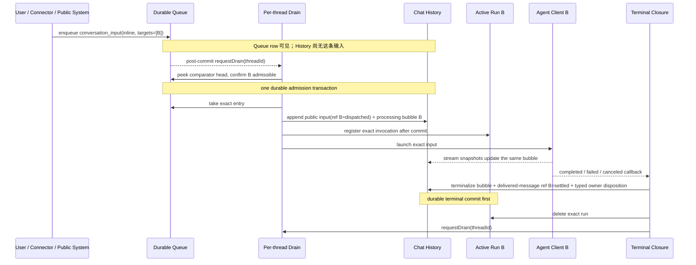
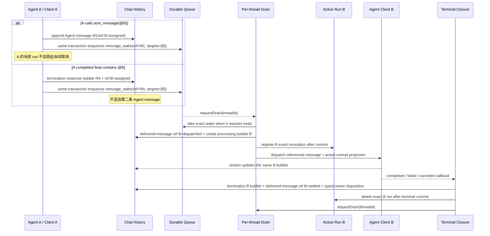
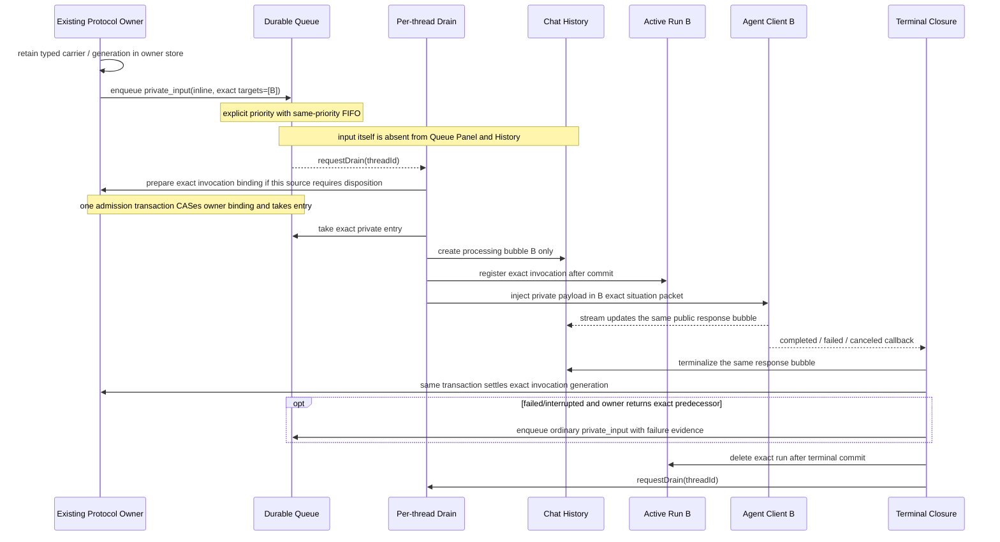
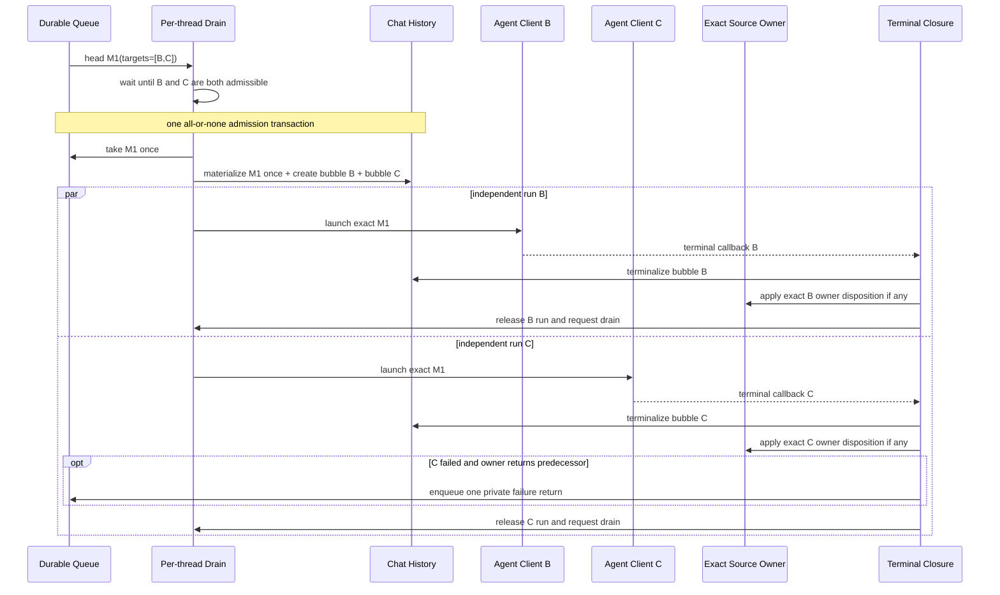
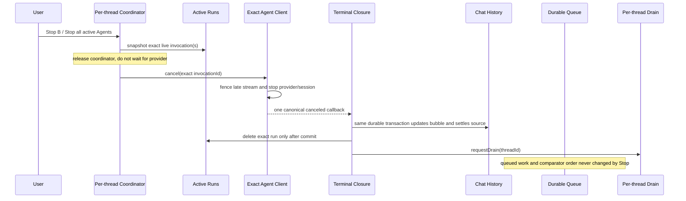
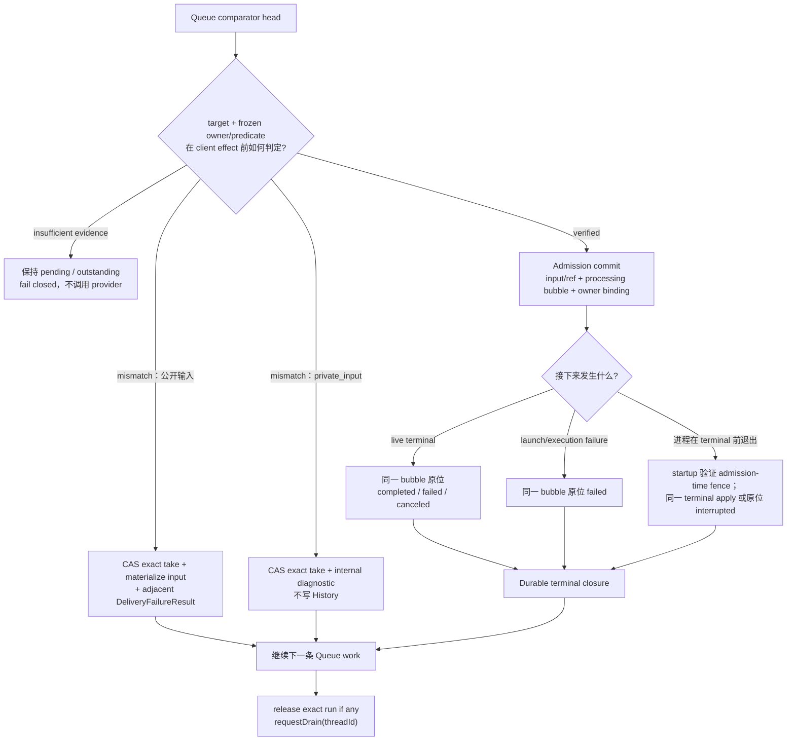
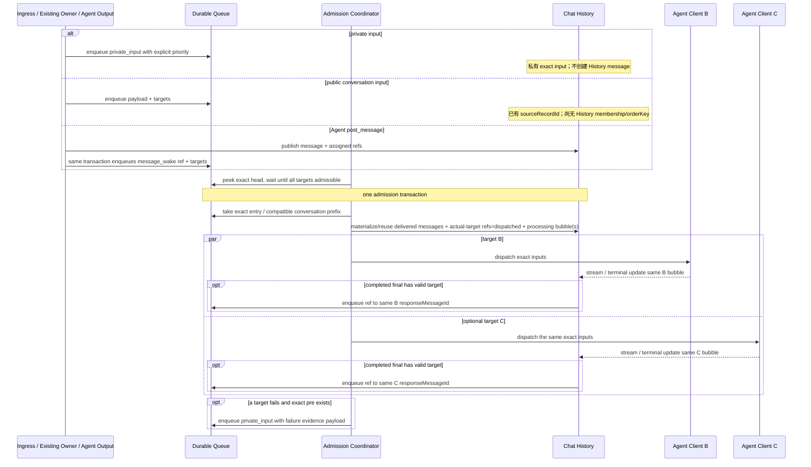

# A2A 消息投递、处理与交接生命周期架构

Related umbrella: [clowder-ai#1354](https://github.com/zts212653/clowder-ai/issues/1354)

Architecture cell: `dispatch + ball-custody + bubble-pipeline + approval-index`

Map delta: none — consolidates existing delivery, custody, result, and responsibility owners; adds no canonical cell or parallel ledger.

Why: the RFC makes one end-to-end contract from existing owner facts so implementation cannot reintroduce competing lifecycle rules.

## 1. 背景、方向与阅读方式

### 1.1 我们重新设计的是什么

一个 thread 同时容纳用户、Agent、Connector 与系统消息。消息可能需要等待、投给一个或多个成员、由用户追加到正在执行的成员，或者由用户 Steer 立即纠正方向。

当前实现的问题不是状态多，而是 owner 边界没有在一张图里说清：Queue/custody、body exposure、structured action/wait、InvocationRecord/TurnExecution 与 UI projection 本来回答不同问题，却经常被一个模糊的“已投递 / 正在处理 / 已完成”互相代替。局部补丁又让普通排队与 Steer 竞争，最终出现 client 已失败但 Queue 停住、消息已经显示却没有结果、或者没有 Agent 执行但 Queue 仍静默积压。

本文只回答一条消息从出现到结果的生命周期：

> 输入何时只存在于 Queue、何时进入共同时间线、队首何时必然被调度、输入如何交给 client、回复如何原位终局，以及失败或重启后用户看到什么。

本文按“完整主流程 → 场景验证 → 局部机制 → 可执行契约 → 异常与验收”的顺序展开。第一次阅读只需先读 §2 的场景旅程：它们给出系统希望用户与 Agent 实际经历的流程。后续章节再解释每一步为什么成立、事务边界在哪里，以及实现必须排除哪些状态。数据类型、伪代码和验收矩阵服务于主流程，不承担读者入口。

### 1.2 设计目标

1. Queue Panel 与聊天面板职责分离；进入 Chat History 后，前端流式气泡、最终内容与 Agent 上下文使用同一顺序；
2. Queue commit 后只使用一个稳定 comparator：手动 `position` 优先，其次只有 `urgent / normal` 两级，最后同级按 enqueue 顺序 FIFO；`private_input` 不因隐藏或协议用途自动获得第三种优先级；消息与 entry 身份永不合并；
3. 所有正常 dispatch 经过一个事件驱动的 per-thread drain；
4. 稳定状态下不可能出现“Queue 非空、没有 Active Run、也没有 drain owner”；
5. 每次被 admission 的运行先有固定响应气泡，成功、失败、取消、重启都原位终局；
6. Steer、Append、Cancel queued 与 Stop running 是用户对具体 entry/run 的显式操作，不是正常调度的补救机制；
7. Agent 内部复用现有未读 cursor 与上下文投影；用户侧在承载被投递正文的公开 History 消息自身下，用每个实际 target 的成员头像表达 processing/terminal 投影。public conversation 的同一 `sourceRecordId` 只有在 admission 后取得 History membership 才承载头像；admission 前的 Queue 投影与始终隐藏的 `private_input` 都不承载头像，也不引入 read receipt；
8. 不同来源已经给定消息用途；入口只把来源 envelope 封装为对应 QueueEntry。所有 `private_input` 与公开 entry 写入同一 durable priority Queue，彼此只在 inline payload 正文上不同；action fence、wait carrier 或 callback carrier 等 typed state 留在各自 owner store，由 owner 以 exact invocation 绑定并在 terminal 提交自身 disposition。
9. 每条实际被投递的公开 History 消息为每个 exact target 保存一条单调的 `dispatchRef` 因果边；消息可以由用户、成员、外部通知或系统产生，也可以是带下一跳 target 的 completed response bubble。阶段只表达尚待 dispatch、已经 dispatch 或已经结束，具体成功、失败、取消与中断仍由关联结果记录唯一表达。
10. enqueue-time target、Queue admission、provider body exposure、source handled 与 responsibility completed 是五个不同事实；任何一个都不能冒充另一个。

### 1.3 非目标

本文明确不设计：

- 持久化 Active Run、重建 provider client 或重启后自动重放；
- 重新实现现有 Queue custody 的 per-target attempt、exact body exposure、seen/handled owner；本文只规定它们怎样与 delivery kernel 对接，不复制其 canonical state；
- 面向用户新增一套已读/未读回执，或把 `dispatchRefs` 升格为 body exposure / handled / responsibility receipt；
- 把 `private_input`、action/wait carrier 或其他隐藏协议输入公开成 Chat History 消息、Queue Panel row 或头像锚点；未来若需要公开，必须另行定义可见性、迁移与权限契约；
- 将多条消息拼成一条正文、覆盖消息边界，或绕过 Queue 顺序的 batching；
- Queue entry 的 `queued / processing / handled / failed` 状态机；
- `urgent / normal` 之外的数值或多级 priority、从 entry kind/source category 暗中推导优先级、parked head、Queue 级 paused/resume 或无对象的 Continue；用户显式重排、Append、Steer 仍是带 exact entry 的 Queue 操作。若未来增加 Queue pause，它必须是独立 Queue 控制，不能成为 Stop running 的隐式副作用；
- hold ball、PR/CI wait 与人工审批 owner 内部如何决定是否产生一条来源消息；本文只定义来源 envelope 的 QueueEntry 封装、owner invocation binding 与 terminal disposition 边界；
- 成员运行时内部如何 compact context、切换/续接 session、handoff continuation 或触发下一段执行；这些都封装在 Agent Client 内，不扩张 Queue / History / Active Run 模型；
- 每种 provider 的具体 append、steer、cancel RPC。

外部等待、action successor、callback principal 与 predecessor failure return 可以从各自上游协议产生一条已经定型的 `private_input` 来源消息。owner 可以只提交自身状态变更而不唤起 Agent；只有 owner 已经决定“需要 exact target 继续处理”并签发 envelope 时，Queue 才出现一条 `private_input`。主生命周期不从 payload 反推这个决定，也不复制 owner 状态或等待记录形成第二条 Queue / 平行 lifecycle。

## 2. 先看一条消息如何完整走完

先不看类型和伪代码，一条输入的正常生命周期只有七步：

1. **来源形成消息**：用户、Connector、系统、Agent 或已有协议 owner 已经决定消息正文、用途与 targets；主生命周期不重新猜用途。
2. **持久入 Queue**：入口把来源 envelope 封装为一条 QueueEntry。公开输入、Agent wake 与私有输入都写入同一 durable priority Queue；默认 `normal`，同级追加到 FIFO 尾部；commit 后触发 `requestDrain(threadId)`。
3. **严格处理 comparator 队首**：per-thread drain 只看 `position → urgent/normal → enqueue FIFO` 算出的唯一 head。目标忙时等待；目标可用或存在确定失败时继续，绝不靠 timer 扫描补救。
4. **Admission 一次切换**：一个事务 exact-take Queue input，按 kind materialize 或复用实际被投递的 History message，把每个 actual target 的 ref 切到 `dispatched`，并为每个 actual target 创建固定 processing response bubble；事务提交后才建立内存 Active Run 并调用 Agent Client。
5. **同一气泡持续更新**：stream 只更新 admission 已创建的 response bubble；成员内部 compact、session rollover 或 handoff continuation 都留在 Agent Client 内，不产生新的主生命周期对象。
6. **Terminal 一次闭合**：completed、failed 或 canceled 都原位终局同一 bubble；同一持久事务让每个 structured owner 按自身 predicate 提交 exact disposition，并只创建该 outcome 合法的 follow-up。这里闭合的是本跳 delivery result，不代替 owner 宣称责任完成。
7. **释放并继续 drain**：terminal commit 成功后删除 exact Active Run，再次 `requestDrain`。下一条 Queue work 因此不会静默积压。

这条主线不会因入口不同而变成几套调度器。差异只发生在“Queue 前是否已有 History message”“admission 是否 materialize input”“terminal 是否产生 successor/predecessor follow-up”三个边界。下面按读者实际会遇到的场景分别展开。

### 2.1 用户或公开来源投给单个成员

公开输入在排队时只显示于 Queue Panel；真正开始 dispatch 时，输入和它的 response bubble 才一起进入 Chat History。这样不会同时维护一条 Queue row 和一条只有作者能看见、目标尚不可读的 History bubble，正在运行的其他成员也不会提前读到尚未出队的消息。



如果 B 忙，entry 留在 comparator 队首，后项不能绕过。若它没有有效 target 且 fallback/default 也不可用，系统不会制造假 B run；它通过 pre-admission transaction 把公开输入与紧邻的 `DeliveryFailureResult` 一次写入 History，并关闭 exact entry。

### 2.2 Agent A 投给 Agent B

Agent 内容先成为公开 History 事实，Queue 只保存对该消息的引用。独立 `post_message` 新建一条 Agent message；Agent Client 的 completed final 则原位终局已有 response bubble。两者有有效 target 时都只建立一个 `message_wake + message_ref`，不会复制正文。



B 正常结束后，M1/RA 上指向 B 的 ref 已经 `settled`，A→B 的 delivery result 闭合；structured owner 是否完成、交回或继续等待仍由其 predicate 决定。若 B 的 completed final 又指向 D，那是 B 自己 response bubble 上从 `assigned` 开始的新 B→D ref/wake；它不会重新打开 A→B，也不会让 A 递归等待 D。

### 2.3 私有协议输入投给 exact target

action successor、event-wait wake、registered callback 与 predecessor failure return 都是同一种 `private_input`。它们只在 inline payload 正文上不同；Queue 不解析 subtype，也不复制 action fence、wait carrier 或 callback generation。需要 terminal disposition 的协议 owner 把 typed state 留在自己的 store，并在 admission/terminal 以 exact invocation 绑定和提交自身状态变更。



私有输入必须有 exact target，永不走最近成员 fallback。target 或 owner binding 在 client effect 前失效时，系统 exact-take 该 entry 并留下 internal diagnostic；私有正文不会被公开，也不会为了“继续跑”而猜一只成员。

### 2.4 一条消息投给多个成员

一条 `@B @C` 消息仍只有一个 Queue entry 和一份公开 input。它在 B、C 都可 admission 时整体出队；随后每个 target 拥有独立 invocation、response bubble 与 terminal，某个 sibling 失败不会回滚另一个已经接受的运行。



兼容的连续 public inputs 可以共用一次 client dispatch，但每条 input 仍有独立 Queue entry、History message 与顺序。多目标 fan-out 也不创建 per-target Queue 残片；Queue 只有一条输入，运行与结果才按 target 分开。

### 2.5 Stop running 与正常终局

Stop Agent 控制的是正在执行的 exact Agent Client，不是 Queue，也不是通用 execution surface。指定成员 Stop 选择该成员的 exact Agent Client run；Stop all Agents 快照操作边界上全部 Agent Client runs。managed command/job、独立 child execution 或 hold task 不进入这个 snapshot，必须使用各自 owner 的 typed cancel。两种 Stop Agent 都不删除、重排或暂停 Queue，也不自行伪造 canceled terminal。



取消前已生成的正文保留在同一 bubble；UI 通过 bubble status/footer 表达 canceled reason，而不是追加第二条 system chat。Stop 之后 Queue 的下一条工作仍可为同一成员创建一个全新的 invocation，旧 Stop 不能误杀它。

### 2.6 失败与重启如何收敛

失败不是绕开主流程的补丁。它只根据发生在 admission 前还是 admission 后，选择“没有假 run 的 delivery failure”或“原位终局既有 response bubble”。



admission commit 之前退出，entry 仍在 Queue；startup 必须把原 owner/predicate 判为 verified、mismatch 或 insufficient evidence，不能直接重选 current generation。commit 之后退出，processing bubble 是 durable outstanding-result witness；系统不重建 provider client、不自动重放已经 admission 的工作。若 exact binding 可验证且 live client 已消失，同一 bubble 收敛为 `interrupted`；若 terminal/verdict 已提交，只补齐同一 apply；证据不足则保持 outstanding 并 fail closed。

### 2.7 后续章节怎样支撑这些旅程

- §3 给出投递内核的三个对象、外部 owner 边界与五条 normative laws，用于把场景中的 Queue、History、Run、Agent Client 和既有责任对象对齐；
- §4–§5 定义 QueueEntry、History、Active Run 以及各来源如何形成合法 envelope；
- §6–§7 证明严格队首 drain、admission 与 terminal transaction 为什么不会静默积压或半提交；
- §8–§11 处理未读顺序、Append/Steer/Cancel/Stop、失败重启与用户可见投影；
- §12–§16 是实现责任面、迁移顺序、Issue 对照、验收矩阵与不可能状态，供实现和 review 查漏。

这些场景不是六套并列状态机。它们用同一条主流程验证不同入口和 outcome 能否闭环；实现不能反过来为每个场景堆一组 `if/else`，再把偶然重合包装成架构。后文任何局部机制都必须能指出自己服务于上面哪一步，并保持 Queue membership、History result、Agent execution、body exposure 与 structured responsibility 各归其 owner。

## 3. 投递内核、owner 边界与规范法则

### 3.1 投递内核的三个业务对象

本文收敛的是 **conversation delivery kernel**，不是家里所有责任与执行状态。内核只有三个业务对象：

| 对象 | 持久化 | 唯一职责 |
|---|---:|---|
| Queue Entry | 是 | 保存一个有序待处理输入、可恢复 source identity、enqueue 时的 target intent，以及 Queue UI 回显所需 payload；仍在 Queue 就表示尚未开始正常 dispatch |
| Chat History Message | 是 | 保存已经进入聊天面板的输入、Agent 消息与响应气泡；拥有固定 `orderKey`，实际被投递的公开消息可持有指向 exact target/result 的 `dispatchRefs` |
| Active Run | 否 | 表示 delivery kernel 已为某个 Agent Client admission 的 exact inputs，并关联唯一响应气泡；它是 active-execution projection 的一个输入，不代表 managed command/job 或全部执行真相 |

Queue custody/body exposure、ActionSuccessor/AwaitState/TurnExecution、durable InvocationRecord、callback principal 与 provider presentation ledger 都是已有 owner 对象。它们不进入这三个内核对象，也不会因为本文使用相同的 `entryId / invocationId / messageId` 引用就失去自己的 canonical state。

### 3.2 全局对象关系图

Agent Client 是 launch 后的 exact 逻辑运行实例：它承接 stream/final callback，也暴露 Stop Agent 所需的 exact cancel handle；成员内部如何 compact、切换或续接 provider session、handoff continuation、重新触发下一段执行，都封装在这个 client 内。对主生命周期而言，这些内部边界仍是同一个 `invocationId + responseMessageId`，既不创建新的 Queue entry / Active Run / response bubble，也不成为第四本账。provider adapter 只是创建和操作 Agent Client 的实现边界，不进入业务对象模型。Admission Coordinator 也只是事件触发的 drain 驱动器，不拥有另一份 lifecycle 状态或排序策略。managed command/job 是另一类 execution owner，不能被 Stop Agent 的 Active Run snapshot 误选。

```mermaid
flowchart LR
    E["输入 envelope<br/>用户 · 外部 Connector · 系统 · callback"] --> P["封装 QueueEntry<br/>kind + payload + from + targets"]
    P -->|"conversation_input"| Q["Queue conversation_input<br/>priority Queue · inline payload"]
    P -->|"private_input"| QC["Queue private_input<br/>same priority Queue · inline payload"]
    PM["Agent post_message"] --> AH["Chat History 独立 Agent message<br/>固定 messageId + orderKey"]
    AH -->|"有效 target：只创建引用"| Q2["Queue message_wake<br/>message_ref payload"]
    Q --> D["Per-thread Drain<br/>事件驱动 single owner"]
    QC --> D
    Q2 --> D
    D --> M["Admission transaction<br/>take exact Queue entry"]
    M --> K{"QueueEntry.kind"}
    K -->|"conversation_input：materialize"| IH["Promote source record into public History<br/>复用 sourceRecordId · 分配 orderKey"]
    K -->|"message_wake：解析引用"| RH["Reuse referenced History message<br/>不复制正文"]
    K -->|"private_input：不创建 History message"| B["Chat History processing bubble<br/>固定 responseMessageId + orderKey"]
    IH -->|"同一 admission transaction"| B
    RH -->|"同一 admission transaction"| B
    B -->|"commit 后"| A["Active Run<br/>内存态"]
    A --> C["Agent Client<br/>成员 session / compact / handoff 内部透明<br/>launch · stream · final · cancel exact invocation"]
    S1["Stop 指定 Agent"] --> X["快照所选 exact Active Runs"]
    S2["Stop thread 全部活动 Agent"] --> X
    X -->|"cancel exact invocation"| C
    C -->|"stream：更新同一气泡"| B
    C -->|"completed / failed / canceled callback"| T["Exact run terminal"]
    T --> H["Chat History<br/>同一 response bubble 原位终局"]
    H --> F{"Terminal outcome"}
    F -->|"success / completed"| FS{"final 有有效 target?"}
    FS -->|"是"| FW["Queue message_wake<br/>引用同一 responseMessageId"]
    FS -->|"否"| R["提交本 invocation 的 typed owner disposition（若有）<br/>commit 成功后释放 exact Active Run"]
    F -->|"failed"| FF{"source owner 返回 predecessor?"}
    FF -->|"是"| N["Queue private_input<br/>payload 携带 failure evidence；不进 History"]
    FF -->|"否"| R
    F -->|"canceled"| R
    FW --> R
    N --> R
    R -->|"requestDrain"| D
```



图中的 conversation work 只在 Drain 的 admission transaction 汇合：

- public `conversation_input` 是 `Queue → take → materialize 为公开 History message → 创建 processing bubble → Active Run → client`；
- Agent `post_message` 已经在 History；有有效 target 时，同一事务写 `assigned` refs 并让 Queue 保存它的引用；
- Agent Client 的 completed final 不另写一条 Agent message：它原位终局 admission 时创建的 response bubble，只解析一次 canonical final；有有效 target 时，同一 terminal transaction 写 `assigned` refs 并创建引用同一 `responseMessageId` 的 Queue wake；
- CLI output 只从 Agent Client 的 stream/terminal 边进入 History，不经过来源消息的 QueueEntry 封装；`private_input` 来源消息则被直接封装为同一 priority Queue 中的 entry，唤起 exact target，但它本身不创建 History message。

因此 inline `conversation_input` materialize 为 History message 后不会再次进入 Queue。`History → Queue` 只表示一条已经存在的 Agent `post_message` 或 completed response bubble 需要唤起成员时创建 `message_wake + message_ref`；它不复制正文。stream chunk 不参与 target 解析，Stop/failed/canceled 也不会凭残留输出创建 wake。`private_input` 已经是 Queue work：drain admission 时只把它作为 exact 私有输入注入，不再额外生成一条 History message；Agent Client 随后的 stream/terminal 仍走同一 response bubble 主链。

主链的 Agent Client terminal 只有 `completed / failed / canceled` 三类 outcome；`interrupted` 是 startup recovery 在没有 live client callback 时合成的 failure-like terminal，沿 failed 分支收敛，不是第四条正常 callback 路径。success 只可能追加 completed-final message ref；failed 只在匹配的 structured source owner 返回 exact predecessor 时把 failure 交回该 predecessor；canceled 不追加 follow-up。用户、Connector、定时任务与公开通知没有 owner binding，不参与 predecessor return，直接进入共同 closure。

共同 closure 把“让本 invocation 已绑定的 structured owners 提交 typed disposition”和“释放 exact Active Run”放在一起表达，但两者有明确先后：History terminal、outcome follow-up 与 owner disposition 先在一个持久事务中提交；只有 commit 成功后才释放内存态 exact Active Run。公开输入没有 source binding，因此跳过 owner disposition，但仍释放 run。generation fence 留在 action-successor / event-wait 等既有 typed carrier 与 owner store 中，不被主生命周期复制成一套通用字段；这样旧回调既不能关闭新一代责任，也不会因 owner CAS 失败而提前丢掉 Active Run。

这里的“成员内部 handoff”与协议可见的 A2A successor 是两件事：前者只是 Agent Client 为完成同一个 invocation 所做的 session continuation，主生命周期不可见；后者只有在 client 产出 canonical completed final / 独立 `post_message` 且带有效 target 后，才以既有 History message 的 Queue ref 进入下一跳。

Stop Agent 不直接写 History terminal。它只从 domain active-execution projection 中筛选 `kind='agent_client'` 的 exact run，再调用所选 Agent Client 的 `cancel(invocationId)`；client 负责停止 provider stream，并沿正常 callback 边界产生唯一 `canceled` terminal。此后仍复用同一 durable closure：原位保留已经生成的正文、把 bubble 标为 canceled、让各 structured owner 按自身 predicate disposition，commit 成功后释放 exact Active Run，再触发 drain。provider/session 级 cancel、内部 handoff 与迟到 chunk 的吸收都属于 Agent Client；主生命周期只接受 processing 状态下的 stream 与该 exact invocation 的单一 terminal。managed command/job 只因显式调用自己的 typed cancel 才终止，不能被 Agent target 或 thread Stop all 猜中。

### 3.3 Canonical facts 与 derived projections

- Queue membership 是“尚未开始 normal dispatch”的唯一调度真相；已有、将被投递的 Agent History message 上的 `assigned` ref 只是同一 enqueue transaction 写出的可重建因果投影，不能代替 Queue；
- exact live Agent Client 由 durable InvocationRecord/TurnExecution、process-local tracker 与 callback principal 共同形成 domain-owned active-execution projection。Active Run 是其中属于本 delivery kernel 的 exact input/response 关联，不是全部 execution 的唯一真相；
- Queue custody/body exposure owner 记录 exact target/invocation 何时真正拿到 prompt body，以及随后是否 handled。`assigned`、`dispatched`、processing bubble 或 provider accepted 都不能自动推出 seen/handled；
- ActionSuccessor、AwaitState、TurnExecution 与其他 structured owner 保留 generation、predicate、attempt、predecessor 和 responsibility terminal。delivery terminal 可以触发 owner disposition，但不能替它宣称责任完成；
- 响应气泡的 `processing / completed / failed / canceled / interrupted` 是公开输出结果。`dispatchRefs` 只是从**实际被投递的公开 History 消息**到 Queue/结果事实的持久 derived projection。对 public conversation，这条 History 消息就是 enqueue 时取得 `sourceRecordId` 的同一记录；admission 前它只投影为 Queue row，不承载头像。transport carrier、structured source owner 与始终隐藏的 `private_input` 只提供 provenance/authority，不是公开消息或头像锚点。ref 不复制 outcome、body exposure、handled 或 typed carrier。

### 3.4 Source ownership / supersession table

本节固定三项重构契约：admission 前 public conversation 保持 Queue-only，并在 live cutover 时取代旧 owner-timeline 双表面；Queue 使用 `position → urgent/normal → same-priority FIFO` 的单一稳定 comparator，不保留 fixed private prefix 或 system/category-derived rank；用户态 `processing` 只表示 server-side Agent execution live，provider receipt/exposure 继续是独立内部事实。这些都是目标实现必须满足的规范，不是运行时可选分支。

owner-timeline baseline 不是推断：当前 `packages/api/src/routes/messages.ts` 在 Queue acceptance 后写入 `deliveryStatus='queued'` 的 MessageStore record，`packages/api/src/domains/cats/services/stores/visibility.ts` 再把它作为 owner-facing browser timeline message，同时禁止普通 cat context 提前读取。重构在 live cutover 时删除的正是这条双表面契约；稳定 `sourceRecordId` 保留同一消息的恢复与 identity，但 admission 前不授予 History membership 或头像投影。

| Contract family | 处置 | Canonical fact | 本 RFC 的集成边界 | Acceptance anchors |
|---|---|---|---|---|
| owner timeline | **superseded at live cutover** | admission 前由 Queue/custody owner 持有可恢复 `sourceRecordId + entryId + payload` 并在 Queue Panel 投影；Chat History 从 admission 起才拥有公开 membership 与 `orderKey` | 一个 Queue row 承担持久回显、reload 与操作入口，并取代现行 owner-facing queued History bubble；admission 复用同一 `sourceRecordId` 进入共同 History，不创建第二条来源消息。Append 若立即赢得 cutover，也会立即完成这一步 | A1, A17–A20, A36, A39, A57 |
| body exposure / handled | **external owner preserved** | Queue custody 的 exact `targetId + invocationId + bodyExposure`；handled/target outcome 由其 owner 以 terminal evidence 推进 | `dispatchRefs.dispatched` 只表示已建立 run/bubble；`seen` 只能在 exact prompt body exposure 后写，`handled` 只能由 owner terminal predicate 写 | A10, A21, A31–A32, A50, A53, A79–A80 |
| ordering / priority | **normative Queue contract** | durable Queue entries 的 `position / priority / enqueuedAt` | 保留 `urgent / normal` 两级核心并移除 hidden category rank：priority 由生产者显式给出或默认 normal，不能从 private/source/system category 推断。用户拖拽提交当前 Queue revision 下完整的 visible row order；服务端原子重写这些 rows 的 positions，因此只有显式手动操作能覆盖默认 priority/FIFO。隐藏 rows 不被客户端寻址，仍按自身 priority/FIFO 排序；reservation 只能让 exact row 暂不可重排，不能改变 comparator rank | A3–A5, A11, A15–A17, A35, A69–A70 |
| wait / retry / continuation | **external owner** | AwaitState/action lease/task owner 的 predicate、baseline、generation、attempt、expiry 与 continuation | owner 先决定 terminalize-only 还是签发 exact `private_input`。没有 envelope 就不启动 Agent；有 envelope 就只按 owner 给定 target 运行，Queue 不解析 carrier。尚未 admission 的 candidate 发生 eligibility/evidence mutation 时，由既有 post-commit signal 唤醒 typed re-read；terminal Retry 若存在，只能创建新 entry/attempt | A33–A34, A48–A50, A54–A56, A59, A66, A86–A88 |
| routing / custody acceptance | **preserved and fenced at admission** | 当前 membership/capability/availability、owner generation 与 Agent Client acceptance 各自由原 owner 给出 | enqueue `targets` 只是 target intent；client effect 前重新验证、建立 exact owner/invocation binding。targetless fallback 只属于 public head，structured/private work 永不 fallback | A6–A7, A12–A14, A18, A27–A29, A40–A47, A74, A78 |
| execution / cancel | **derived composition** | domain active-execution service 组合 InvocationRecord、tracker、TurnExecution、managed command/job 等 owner truth | Active Run 只贡献 Agent Client delivery slice；Stop Agent 只 cancel exact Agent Client snapshot，不能命中 managed command/job，也不能直接写 terminal | A22–A25, A27–A29, A60–A65 |
| restart interruption | **preserved direct dependency** | durable running invocation/processing bubble、callback principal、immutable structured owner admission binding 与 Queue custody | startup 先按原 owner/predicate fence 区分 verified、mismatch、insufficient evidence；只有 binding 可验证且 live client 消失的 admitted Agent run 原位收敛为 `interrupted`，同步 owner disposition 与 derived refs。已提交 verdict 只补 apply；未 admission work 不自动重放。live cutover 前移除或隔离所有 selectable terminal-plus-queued legacy projection | A17, A19–A21, A49, A53, A59, A80–A89 |
| model presentation | **normative derived projection** | History/Queue facts、body exposure、active-execution snapshot；动态 context 的 provider-received receipt 仍归 presentation ledger | UI 与 Agent situation packet 从同一 canonical snapshot 映射；用户态 `processing` 表示 exact server-side Agent execution 已开始且尚未终局，不承诺 provider 已接收或 Agent 已看到正文。launch/execution 失败仍让同一 bubble 原位 `failed`；`presented` 只由 provider receipt 推进 | A22–A23, A30–A32, A53, A67–A68, A76–A85 |
| `dispatchRefs` | **rebuildable derived projection** | `assigned` 来自 exact message-wake Queue membership；`dispatched` 来自 delivered-message↔processing bubble/invocation binding；`settled` 来自 linked terminal record | History owner 可持久化 ref 供读取，但 startup/reconciler 必须能从上述事实重建。失配时 canonical facts 胜出；唯一映射可 CAS 修复，缺失/多义则 fail closed、隐藏 working claim并报警，不猜测；同一 public source record 仅在取得 History membership 后承载 ref，transport carrier、structured owner 与 private input 不能成为替代 UI anchor | A2, A6–A7, A10, A40, A53, A73, A75–A80, A90 |

### 3.5 五条 normative laws

**L1 — 每个事实只有一个 owner。** Queue/source custody 拥有未 dispatch 输入与 exact exposure；History 拥有公开 timeline/result；execution owners 拥有 live/terminal；structured owners 拥有责任 generation。其他 surface 只能引用或投影，不能复制并裁决同一事实。

**L2 — 顺序、副作用与 authority selection 只在一个 durable cutover 上改变。** 一条 durable Queue 只有一个稳定 comparator：存在 `position` 的 rows 先按 position，未定位 rows 再按 `urgent → normal → enqueuedAt → id`；同 priority 永远 FIFO，entry kind/source/system category 不产生第三种隐藏优先级。用户拖拽必须携带 `expectedQueueRevision + orderedVisibleEntryIds` 原子替换完整 visible order；不能直接寻址 private rows。任何 normal dispatch/Append/Steer 都先原子赢得 exact Queue cutover、固定 targets/bubble，并让 external structured owner 按每个 target/invocation 提交 immutable admission binding：owner kind、lease id/generation、frozen predicate 或 HEAD、principal/tenant/route。preflight、admission/persist、terminal、same-generation replay 与 startup recovery 都只验证这份 admission-time fence；History/Queue 只引用 `invocationId`，secondary resolver 不得从 carrier 或 current-identity lookup 重新选择“当前 generation”。完成这些提交后才能产生 client side effect。

**L3 — identity、admission、exposure、handled 不可互相推断。** enqueue targets 只是 intent；dispatch 时重验 membership/capability/availability 与 owner fence；`dispatched` 不等于 provider-presented/seen，`settled` 不等于 handled 或 responsibility completed。每次推进都必须绑定 exact entry/source/target/invocation/generation。

**L4 — 每个 admitted target/invocation 只有一个 durable delivery-result terminal。** client effect 前先有固定 response bubble 与 recoverable callback principal；completed/failed/canceled/interrupted 原位终局同一个 delivery result。message persisted、target invocation admitted、execution terminal、visible reply lineage、body handled 与 structured responsibility settled 是六个不同事实；responsibility terminal/disposition 始终归 external structured owner 的 exact generation/predicate。same-generation replay 返回已经提交的同一 terminal；compensation 不能撤销已提交的 typed verdict，也不能把 append-won/apply-crashed 恢复成第二个 semantic answer。Stop 只请求 exact Agent Client cancel；startup 先验证 admission-time fence，再收敛确已 admission 且 live client 消失的 processing work。

**L5 — projection 可重建，歧义时 fail closed。** `dispatchRefs`、头像、“正在处理”与 Agent situation summary 都从 canonical facts 导出；derived state 可以缓存/CAS 修复，但不能反向改写 owner。缺证据、映射多义或 owner read 不完整时，只能省略动态 claim并暴露诊断，不能显示虚假的 seen/working/completed。

## 4. Reference：最小数据契约

本节把 §2–§3 已经讲清的流程固化为实现契约。第一次阅读可以跳到 §5；实现、迁移与 review 时再回到这里逐字段核对。

### 4.1 Queue Entry：有序待处理输入

```ts
type InlinePayload = {
  type: 'inline'
  body: readonly MessageContent[]
  routingWarnings?: readonly RoutingWarning[]
}

type MessageRefPayload = {
  type: 'message_ref'
  messageId: string
}

type QueuePayload = InlinePayload | MessageRefPayload

type MessageFrom =
  | { kind: 'user'; userId: string }
  | { kind: 'agent'; catId: string }
  | {
      kind: 'external'
      connectorId: string
      sender?: { id: string; name?: string }
      address?: { chatId: string; messageId?: string }
    }
  | { kind: 'plugin'; instanceId: string }
  | { kind: 'system'; service: string }

type QueueEntryBase = {
  id: string
  threadId: string
  from: MessageFrom
  targets: string[]
  ownerAuthProvenance: 'strict' | 'compatibility_fallback' | 'unknown'
  priority: 'urgent' | 'normal'
  enqueuedAt: number
  position?: number
}

type QueueEntry =
  | (QueueEntryBase & {
      kind: 'conversation_input'
      sourceRecordId: string
      payload: InlinePayload
    })
  | (QueueEntryBase & {
      kind: 'message_wake'
      payload: MessageRefPayload
    })
  | (QueueEntryBase & {
      kind: 'private_input'
      payload: InlinePayload
    })

type ReorderVisibleEntriesCommand = {
  threadId: string
  expectedQueueRevision: string
  orderedVisibleEntryIds: string[]
}
```

`ReorderVisibleEntriesCommand` 对齐现有 Queue Panel 的批量 reorder，而不是发明三种位置命令。拖拽结束后，前端提交它在同一 snapshot 中看到的**完整 visible row 顺序**；服务端先校验 `expectedQueueRevision`，并确认 ids 无重复、集合与该 revision 的可重排 visible rows 完全一致，然后在一个事务中依次写入 `position=0..n-1`。revision、集合或 row eligibility 任一变化时整批 typed conflict，不能 partial-write 或猜邻近位置。

唯一 comparator 固定为 `position presence → position → priority(urgent before normal) → enqueuedAt → id`。因此没有手动操作时只有两级稳定 priority，同级新 entry 永远排在后面；一旦用户显式提交完整 visible order，这些 positioned visible rows 按用户顺序先于未定位的隐藏 rows，隐藏 rows 仍按自己的 `urgent/normal/FIFO` 排序且彼此不会被客户端直接改写。execution reservation 只能让 exact row 暂时不具备 reorder eligibility，不能把它提升成第三种排序等级。这个规则保留现行 `InvocationQueue.compareEntries`、Queue Panel `positions[]` 的两级排序核心，同时明确 supersede category-derived pinned rank，并用 revision CAS 补上并发窗口。

这七个维度不能互相代替：

- `payload` 只回答正文是直接随 entry 保存，还是引用一条已存在的 History message；因此只有 `inline / message_ref` 两种承载方式；
- `from` 只回答“谁/哪个系统发出”。每个 id 都位于自己的判别命名空间中，不能把 IM sender、GitHub actor、plugin instance、user 或 Agent 的 id 当成同一种 id；
- `targets` 只回答 enqueue 时的 target intent，不是成员当前可用、capability 合格、已接受 custody 或已经 seen；
- `sourceRecordId` 是 public conversation 在 enqueue commit 时就获得的可恢复 owner identity；它尚未拥有 History membership/orderKey，admission 时复用为公开 `messageId`，不能再生成第二个来源身份；
- `ownerAuthProvenance` 只记录生产者认证强度；它不替代 owner generation/capability preflight。新的 public/plugin/private producer 必须建立 strict binding，legacy unknown 只能走显式迁移/fail-closed 路径；
- `priority` 只有 `urgent / normal`，默认 `normal`；生产者必须显式选择 urgent，不能让 Queue 从 `kind`、source category 或 payload 正文推导；
- `kind` 才决定 admission 语义：是否 materialize History message、是否允许 targetless fallback，以及是否对用户可见；它不决定 Queue 优先级。

现有代码已经提供了这类判别结构的先例：普通 `MessageSender` 区分 user/cat；Connector message 另有 `connector + sender`；plugin messaging envelope 又把 `actor(user/cat/plugin)` 与 `provenance.origin(host/plugin/external)` 分开。目标模型将真正的发送者收敛为上面的 `MessageFrom`，而不是继续用裸 `authorId`。这里 transport/provenance 也不能冒充 sender：`host` 表示宿主转发来源，不是第六种人；当前 Connector transport 同时承载外部平台消息与内部 system notice，因而 GitHub/IM/webhook 归入 `external(connectorId + sender/address)`，scheduler 等家内服务归入 `system(service)`。当前实现里的 `ci / review / conflict / scheduled / a2a / continuation / issue / freshness` 是触发原因或协议用途，不是与 user/Agent 并列的身份类型；需要保留时放入 payload 正文、payload provenance 或观测 metadata，不扩张 `from` 或 lifecycle `kind`。

`targets` 是 enqueue 时从结构化 mention 得到、当时有效的成员集合：

- 能解析到成员时保存 exact ids；Queue UI、队首 busy 检查、多目标 admission 与显式操作都直接使用它；
- public `conversation_input` 无 mention、mention 解析失败或没有有效成员时保存空数组；此处空数组明确表示在实际出队时选择 fallback；
- entry 到达队首时仍要按当前 thread membership 重新验证；只有 `conversation_input` 允许空数组/fallback。`message_wake` 与 `private_input` 都必须有 exact targets，不能把显式目标失效解释成“随便找最近成员”，否则会把定向或私有内容交给错误成员；
- target 相同是共用一次 dispatch 的必要条件，但不是“把消息合成一条”的许可。只有队首开始的兼容输入，或已被同一次未读投影精确覆盖的 wake ref，才可一并取走；每条消息与 entry 的身份、正文和顺序仍然独立。

`conversation_input` 用于 public conversation 的用户、外部 Connector、plugin 或系统输入。它使用 inline payload 保存 Queue row 完整回显所需的正文与附件，并在 enqueue commit 时获得稳定 `sourceRecordId`；但此时没有 History membership/orderKey，Agent 普通 context 也不可见。admission 才把同一 source record materialize 为公开 History message。默认规则是：所有普通来源都构造 `conversation_input`；只有正文已经存在于 History 时使用 `message_wake`，或来源明确给出不可公开的协议输入时使用 `private_input`。`message_wake` 使用 message-ref payload，只引用既有 `messageId/responseMessageId`，不复制正文。`private_input` 也使用 inline payload，但必须有非空 exact `targets`，与其他 kind 一样进入同一 priority Queue；它不创建 History message，也不在用户 Queue Panel 回显。action successor、event-wait wake、registered callback 与 predecessor failure return 只会让 payload 正文不同；QueueEntry 形状、admission、可见性和 terminal 规则完全相同，priority 则由各生产者明确给出而非从这些用途猜测。它们都只在目标 Agent 的 exact input / situation packet 中可见，永不进入 Chat History 或普通 Queue Panel。

History 策略不能从 `from` 单独推断：`from.kind='system'` 既可能是需要公开的 `conversation_input`，也可能是 `private_input`；`from.kind='agent'` 说明发送者身份，但只有 `kind='message_wake' + payload.type='message_ref'` 才表示正文已经存在于 History。合法组合由 `QueueEntry` 的判别 union 固定，dispatch 不再用 sender id 猜消息用途。

Queue 只保存 `private_input` 的 inline payload，不理解这段正文为何产生，也不解析 generation、predecessor 或成员 session 状态。action-successor 的 `actionSuccessorFence`、event-wait 的 `waitContinuationCarrier` 与 registered callback 自己的 carrier 继续由各自 owner store 解释；owner 若需要 terminal disposition，就在 QueueEntry 之外按 exact entry/invocation 建立自己的 binding。failure return 的生产者只创建一条正文含 exact evidence 的普通 `private_input`，不登记新的 predecessor binding。是否存在 owner binding 是上游协议事实，不是 QueueEntry 字段或 private payload subtype。

本文图中的 `pre` 只是 failed/interrupted owner disposition 的 nullable **返回结果**：owner 校验 admission 时冻结的 typed carrier、lease/generation 与 predicate 后，可能返回 exact predecessor route，也可能返回 `null`。它不是 QueueEntry、Message 或 Active Run 的通用字段，更不是 `from` 或“这条正文看起来像谁写的”。public input 没有 source binding，因此自然得到 `pre=null`；一条 `from.kind='agent'` 的普通公开消息也不能仅凭发送者自动补造 pre。

Queue Entry 不保存任意数值 priority、attempt、receipt 或运行状态。priority 只允许 `urgent / normal`，默认 normal，同级按 `enqueuedAt` FIFO；kind、source/system category 与 private payload 正文都不能暗中改写它。用户显式重排提交完整 `orderedVisibleEntryIds`，服务端原子重写这些 rows 的 `position`，这是唯一能覆盖默认 priority/FIFO 的普通排序路径。客户端不提交 private ids；未定位的隐藏 rows 仍按 priority/FIFO 形成唯一后缀顺序。commit 后只由上述 comparator 驱动 drain，既不维护第二条 Queue，也不在 dequeue 时临时扫描越过 head。

每条输入对应一个独立 Queue Entry：

- 每次用户或 Connector 输入是一条 inline payload + 一条 entry；
- 每次 `post_message` 是一条独立 History message；需要成员处理时再建一条 message ref entry；
- 每次 completed final 原位终局既有 response bubble；只有 canonical final 含有效结构化 target 时才建立引用该 bubble 的 message ref entry，不追加第二条 Agent message；
- 每条 `private_input` 来源消息是一条独立 private entry，按显式 priority 与同级 FIFO 入队；它不会复制成公开 History message；
- 相邻且路由形状、解析后 target set 都相同的 public conversation inputs 可以共用一次 dispatch，但会分别 materialize 为独立 History message；
- 多条 wake 可以由同一次未读投影精确覆盖，但不拼正文、不丢 message/entry 边界；
- 拖动重排或删除 entry 是显式用户操作；批量 reorder CAS 成功后，完整 visible order 立即成为新真相。

### 4.2 Chat History Message：进入聊天面板时固定位置

```ts
type DispatchRef =
  | {
      targetId: string
      phase: 'assigned'
    }
  | {
      targetId: string
      phase: 'dispatched'
      statusMessageId: string
    }
  | {
      targetId: string
      phase: 'settled'
      statusMessageId: string
    }

type LifecycleMessageMetadata = {
  orderKey: string
  from: MessageFrom
  dispatchRefs?: DispatchRef[]
  producerInvocationId?: string
}

type DeliveryFailureResult = {
  kind: 'delivery_failure'
  status: 'failed'
  id: string
  threadId: string
  orderKey: string
  sourceEntryId: string
  inputMessageId: string
  requestedTargets: readonly string[]
  reason:
    | 'no_available_target'
    | 'invalid_explicit_target'
    | 'control_carrier_missing'
    | 'control_carrier_replaced'
  body: MessageContent
  createdAt: number
}

type ResponseBubble = {
  id: string
  threadId: string
  orderKey: string
  invocationId: string
  targetId: string
  inputEntryIds: string[]
  inputMessageIds: string[]
  body: MessageContent
  status: 'processing' | 'completed' | 'failed' | 'canceled' | 'interrupted'
  dispatchRefs?: DispatchRef[]
  startedAt: number
  completedAt?: number
  reason?: string
}
```

`orderKey` 在消息或响应气泡首次进入 History 时分配，之后永不改变。外部输入在 Queue 阶段已经有 owner-owned `sourceRecordId`，但没有 History membership/orderKey；正常 dispatch admission 复用该 identity 写入 History，并紧接着写入对应的 processing response bubble。bubble 的 `status='processing'` 是 durable **outstanding-result witness**，只说明该 admitted invocation 还没有 delivery-result terminal；它本身不提供 responsibility authorization。只有它、exact live Active Run 与可验证的 admission-time owner fence 同时成立时，UI 才投影“正在处理”，其含义是 server-side Agent execution live。provider-presented、body exposure、seen、handled 与 structured responsibility 仍由各自 owner 独立推进。`completedAt` 只用于耗时与诊断，不能重新排序。

`dispatchRefs` 是**实际被投递的公开 History record**到 exact target 结果记录的持久因果边，每个 target 最多一条，并按实际 target set 的稳定顺序保存。这里的 History record 就是正文被交给目标的那条用户消息、成员消息、公开外部/系统通知，或带下一跳 target 的 completed response bubble。public conversation 在 enqueue 时已经取得 `sourceRecordId`，admission 只让同一记录获得 History membership、`orderKey` 与 refs，不另造 source bubble；transport carrier、structured source owner、始终隐藏的 `private_input` 与为目标执行创建的 response bubble 都不是这条输入消息的替代头像锚点：

- `assigned`：被投递消息已经在 History，且同一事务已为该 target 创建 durable `message_wake`；它仍是尚未 actual dispatch 的 Queue 计划，用户 UI 不用头像宣称目标正在处理；
- `dispatched`：admission 已把该消息交给解析/重验/fallback 后的 actual target exact run，并创建 `statusMessageId` 指向的 processing response bubble；public conversation input 因为此前尚无 History message，会在 materialize 时直接以 actual target 的这个阶段出现；
- `settled`：该 target 的本跳已经产生 canonical terminal；`statusMessageId` 继续指向原 response bubble，或在 explicit target 于 admission 前失效时指向相邻的 `DeliveryFailureResult`。

阶段只能单调推进。`completed / failed / canceled / interrupted` 等 outcome 只从 `statusMessageId` 指向的 canonical record 读取，不能复制进 ref 后形成第二份结果真相。`settled` 只表示 linked canonical result 已 terminal；它不表示 target 已看到正文、Queue custody 已 handled、ActionSuccessor/AwaitState 已 completed，或整个责任链结束。一个 response bubble 覆盖多条 exact input 时，每条公开被投递消息的对应 ref 可以指向同一个 `statusMessageId`；multi-target input 则由每个 target 的 ref 独立推进。completed response bubble 若随后带 target，它在上一跳是 terminal result、在下一跳同时也是被投递消息，并只在自身 record 上增加下一跳 refs。`private_input` 没有公开被投递 History record，因此不创建 `dispatchRefs` 或用户头像。

`dispatchRefs` 虽持久化以服务读取性能，仍必须可重建：`assigned` 从 exact `message_wake + target` Queue membership 重建，`dispatched` 从 delivered message identity、processing bubble 的 exact input IDs/target/invocation binding 重建，`settled` 从 linked terminal bubble 或 `DeliveryFailureResult` 重建。History projection owner 负责 reconciliation：唯一映射时用 CAS 修复；canonical facts 缺失、冲突或出现多个候选时 fail closed，移除/隐藏不可信 working claim并写诊断，绝不让 ref 反向终结 Queue、execution 或 structured owner，也不把 provenance carrier 临时投影成一条可见消息。

`DeliveryFailureResult` 是 Chat History 中的公开终局结果，用于没有 target/invocation、因而不能合法创建 `ResponseBubble` 的 pre-admission failure。它引用 exact Queue entry 与 input message，但不伪造 target、invocation 或 Active Run。进入 Chat History 就表示已经进入聊天面板并成为公开对话事实。只给某个 Agent 的内部输入不能靠隐藏 visibility 状态塞进 History；它必须留在 Queue 的 `private_input` payload，dispatch 时只进入该 Agent 的 exact input / situation packet。

Response bubble 不保存 source owner carrier；它只持久化输出身份、exact `invocationId`、输入因果引用与用户可见结果。source owner 以 invocation binding 保存自己的 typed carrier，startup/terminal 用 `invocationId` 查询，不把 generation 或 predecessor 暴露进 History API。`body` 始终是该 invocation 截至当前的完整累计正文；stream 持久化以单调 sequence/CAS 对同一 record 做 snapshot replace，而不是每个 chunk append 一条 History message。这样既支持 provider 的 append chunk，也支持 replace snapshot，重试不会把正文重复拼接。

completed response bubble 同时也是一条可被 `message_wake` payload 引用的既有 Chat History record。target parser 只消费 terminal commit 采用的 canonical final body；stream chunk、failed/canceled 残留正文和重复 terminal callback 都不能创建 successor wake。terminal transaction 必须把 bubble 终局与其 completed-final wake（若有）作为一个幂等提交，避免 History 已可见但 Queue wake 永久缺失，或重试产生重复 entry。

### 4.3 Active Run

```ts
type ActiveRun = {
  threadId: string
  targetId: string
  invocationId: string
  responseMessageId: string
  inputEntryIds: readonly string[]
  inputMessageIds: readonly string[]
  privateInputEntryIds: readonly string[]
  startedAt: number
}
```

Active Run 保存本轮 exact entry IDs；公开输入另有 `inputMessageIds`，`private_input` 只列在 `privateInputEntryIds`。typed owner disposition 不靠 Active Run 复制 carrier：exact terminal 只用 `invocationId` 调用 existing owner，owner 从 durable invocation binding 找回自己的 typed carrier。需要公开输入的作者、来源或因果信息时从 History 回读。failure return 是 owner disposition 后产生的一条普通 `private_input`；其生产者不建立新的 predecessor binding，因此再次失败时不会递归交回，但 Queue 不需要知道这条 payload 的用途。正常 dispatch 在调用 provider 前登记 Active Run，同一结构承担 admission 后的 occupancy 与显式操作定位。

provider 只需返回是否接受以及 exact execution handle；动作类型由调用方确定。

### 4.4 External owner admission binding：同一授权决定贯穿恢复与终局

需要 structured responsibility disposition 的 source，由它的 external owner 在自己的 store 中持久化一条 immutable admission binding；这不是 Queue、History 或 Active Run 的字段，也不是第四个通用 WorkUnit/Receipt/Settlement ledger：

```ts
type StructuredOwnerAdmissionBinding = {
  invocationId: string
  entryId: string
  targetId: string
  ownerKind: string
  ownerSubjectRef: string
  leaseId?: string
  generation: number
  frozenPredicate: {
    kind: string
    value: string
    headSha?: string
  }
  principal: {
    tenantId: string
    routeId: string
    callbackPrincipalId: string
  }
  admittedAt: number
}
```

字段名可以按 owner 的 typed contract 具体化，但不可丢失这些语义：`invocationId → owner kind + lease/generation + frozen predicate/HEAD + principal/tenant/route`。action/wait lease 是 responsibility authority；callback principal 只认证 exact callback actor/invocation；carrier 只提供 transport provenance。后三者不能互相替代，也不能由当前 thread holder、当前身份或“仍是同一个 HEAD”推导。

preflight 只产生一个待提交的 exact decision candidate。admission transaction 必须重新校验该 candidate 仍 current，并与 Queue take、processing bubble、callback-principal activation 一起 CAS 提交 binding；即使 HEAD 未变，只要 generation 已替换，旧 candidate 也必须失败。提交后 owner binding immutable：terminal、duplicate replay、compensation 与 startup 都按 `invocationId` 读取并验证这份 exact fence。History/Queue/Active Run 只引用 `invocationId`；secondary resolver 可以核验 owner 事实，却不能从 carrier 或 current-identity lookup 重新挑一个“最新” owner/generation。

同一 exact binding 的持久状态转移只有一条：

```text
preflight candidate
  → admission commit（immutable owner binding）
  → delivery-result terminal + typed owner disposition
  → same-generation replay / startup convergence 返回同一 committed facts
```

binding mismatch 时，系统只可用 CAS 关闭仍由 Queue 持有的 obsolete pending work，不产生 provider side effect；证据不足时 entry/bubble 保持 pending/outstanding 并 fail closed。已提交 typed verdict 或 delivery terminal 后，恢复只能补齐同一提交的 projection/apply，不能补偿成第二个语义答案。

## 5. 消息入口

### 5.1 各来源直接封装同一种 QueueEntry envelope

主生命周期没有 `Pre-Queue` 分类状态，也不在入口调用 existing owner 或 Agent Client。每个生产者直接给出 `kind + payload + from + targets`；入口只校验字段组合、解析结构化 targets 并持久入队：

```text
用户 / external connector / plugin / system 的公开消息
  → conversation_input + inline payload → priority Queue（默认 normal）

Agent post_message / completed final 已存在的 History message
  → message_wake + message_ref payload → priority Queue（默认 normal）

action successor / event-wait / registered callback 的私有协议输入
  → private_input + inline payload → priority Queue（生产者显式 urgent/normal）

failed/interrupted disposition 返回的 exact predecessor failure return
  → private_input + inline payload → priority Queue（生产者显式 urgent/normal）
```

这只是不同生产者构造同一种 QueueEntry envelope，不是一个额外业务步骤。入口不能搜索正文关键词，也不能根据 transport、payload 内容、是否存在 predecessor 或当前 thread holder 改写 `kind`。它只检查 Queue 契约，例如 `message_wake` 必须引用同 thread 的既有 History message，`private_input` 必须使用 inline payload 并带 exact targets。action/wait/callback owner 的 typed carrier 留在 owner store；failure return 的 evidence 只是 payload 正文。若上游协议没有产生消息，就没有 Queue entry。

CLI output 来自已经运行的 Agent Client：stream 更新既有 response bubble，completed/failed/canceled 走 §7.3–§7.4 的 terminal closure；只有 completed final 或独立 `post_message` 含有效 target 时，才构造 `message_wake + message_ref`。`private_input` 则先进入同一 priority Queue，admission 后才作为 exact 私有输入启动 Agent Client；此前不存在这次 Agent Client 调用。

### 5.2 用户、Connector、定时任务与公开通知：先入 Queue，dispatch 时进入聊天面板

```text
收到输入
  → 构造 from，并解析结构化 mention 得到 targets（可为空）
  → 持久化 sourceRecordId + 创建 QueueEntry(conversation_input, inline payload, from, targets)
  → Queue Panel 直接回显 entry payload
  → Queue commit 后 requestDrain(threadId)
  → 队首按当前 membership 重验 targets；为空时选择合法 fallback，得到 actualTargets
  → admission 时复用 sourceRecordId 为 messageId、分配 orderKey，并以 actualTargets 的 dispatchRefs=dispatched 写入 Chat History
```

Queue Panel 是 public conversation input 在排队阶段的唯一用户可见位置，聊天面板只展示已经开始 dispatch 的消息。entry 仍在 Queue 时，输入既不属于 Chat History，也不进入任何 Agent 普通上下文；admission 原子移除 entry、按实际解析出的 target set materialize 一条公开 History message 并创建 response bubble 后，它才同时出现在聊天面板并成为本轮 exact Agent input。此时这条新出现的 input bubble 本身就是被投递消息与头像锚点：每个 actual target 的 ref 都直接为 `dispatched`，不存在另一条“source bubble”。`private_input` 是同一 durable Queue 中的私有 entry，但不在用户 Queue Panel 或聊天面板展示，只在被投递目标的 exact input 中可见，因此也没有公开头像锚点。

Queue commit 自身就是外部输入的持久边界。排队阶段的 source record 只提供稳定 identity 与 Queue/custody 恢复，不拥有 History membership/orderKey；admission 复用同一 identity，不为 Queue 回显制造第二条 message。

目标契约在 live cutover 时取代旧 owner-timeline publication。现行基线先创建 Queue entry，再把同一正文以 `deliveryStatus='queued' + queueCustody` 写入 MessageStore：browser reader 把它放进 owner timeline，cat context 则继续隐藏。这个设计虽然可恢复，却让同一待处理输入同时占有 Queue row 与 owner-only History bubble，并被迫维护三套不同语义：authoring-time timeline position、Queue execution order、target cognition order。用户随后在 Queue 中重排时，History bubble 仍留在原 authoring position；target 看到它的时间又取决于 dequeue，单个 bubble 因而无法直观表达“在队列哪里”和“何时成为共同对话”。

新契约只保留一个 pre-admission 用户表面：Queue acceptance 后，发送者从 Queue Panel 获得完整正文、附件、持久 identity、reload 恢复与 Cancel/Append/Steer/reorder 操作；共同 Chat History 只包含已经 admission 的输入。这样排序事实只在 Queue，conversation order 只在 admission 时生成，target cognition 仍由 body-exposure owner 独立记录，不再用一条 owner-only bubble 横跨三个时间坐标。排队消息在 admission 前不会出现在 Chat History；这是 live cutover 必须一次完成的产品契约，不是兼容性 fallback。

若 App Server 支持 Append 且用户选择立即 Append，Append 先 exact-take entry 并赢得同一 admission cutover，因此消息会立即进入 History 与目标 exact input；这不是提前发布 Queue row 的第二条路径。迁移时，旧 `deliveryStatus='queued'` owner-only records 若尚未 body-exposed，就降为 Queue source record 并从 shared History membership 移除；已经 exposure 或存在公开引用的 record 必须保留原 identity，并走显式 migration/quarantine，不能静默重排既有公开事实。

### 5.3 Agent `post_message` 与 completed final：共用 History ref，写入时机不同

```text
Agent post_message
  → 解析结构化 mention，得到 targets
  → 写一条独立 History message
  → 若需要成员处理，同一事务写 dispatchRefs=assigned
    + 创建 QueueEntry(message_wake, message_ref, from=agent, targets)
  → requestDrain(threadId)

Agent Client completed final
  → 对 terminal 采用的 canonical final body 解析一次结构化 mention
  → 在 terminal transaction 中原位 completed 同一 response bubble
  → 若有有效 target，原子写 dispatchRefs=assigned
    + 创建 QueueEntry(message_wake, message_ref=responseMessageId, from=agent, targets)
  → 不追加第二条 Agent History message
  → 释放 exact Active Run 后 requestDrain(threadId)
```

`post_message` 本身是完整聊天内容，因此立即成为一条独立 History message。completed final 已经属于 admission 时创建的 response bubble，只更新其正文与 terminal status；它不能为了 target routing 再复制成第二条 message。两条路径都只在 canonical 完整正文上解析结构化 target：`post_message` 在发布时解析，final 在 completed terminal 时解析；stream chunk、failed/canceled 残留正文与重复 callback 都不解析。有效 targets、`assigned` refs 与 `message_wake` 必须在同一事务写入；Queue entry 被实际 admission 时再把**这条被投递 History 消息自身**的对应 refs 原子推进到 `dispatched`。因此 completed response bubble 若投给下一跳，既保留上一跳终局，也直接在同一 bubble 下显示下一跳 target 的处理头像，不复制“来源消息”或“投递状态消息”。

没有有效目标时，消息或 completed bubble 只公开给用户，不创建 Queue entry，也不猜测下一只 Agent。独立 Agent message 若由 live invocation 产生，携带 `producerInvocationId`；response bubble 已携带自身 `invocationId/targetId`。这些只是内容因果元数据，不能替代 source owner 的 invocation binding。普通 `message_wake` 的 `payload.messageId` 足以让 dispatch owner 查验是否存在对应 structured handoff；action successor 与 event wait 产生的 `private_input` 也只在 Queue 保存 inline payload，typed carrier 仍留在 owner store。任何 owner 都不得等到 terminal 再从“当前 holder”或聊天正文猜 source。

### 5.4 targets 在 enqueue 时记录、在队首按 entry kind 确认

入口解析结构化 mention 并把当时有效的 exact `targets` 写入 Queue Entry；这只形成 `assigned` target intent，不在 enqueue 时猜默认成员。entry 成为队首后先得到 actual target set，再按 `kind` 处理：

- `conversation_input`：按当前 thread membership 重新验证 stored targets；若结果为空，只有当该 thread 没有任何 Active Run 时才从 Chat History 反向找到最近一条 `status='completed'` 响应气泡的回复成员，并确认该成员当前仍可用；`processing / failed / canceled / interrupted` 都不能成为 fallback 候选。没有历史成员时才使用服务端默认成员；默认成员也不可用时，走 §7.1 的 pre-admission failure transaction，不永久卡住队首。
- `message_wake`：它只因 Agent completed final / `post_message` 的显式 target 才进入 Queue。target 在 head 时失效必须走 §7.1 typed pre-admission failure；若其 `payload.messageId` 对应的 structured dispatch owner 返回 predecessor route，则交回 predecessor 决定改投或上升，否则只留下公开结果；不能 fallback 到最近成员。
- `private_input`：必须携带来源给定的 exact target，不允许 targetless；所有 payload 都走相同的 priority Queue 与 admission，只使用 envelope 显式给出的 `urgent / normal`，不因用途获得隐式优先级。Queue 不读取 payload 来判断它属于 action、wait、callback 还是 failure return。target 失效时留下 internal terminal diagnostic 并移除 entry，不写 History message、不 fallback，也不把私有正文暴露给其他成员。若上游另有 source owner binding，owner 独立校验其 generation/current custody；这不改变 Queue 的处理分支。

用户/Connector/定时任务等 conversation input 中的裸 `@`、代码片段、未知成员或解析失败只产生 routing warning，并让 `targets=[]`；warning 在 Queue row 中即可见，输入进入 History 时继续随消息保留。

因此只有 `kind='conversation_input'` 才能走 targetless fallback。fallback 一旦在队首解析成功，选中的成员就是这次 dispatch 的 actual target；History materialize、processing bubble、Active Run 与头像 ref 必须使用同一 target set，不能继续显示空 target、失效 mention 或 provenance sender。`private_input` 进入同一 Queue、按 comparator 位置等待且必须 exact-target；Agent message ref 也不能借空 targets 制造一个成员 invocation。public targetless input 不会在其他成员仍运行时猜目标。

### 5.5 汇合图：单目标、多目标与失败

下面画同一条 Queue 主链；`private_input` 与 conversation/Agent wake 共用 Queue、comparator、drain、admission 和 Agent Client，只是不 materialize History message。



单 target 与 multi-target 共用这条主链：一条 `@B @C` 消息仍只有一个 Queue entry 和一份公开 input；admission 后才分别拥有 B/C 的 run 与 response bubble。某个 target 失败不会回滚已经被 sibling 接受的运行。

三种顶层 QueueEntry 只在 admission 汇合：`private_input` 是 `priority Queue → exact private input`；public conversation input 是 `priority Queue → History`；`message_wake` 是 `History → priority Queue ref`，其中 Agent Client 的 completed final 先原位终局既有 response bubble，只有解析出有效目标时才让 Queue 引用同一个 `responseMessageId`。不能把它们抽象成“所有消息先写 History”，也不能把 completed final 复制成第二条 Agent message。

## 6. 事件驱动 Admission Coordinator

### 6.1 目标不变量

目标设计必须满足：

> 不可能稳定停留在“Queue 非空、队首可执行、没有 Active Run、也没有 drain owner”的状态。

Admission Coordinator 不是 timer 或优先级 scheduler，也不由“任意 History write”触发。它只串行化 admission/drain，并在以下五类事件改变队首可执行性后运行：

1. Queue Entry enqueue；
2. Queue Entry remove 或 reorder；
3. Active Run 终局并被删除；
4. external structured source owner 提交了会改变某条**尚未 admission** Queue candidate 可执行性的 exact typed fact，并通过既有 post-commit event/outbox 发出信号；
5. 进程启动发现 durable Queue 非空。

每个事件在自身提交成功后调用 `requestDrain(threadId)`。第 4 类事件只负责唤醒 coordinator；它不凭 owner terminal 宽匹配删除 Queue/custody/ref/tracking，也不存在可在 admission 前复用的 admission-time binding。drain 必须重新读取 exact source candidate，再由 §7.1 的 Queue revision CAS 决定 admission、关闭或继续 fail closed。所有正常调度、Append、Steer、Cancel 与 Queue 重排都经过同一个 per-thread mutation coordinator。

### 6.2 `requestDrain` 的 dirty-bit 语义

```ts
function requestDrain(threadId: string): void {
  const state = drains.getOrCreate(threadId)
  state.dirty = true

  if (!state.owner) {
    state.owner = runDrain(threadId)
  }
}

async function runDrain(threadId: string): Promise<void> {
  const state = drains.get(threadId)

  while (true) {
    state.dirty = false
    await drainExecutableHeads(threadId)

    if (state.dirty) continue

    // “确认 clean + 释放 owner”必须是同一个内存临界区。
    if (state.releaseOwnerIfStillClean()) return
  }
}
```

drain 已运行时，新事件不能被“已有任务”简单吞掉；它必须置 `dirty=true`，迫使 owner 再检查一轮。owner 只有在原子确认没有新 dirty event 后才能释放。

### 6.3 单一稳定 comparator + 严格 head drain

```ts
async function drainExecutableHeads(threadId: string): Promise<void> {
  while (true) {
    const head = await queue.peekByComparator(threadId)
    if (!head) return

    const resolution = await resolveHead(threadId, head)

    if (resolution.kind === 'wait_for_idle') return
    if (resolution.kind === 'terminal') {
      await terminalizePreAdmissionFailure(head, resolution.failure)
      continue
    }
    if (resolution.targets.some(target => activeRuns.has(threadId, target))) {
      return
    }

    const entries = head.kind === 'conversation_input'
      ? await queue.collectCompatibleConversationPrefix({
          head,
          routingClass: resolution.routingClass,
          resolvedTargets: resolution.targets,
          fallbackSnapshot: resolution.fallbackSnapshot,
        })
      : [head]
    const admitted = await admitExactBatch(entries, resolution.targets)
    if (!admitted) continue // 被显式操作或另一 owner 先取走

    await launchAll(admitted)
    // 只等 provider 接受或明确拒绝，不等完整回复。
  }
}
```

所有 entry kind 都进入同一 durable Queue；没有手动 position 时，comparator 只比较 `urgent before normal`，同 priority 再按 `enqueuedAt` FIFO。priority 是 envelope 的显式两值字段，默认 normal；Queue 不读取 `private_input`、source category 或 payload 正文来暗中升级。用户对可见 rows 的显式 reorder 以 `expectedQueueRevision + orderedVisibleEntryIds` 原子重写完整 visible positions；commit 后 drain 只看 comparator 算出的唯一 head，绝不在一次 dequeue 内扫描寻找另一个“更高优先级”候选或跳过当前 head：

```text
A 正在运行

Queue:
  M1 → A
  M2 → B

M1 阻塞时 B 不启动。
A 终局 → 删除 Active Run → requestDrain → M1 被处理 → M2 随后启动。
```

FIFO 约束同 priority、未手动定位 rows 的 dispatch 顺序，不要求所有 client 串行执行。M1 被 provider 接受后，drain 可以继续启动 M2；A 与 B 可以并发运行。

Queue 没有 `urgent / normal` 之外的数值等级、kind/system-category prefix 或第二条隐藏队列。Queue UI 只渲染可见 rows；拖拽完成后不是只发送一个含糊的“移动 V3”，而是发送当前 revision 下完整的可见顺序。后端验证集合后把这些 rows 原子写为 `position=0..n-1`；有 position 的 rows 按 position 排在未定位 rows 前，因此用户手动排序是唯一可以覆盖默认 priority/FIFO 的普通路径。隐藏 private rows 不出现在命令中，仍按其显式 priority 与 FIFO 保持唯一相对顺序。

例如 comparator 当前投影为 `[V1, C1, V2, C2, V3]`，其中 `C1/C2` 为未定位隐藏 rows；UI 显示 `[V1,V2,V3]`。用户把 `V3` 拖到 `V1/V2` 之间后提交完整列表 `[V1,V3,V2]`，服务端在同一 revision 原子写入 positions，唯一结果为 `[V1,V3,V2,C1,C2]`。这不是从可见锚点猜隐藏行应落在哪一侧，而是现行 comparator 的明确规则：手动定位集合在前，未定位集合在后；两组内部各有唯一排序。若拖拽期间 Queue 新增、删除或 eligibility 改变，revision/集合校验失败，前端刷新后重试。需要立即作用于当前执行的行为仍必须是带 exact entry 的 Append/Steer，不能由 private kind 暗中获得。

### 6.4 兼容队首批次：一次 dispatch，不合并消息

只有 public `conversation_input` 参加队首批次；`private_input` 始终作为 exact 私有输入单独 admission，Agent `message_wake` 依靠 §8.3 的实际未读投影消除重复 wake。`collectCompatibleConversationPrefix` 只取得从当前队首开始的最长兼容前缀：

1. 每个 entry 仍是独立消息，顺序连续且没有被用户显式操作；
2. routing class 相同：要么都是显式 targets，要么都是 targetless；不能仅因为 fallback 恰好等于某条显式 target 就混批；
3. 按队首时刻解析后的 exact target set 完全相同；连续 targetless entries 使用同一个 fallback 快照；
4. 所有目标都可 admission；遇到第一个非 conversation input、不同 routing class、不同 target set、不可解析项或操作边界立即停止；
5. conversation inputs 分别生成 History message，不拼正文；
6. 每个 target 只创建一个 Active Run 和一个 response bubble，`inputEntryIds/inputMessageIds` 保存完整独立列表。

因此连续三条 `M1/M2/M3 → B` 可以一次拉起 B，但 History 中仍是三条输入，Queue UI 仍可在 admission 前分别重排、删除或 Steer。batch 是一次 client 调用的输入集合，不是新领域对象，也不改变“一条输入一个 entry”。

### 6.5 为什么不会静默积压

- enqueue、remove、reorder 后都有 post-commit `requestDrain`；
- 可执行 head 会在 drain 循环中被处理，直到 Queue 空，或 head 被 Active Run / source-owner evidence 明确阻塞；
- 若 head 只因 target occupancy 被阻塞，至少存在一个阻塞它的 Active Run；该 run 终局时必然再次 `requestDrain`；
- targetless head 只等到最后一个 Active Run 删除，同一个终局事件会立即重新触发；
- 若 structured head 因 `insufficient_evidence` 被阻塞，它不是“可执行 head”；exact source owner 的后续 evidence/eligibility mutation 通过第 4 类 post-commit 信号再次触发 typed read，不靠 timer 猜测；
- drain 运行期间到达的新事件置 dirty bit，不会落在 owner 退出窗口；
- 持久提交后、调用 `requestDrain` 前进程退出，由启动扫描重新触发。

因此“消息挤压但没人执行”不是靠 watchdog 定期补救，而是在目标模型中被状态转移本身排除。当前仓库散落的 `tryAutoExecute`、`onInvocationComplete`、pause recovery timer 与 stuck log 需要收敛到这一入口，不能拿现状当作已经满足该不变量的证据。

### 6.6 多目标消息

一条 `@B @C` 仍是一个 Queue Entry。只有 B、C 都空闲，且相关 structured source owners 都能按 target 建立 exact invocation binding 时才 admission；若兼容前缀包含多条 conversation input，则每条分别创建公开 History message，再为 B、C 各创建一个 Active Run 与响应气泡，并发调用 provider。

这是严格 FIFO 下的 all-or-none admission。某个 target 启动失败不会取消已经被其他 target 接受的 sibling；每个 target 的响应气泡独立终局。

## 7. Admission、响应气泡与运行终局

### 7.1 Pre-admission failure 关闭 exact entry，不制造假 run

两类公开失败发生在合法 invocation 形成之前：public targetless input 找不到可用 fallback/default；Agent `message_wake` 的显式 target 已失效。它们不能创建要求 `targetId + invocationId` 的 `ResponseBubble`，也不能把 entry 留着反复重放。`private_input` 的 exact target 失效时也必须关闭 exact Queue entry，但只留 internal terminal diagnostic，不写 `DeliveryFailureResult` 或 History message。若另行登记的 source owner binding 已 stale，由 owner 在同一 cutover 前独立拒绝；Queue 不从 payload 推断或校验 typed carrier。

`terminalizePreAdmissionFailure` 在 per-thread coordinator 中调用一个持久事务：

```ts
async function terminalizePreAdmissionFailure(entry, failure) {
  return stores.takeExactAndWriteDeliveryFailure({
    expectedEntryId: entry.id,
    expectedPayload: entry.payload,
    expectedSelection: failure.expectedSelection,
    conversationInput: entry.kind === 'conversation_input'
      ? materializeAsHistoryMessage(entry.payload, entry.from)
      : undefined,
    existingInputMessageId: entry.kind === 'message_wake'
      ? entry.payload.messageId
      : undefined,
    result: {
      sourceEntryId: entry.id,
      requestedTargets: entry.targets,
      reason: failure.reason,
      body: failure.userFacingBody,
    },
    privateReturns: failure.predecessorReturns ?? [],
    ownerDiagnostic: failure.ownerDiagnostic,
  })
}
```

事务必须同时验证并移除 exact entry、确定 `inputMessageId`、写一条 `DeliveryFailureResult`，以及提交 source owner 已经返回的 failure-evidence private input / internal diagnostic（若有）。若失败的是已有 Agent History message 的 `message_wake`，同一事务还必须把对应 target 的 `assigned` ref 推进到 `settled`，并让 `statusMessageId` 指向该 `DeliveryFailureResult`。正常 drain 的 `expectedSelection` 要求它仍是 head；Append/Steer 的 `expectedSelection` 要求 exact selected entry/revision 仍成立，不能借失败路径绕过另一个已赢得 take 的 owner：

- `conversation_input` 在同一事务中先 materialize 为公开 History message，紧接着分配 failure result 的 `orderKey`；两者在聊天面板相邻，不能只有失败而丢失用户原输入；
- `message_wake` 引用的 message 保持原 `orderKey`，failure result 在 terminal transaction 时取得新的 `orderKey` 并引用原 `payload.messageId`；
- exact take 失败则什么都不写；事务成功后 entry 已终局，不能再次进入 drain 或产生 client side effect；
- source owner 明确判定 binding/candidate 已替换时，只消费仍由 Queue 持有的 exact entry 并让对应 owner 记录 diagnostic；若 owner read 是 `insufficient_evidence`，则不消费 entry，保持 pending 并 fail closed。两者都不能伪造旧 generation 的成功 disposition，也不能靠解析 private payload 重建 binding。

source owner 在 admission 前提交 terminal、replacement 或新的可验证证据时，改变的只是这条 unadmitted candidate 的 typed 判定。owner 的既有 post-commit event/outbox 必须携带可定位该 Queue candidate 的 exact source identity 并触发 `requestDrain(threadId)`；coordinator 随后重读 owner fact，只有 `entryId + Queue revision + typed candidate` 全部仍匹配时，才通过上述 pre-admission transaction 整条关闭或 admission。same fact 重放只会遇到 entry 已不存在并 no-op；旧 generation 的 event 不能关闭 fresh candidate。若 event 与 Queue 位于不同 store，durable owner event 是信号真相，Queue CAS 是消费真相，不新增 retirement ledger或 timer fallback。

一旦 admission transaction 提交，Queue entry 已经消失；此时 source owner 的 terminal/disposition 只随 §7.4 收敛 processing bubble、refs 与 owner 自己的责任事实，绝不存在“failed target 仍在原 Queue 等 Retry”的正常状态。若历史数据出现同一 target 同时 `failed/terminal` 与 Queue member，它是 §13.1 的迁移异常，不是运行时分支。

私有 entry 走同一个 exact take/CAS 边界，只是结果写 internal diagnostic 而不写 History。需要 terminal disposition 的 source owner 从自己的 invocation binding 找回 typed carrier；failure-evidence private input 的生产者不登记新的 predecessor binding。两者在 Queue 中仍是完全相同的 `private_input`。两条路径仍然只有 Queue membership 与 Chat History 两个业务真相源；`DeliveryFailureResult` 是 History message 的一种，不是新 lifecycle ledger。

### 7.2 Admission 是唯一运行 cutover

`admitExactBatch` 在 per-thread coordinator 内完成：

1. 再次确认 exact entry 列表仍是从当前队首开始的兼容前缀；
2. 重新确认 stored targets 或同一 targetless fallback 快照；对 `message_wake` 验证 `payload.messageId`，对 `private_input` 只验证 inline payload 与 exact target，不按正文内容分流；若 entry 另有 source owner，则 owner 从自己的 typed state 产生 exact preflight candidate，冻结 owner kind、lease/generation、predicate/HEAD 与 principal/tenant/route；
3. 为每个 resolved actual target 生成 `invocationId + responseMessageId + startedAt`，并让相关 source owner 准备把 exact entry/dispatch 与该 frozen decision 绑定到该 invocation；同 HEAD 但 generation 已替换也属于 stale；
4. 持久化尚未激活的 exact callback principal；principal mint/persist 失败时整批 entries 保持 Queue 中，不能报告 accepted；
5. 一个持久事务原子完成：existing owners CAS 验证 preflight candidates 仍 current，并提交 immutable admission bindings；exact take 整个前缀；每条 conversation input 复用 `sourceRecordId` 为公开 `messageId` 并分配 `orderKey`，只为 admission 时重验/回退所得的 resolved actual targets 直接写 `dispatched` refs；每条 message wake 分别验证 `payload.messageId`，把对应 actual target 的 `assigned` ref CAS 推进到 `dispatched`；`private_input` 不写 History message/ref，只返回 exact 私有输入；随后为每个 actual target 写一条引用完整 `inputEntryIds/inputMessageIds` 的 `processing` ResponseBubble，把各 ref 的 `statusMessageId` 固定到该 bubble，并激活 callback principals；
6. 在调用 provider 前创建 Active Run；
7. 调用 provider，明确得到 accepted 或 failure。

第 5 步的 processing bubble 是最小的 durable `admitted, delivery result outstanding` witness；它属于 Chat History，不是持久 Active Run、responsibility authorization 或第四个业务状态面。typed carrier 与 immutable admission binding 留在各自 existing owner；Queue/History 不复制 owner state。startup 只可用 bubble 的 exact `invocationId` 查询并验证原 binding，不能从 History、carrier 或 current identity 反推/重选 source。

callback principal 只有在第 5 步 admission commit 成功时才激活。若 exact-prefix take 或任一 owner binding CAS 失败，整个事务没有 Queue/History/owner 副作用，尚未激活的 principal 可以直接丢弃；它从未授权 client callback，也不算一次 admitted run。下一轮由同一 owner 对原 preflight candidate 做 typed 判定：若已被替换，则用 CAS 走 §7.1 terminal；若证据不足，则 entry 保持 pending 并 fail closed。任何分支都不能从 carrier/current identity 选择新 generation，也不能把 entry 留成未受约束的可重放工作。

```ts
async function admitExactBatch(entries, targets) {
  const sourceBindings = await structuredSources.prepareExactInvocationBindings({
    entries,
    targets,
  })
  if (sourceBindings.kind === 'terminal') {
    await terminalizePreAdmissionFailure(sourceBindings.entry, sourceBindings.failure)
    return null
  }

  const prepared = await prepareAdmissions(targets, entries)
  await principals.persistAll(prepared)

  const admission = await stores.takePrefixAndMaterializeAdmission({
    expectedEntryIds: entries.map(entry => entry.id),
    payloads: entries.map(entry => entry.payload),
    targets: targets,
    responses: prepared.map(toProcessingBubble),
    dispatchRefTransitions: prepared.flatMap(item =>
      entries.map(entry => toDispatchedRef(entry, item))
    ),
    sourceBindingCommits: sourceBindings.commits,
    activatePrincipalIds: prepared.map(item => item.principalId),
  })
  if (!admission) {
    await principals.discardAll(prepared.map(item => item.principalId))
    return null
  }

  return prepared.map(item => {
    const run: ActiveRun = {
      threadId: entries[0].threadId,
      targetId: item.targetId,
      invocationId: item.invocationId,
      responseMessageId: item.responseMessageId,
      inputEntryIds: admission.inputEntryIds,
      inputMessageIds: admission.inputMessageIds,
      privateInputEntryIds: admission.privateInputEntryIds,
      startedAt: item.startedAt,
    }
    activeRuns.add(run)
    return run
  })
}
```

所有会启动运行的入口都必须复用该 cutover。provider side effect 只能发生在事务 winner 创建好全部公开输入与 processing bubble、并固定好私有 exact inputs 之后。

### 7.3 流式与最终内容原位更新

provider stream 使用 admission 时确定的 `responseMessageId`。前端可以即时消费增量 chunk；持久层则按 stream sequence 把“截至当前的完整累计正文”覆盖写入同一 bubble，而不是把 chunk 追加成新的 History rows。气泡身份和位置始终不变：

```text
processing bubble（固定 id/orderKey）
  → stream chunk / replace snapshot 更新同一 body
  → completed：保留 canonical final body + status
  → failed / canceled / interrupted：保留已生成 body + structured reason
```

成功但没有 CLI 正文时，也必须把同一气泡终局为可理解的“处理完成但没有额外回复”，不能留下永久空气泡。

stream chunk 只更新显示内容，绝不触发 target 解析或 enqueue。只有 Agent Client 返回的 canonical `completed` final 才解析一次结构化 `@`；若存在有效目标，terminal transaction 同时在该 response bubble 上写 `assigned` refs，并提交指向它的 `message_wake`。`failed / canceled / interrupted` 的残留输出以及重复 terminal callback 都不能制造 successor wake。

failed/canceled 不新建第二条 chat message，也不把“已取消”“token 耗尽”等系统文字拼进 Agent 正文。terminal transaction 保留已累计 body，并在同一 record 上写 `status + typed reason`；前端把 reason 渲染成气泡内的状态 footer/chrome，例如“已取消；以上为取消前生成的内容”或“因 token 上限中断”。没有任何正文时仍显示同一个 status-only bubble。这样一轮运行只有一个输出身份，半截内容可读，系统状态也不会伪装成 Agent 新说的一句话。

当前实现的迁移基线不是永久 History 的 chunk append：`route-serial.ts` 先在内存累计 `textContent`，每隔时间/字符阈值把完整 snapshot `upsert` 到独立 DraftStore；`GET /messages` 再把它合并成 `draft-{invocationId}` 临时气泡，终局才 `MessageStore.append` 正式 stream message。provider error 还会额外 append 一条 system error。目标模型把这两份可见输出收敛到 admission 时已存在的 response bubble：draft checkpoint 只作为同一 bubble 的恢复实现，error diagnostics 进入该 bubble 的 structured reason/折叠详情，不再成为第二条 canonical chat。

Agent Client 可以在这段逻辑运行期间经历任意次成员内部 compact、session rollover、handoff continuation 或 provider-specific re-trigger。主生命周期不订阅这些内部事件，也不据此写 History、修改 Queue 或替换 Active Run；client 必须把它们归一到 admission 已固定的 exact invocation 与 callback principal。只有 stream update、三类 canonical terminal 和对 exact cancel handle 的操作能越过这条边界。若内部 continuation 最终无法继续，live Agent Client 对外给出 typed `failed`；只有 startup recovery 会在没有 live client 的情况下合成 `interrupted`，两者都按同一气泡的 failure-like closure 处理。

### 7.4 三类 terminal outcome 与共同 closure

```ts
async function onRunTerminal(run, terminal): Promise<void> {
  const completedFinalDispatches = terminal.status === 'completed'
    ? await buildCompletedFinalDispatches({
        responseMessageId: run.responseMessageId,
        targetId: run.targetId,
        body: terminal.body,
      })
    : []

  const sourceDisposition = await structuredSources.prepareDispositionByInvocation({
    invocationId: run.invocationId,
    terminal,
  })
  const predecessorReturns = isFailureLike(terminal)
    ? sourceDisposition.predecessorReturns
    : []

  const finalized = await stores.finalizeResponseApplyDispositionsAndEnqueueFollowups({
    responseMessageId: run.responseMessageId,
    expectedInvocationId: run.invocationId,
    terminal,
    sourceDispositionCommits: sourceDisposition.commits,
    completedFinalDispatches,
    sourceDispatchRefSettlements: run.inputMessageIds.map(inputMessageId => ({
      inputMessageId,
      targetId: run.targetId,
      statusMessageId: run.responseMessageId,
    })),
    predecessorReturns,
  })
  if (!finalized) return 'stale'

  activeRuns.deleteIfInvocation(
    run.threadId,
    run.targetId,
    run.invocationId,
  )

  requestDrain(run.threadId)
}
```

live Agent Client 对外只有 `completed / failed / canceled` 三类 terminal outcome。startup recovery 合成的 `interrupted` 复用同一个函数，但在 outcome branching 中按 failure-like 处理。不存在 `other` follow-up：`completed` final 只有在有效 target 存在时写引用同一 `responseMessageId` 的 `message_wake` entry；`failed/interrupted` 只有在 source owner 返回 exact predecessor 时才写回；owner 查询为空或返回 `null` 时直接跳过；`canceled` 不写 follow-up。

terminal transaction 必须以 `expectedInvocationId` 找到该 invocation 在各 existing owner 中的 immutable admission binding，让每个 owner 用原 lease/generation/frozen predicate CAS 提交 terminal disposition，同时原位更新 bubble、把所有公开 exact input 对应该 target 的 ref 推进到 `settled`，并提交上述 exact follow-up。若 completed final 产生下一跳，当前 bubble 的输出 status 与其新建的 outbound `assigned` refs 也在这笔事务一起提交。某个 owner 可以据此完成责任、关闭当前 attempt、记录失败后继续等待，或返回 predecessor；delivery kernel 不把 `completed/canceled` 硬编码成所有 owner 的 responsibility terminal。任何 outcome 都不能让同一 Queue work 自动复活。普通 public input 若没有 source binding，owner 查询返回空集，bubble 与 refs 仍正常终局。

各 owner 的 namespace 与 generation 独立：无关成员后续 `hold_ball`、另一个 event wait 或 thread 展示 holder 的变化不能改写 action-successor/TurnExecution binding，也不能让 exact A2A success 变成 `holder_mismatch/source_missing`。若 owner CAS 不匹配，整个 terminal commit fail closed，bubble 保持 durable outstanding witness；startup/retry 以 bubble 的 `invocationId` 重试同一个 typed disposition，而不是从 bubble 复制 carrier、猜 source 或追加第二条结果。

response bubble terminal、typed owner dispositions 与该 outcome 的 exact follow-up entries 必须在同一个持久事务中提交；否则进程可能在几次写入之间退出，留下“用户看到了 completed final，但目标没有 wake”，或“用户看到了失败，但 exact predecessor 永远没收到 owner 决定的通知”的半终局。这笔 durable transaction 与随后删除 in-memory exact Active Run 共同组成 run closure，但不能颠倒：事务成功后才执行“删除 exact Active Run → requestDrain”。若提前释放 run，owner CAS 失败时会丢掉 outstanding work；若先触发 drain 再释放 run，drain 会看到 busy 后退出且可能再也没有信号。

terminal API 以 `invocationId + exact admission fence` 幂等：same-generation duplicate replay 必须返回已提交的同一 delivery terminal、owner disposition 与 follow-up identities，不重新解析 final、追加第二个 wake 或产生第二次 typed verdict。若 external owner 的 verdict/event append 已提交而 projection/apply 在 crash 前未完成，recovery 只重放同一 verdict 对同一 bubble/ref 的 apply；compensation 不能 cancel 已提交的 verdict、换用 current generation，或把 append-won/apply-crashed 状态变成另一个 completed/failed semantic answer。不同 fence 或冲突 terminal 都是 stale/conflict，不得覆盖 canonical commit。

launch failure 走同一终局路径：把已经存在的 response bubble 更新为 `failed`，source owner 返回 exact predecessor 时原子追加 predecessor return，删除 run，再 requestDrain。结果不会因为 client 没有输出而静默消失。

### 7.5 一跳终局与 exact predecessor

每个 target 的 response bubble 独立终局；它只闭合当前 input → target 这一跳，不递归等待目标后来又发起的工作：

```text
A → B

B completed  → source owner 按自己的 typed generation/predicate 提交 success disposition；delivery result 闭合，不以新消息重新唤醒 A
B canceled   → source owner 按自己的 typed generation/predicate 提交 cancel disposition；delivery result 闭合，不以新消息重新唤醒 A
B failed     → exact source owner 记录 failure/return disposition；公开 failed bubble；owner 返回 predecessor 时私下交回，由其决定改投或上升
B interrupted→ exact source owner 记录 interrupted；因系统不重放，公开结果；owner 返回 predecessor 时按 failure-like 规则交回

B completed final 本身含有效 @D
              → 原位终局 B 的同一 response bubble，并为同一 responseMessageId 建 Queue ref；不复制第二条 Agent message
B completed 后又 post_message @D
              → 新建独立的 B → D history message + Queue ref
```

一条 input 同时投给 B/C 时，B completed 与 C failed 可以同时成立：B 的 exact invocation binding 接收 success disposition，C 的 binding 接收 failure disposition 并在 owner 返回 pre 时交回 predecessor，不能用 aggregate failure 覆盖 sibling。一次 run 同时覆盖来自 A/C 的多个 structured dispatch 时，各 owner binding 分别按自己的 generation/predicate 提交状态变更；failure return 再按 exact predecessor 去重，各交回一次。

### 7.6 失败交回

是否需要 failure return 只看 source owner 对 exact `invocationId` 提交 disposition 后返回的 `pre`，不看 History author/source 字段，也不从 `run.inputMessageIds` 猜：

- owner 查询为空或返回 `pre=null`：用户、Connector、scheduled、公开通知没有 structured source binding；公开 failed bubble 已经给出结果，直接进入共同 closure；
- `pre` 存在：source owner 已用自己的 typed carrier + generation 验证 exact predecessor，系统向同一 priority Queue 追加一条普通 `kind='private_input'` entry，`targets=[predecessorId]`，inline payload 带 exact input/failure 证据，并显式给出 `urgent / normal`（未给则 normal）；它不进入 Chat History，只在 predecessor 被 dispatch 时进入 exact input / situation packet；
- 多个 owner bindings 返回同一 predecessor 时，本轮只交回一次；不同 predecessor 各收到自己的 exact evidence；
- 该 failure-evidence private input 的生产者不建立新的 predecessor binding，再次失败时不会递归生成交回树。

failure return 不是第四种 QueueEntry，也不是 `private_input` 的 subtype，更不拥有 subtype-specific priority 字段；它只是 payload 正文不同，使用所有 QueueEntry 共用的 `urgent / normal` 字段与 comparator，未显式给出时默认 normal。

## 8. Agent 未读上下文与顺序一致性

当前系统已经有 per-cat × per-thread 的持久 delivery cursor、可见性过滤、token/window 裁剪，以及本轮实际 `projectedMessageIds / exposedMessageIds`。新模型直接复用这条链路。

### 8.1 同一个顺序贯穿三处

Queue Panel 是 admission 前的 staging view，不属于 Chat History 排序。输入一旦进入聊天面板，所有消费者都按 History `orderKey`：

- 前端用它确定输入与流式气泡的位置；
- 最终 History 只原位更新，不按完成时间重排；
- Agent 未读上下文也按它推进 cursor。

如果 A 先开始、B 后开始、B 先完成，最终顺序仍是 A bubble → B bubble，而不是完成先后。不能再让 UI 按 `startedAt`、Agent 却按终局写入时才分配的 `visibilitySeq` 看到 B→A。

### 8.2 ordering barrier

`status=processing` 的 response bubble 是 cursor barrier。Queue 中的 conversation input 尚未进入 History，因此不参与 cursor，也不需要伪造一个“前端可见、Agent 不可见”的 History 状态。已有、将被投递的 Agent History message 上的 `assigned` ref 也不构成一条新的未读消息。

Agent 可以从被投递 History 消息的 `dispatchRefs` 与关联 bubble/thread snapshot 投影中知道“哪个成员正在处理这条消息”，但这只是 situation summary，不创建 read receipt，也不让持久 cursor 越过 processing bubble并把它当作正文已读。气泡终局后，下一次上下文在原位置读取完整正文，再推进 cursor；failed、canceled 与 interrupted 因此都会作为 canonical terminal 被后续 Agent 看见。

当前被 dispatch 或显式 Append/Steer 的 public conversation input 会先 materialize 为 History message；message ref 复用已有消息；`private_input` 不 materialize，只作为 exact private input 注入 provider。即使普通 cursor 被更早的 processing barrier 挡住，public exact input 或 private exact input 仍可注入；这不越过 barrier，也不把窗口外消息误标为已读。

### 8.3 wake 覆盖：避免重复唤起，不合并消息

每条 Agent `post_message` 都保持独立 History message 与 Queue Entry。target 被拉起时：

1. 走现有未读 cursor 取得可见上下文；
2. 将本次 admission 的 `inputMessageIds` 作为必选 exact inputs；
3. 记录每个 target 本轮实际 `projected/exposed` 的 message IDs；
4. 对仍在 Queue 中的 `message_wake` 做精确覆盖检查：只有该 entry 的所有 target 都在本次 admission 中、各 target 的实际投影都包含其 `payload.messageId`，且该 message 对应的 structured dispatch（若有）仍可由 owner 绑定到本次 exact invocations，它才是 fully covered；
5. 在 client side effect 前，用一个持久事务原子完成：owner CAS 提交 covered dispatch 的 invocation bindings；take 所有 fully covered wakes；把每条 wake 的 `entryId/messageId` 附到各 target 当前 processing bubble 与 Active Run；
6. conversation input 与 `private_input` 不在 History，绝不能靠未读覆盖提前删除。

例如 A→B、C→B 的两条消息都已公开，B 的本轮未读投影同时包含两者时，两条 wake 都可被同一次运行覆盖，B 不重复启动；两条 History message 仍然独立，且 B 失败时两个 dispatch owners 都能从其 durable invocation bindings 返回 A/C 的 exact predecessor route。窗口外或未被所有 target 覆盖的 wake 继续留在原队列位置，不能凭“可能读过”猜测清理。

混合 wake 与 public conversation input 时仍只用这一条规则，不按排列另加分支：

- `wake(A→B), conversation(user→B)`：队首 wake 可以先启动 B；后面的 conversation input 尚未进入 History，继续留在 Queue；
- `conversation(user→B), wake(A→B)`：conversation input admission 后，若 B 的实际投影包含 A→B，则同一运行附上 A→B 的 exact entry/message IDs、提交其 owner binding 并移除该 wake；
- `wake(C→B), conversation(user→B), wake(A→B)`：若由队首 wake 启动的 B 实际投影同时包含 C→B 与 A→B，则两条 wake 都附到本轮并移除，中间的 conversation input 仍留在原位。

最后一种不是后项绕过队首 dispatch，而是删除一条已经被当前运行实际满足的 wake。conversation input 没有进入 History，不能被同一规则顺带取走。

这项覆盖是 Queue wake 的已满足判定，不是把消息正文合并，也不允许后面的 conversation input 绕过队首进入本轮。structured dispatch owner 拒绝 invocation binding 的 wake 不能作为 covered wake 删除；它留在原位，轮到 exact head/selected action 时走 §7.1。禁止“只删 wake、不提交 owner binding、不附 input IDs”的半提交；否则后续 terminal 无法让 exact owner 判断是否需要 predecessor return。

## 9. Append、Steer、Cancel queued 与 Stop running

| 用户动作 | Queue 操作 | Active Run / client 结果 |
|---|---|---|
| 正常等待 | 只由 drain 处理队首 | target busy 时等待终局事件 |
| Append | coordinator 取出选中的 public entry | 追加给 exact target set 的现有 Active Runs，不新建 run |
| Steer / Immediate | coordinator 取出选中的 public entry | 取消 exact target set 中仍 live 的旧 runs；若 entry 是 live producer invocation 产生的 Agent wake，也精确取消该 source run；随后为完整 target set admission 新 runs |
| Cancel queued | coordinator 删除选中 entry；若为 `message_wake`，同一事务移除尚未 dispatch 的 `assigned` refs | 不影响任何 Active Run |
| Stop 指定 Agent | Queue 不参与，也不改变自动 drain | 只选择该 Agent 在操作边界仍 live 的 exact run，调用对应 Agent Client `cancel(exact invocation)`；client 正常回调 canceled terminal 后释放 run |
| Stop thread 全部活动 Agent | Queue 不参与，也不改变自动 drain | 只对操作边界的全部 live Agent Client runs 做 exact snapshot，逐一调用各 Agent Client cancel；managed command/job/wait 不在集合中；各自正常 terminal closure 后释放 |

Queue row 可见只表示它仍待 admission，不授予 Immediate/Steer/Append。服务端从同一 snapshot 计算一个不持久化的 action projection：`entryId + Queue revision + 完整 stored target set + source-owner preflight verdict + exact Active Runs + client capabilities`。只有完整 entry 的操作前置条件成立时，才提供对应 action；命令端点必须重验完全相同的 snapshot，并在整条 entry 的 exact take 成功后才产生 client side effect。`private_input` 不对用户显示，只走正常 drain。

这份 projection 不引入新的 lifecycle 对象，也不把 execution outcome 复制回 Queue。正常模型中 Queue entry 在 provider execution 前已经被移除，所以 action reducer 不接受 `failed + queued` target，也不把 terminal attempt 的 Retry 伪装成旧 Queue action。若 external custody owner 支持 Retry，它对 terminal result 创建一次新的 attempt / Queue work，不能复活或部分 claim 原 entry。snapshot 已变化时命令返回 typed conflict 与当前 canonical Queue/action projection；UI 使旧确认失效并刷新，不能自动重复相同命令。

Stop Agent 是 typed Agent execution control，不是 Queue control，也不是“取消 thread 内一切工作”。指定 Agent 的 Stop 只选择该 target 当前的 exact Agent Client invocation；thread 级 Stop all Agents 则在同一个 per-thread coordinator 临界区快照当前全部 `kind='agent_client'` Active Runs。managed command/job、独立 child execution 与 registered wait 不属于该集合。两种 Stop 都只对 snapshot 中仍 live 的 exact Agent Clients 发 `cancel(invocationId)`，不自行伪造 terminal，也不提前删除 Active Run。Agent Client 必须把 provider/session-specific cancellation 收敛为该 invocation 唯一的 `canceled` callback；callback 再按 §7.4 原位终局 bubble、让 existing owners disposition 该 invocation 的 typed bindings、释放 exact run。Stop 请求之后到 terminal commit 之前的迟到 stream 由 client fence；terminal commit 之后的任何 chunk/final callback 都是 stale no-op。已终局的 stale run 不在 snapshot 中，操作边界之后新启动的 invocation 也不得被旧 Stop 误杀。

批量 Stop 的 coordinator 临界区只负责 snapshot 与逐一发出 exact cancel，不持锁等待 provider 或 Agent Client 返回。发出 cancel 后即可释放 coordinator owner；随后每个 canceled terminal callback 独立完成自己的 durable closure，并把同一个 drain dirty bit 置位 / 调用 `requestDrain(threadId)`，幂等合并后保证最终至少再运行一轮 drain。Stop 不删除、不重排、不 take Queue entry，也不写 `paused`；因此 Queue 会按原 comparator 顺序继续出队。下一条 entry 即使仍以刚停止的 Agent 为 target，也会创建新的 response bubble 与 invocation，这是新的工作，不表示旧 Stop 失败。若未来增加“暂停队列”，它必须拥有独立的 Queue 级显式操作、持久策略与 Resume 语义，并重新证明 startup/drain liveness；不在本文范围内。

显式操作也保持“一条 multi-target message 是一个 entry”的边界：

- entry 已有 targets 时，操作对象是重新验证后的完整 exact target set；不能只取走其中一个 target、把其余 target 留成隐式残片；
- targetless entry 选择 Append/Steer 时，由用户选择一个 exact target，并在 take transaction 中固定；
- multi-target Append 只有在每个 target 都有 expected Active Run 时才可 take；multi-target Steer 对每个 target 的当前快照做一次 all-or-none cutover，idle target 不需要取消，busy target 原位 canceled；
- 若用户只想作用于 multi-target entry 的一部分，必须显式取消并以新的 target set 重发；协议层不偷偷拆 entry。

Append 与 Steer 的持久 cutover 分别是：

```ts
async function appendSelected(entryId, expectedRuns) {
  return coordinator.runExclusive(threadId, async () => {
    const entry = await queue.requirePublicSelectable(entryId)
    const targets = resolveActionTargets(entry, expectedRuns)
    const sourceBindings = await structuredSources.prepareExactInvocationBindings({
      entries: [entry],
      targets: targets,
      expectedInvocations: expectedRuns,
    })
    if (sourceBindings.kind === 'terminal') {
      return terminalizePreAdmissionFailure(entry, sourceBindings.failure)
    }
    const taken = await stores.takeSelectedMaterializeAndAttachInputToRuns({
      entryId,
      expectedRuns: expectedRuns.map(exactRunRef),
      targets,
      sourceBindingCommits: sourceBindings.commits,
      dispatchRefTransitions: expectedRuns.map(run =>
        toDispatchedRef(entry, run)
      ),
    })
    if (!taken) return 'stale'

    activeRuns.addExactInput(expectedRuns, taken.exactInput)
    const outcomes = await dispatchToExistingRuns(
      expectedRuns,
      taken.exactInput,
      { force: false },
    )

    for (const outcome of outcomes.filter(item => !item.accepted)) {
      const finalized = await stores.detachRejectedAppendAndSettleSource({
        expectedInvocationId: outcome.run.invocationId,
        exactInput: taken.exactInput,
        settleRejectedBindingFor: taken.exactInput.id,
        inputMessageId: taken.inputMessageId,
        targetId: outcome.run.targetId,
        reason: outcome.reason,
        settleDispatchRefWithFailure: true,
      })
      if (finalized) {
        activeRuns.removeExactInput(
          outcome.run,
          taken.exactInput,
        )
      }
    }
    return outcomes
  })
}

async function steerSelected(entryId, selectedTargets) {
  return coordinator.runExclusive(threadId, async () => {
    const entry = await queue.requirePublicSelectable(entryId)
    const targets = resolveActionTargets(entry, selectedTargets)
    const targetRunSnapshot = activeRuns.snapshotForTargets(threadId, targets)
    const sourceRun = await activeRuns.findExactProducer(
      entry.kind === 'message_wake'
        ? await history.producerInvocationId(entry.payload.messageId)
        : undefined,
    )
    const sourceBindings = await structuredSources.prepareExactInvocationBindings({
      entries: [entry],
      targets: targets,
    })
    if (sourceBindings.kind === 'terminal') {
      return terminalizePreAdmissionFailure(entry, sourceBindings.failure)
    }
    const prepared = await prepareAdmissions(targets, [entry])
    await principals.persistAll(prepared)

    const cutover = await stores.takeSelectedMaterializeAndCutoverResponses({
      entryId,
      targets,
      expectedTargetRuns: targetRunSnapshot.map(exactRunRefOrIdle),
      cancelTargetResponseIds: targetRunSnapshot.flatMap(responseIdIfRunning),
      cancelSourceIfStillProcessing: sourceRun && {
        invocationId: sourceRun.invocationId,
        responseMessageId: sourceRun.responseMessageId,
      },
      settleCanceledInvocations: dedupeExactRuns([
        ...targetRunSnapshot.filter(isRunning),
        ...(sourceRun ? [sourceRun] : []),
      ]).map(run => run.invocationId),
      sourceBindingCommits: sourceBindings.commits,
      createProcessingResponses: prepared.map(toProcessingBubble),
      dispatchRefTransitions: prepared.map(item =>
        toDispatchedRef(entry, item)
      ),
      settleDispatchRefsForInvocations: targetRunSnapshot
        .filter(isRunning)
        .map(run => run.invocationId),
      activatePrincipalIds: prepared.map(item => item.principalId),
    })
    if (!cutover) {
      await principals.discardAll(prepared.map(item => item.principalId))
      return 'stale'
    }

    const canceledRuns = dedupeExactRuns([
      ...targetRunSnapshot.filter(isRunning),
      ...(cutover.canceledSourceInvocationId ? [sourceRun] : []),
    ])
    activeRuns.deleteAllExact(canceledRuns)
    const newRuns = buildRuns(prepared, cutover.exactInput)
    activeRuns.addAll(newRuns)

    await cancelAllBestEffort(canceledRuns)
    return launchAll(newRuns, { force: true })
  })
}
```

`takeSelectedMaterializeAndAttachInputToRuns` 的原子范围是“验证 exact selected entry、完整 target set 与所有仍为 processing 的 expected invocations + 让 structured source owner 提交 exact invocation binding + 移除 entry + 把 conversation input 写入 History，或验证并复用 message ref + 把被投递消息 refs 推进到 `dispatched` 并指向各 target 的现有 response bubble + 把 input entry/message IDs 持久附到每个 bubble”。Append 不创建新 response bubble；现有 bubbles 已是 outstanding witnesses。只有该事务 winner 才能调用 adapters。某个 target 拒绝时，系统在一个带 invocation + owner-generation 校验的事务中，从该 target 仍为 processing 的 bubble 移除 exact input IDs、让 owner terminalize 对应 binding、把该 delivered-message ref 以独立 failure result 收敛为 `settled`，再更新 Active Run；其他已经接受的 target 不回滚。若事务后进程退出，startup 会按 processing bubble 的 `invocationId` 查询 owner bindings并收敛为 interrupted，不会丢掉一次可能已经发生的 client side effect。

`takeSelectedMaterializeAndCutoverResponses` 的原子范围是“验证 exact selected entry、完整 target set 与各 target 的 running/idle 快照 + 提交新 entry 的 source owner bindings + 移除 entry + materialize public input，或验证并复用 message ref + target 旧 bubbles 原位 canceled、旧 inputs 的 refs 原位 `settled`、按其 invocation IDs 提交 old binding dispositions + 若 History message 的 exact `producerInvocationId` 仍 live，则 producer bubble、refs 与 bindings 也原位 canceled/settled/dispositioned + 为每个 target 创建新的 processing bubble + 新 input refs 进入 `dispatched` + 激活 principals”。只有该事务 winner 才能更新 Active Runs 并产生 cancel/`dispatch(force=true)` side effects；进程在事务后退出时，新 bubbles 仍由 startup 通过 durable invocation bindings 收敛为 interrupted，旧 providers 的迟到 callbacks 只会命中已终局的旧 invocations。

Append 不会自动发生，也不会把两条 History message 合成一条。它只是把新 exact input 加入选定 target set 的现有 Active Runs；已有 response bubbles 继续保持原位置。

普通 `post_message @B` 只会入队，绝不自动取消发送者。只有用户对该 Agent wake 显式 Steer，且消息携带的 exact `producerInvocationId` 此刻仍 live，才同时取消 source run 与完整 target set 中仍 live 的 old runs；不能按 `from.catId` 猜测并取消发送者的较新 invocation。用户 Steer 一条普通用户/Connector 输入时没有 source run，只取消 targets 中仍 live 的 old runs；thread 内其他非目标 run 继续执行。

无 target 输入选择 Append/Steer 时，用户在 UI 中选择 exact target；这个选择只在原子 take 中固定，不需要在 Queue Entry 中提前持久化一个稍后绑定的 target override。

### 9.1 client capability 边界

Append 与 Steer 仍走同一个 client dispatch contract，`force` 只是行为提示：正常 dispatch/Append 使用 `force=false`，Steer 使用 `force=true`。provider 最终只返回 accepted（含 exact execution handle）或 typed failure，不返回另一套持久 lifecycle 状态。

- 支持运行中追加的 client 把 `force=false` exact input 交给 expected existing invocation；Append 不能取消该 run；
- 支持 steer 的 client 在 `force=true` 时中断或干扰 exact old invocation，并接受新 input；
- client 不支持某个提示时，可以使用自身明确声明的默认投递语义，或返回 typed failure；“忽略提示”绝不能表示静默丢消息；
- capability 只是上述 server action projection 的一个输入，不是 authority。UI 只能把 projection 中可用的操作呈现为可提交；direct/stale 请求仍由服务端按同一 Queue revision、完整 target set 与 exact run/candidate preconditions 返回 typed result，展示层不能自行放宽。

## 10. 失败与重启

### 10.1 失败分类

| 位置 | 必须留下的结果 | Queue 行为 |
|---|---|---|
| `private_input` envelope 形状非法或缺少 exact target | enqueue reject；不制造聊天输入 | Queue entry 不创建 |
| 已入队 `private_input` 的 exact target 在 admission 前失效 | internal diagnostic；不制造聊天输入 | exact ordered entry 被移除；绝不 member fallback |
| QueueEntry 之外登记的 source owner candidate 在 admission 前明确 mismatch | owner diagnostic；不从 payload/current identity 重建 carrier | owner fence + Queue revision CAS 移除 exact obsolete entry；绝不启动 client |
| source owner candidate 在 admission/startup 时证据不足 | 显式 blocked diagnostic；不合成 terminal | exact entry 保持 pending；不 take、不 fallback、不启动 client |
| conversation input 无有效 target 且 default 也不可用 | 同一事务 materialize public input + adjacent `DeliveryFailureResult(no_available_target)` | exact entry 被处理，继续下一条 |
| message ref 的显式 target 在 head 时失效 | 保留原 Agent message + `DeliveryFailureResult(invalid_explicit_target)`；source owner 返回 predecessor 时追加含 failure evidence 的 private input | exact entry 被处理；绝不 fallback |
| callback principal mint/persist 失败 | 未 accepted；对应 Queue view 显示诊断 | exact entry 留在 Queue，可重试 |
| provider launch 失败 | 原 processing bubble → failed | 释放 run，继续下一条 |
| provider 执行失败 | 原 processing bubble → failed | 释放 run，继续下一条 |
| provider 被取消 | 原 processing bubble → canceled | 释放 run，继续下一条 |
| conversation-input Queue entry 被取消 | Queue row 消失或显示已取消；不创建 Chat History message | 删除 entry，不调用 provider |
| message ref entry 被取消 | 已发布的 Agent message 保持不变；同一事务移除尚未 dispatch 的 `assigned` refs | 删除 entry，不调用 provider |

run failure bubble 至少携带 `targetId + invocationId + inputEntryIds + inputMessageIds + typed reason`。pre-admission `DeliveryFailureResult` 至少携带 `sourceEntryId + inputMessageId + requestedTargets + typed reason`。这些是结果自身的因果元数据，不组成 receipt ledger；typed source carrier 与 generation 留在 existing owner 的 invocation binding 中。

### 10.2 重启收敛

启动恢复先验证 authority，再决定执行、收敛或等待；`processing` 不能替它提供授权。对每个尚未 admission 的 structured Queue work，external owner 用原 source/preflight fact 进行一次 typed read，并只返回三态：

1. `verified`：owner 对 exact source candidate 给出 `admit` 或 `terminalize_only` disposition；前者通过一个 durable reservation 进入正常 admission，后者以同一 candidate + Queue revision CAS 关闭整条 exact entry；reservation/terminal transaction 提交前都不调用 provider；
2. `mismatch`：用 owner fence + Queue revision CAS 终局 exact obsolete pending work，不产生 provider side effect、不把同 HEAD 的新 generation 接到旧 carrier；
3. `insufficient_evidence`：entry 保持 pending，写诊断并 fail closed；不得 take、fallback、猜 current identity 或让 thread readiness 把它伪装成可执行。

随后处理每条仍为 `processing` 的 response bubble。它已经 admission，startup 只能以 exact `invocationId` 读取 immutable admission binding 与已有 terminal/verdict：

- 若同一 binding 的 delivery terminal / typed verdict 已提交，只补齐同一 terminal 的 projection/apply 并返回 canonical result；
- 若 binding 可验证、terminal 尚未提交且 exact live client 已消失，在一个持久事务中把 bubble 原位终局为 `interrupted / runtime_restart`、把所有公开 exact inputs 的 refs 推进到 `settled`、提交原 generation/predicate 的 owner dispositions，并在 owner 返回 pre 时追加正文含 failure evidence 的普通 `private_input` entries；不重放 provider；
- 若 binding 证据不足，bubble 保持 outstanding，隐藏 live/working projection并 fail closed；不得改用 current generation 或合成一个猜测 terminal。

只有上述已经 admission 且 live client 消失的 work 才成为 `interrupted`。Active Runs 从空内存开始，不重建、不猜 target、不自动重放。必须先收敛所有可判定的旧 processing bubbles，并把 evidence-insufficient work 保持显式 blocked，才能对无阻塞的 durable Queue thread 调用 `requestDrain`；否则空内存会把旧 target 误判为 idle。`interrupted` 是 failure-like delivery terminal：source owner 返回 predecessor 时唤醒它决定改投或上升，owner 查询为空或返回 `null` 时直接闭合；该系统生产者不为 failure-evidence private input 建立新的 predecessor binding，因此不递归交回。三种 crash window 都有明确结果：

- admission transaction 前退出：entry 仍在 Queue；startup 重新验证原 decision，verified 才继续，mismatch 终局 exact obsolete entry，insufficient evidence 保持 pending；
- Queue take / exact inputs + processing bubble/immutable admission bindings commit 后、provider launch 前退出：public inputs 已 materialize、private input 与 typed owner bindings 已固定；在 binding 可验证时，同一 bubble 变为 interrupted，existing owners 收到 exact terminal；
- provider accepted 后、terminal callback 前退出：同一 bubble 按原 binding 原位 interrupted；若 typed verdict append 已赢，只补齐其 apply，不提交第二个结果。

exact callback principal 在 canonical terminal 前不能因静默 TTL 变成 `unknown_invocation`。API 重启后迟到 callback 必须能识别 exact invocation；若 bubble 已被 startup 原位终局，则 same-generation 回调返回同一 terminal，其他 fence 按 stale/conflict 处理，而不是生成第二条结果或复活 Active Run。principal 的 durable lifetime 与 tombstone 由 runtime durability 边界负责，Queue/History 只消费其结论。

## 11. 用户可见模型

前端只展示七个直接事实：

```text
Queue row                       → 输入已持久化并获得 source identity，等待 dispatch
delivered public History message → 正文已进入聊天面板并被交给 actual target
delivered-message target avatars → 哪些 actual targets 正在处理、哪些已经结束本跳
processing response bubble → exact server-side Agent execution live，尚未终局
terminal response bubble   → 已完成、失败、取消或被重启中断
delivery failure result    → admission 前已确定无法投递，没有伪造运行
terminal without link      → exact execution/result 已终局，但没有可证明的可见回复 lineage
```

- public conversation input 由 Queue row 直接渲染；它已经有 owner-owned `sourceRecordId`，但还没有 History membership/orderKey；
- private input 是 durable Queue entry，但只进入内部 ordered-Queue 投影，不在普通 Queue Panel 或 History 渲染；
- admission 后 Queue row 消失，输入与 processing bubble 一起进入聊天面板；
- 每条实际被 dispatch 的公开 History 消息都在**自身气泡**下按 actual target 的稳定顺序渲染 `dispatchRefs`：`assigned` 仍是尚未 actual dispatch 的 Queue 计划，不用头像宣称正在处理；`dispatched` 在 exact Active Run 可验证时使用现有处理头像的动态效果；`settled` 显示静态头像。multi-target 的头像分别推进，互不覆盖；
- 该规则与发送者无关：用户消息、成员 `post_message`、公开外部/系统通知都使用自己的消息气泡；completed response bubble 若把 canonical final 投给下一跳，也由这个既有 bubble 承载下一跳头像。public conversation 的 source record 在 admission 后就是这条 History message，只有其 admission 前的 Queue 投影不承载头像；transport carrier、structured source owner、始终隐藏的 `private_input` 与新建的 processing response bubble 都不是上一条 delivery 的替代锚点；
- 头像提示只给出成员与阶段/结果：`B 正在处理`、`B 处理完成`、`B 处理失败`、`B 已取消`、`B 已中止`；其中“正在处理”明确表示 B 的 server-side Agent execution 已开始且尚未终局，不承诺 provider 已接收正文或 B 已 seen/handled。具体正文与 reason 仍由 `statusMessageId` 指向的 response bubble / delivery failure record 承载；
- target/default 或独立 source owner binding 在 admission 前失效时，Queue row 消失；公开输入（若尚未入 History）与 `DeliveryFailureResult` 在一个事务中可见，私有输入只留下 internal diagnostic；不会出现假 member bubble；
- 已经发布的独立 Agent `post_message` / owner successor 保持原 History 位置，Queue row 只是它的待 dispatch 引用；
- response bubble 在运行开始时出现，stream 与 final 使用同一 id；completed final 含有效 target 时，Queue row 也只引用这一个 bubble；
- 用户可见的 Queue rows 只按服务端从 exact Queue revision、完整 target set、source-owner verdict、Active Runs 与 client capabilities 导出的 action projection显示 Cancel queued/Append/Steer；row 可见本身不授权操作，不可见 private entry 不接受这些 UI 操作；
- Stop Agent 可以选择一个 Agent 的 exact Agent Client run，或快照 thread 当前全部 Agent Client runs；它不改变 Queue 顺序与自动 drain，也不取消 managed command/job/wait；
- 拖动可见 Queue row 后，UI 只提交 `expectedQueueRevision + orderedVisibleEntryIds`，即同一 snapshot 中完整的 visible row 顺序；API 校验 revision、完整 visible set 与 eligibility 后原子写入 `position=0..n-1`。positioned visible rows 位于未定位 hidden rows 前，hidden rows 只按自身 priority/FIFO 排序且不被 UI 直接寻址；任何并发变化都整批 typed conflict；
- 不展示用户已读/未读、receipt processing、attempt aggregate、thread-wide paused 或无对象 Continue。
- 若 exact execution/owner result 已 terminal，但 canonical reads 不能证明唯一 `responseMessageId/delivered-message ref`，projection 必须诚实显示“已终局，但未关联可见回复”及 diagnostic anchor；不能凭 terminal body、carrier 或当前身份补造 History bubble/ref。只有后续证据能唯一证明既有 lineage 时，reconciler 才可 CAS 修复链接；该 projection 不是第四个 lifecycle ledger。

### 11.1 用户与 Agent 共用同一工作状态投影

“某成员正在处理这条消息”不能由 Queue row、旧对话文本或一个孤立字段单独猜出。用户 UI 与 Agent situation/context summary 必须读取同一份 domain snapshot：被投递 History 消息对 actual target 的 ref 为 `dispatched`、关联 bubble 为 `processing`，并且 active-execution owner 返回匹配的 exact Agent Client run 时，才在**该被投递消息气泡下**投影动态头像/“正在处理”；这里的 processing 是粗粒度 server-execution 状态，不是 provider receipt、body exposure、seen 或 handled 的同义词。任一 canonical read 不完整就 fail closed，不用 ref、carrier 或 source owner 单独补齐。ref 为 `settled` 时，从关联 canonical record 读取 completed/failed/canceled/interrupted，并在同一消息气泡下投影静态头像与对应提示。provider launch 或 execution 失败必须让关联 response bubble 原位 `failed` 并保留已有 partial body/typed reason，不能让被投递消息头像永久 spinning，也不需要向普通用户再拆“启动中/连接中”。`assigned` 只说明 Queue 已有定向计划，`dispatched` 只说明 admission 已发生；两者都不表示成员已经看到 exact body。Agent situation packet 的 `presented` receipt 只在 provider adapter 确认收到对应 projection 后写入，也不反向推进 `dispatchRefs` 或 structured responsibility。

API 启动时必须先完成 §10.2 的 owner-fence validation、canonical terminal apply、interrupted/source-owner disposition/ref 收敛，才能把无阻塞 thread 标为 ready、提供新的 Agent context 或接受新的 dispatch。重启后 Active Runs 为空，旧 processing bubbles 只有在 exact binding 可验证且 live client 消失时才原位 interrupted；已提交 terminal 只补同一 apply，证据不足则保留 outstanding/blocked 并隐藏“正在工作”。`hold_ball` 或已注册外部等待可以在没有任何 Active Run 时合法存在；它是独立的结构化等待事实，不得伪装成成员正在工作。若其上游协议产生 `private_input` 来源消息，主生命周期只把该 envelope 封装进同一 priority Queue，不需要新增持久责任账本。

## 12. 实现责任面

| 责任 | 主要代码位置 | 目标改造 |
|---|---|---|
| QueueEntry 封装 | message/Connector/scheduled callback routes | 生产者直接给出 `kind + payload + from + targets + priority`；入口只校验合法组合。priority 仅为 `urgent / normal`，缺省 normal；不从 kind/source/payload 推断，也不调用 existing owner 或 Agent Client |
| 输入持久化 / owner timeline | `packages/api/src/routes/messages.ts` + queued-message custody owner | public conversation 在 enqueue commit 时持久化稳定 `sourceRecordId + entryId + payload/custody`；不提前获得 History membership/orderKey；commit 后 requestDrain。admission 复用该 identity materialize 被投递 History 消息，并按 actual targets 直接建立 `dispatched` refs；source record/carrier 不形成另一条 UI anchor，也不制造中间 `assigned` 状态 |
| Queue | `packages/api/src/domains/cats/services/agents/invocation/InvocationQueue.ts` | durable priority QueueEntry；payload 只保留 inline/message_ref 两种承载，`from` 使用判别结构，顶层 `kind` 只有 conversation-input/message-wake/private-input；唯一 comparator 为 `position → urgent/normal → enqueuedAt → id`。显式 reorder 以 `expectedQueueRevision + orderedVisibleEntryIds` 原子刷新完整 visible positions；kind/source/system category 不授予 hidden rank |
| Admission Coordinator | `packages/api/src/domains/cats/services/agents/invocation/QueueProcessor.ts` | 唯一 requestDrain、dirty-bit single owner、commit 后严格 comparator head、启动恢复；消费 Queue mutation、run terminal 与 external source-owner eligibility 的既有 post-commit signal，不持有 timer 或另一套排序策略，private input 单独 admission |
| Agent 路由 | `packages/api/src/domains/cats/services/agents/routing/AgentRouter.ts` | enqueue 时解析 exact targets；targetless fallback 留到 head execution |
| body exposure / handled | `queued-message-custody.ts` + `QueuedMessageCustodyCoordinator.ts` | 保留 exact target/invocation body exposures、seen 与 handled/target outcome；provider prompt exposure 后才写 seen，terminal predicate 后才写 handled；`dispatchRefs` 与 bubble 不得替代或反向推进这些 facts |
| 未读 / provider presentation | `route-helpers.ts` + context presentation mapper/ledger | 复用 delivery cursor、visibility/window 与 projected/exposed ids；processing barrier + exact input。只有 provider adapter 已接收 projection 后才写 content-free presented receipt；不从 render、admission 或 `dispatchRefs` 提前消费 |
| admission / 响应发布 | `packages/api/src/domains/cats/services/agents/routing/route-serial.ts` | Agent Client effect 前让 existing owners CAS 提交 immutable exact admission binding（owner kind + lease/generation + frozen predicate/HEAD + principal/tenant/route）；同一 cutover take Queue、materialize/reuse delivered message、固定 response bubble、激活 callback principal，并把 delivered-message exact target ref 创建/推进为 `dispatched`。stream snapshot 原位更新；pre-admission mismatch 写 exact result/diagnostic，insufficient evidence 保持 pending；terminal 按 invocation 原子提交 typed owner dispositions、delivered-message refs、completed-final wake/assigned refs 与 predecessor return |
| History 顺序 / dispatch-ref projection | `redis-message-append.ts` + `RedisMessageStore.ts` + startup reconciler | admission 复用 sourceRecordId 并为 delivered input/bubble 连续分配 orderKey；更新不重排；每个 actual target 的 ref 只允许单调 CAS。reconciler 从 Queue membership、delivered message/bubble input binding 与 terminal result 重建；唯一映射可修，缺失/多义 fail closed 并报警 |
| Active execution | `active-execution-service.ts` + InvocationRecord/Tracker/TurnExecution/managed-command owners | domain service 组合完整性标记与 typed execution kinds；Active Run 只保存 Agent Client exact run + responseMessageId + input IDs，不复制 source carrier。Stop Agent 只筛选/cancel Agent Client kind；owner read 不完整时不宣称 idle/working |
| Agent wake | `packages/api/src/routes/callback-a2a-trigger.ts` + terminal path | 每条 `post_message` 独立写 History；Agent Client completed final 复用 response bubble；两者解析出有效 target 时原子建立唯一 message-ref entry 与每目标 `assigned` ref；structured dispatch owner 用 message identity 建立 invocation binding |
| Structured source owners | existing `TurnExecution`、action-successor、event-wait stores/services | 保留各自 typed carrier、lease 与 predicate；preflight 产生 candidate，admission CAS 提交 immutable exact entry/target/invocation fence。unadmitted candidate 的 terminal/replacement/evidence mutation 以既有 durable post-commit event 唤醒 Queue coordinator，由后者重读 typed fact 并 exact CAS；admitted work 的 terminal/replay/startup 只按 invocation 找回原 binding，并让 owner 以同一 generation/predicate 提交或返回既有 disposition/predecessor；callback principal 与 carrier 都不能替代 lease authority；owner namespace 互不覆盖 |
| Queue / execution 控制 | `packages/api/src/routes/queue.ts` + existing invocation cancellation route | 服务端从 exact Queue revision、完整 target set、source-owner verdict、Active Runs 与 client capabilities 导出并消费同一 action projection。Append/Steer/Cancel queued 与 Stop running 进入同一个 per-thread coordinator；Queue action 对完整 entry all-or-none，先 exact take 后 Agent Client effect，并与对应 ref 创建、推进、删除保持原子；取消尚未 dispatch 的 Agent wake 时删除其 `assigned` refs；Stop 只快照并 cancel exact Agent Clients，不直接写 terminal / 释放 run |
| Agent Client / provider adapter | `packages/api/src/domains/cats/services/agents/providers/CodexAppServerClient.ts` 及 adapters | adapter 创建 exact Agent Client；client 内部吸收 session/compact/handoff/re-trigger/cancel 差异，对外只暴露 accepted/failure、同 invocation 的 stream callback、唯一 completed/failed/canceled terminal callback 与 exact cancel；Stop cancel 必须停止后续 stream 并正常产出 canceled terminal |
| UI | `packages/web/src/components/QueuePanel.tsx` 及消息气泡 | Queue row 直接渲染 inline payload 或 message-ref preview，并只把服务端 exact action projection 中的操作呈现为可提交；typed stale/conflict 使旧确认失效并刷新 canonical snapshot，不自动重复。聊天面板只渲染 History；stream/final 同一气泡；failed/canceled 保留 partial body，并用气泡内 status footer 呈现 structured reason，不追加第二条 chat。每条实际被 dispatch 的公开 History 消息都在自身气泡下按 actual-target `dispatchRefs` 投影头像：`assigned` 不宣称 processing，`dispatched + exact live run` 复用现有处理头像动效，`settled` 静态显示并只提示处理结果；不得把 carrier/source owner/另造状态消息作为锚点。exact terminal 缺少可证明 visible lineage 时显示 terminal-without-link diagnostic，不补造 bubble/ref |

现有 Queue custody 的 body exposure/seen/handled/attempt、ActionSuccessor/AwaitState、TurnExecution、typed verdict、active-execution composition 与 presentation receipt 都是本 RFC 明确保留的 external owner，不能作为“重复 ledger”删除。Queue / History / Active Run 是 conversation-delivery kernel 的 Occam boundary；不得再增加通用 WorkUnit/Receipt/Settlement ledger。需要 supersede 的是它们在 UI/调度上的替代写入、category-derived Queue rank、Queue pause/fallback；实施时按 §3.4 disposition 逐项迁移，不通过兼容层让两个 owner 同时裁决同一 fact。

## 13. 实施顺序

1. 先用行为测试锁定 §3.5 五条 laws、QueueEntry 封装、`position → urgent/normal → FIFO` 单一 comparator、完整 visible-order batch reorder 与 stale-revision fail-closed、严格 head drain、targetless fallback、typed source disposition、body exposure/handled 隔离、`dispatchRefs` 可重建性、drain dirty bit 与响应气泡终局；
2. 让所有 message/Connector/plugin/scheduler/system 生产者提交 `kind + payload + from + targets + priority + ownerAuthProvenance`；priority 缺省 normal，urgent 必须显式给出；public conversation 同时获得稳定 sourceRecordId。入口只校验判别组合；structured owner 在签发 private envelope 前自行决定是否需要 Agent。CLI completed final 只在 terminal transaction 内创建 message-ref wake；
3. 把 QueueEntry 的 payload 收敛为 inline/message_ref 两种承载，把 sender 收敛为 namespaced `MessageFrom`，并把顶层 entry kind 收敛为 conversation-input/message-wake/private-input；私有协议差异只体现在 inline payload 正文与 Queue 外 owner binding；实现默认 normal、显式 urgent、同级 FIFO、完整 visible-order batch reorder 与 public conversation 兼容前缀批次；
4. 调整 public conversation 入口为 Queue-first；独立 Agent `post_message` / completed final 直接复用其 History message，并与 message-ref wake 原子写入每目标 `assigned` ref；targetless fallback 只留给 public head；
5. 建立 pre-admission terminal transaction 与 admission transaction：前者 exact take + History failure result + 已存在 ref 的 `settled`，后者 existing-owner invocation binding + exact take + materialize/reuse 被投递 History 消息 + processing bubble + callback principal + actual-target ref 的 `dispatched`；
6. 把 Active Run 收敛为 Agent Client exact invocation、responseMessageId 与三组 exact input IDs，并作为 domain active-execution service 的一个 typed input；managed command/job/child execution 继续由各自 owner 参与完整投影；typed source carrier 只留在 owner 的 invocation binding；
7. 把所有调度触发收敛到 `requestDrain`，包括 structured source owner 对 unadmitted candidate 的 exact eligibility/evidence post-commit signal；由 coordinator 重读 typed owner fact 并竞争 Queue CAS，删除 timer 型正确性兜底；
8. 接通现有未读 cursor、Queue custody exact body exposure 与 provider presentation receipt：processing barrier + exact input；Agent situation summary 从 canonical Queue/History/execution snapshot 派生，provider adapter 确认接收后才记 presented；
9. 让 Agent Client 封装成员内部 session/compact/handoff/re-trigger/cancel，并证明跨这些边界仍保持同一 invocation/callback principal；把现有 DraftStore snapshot 与正式 MessageStore append 收敛为同一 response bubble，completed canonical final 解析 target 后把这个既有 bubble 作为下一跳被投递消息，原子创建同 bubble message ref + `assigned` refs；failed/canceled/interrupted 保留 partial body + structured reason，同时按 invocation 提交 typed owner dispositions 与上一跳 delivered-message ref `settled`；
10. 接入服务端 exact full-entry action projection 与显式 Append/Steer/Cancel queued/Stop Agent；验证 UI/API 读取并重验同一 Queue revision + 完整 target set + owner/run/capability preconditions，Queue action 先整条 take 后 side effect、对应 refs 同事务迁移，并验证 Stop 只 cancel typed exact Agent Client、绝不命中 managed command/job，由 client 正常回调 canceled terminal，不暂停也不删除 Queue；
11. 保留 Queue custody 的 exposure/seen/handled/attempt、structured owner、active-execution 与 presentation ledger，以及 Queue 的 `urgent / normal` 两级 priority；删除的只是 category-derived rank、Queue pause、ref 反向裁决和多层 timer/fallback。新增 dispatch-ref reconciler 只修 derived projection，不能改写 canonical owners；
12. 在隔离环境跑完整验收矩阵后执行 quiescent live cutover：先把 content-free `lifecycleWriterEpoch` CAS guard dark-land 到所有 legacy/new writer transaction；语义激活前停止 legacy 新 admission、收敛或持久化在途事务、撤出未受 guard 保护的 binary，再由独占迁移 lease 完成 `legacy → migrating` writer fence、reconciliation 与 `migrating → live` 提交；不得让两套 lifecycle 并行裁决 live work。

### 13.1 Dark landing 与单次语义激活

实现按三个可独立验证、但不能各自激活 live semantics 的切片推进：

1. **schema/reducer + shadow comparison**：先落新 binding/result/recovery reducer 与新旧结果对比，只读观测，不启用第二个 writer；
2. **admission cutover**：producer、exact Queue take、immutable owner binding、callback-principal activation、History materialization 与 processing bubble 是一个不可拆的 durable cutover；
3. **terminal/recovery cutover**：bubble delivery terminal、typed owner disposition、successor/predecessor enqueue、same-generation replay、append-won/apply-crashed compensation 与 startup freshness 是另一个不可拆的 durable cutover。

三个切片可以分别 dark-land，但只有 admission 与 terminal/recovery 都具备并通过 A1–A90 后，live semantics 才一次激活。dark landing 可以沿用 rolling deployment；**live activation 不能是 rolling writer handoff**。激活前置版本必须先把 content-free、monotonic `lifecycleWriterEpoch` CAS guard 部署到每一条 legacy/new admission、terminal 与 migration write transaction；epoch 只裁决哪代 writer 可提交，不复制 Queue、execution 或责任事实，因此不是第四个 lifecycle ledger。任何没有该 guard 的 binary 都不具备 cutover 资格，必须先从流量与进程集合撤出。随后执行 quiescent writer fence：

1. legacy fleet 先停止接受新的 root ingress/admission，但继续让已接收事务提交 canonical terminal，或留下足以让已 dark-land terminal/recovery reducer 接管 exact callback 的持久 outstanding witness；新 ingress 在 activation 完成前保持 blocked，不绕到新 writer；
2. 等所有已开启的 legacy lifecycle transaction 退出，并撤出所有未受 epoch guard 保护的 binary；无法证明任一 transaction/binary 已退出时，cutover fail closed；
3. operator/cutover controller 在 canonical store 取得独占 migration lease，以 expected epoch 原子提交 `legacy → migrating`。从这一刻起，所有仍携带 legacy epoch 的 admission/terminal/migration commit 都 typed conflict，不能在 clean scan 后补写；
4. controller 在同一 lease 与 `migrating` epoch 下执行下述 invariant reconciliation；只有 clean scan 成功才 CAS 提交 `migrating → live`。失败或 crash 保持 `migrating + ingress blocked`，只能幂等续做同一 reconciliation，不能恢复 legacy writer 或双写；
5. 只有要求并验证 `live` epoch 的新 fleet 才重新开放 ingress。受 guard 保护但版本陈旧的 binary 即使被误启动，也因 expected epoch 不匹配拒绝 lifecycle write。

因此 scan 与 activation 之间不存在仍有提交权限的 legacy transaction；正确性来自 durable epoch CAS，不依赖进程观察、timer 或周期重扫。激活后 legacy resolver 只能保留为 diagnostic/shadow comparison；它不得继续为 live work 重选 current generation、补写 authority 或充当第二 writer。

迁移不得删除现有 Chat History、Queue custody 或 structured owner truth。旧 Queue 记录若绑定的是已公开 Agent/terminal message，转换为 `kind='message_wake' + message_ref`，并按其 exact targets 在同一迁移事务补 `assigned` refs。现行 user/Connector queued record 虽已写入 MessageStore 并对 owner timeline 可见，但只要仍是 `deliveryStatus='queued'`、没有 cat body exposure、没有外部 message permalink/reference，迁移就保留原 message identity 为 `sourceRecordId`，把正文转入 `kind='conversation_input' + inline`，并撤销 admission 前的 History membership/orderKey；这不是删除用户数据，而是把同一 owner-owned record 从 owner-only timeline 投影迁到 Queue Panel。若 queued record 已被 cat exposure、外部引用或其他公开事实观察到，则不能静默改写历史：保留原 History identity、转为 message-ref wake，或 fail closed 留下迁移诊断。对具有可靠 inputMessageIds/responseMessageId 的旧 live work，可以补指向该 processing bubble 的 `dispatched` refs；无法证明 source、target 与 canonical result 唯一对应时只保留诊断并隐藏 working claim，不伪造 ref。旧裸 sender id 必须结合原字段/transport 迁移进明确 `MessageFrom`；不能确认命名空间或认证强度的记录保留诊断，不猜成 Agent/strict。不能可靠转换的运行投影保留 owner truth 与诊断，但不恢复成 Active Run。

`lifecycleWriterEpoch` 已从 `legacy` CAS 为 `migrating`、且独占 migration lease 生效后，live cutover 才能做 invariant reconciliation：只把“全部 target 都仍是纯 pre-admission pending，且没有任何 admitted/terminal delivery fact”的 legacy entry 导入新 Queue。若同一 target 同时有 Queue membership 与 processing/failed/completed/canceled/interrupted result，保留 canonical History/owner terminal 并删除其 selectable Queue projection；若一个 legacy multi-target row 混有 terminal 与 pending sibling，或证据不能唯一证明整条 entry 仍可执行，则整条 row 进入 non-selectable migration diagnostic，不自动拆成 per-target Queue 残片。后续 Retry/重发（如产品提供）创建新的 entry/attempt，绝不复活旧 row。cutover controller 只有在同一 lease 与 expected `migrating` epoch 下证明不存在 selectable `terminal + queued` row，才能 CAS 提交 `live` epoch；clean scan 不能脱离 writer fence 单独充当激活证据。

## 14. 已知异常如何闭合

| 异常 | 根因 | 本设计的闭环 |
|---|---|---|
| Queue 有消息但没有 Agent 执行 | 分散 trigger 丢失、source-owner evidence 改变未唤醒 drain，或在 busy 检查后无再触发 | 五类事件统一 requestDrain；run release 与 unadmitted owner eligibility/evidence post-commit signal 都是 mandatory trigger；dirty bit 封闭退出窗口 |
| 正常消息与 Steer 竞争失败 | 正常推进和用户控制使用不同调度入口 | 全部 Queue mutation 进入同一 per-thread coordinator，只有 exact take winner 产生 side effect |
| Queue row 可见但 UI 展示了当前不可提交的 Append/Steer | 把可见性或 client capability 误当成 command authority | 服务端从 exact revision、完整 target set、owner verdict、Active Runs 与 capability 导出并消费同一 action projection；stale conflict 使旧确认失效并刷新，不自动重复 |
| legacy 数据同时出现 terminal/failed 与 Queue pending，或 multi-target row 只有部分 target 仍 pending | 旧补丁把 admission、attempt outcome 与 Queue membership 并成可部分恢复的状态机 | cutover 前 invariant reconciliation 保留 canonical terminal；整条异常 row 不可选，不拆 per-target 残片；明确的 Retry/重发只能创建新 entry/attempt |
| reconciliation clean scan 后、live activation 前 legacy writer 又写入 selectable terminal-plus-queued row | 把无坏行快照误当成 writer fence，允许 rolling deployment 中旧实例继续提交 | writer transaction 预先 dark-land `lifecycleWriterEpoch` CAS；quiescent cutover 先阻断新 legacy admission、退出未受 guard 保护的 binary/旧 transaction，再在独占 migration lease 内提交 `legacy → migrating`、reconcile、`migrating → live`。旧 epoch commit 一律 conflict |
| Queue row 被误当作聊天消息 | source identity、Queue visibility 与 History membership 被混成一个事实 | enqueue 持久化 sourceRecordId/Queue payload；conversation input 只在 admission 时获得 History membership/orderKey，并复用同一 identity |
| `private_input` 被当作 targetless public message | QueueEntry 封装时丢失 entry kind | 原样保留 `private_input + exact target` 并写同一 priority Queue；不 materialize History message，绝不 member fallback |
| A2A client 已成功但 source 无法 disposition | structured source 没有在 admission 绑定 exact invocation，terminal 又依赖可被无关 hold 改写的 thread holder | action/wait/dispatch owner 保留自己的 typed carrier，admission CAS 建立 exact invocation binding；terminal 以 invocation 找回同一 generation 并让该 owner 按 predicate 提交 disposition，owner namespace 隔离 |
| preflight 与 persist 之间 owner generation 被同 HEAD 替换 | 把 HEAD/carrier 当成 authority，admission 又重新选择 current generation | admission CAS 原 preflight candidate；generation mismatch 即使 HEAD 相同也关闭 exact obsolete pending work，不启动 provider；证据不足则保持 pending |
| terminal/verdict append 已提交，projection apply 前 crash | append 与 apply 被误当作两个可重新裁决的答案 | startup/retry 读取 exact invocation + admission fence，只补同一 committed terminal/verdict 的 apply；compensation 不 cancel verdict、不产生第二个 semantic answer |
| execution 已 terminal 但找不到唯一可见 reply lineage | projection 把 execution terminal 误当成可任意补 History link 的许可 | 保留 canonical terminal并显示 terminal-without-link diagnostic；只有唯一证据可 CAS 修复链接，不从 body/carrier/current identity 补造 bubble/ref |
| target/default 在 admission 前失效却没有可表示结果 | 只有要求 target/invocation 的 ResponseBubble | exact take 与 `DeliveryFailureResult` 同事务；不造假 run、不静默删除、不保留成 replayable entry |
| 后续 Agent 不知道前一条公开消息实际投给谁、谁仍在处理 | 被投递 History message 与 response bubble 之间没有持久 exact target/结果边，或错误地把 carrier/source owner 当 UI anchor | 每条实际被投递的公开 History 消息为 actual targets 保存单调 `dispatchRef`；Agent 与用户从同一 ref + canonical bubble/thread snapshot 派生状态，不另建 source/status bubble 或 read receipt |
| 重启或异常终局后被投递消息下的目标头像永远闪烁 | terminal/startup 只收敛 response bubble，没有同事务收敛 delivered-message ref | terminal 与 startup 都在 thread ready 前把对应 `dispatched` ref 推进为 `settled`，再由 linked canonical result 在同一被投递消息下投影终态 |
| 前端 A→B，Agent 却读成 B→A | response 在 final append 时才分配位置 | input/bubble 在 admission 时固定 orderKey；processing 是 cursor barrier；final 原位更新 |
| client 失败但没有回复 | final 才创建 message，失败路径没有共同出口 | admission 先创建 processing bubble，所有 terminal 原位更新 |
| completed final 含 `@` 后重复出现两条 Agent message，或目标没有被唤起 | 把 Agent Client final 当成独立 `post_message`，或把 History terminal 与 Queue enqueue 分成两次提交 | final 只原位终局既有 response bubble；有效 target 的 message ref、每目标 `assigned` ref 与 terminal 原子提交并引用同一 `responseMessageId` |
| 成员 compact / session handoff 后出现第二个 run、第二个气泡或 Queue wake | provider session 生命周期泄漏成主生命周期状态 | Agent Client 把内部 continuation 归一到同一 invocation/responseMessageId；只有协议可见的 canonical output 能触发 History/Queue 变化 |
| Stop 后气泡仍 processing，或 provider cancel 语义不一致 | 把 provider/session 取消细节泄漏给主生命周期，或让 Stop 自己伪造 terminal | Agent Client 的 exact cancel 是业务契约：停止 stream，并且只回调一次 canceled；主生命周期继续复用普通 terminal closure |
| failed/canceled 后出现“半截 Agent 消息 + 第二条错误/取消 chat” | streaming draft 与 terminal diagnostic 各自成为一条聊天真相 | 保留同一 bubble 的 partial body；status/reason 作为 bubble chrome/折叠详情，不伪装成第二条 Agent/system 对话 |
| 根据 `pre/owner` 是否存在改写消息 kind | 把 owner disposition 结果误当成来源消息用途 | entry kind 由生产者给定；`pre` 只是 failed/interrupted disposition 的 nullable 返回结果，不参与 QueueEntry kind 选择 |
| 重启后 admitted work 静默消失或被无条件重放 | Active Run 只在内存、processing witness 被误当成 authority，或 recovery 重选 current generation | History processing bubble 是 outstanding-result witness；startup 先验证 immutable admission fence：已有 terminal 补 apply，可验证且 client 消失才 interrupted，证据不足保持 outstanding/blocked |
| targetless 消息错误投给忙碌成员 | ingest 时过早猜 fallback | entry 保存空 targets；到队首且 thread idle 后才选择最近活跃成员/default |
| 连续消息被拼成一条，无法单条操作 | Queue 把 dispatch batching 误实现成正文/entry 合并 | 一 message 一 entry；兼容前缀只共用一次 dispatch，History 与 Queue 身份不合并 |
| private work 暗中越过 Queue comparator，或 failure return 获得隐藏优先级 | 把 `private_input` 的协议用途误当成 Queue priority | failure return 与其他 kind 共用显式 `urgent / normal`（缺省 normal）与同级 FIFO；normal drain 只看 comparator head。用户显式 reorder 原子刷新完整 visible positions；private rows 不被客户端寻址，仍按自身 priority/FIFO 保持唯一相对顺序 |

## 15. 验收矩阵

### 15.1 法则推导索引

下面不是第六组规范，而是把验收题映射回 §3.5 的五条 laws。每个 acceptance row 至少落在一个组合中；§16 的 impossible states 则是同一组合的反证。实现若需要新增规则，应先证明它不能由 L1–L5 推出，否则不得另起 lifecycle 例外。

| 验收 / 反证簇 | 由哪些 laws 推出 | 覆盖范围 |
|---|---|---|
| source identity、History membership、target fence、body exposure/handled 与 presentation 必须分离 | L1 + L3 + L5 | A1–A2, A6–A10, A12–A14, A17–A21, A30–A34, A36–A41, A45–A50, A53–A59, A63, A71–A90；§16 中 owner/custody/ref/presentation 互相代写或推断的状态 |
| Queue 顺序、batch/Append/Steer/Cancel 的 exact cutover 与 side-effect/authority fence | L1 + L2 | A3–A5, A8–A18, A26–A29, A35, A37, A42–A44, A51–A52, A57–A58, A61–A64, A69–A70, A73–A75, A81, A84, A86–A89；§16 中跨 head、hidden priority、authority 重选、先 side effect 后 take、重复 launch、UI 发明 eligibility 的状态 |
| admitted run、delivery terminal、owner disposition、Stop 与 restart recovery | L1 + L4 + L5 | A4–A7, A10, A17–A25, A27–A30, A33–A34, A40–A50, A53, A55–A68, A76–A90；§16 中无 durable result、半终局、stale callback、错误 cancel/replay/compensation、terminal 与 Queue 并存及虚假 working claim |

三行的并集精确覆盖 A1–A90；交集是有意的，因为同一场景可以同时验证顺序、owner 和 recovery。§16 的每一项也必须能归入上表至少一类，不能仅凭“看起来危险”新增无 owner 的禁令。

### 15.2 场景矩阵

| ID | 场景 | 必须满足 |
|---|---|---|
| A1 | 用户发送 `@B`，B 繁忙 | 一个 `conversation_input` entry 保存 inline payload + `from={kind:'user',...}` + `targets=[B]`；Queue Panel 回显；History 中尚无该输入 |
| A2 | A `post_message @B`，B 繁忙 | 独立消息立即公开并成为待投递消息；一个 entry 与一个 B 的 `assigned` ref 原子留下；尚未 actual dispatch 时不显示“正在处理”头像；A 不被自动取消 |
| A3 | 队首 `M1→A`、次条 `M2→B`，A 繁忙 | 不跳过 M1；B 不提前启动 |
| A4 | A 终局释放最后一个 blocker | 同一终局路径 requestDrain；M1 随即被处理，不依赖 timer |
| A5 | M1 被 provider 接受后 M2 可执行 | drain 继续启动 M2，不等待 M1 完整回复 |
| A6 | 一条用户消息 `@B @C` | 一个 entry 保存 `[B,C]`；B/C 全空闲后 atomically materialize 这一条被投递 input + 两个独立 response bubble + 两个分别指向其 bubble 的 `dispatched` refs；B/C 头像都挂在该 input bubble 下并独立显示处理中 |
| A7 | B 启动成功、C 启动失败 | B 继续；C 原位 failed；B/C refs 分别保持 `dispatched`/推进为 `settled`，两者不相互覆盖 |
| A8 | 连续三条相同 target 用户消息 | 三条独立 entry 作为兼容队首前缀一次 dispatch；分别生成三条公开 History message，不拼正文 |
| A9 | 用户显式 Append 第二条 | 选中 entry 先 materialize，再加入 exact run；两条 History message 仍独立 |
| A10 | A→B 与 C→B 的独立消息都在 B 本轮实际未读投影 | 两条 History message/entry/ref 身份独立；两条 wake 被原子移除并附到 B bubble/run；两个 refs 都从 `assigned` 推进为指向该 bubble 的 `dispatched`；B 只启动一次 |
| A11 | 用户消息无 target，thread 有 Active Run | targetless head 等待，后续显式 target entry 不越过 |
| A12 | 最后一个 Active Run 终局 | targetless head 只选择最近一条 `completed` 响应的当前可用回复成员；排除 processing/failed/canceled/interrupted；没有则 default |
| A13 | public conversation input 的 mention 无效或成员已删除 | Queue row 保留 warning；按仍有效 targets 或 targetless fallback 继续，不永久卡 head；admission 后消息气泡只为最终 actual targets 建 refs/头像，不保留失效 mention 的假 processing claim |
| A14 | 普通正文包含 `@` | 不产生结构化 target |
| A15 | 两个调度事件同时到达 | 一个 drain owner；第二个只置 dirty；不会重复 dispatch |
| A16 | 事件在 drain 退出窗口到达 | release-owner 临界区观察 dirty，至少再运行一轮 |
| A17 | Queue commit 后、requestDrain 前进程退出 | startup scan 重新触发，消息不静默积压 |
| A18 | admission 前 principal persist 失败 | entry 与 inline payload 仍在 Queue；History 无 ghost message；没有 client side effect |
| A19 | crash after Queue take before provider launch | input、processing bubble 与 `dispatched` delivered-message refs 已原子写入；startup 将 bubble 原位 interrupted、refs 原位 `settled`；source owner 返回 predecessor 时原子交回，否则直接闭合；不重放 |
| A20 | crash after provider accepted before final | 同一 bubble 原位 interrupted 并保留已持久化 partial body；delivered-message refs 同事务推进为 `settled`；source owner 返回 predecessor 时原子交回；不追加第二条结果 |
| A21 | detached exact run 长时间静默并跨 API restart | callback principal 不因静默 TTL 变 unknown；迟到 terminal 幂等识别 |
| A22 | provider launch 抛错 | processing bubble 原位 failed；delivered-message refs 原位 `settled`；run 删除；requestDrain |
| A23 | provider 执行失败且没有正文 | processing bubble 原位 failed、delivered-message refs 原位 `settled`；不能永久留空 |
| A24 | provider 成功但没有额外文本 | bubble 原位 completed，并显示可理解的完成说明 |
| A25 | 用户 Stop 指定 Agent | 只对该 Agent 在操作边界仍 live 的 exact Agent Client 调用 cancel；Stop 本身不写 History、不删除 run；client 的 canceled callback 原位终局 bubble，并把 delivered-message refs 推进为 `settled` 后才释放 exact run 并 requestDrain；其他 Agent runs 不变 |
| A26 | 用户 Cancel queued conversation input | exact entry 删除；不创建 History message；不调用 provider |
| A27 | 用户 Steer 与正常 drain 竞争同一 entry | exact persistent cutover 同时 take、materialize input、cancel target 旧 bubbles、创建新 bubbles；只有 winner 调 clients |
| A28 | 用户 Steer 一条 live A invocation 产生的 `A→B` wake | 原子 cutover 后取消 B 的 exact old run 与消息记录的 exact A source run；不按 author 猜测较新的 A run |
| A29 | multi-target Append 中一个 adapter 拒绝 | 已接受 target 保留 input；拒绝 target 的原 run 保持并移除该 input，写独立 failure result；消息不丢 |
| A30 | A 先开始、B 后开始、B 先完成 | UI、最终 History、Agent context 都保持 A bubble → B bubble |
| A31 | cursor 遇到 processing bubble | 不越过；terminal 后在原位置读正文再推进 |
| A32 | admission input 位于更早 processing barrier 之后 | materialize 后作为 exact input 注入；不错误推进普通 cursor |
| A33 | run 失败且 source owner 返回 exact predecessor | 公开 failed；owner 先按自己的 typed carrier + generation 校验，再向 exact predecessor 追加一条正文含 failure evidence 的 Queue-only `private_input`；不按 History author 猜；failure return 不进入 History，只进 predecessor 的 exact input |
| A34 | 上述 failure-evidence private input 再次失败 | 生产者不建立新的 predecessor binding，不递归创建交回树；Queue 不靠 payload subtype 特判 |
| A35 | Queue 中存在隐藏 private rows，用户 reorder 可见 Queue rows 或 remove 一个 visible row | UI 携带读取时的 `expectedQueueRevision + orderedVisibleEntryIds`；服务端校验 revision、完整 visible set 与 eligibility 后，在一个事务中写入 `position=0..n-1` 并 requestDrain。remove 只删除 exact visible row。private rows 不可由 UI 寻址，仍按自身 priority/FIFO 排序；revision/集合变化时整次 typed conflict，不 partial-write、不猜位置 |
| A36 | 用户/Connector 输入仍在 Queue | Queue API/UI 能从 inline payload 完整回显正文与附件；稳定 `sourceRecordId` 已存在，但没有 History membership/orderKey，Agent 普通 context 不可见 |
| A37 | 两条相邻 public conversation inputs 的 routing class 与 targets 相同 | 可共用一次 dispatch，但仍是两个独立 entry/message；target 相同不能触发正文拼接 |
| A38 | 正文含 predecessor failure evidence 的 private input 仍在 Queue | 用户 Queue Panel 与 Chat History 都不可见；target Agent dispatch 时从 exact situation packet 读取；Queue 形状与其他 private input 相同 |
| A39 | Connector/定时任务输入仍在 Queue | Queue inline payload 可完整回显并保留 sourceRecordId；`from` 分别保留 external connector / system scheduler 命名空间；admission 才获得 History membership/orderKey |
| A40 | Agent message ref 的 target 在队首前被删除 | 保留原 Agent message并写 public typed target failure；source owner 返回 predecessor 时给它排正文含 failure evidence 的 private input，否则不排；绝不投给 fallback |
| A41 | 上述 failure-evidence private input 的 exact target 被删除 | 与任何 private input 相同，entry 以 internal diagnostic 结束；不写 History、不交给其他成员、不 fallback |
| A42 | conversation input 后紧跟相同 target 的 message ref/private input | conversation batch 在 kind 边界停止；message wake 只按实际未读覆盖，private input 单独 admission |
| A43 | 用户查看一条 `@B @C` entry，B/C 都在运行且完整 Steer preconditions 成立 | 服务端 action projection 才提供整条 Steer；一个原子 cutover take 整条 entry、终局 B/C 旧 bubbles、为 B/C 建新 bubbles；不拆出 per-target Queue 残片 |
| A44 | 用户查看一条 `@B @C` entry，B 有 Active Run、C 没有 Active Run | 服务端 action projection 不提供 Append；绕过 UI 的 direct/stale 请求返回 typed precondition conflict + 当前 canonical projection且无 side effect，entry 整条留在 Queue；不能只 Append 给 B 后静默丢掉 C |
| A45 | B completed 后又 `post_message @D` | A→B 当前一跳保持闭合；另建 B→D 独立 History message 与 Queue ref |
| A46 | B completed、C failed，二者来自同一 multi-target input | B bubble 保持 completed；C bubble 独立 failed；C 的 source owner 返回 predecessor 时只交回该 predecessor，不影响 B |
| A47 | target client 不支持 Append/Steer 提示 | 明确使用已声明的默认投递语义或返回 typed failure；Queue input 不能静默丢失 |
| A48 | failed/interrupted bubble 与 predecessor return 提交之间进程退出 | 两者属于一个持久事务，只能同时出现或都不出现；不会留下不可恢复的半终局 |
| A49 | startup 同时发现 processing bubbles 与非空 Queue | 先按 exact admission fence 收敛旧 bubbles：已提交 terminal 只补 apply，binding 可验证且 live client 消失才原位 interrupted，证据不足保持 outstanding/blocked；所有可判定项完成后才 requestDrain，不因 Active Runs 为空提前启动冲突 run |
| A50 | B 一轮精确覆盖 A→B 与 C→B 后失败 | durable bubble 引用两条 input entry/message IDs，两个 dispatch owners 都绑定同一 invocation；failed terminal 按各 owner 返回的 exact pre 给 A/C 各排一次正文含 failure evidence 的 private input；不能只交回队首 predecessor，也不能从 author 猜 |
| A51 | Queue 为 `wake(A→B), conversation(user→B)` | B 本轮只能精确处理已公开的 A→B；conversation input 继续留在 Queue，不能提前进入 History |
| A52 | Queue comparator 顺序为 `conversation(user→B), wake(A→B)`，或 `wake(C→B), conversation(user→B), wake(A→B)` | 只移除本轮实际投影覆盖并附到 bubble/run 的 wakes；中间 conversation input 不被跨越 materialize，Queue comparator 顺序保持 |
| A53 | API 重启前 B 有 processing bubble，重启后用户或 Agent 查询工作状态 | startup 收敛完成前 thread 不对外 ready；binding 可验证且 live client 消失时 B bubble 为 interrupted、对应 refs 为 `settled`、Active Run 不存在。binding 证据不足时保留 outstanding/blocked 并隐藏 working claim；两种结果都不得宣称 B 仍在工作 |
| A54 | 来源提交 CI/review/approval/wait wake 的 `private_input` envelope | Queue envelope 只携带 inline payload + exact target + 显式 `urgent / normal`（缺省 normal）；action fence / wait carrier / callback carrier 留在各自 owner store，入口不解析 payload、不调用 Agent Client、不写 History message、不选择最近成员，也不因 private kind/source category 获得优先级 |
| A55 | B 正在处理带 exact A2A/action owner binding 的 work，期间无关 C 调用 `hold_ball`，随后 B completed | C 的 hold 只修改自身 owner namespace；B terminal transaction 仍按 exact invocation binding 让该 source owner 提交 disposition，不出现 `holder_mismatch/source_missing` |
| A56 | private input 在 Queue 外登记的 source owner binding 于 admission 前缺失或已被新 generation 替换 | owner 在 client effect 前拒绝 binding；pre-admission private terminal transaction 移除 exact entry 并留下 diagnostic，不能从 payload 重建 carrier，也不能变成可重复唤起的 work |
| A57 | public targetless input 到队首，最近 completed member 与 default 都不可用 | 一个事务 materialize 原输入，再紧邻写 `DeliveryFailureResult(no_available_target)` 并移除 exact entry；没有假 invocation/bubble |
| A58 | Agent message ref 的显式 target 在队首前失效 | 原 Agent message 保持原位；terminal transaction 追加 `DeliveryFailureResult(invalid_explicit_target)`；仅在 source owner 返回 predecessor 时追加正文含 failure evidence 的 private input，并移除 entry；绝不 fallback |
| A59 | admission 已提交 immutable source owner bindings 并写 processing bubble，进程在 terminal 前退出 | startup 以 bubble 的 invocationId 查询原 lease/generation/frozen predicate；无 committed terminal 且 live client 消失时把 exact source terminalize 为 interrupted，已有 terminal 则只补 apply；不从 thread holder/current identity 猜 source，不追加第二份结果 |
| A60 | A/B 同时 active，用户 Stop thread 全部活动 Agent | coordinator 快照 A/B 的 exact invocations并分别调用两个 Agent Clients cancel；每个 client 的 canceled callback 独立原位终局对应 bubble并释放对应 run；Queue entry 不删除、不重排 |
| A61 | Stop 后 Queue 仍有下一条 `M→A` | Stop 完成后 requestDrain；M 按 comparator 队首创建新的 A bubble/invocation；不得把 Queue 隐式设为 paused，也不得把新 invocation 当作旧 run 误杀 |
| A62 | B 的 Agent Client canonical completed final 含有效 `@D` | B 的同一 response bubble 原位 completed；terminal transaction 原子创建引用同一 `responseMessageId` 的 message ref 与 D 的 `assigned` ref；不追加第二条 Agent message；stream chunk 与重复 callback 不 enqueue |
| A63 | 用户/Connector/公开通知来源提交 `conversation_input` envelope | 入口直接封装为 QueueEntry，priority 缺省 normal；它没有 structured source binding，不能因此改写 kind、跳过 Queue 或直接写 History |
| A64 | 用户 Stop exact B run，底层 provider cancel RPC 失败或迟到 | 差异被 B Agent Client 吸收：client fence 后续 stream，并仍只产生一次 canceled callback；主生命周期由该 callback 原位终局同一 bubble、释放 exact run、继续 drain；任何迟到 provider chunk/final 都是 stale no-op |
| A65 | B 的成员运行时在处理中 compact context、roll over session、内部 handoff continuation 或 re-trigger | 主生命周期始终只有同一 B Active Run、`invocationId`、callback principal 与 response bubble；不新增 Queue/History 状态；后续 stream/final 继续更新同一 bubble |
| A66 | terminal 分别为 completed 无有效 target、failed 且 owners 均返回 `pre=null`、canceled | 三者都不创建 Queue follow-up；有 structured source binding 时由 owner 在 durable terminal transaction 中按 exact generation/predicate 提交 disposition，无 binding 时为空操作；commit 后释放同一 Active Run 并 requestDrain；不存在第四条 `other` outcome |
| A67 | Agent 连续 stream append chunk、replace snapshot，期间 F5 | UI 与 History 投影始终只有 admission 时的同一 `responseMessageId/orderKey`；持久层保存最新累计 snapshot，不产生每-chunk History rows、不重复拼接正文 |
| A68 | Agent 已 stream 半段正文后 token 耗尽或被用户取消 | 同一 bubble 保留半段正文；分别终局为 `failed/token_limit` 或 `canceled/user_cancel`，delivered-message refs 同事务推进为 `settled`，状态作为 bubble footer/折叠详情显示；不追加第二条 chat，不从 partial body 解析 target |
| A69 | 未定位的 Queue rows `N1, N2` 均为 normal，来源随后提交 normal `private_input C` | enqueue commit 后三者的 FIFO comparator 顺序为 `[N1, N2, C]`；若 C 显式为 urgent，则按两级 priority 排到未定位 normal rows 前。C 不因 private kind/source category 插队，轮到 comparator head 时才作为私有输入启动普通 Agent Client 主链；不写 History message、不 fallback |
| A70 | comparator 当前投影为 `[V1,C1,V2,C2,V3]`，其中 `C1/C2` 是未定位隐藏 rows；用户把 `V3` 拖到 `V1/V2` 之间 | UI 提交同一 revision 下完整 visible 顺序 `[V1,V3,V2]`；服务端原子写 positions 后唯一 comparator 结果为 `[V1,V3,V2,C1,C2]`。`C1/C2` 不被客户端寻址并继续按自身 priority/FIFO 排序；同一个 revision + ordered visible ids 不能得到另一结果，revision/visible set 已变化时整批 conflict |
| A71 | IM sender id 或 GitHub actor id 与某个 catId 字符串相同 | `from.kind='external'` 的 connector/sender 命名空间保持不变；路由器绝不把它解析成 Agent sender |
| A72 | `from.kind='system'` 分别提交公开通知与 private input | 公开通知用 `kind='conversation_input'`，admission 时 materialize；私有协议输入用 `kind='private_input'`，不创建 History message；不能仅凭 from 推断可见性 |
| A73 | Agent `post_message` / completed final 需要唤起成员 | Queue payload 都是唯一 `message_ref`；正文只存在于原 History message，不复制到 Queue；message-ref entry 与每目标 `assigned` ref 原子创建 |
| A74 | envelope 组合非法，例如 `message_wake + inline`、`conversation_input + message_ref` 或 `private_input` 的 `targets=[]` | enqueue 原子拒绝且不创建 Queue/History 状态，不用运行时猜测修正 |
| A75 | 用户取消尚未 admission 的 Agent `message_wake` | exact Queue entry 与该 wake 尚未 dispatch 的 `assigned` refs 同事务删除；原 History 正文保留；不制造“已取消处理”头像或结果 |
| A76 | 用户/Connector 公开消息出队并显式路由给 B/C | materialize 时直接在这条被投递消息上创建 B/C 的 `dispatched` refs 并分别链接两个 processing bubbles；不经过可观察的 `assigned`；两个头像都在该消息气泡下复用现有处理动效 |
| A77 | 同一被投递消息的 B completed、C failed | 两个 refs 各自推进为 `settled`；同一消息气泡下两个头像分别停止并静态显示；提示只分别为“B 处理完成”“C 处理失败”，详细结果仍只来自各自 linked canonical bubble |
| A78 | Agent `message_wake @B` 在 admission 前发现 B 无效 | 原消息保留；`assigned` ref 与 Queue exact take 同事务推进为指向 `DeliveryFailureResult` 的 `settled`；不创建 processing bubble、Active Run 或 fallback target |
| A79 | A 的 server-side Agent execution 正在处理先前公开输入，provider receipt 尚未知，B 随后获得 situation/context summary | B 从该被投递 History 消息的 A `dispatched` ref、关联 processing bubble 与 exact Active Run 得到粗粒度“A 正在处理”；用户也只在这条消息气泡下看到 A 动态头像。该文案只表示 server execution live，不是 provider receipt/read receipt，不推进普通 cursor；A 失败时关联 bubble 原位 failed，终局后 B 只读一次原位 terminal bubble |
| A80 | startup 发现 delivered-message ref 为 `dispatched`、关联 bubble 仍 processing | thread 对外 ready 前验证 exact admission fence；binding 可验证且 live client 消失时 bubble 原位 interrupted、ref 原位 `settled`。证据不足时 ref/bubble 保持 outstanding 但不投影动态头像；不得借 ref 自身提供 recovery authority |
| A81 | preflight 冻结 `HEAD=H, generation=7`，admission persist 前同一 owner 以相同 HEAD 替换为 generation 8 | generation 7 的 admission CAS 失败；不 take Queue、不建 bubble、不激活 principal、不调用 provider。owner 明确 mismatch 后只 CAS 关闭 exact obsolete entry；resolver 不因 HEAD 相同而改绑 generation 8 |
| A82 | client 以同一 message/invocation、同一 admission fence 重放已提交 terminal | 返回相同 delivery terminal、typed owner disposition 与 follow-up identities；不重新解析 final、不追加 wake/bubble、不产生第二个 verdict。不同 fence 返回 stale/conflict |
| A83 | typed verdict/event append 已提交，projection/apply 前 crash，随后 compensation/recovery | recovery 读取 exact invocation + admission fence，只补齐同一 verdict 对 bubble/ref 的 apply；compensation 不 cancel 已提交 verdict、不切换 current generation、不把 append-won 状态变成第二个 completed/failed answer |
| A84 | startup 对两个 pending structured entries 分别得到 `mismatch` 与 `insufficient_evidence` | mismatch entry 以 owner fence + Queue revision CAS 终局且无 provider effect；insufficient-evidence entry 保持 pending/blocked。二者都不 fallback、不从 carrier/current identity 重选 owner |
| A85 | exact execution/result 已 terminal，但 canonical reads 不能证明唯一 persisted visible reply lineage | projection 显示 terminal-without-link + diagnostic anchor；不伪造 History bubble/ref/body。后续只有唯一证据可 CAS 修复链接，terminal 与 typed responsibility facts 不因缺 link 被撤销或重答 |
| A86 | generation 7 structured source candidate 仍在 Queue，owner 在 admission 前提交 matching `terminalize_only` 或 replacement | owner 的既有 durable post-commit event 触发 requestDrain；coordinator 重读 exact typed fact，以 entry + Queue revision + candidate CAS 整条关闭并写既有 result/diagnostic；不建 bubble、不调用 provider。重复 event no-op，generation 7 event 不能关闭 generation 8 candidate |
| A87 | structured head 因 `insufficient_evidence` 保持 pending，owner 后来提交足以判为 `admit`、`terminalize_only` 或 `mismatch` 的新证据 | exact evidence-change post-commit signal 触发 requestDrain；新 typed read 只走正常 admission 或 §7.1 exact closure。等待期间它不是可执行 head，不靠 timer/fallback，也不绕过 comparator |
| A88 | Queue entry 已完成 admission cutover，随后 provider launch/execution failed | 原 Queue entry 在 provider effect 前已经不存在；同一 processing bubble 原位 failed，refs/owner disposition 正常收敛。系统不得生成 `failed + queued` row；Retry/重发若被 owner 授权，只能创建新的 entry/attempt |
| A89 | live cutover 时存在 failed-only legacy Queue row，或同一 multi-target row 中 terminal B + pending C；另一个旧实例试图在 clean scan 后补写 legacy projection | 所有 writer transaction 已带 `lifecycleWriterEpoch` CAS。先阻断新 legacy admission、退出未受 guard 保护的 binary/已开启 transaction，再取得独占 migration lease并提交 `legacy → migrating`。lease 内保留可证明的 canonical terminal/owner facts；旧 row 整体不可选并删除/隔离 Queue projection，mixed/歧义数据留下 migration diagnostic，不自动拆 target。clean scan 后同 lease CAS `migrating → live`；旧实例的 legacy-epoch commit typed conflict。任一 guard/transaction/scan 条件不成立时保持 `migrating + ingress blocked` |
| A90 | 用户消息、Agent `post_message`、公开外部/系统通知、带下一跳 target 的 completed response bubble 分别触发 dispatch；其中一条 public input 通过 fallback 选中 D | 四类公开消息都以自身 History record 作为唯一 delivery-avatar anchor；public input 复用 enqueue 时的同一 `sourceRecordId`，fallback 后只为 actual target D 建 ref。每个 target 只有在 `dispatched + processing bubble + exact live Active Run` 同时成立时头像动态闪烁，target terminal 后同一头像按 linked result 静态终局；admission 前的 Queue 投影、transport carrier、structured source owner、始终隐藏的 `private_input` 与另造状态 bubble 都不承载这组头像 |

## 16. 必须保持不可能的状态

- conversation input 在 Queue 中却缺少可回显的完整 inline payload、namespaced `from` 或显式 `targets` 数组；
- QueueEntry 使用 inline/message_ref 之外的第三种 payload 承载，或把 sender 身份、payload storage 与 dispatch kind 重新混成一个 `source` 字段；
- 来源消息绕过 QueueEntry 封装直接启动 Agent Client，或入口自行调用 existing owner 来改写 entry kind；
- `private_input` 因 entry kind/source/system category 获得 `urgent / normal` 之外的排序等级、使用 targetless fallback、materialize History message，或绕过同一 Queue 直接启动 Agent Client；
- 同一个 `expectedQueueRevision + orderedVisibleEntryIds` 映射出两个 comparator 结果；服务端接受 stale revision、不完整/重复 visible set、hidden id 或 partial position write；或用户操作直接改变了两条 hidden private entries 的相对 priority/FIFO 顺序；
- `conversation_input/private_input` 因 failed/interrupted disposition 最终是否返回 `pre` 而被互相改写，或 public input 因没有 structured source binding 而绕过 Queue；
- `private_input` 因 payload 内容被分成额外 subtype/调度分支，或 typed carrier 被复制进 QueueEntry、从聊天正文、author、thread holder 反推；
- 用户/Connector conversation input 在 admission 前已经获得 History membership/orderKey 或进入 Agent 普通 context；预分配 owner-owned sourceRecordId 不属于该违规；
- Agent History message 已提交 `message_wake` 却缺少相同 exact targets 的 `assigned` refs，或 `assigned` ref 在 Queue entry 已取消/被 take 后仍无对应单调迁移；
- message-ref entry 指向不存在或不属于同一 thread 的 message，或 external/plugin/system id 被按 Agent id 解析；
- Queue 非空、队首可执行、没有 Active Run，也没有 drain owner；
- external structured owner 已提交会改变 exact unadmitted candidate 可执行性的 durable typed fact，却没有通过既有 post-commit signal 触发 `requestDrain`；或 drain 直接相信 event payload 而不重读 owner fact / 竞争 Queue revision CAS；
- commit 后，后面的 entry 在正常 drain 中绕过被 busy target 阻塞的 comparator head；
- 两个 owner 从同一个 Queue Entry 启动两次 provider；
- dispatch batching/coalesce 改写、拼接或覆盖两条独立消息的身份；
- targetless input 在其他 Active Run 尚存时提前猜成员；
- client side effect 已发生，但 History 中没有固定 response bubble；
- client side effect 已发生，但实际被投递的公开 History message 对该 exact target 没有指向固定 response bubble 的 `dispatched` ref，或 ref/头像在 public source record 取得 History membership 前提前出现，或错误挂在 transport carrier、structured source owner、private input、sender provenance 或另造状态消息上；
- client side effect 已发生，但 structured source owner 尚未绑定 exact entry/target/invocation 与 admission 时冻结的 owner kind、lease/generation、predicate/HEAD、principal/tenant/route；
- `lifecycleWriterEpoch` 已是 `migrating/live`，legacy-epoch admission/terminal/migration transaction 仍可提交；或 reconciliation clean scan 未受同一 migration lease + expected `migrating` epoch 保护，就被当作激活证据；
- live cutover 后，同一 `entryId + targetId` delivery attempt 既是 selectable Queue member，又已有 processing/failed/completed/canceled/interrupted bubble；non-selectable migration diagnostic 不属于 Queue member；
- preflight candidate 与 admission persist 之间 generation 已替换，系统却因 HEAD/carrier 相同而改绑 current generation、take Queue 或调用 provider；
- callback principal、transport carrier、thread holder 或 current identity 被当作 action/wait lease authority，或 secondary resolver 在 terminal/recovery 重新选择 owner generation；
- response bubble 已 completed/canceled，而该 invocation 的 structured source bindings 没有在同一个 owner-generation/predicate 校验的 terminal commit 中提交 disposition；
- delivered-message `dispatchRef` 从 `dispatched` 倒退到 `assigned`、跳过 actual target、缺少 `statusMessageId`，或 `settled` ref 指向仍为 processing 的 canonical record；
- response bubble 已 terminal，但对应 delivered-message ref 仍为 `dispatched`，或 ref 已 `settled` 而 linked canonical result 尚未在同一事务终局；
- 无关 `hold_ball`、event wait 或展示 holder 改写了另一个 action/TurnExecution reservation；
- 无有效 target/invocation 的 pre-admission failure 被伪造成 ResponseBubble、静默删除，或仍留在 Queue 可重放；
- stream 与 final 使用不同 message id、每个 chunk 追加成 History row，或完成时重新插入位置；
- failed/canceled 丢弃已经生成的 partial body，或把 error/cancel 追加成第二条 canonical chat / Agent 正文；
- completed final 被复制成第二条 Agent History message；stream chunk、failed/canceled residual output 或重复 callback 创建 successor wake；
- completed final 的有效 target 已经随 bubble 对用户可见，但引用同一 `responseMessageId` 的唯一 Queue wake 没有在同一 terminal transaction 中提交；
- completed final / `post_message` 的 Queue wake 已提交，却没有在同一事务写入每个 exact target 的 `assigned` ref；
- 成员内部 compact、session rollover、handoff continuation 或 re-trigger 被主生命周期解释为新 Queue entry、新 Active Run、新 response bubble，或导致 callback principal / invocation identity 漂移；
- UI 与 Agent context 对同一组消息使用不同排序键；
- 用户 UI 与 Agent situation/context summary 对同一成员是否正在工作给出不同结论；
- UI 把 `assigned` 当成成员已看到消息，把“正在处理”解释为 provider 已接收/body seen/handled，或另行展示用户已读/未读、receipt processing/attempt aggregate 作为第二套责任真相；
- UI 仅因 Queue row 可见或 client capability 存在就把 Append/Steer 呈现为可提交，或 UI 与 command endpoint 不消费同一 Queue revision、完整 target set、source-owner verdict 与 exact Active Run preconditions；
- typed stale/conflict 后旧确认仍可提交、自动重复相同命令而不刷新 canonical Queue/action projection；
- Agent cursor 越过 processing bubble 后永远读不到其终局正文；
- covered Agent wake 已从 Queue 删除，却没有提交 structured dispatch owner binding（若有），或没有把 exact input IDs 附到 current bubble/run；
- provider launch/execution 失败但 response bubble 永久 processing；
- failed bubble 已终局，但 exact pre 对应的必要 predecessor return 因半提交永久缺失，或系统从 History author/source 猜出了一个 pre；
- run 已释放却没有触发下一轮 drain；
- terminal outcome 出现 completed/failed/canceled 之外的普通 client 分支，或 invocation 的 structured source bindings 尚未持久提交 owner disposition 就提前释放 exact Active Run；
- same-generation replay 返回不同 delivery terminal、再次解析 completed final、创建第二个 follow-up/bubble 或追加第二个 typed verdict；
- typed verdict/event append 已提交后，compensation 将它 cancel/改写，或 apply-crashed recovery 以 current generation 产生第二个 semantic answer；
- Stop running 删除、重排或 take 了 Queue entry，隐式把 Queue/drain 设为 paused，或按 target 误杀操作快照之后的新 invocation；
- Stop 绕过 Agent Client 直接伪造 canceled terminal / 释放 Active Run，或 Agent Client 接受 exact cancel 后仍继续产出可提交 stream、没有唯一 canceled callback；
- Steer 先取消 client，随后才竞争 Queue take；
- Append 自动取消旧 run，或 Steer 按 author 猜测并取消不是消息 exact `producerInvocationId` 的 source run；
- multi-target entry 被显式操作 partial-claim，或拆成持久/未持久化的 per-target Queue 残片，而不是对完整 stored target set 做 all-or-none cutover；
- Retry/重发复活、部分复用一个已经 terminal 的旧 Queue entry，而不是由其 owner 明确创建新的 entry/attempt；
- private input 在被目标 Agent 处理前进入 Chat History 或普通 Queue Panel；
- B 后续发起 B→D 时，重新打开已经终局的 A→B 当前一跳；
- 重启后 admitted work 在 exact binding 可验证且 live client 消失时没有 completed/failed/canceled/interrupted 任一结果；
- startup 对 `mismatch` pending work 产生 provider side effect，或对 `insufficient_evidence` work 擅自 take、terminalize、fallback/replay；
- callback principal 在 canonical terminal 前因静默失效；
- exact execution/result 已 terminal但 visible lineage 缺失时，系统从 body/carrier/current identity 伪造 History bubble/ref，或因缺 link 撤销/重答 canonical terminal；
- failure-evidence private input 绕过统一 priority Queue 另建 hidden priority，或递归生成责任树；
- 为修复上述问题再增加一套平行 lifecycle ledger 或 timer 型正确性 fallback。

最终判断标准不是“覆盖了多少状态”，而是：普通读者沿一条输入从 Queue row 走到公开 History message，再走到一个 terminal bubble 时，每一步只有一个 owner、一个顺序和一个下一触发。
