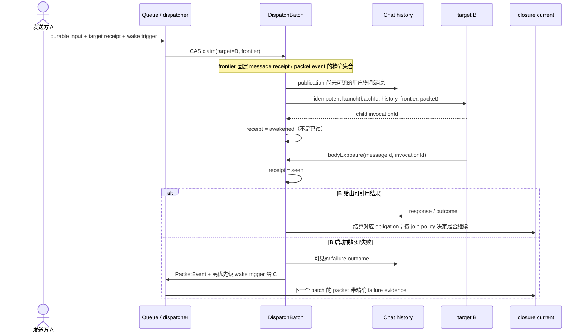

# Thread 消息生命周期 RFC

## 读法与结论

#1354 暴露的不是一条 Queue 文案或一个 `isPaused` 分支，而是消息可见性、目标投递、正文暴露、执行结果与协作责任被混成 thread-wide "正在处理"。因此本 RFC 先固定一条读者可顺着走完的主链：**一条输入怎样到达目标、单目标/多目标如何处理、失败如何精确回流**；再说明 append、steer、重启和 human gate 如何只改变同一条链上的 durable facts。

本文的核心结论：

1. Queue entry 只负责请求一次唤起；它不是 prompt 内容，也不与 message receipt 一一对应。
2. 一次 dispatch 必须先以 CAS 固定一个不可变 `DispatchBatch` frontier，再启动 client。frontier 是这次真正交付的 message receipt 与 packet event 的精确集合。
3. **投递资格、正文暴露、obligation 结算、会话上下文是四件事**。不能用 `awakened` 代替 `seen`，也不能用 receipt 或 Queue 状态裁决闭环。
4. 已失败的 delivery attempt 不会因为下一条消息触发 dispatch 而自动重投；重试或改派必须创建 policy 授权的下一 generation。
5. 系统通知与普通消息共用 batch claim、启动、消费和恢复算法；区别只在普通消息进入 chat history，系统通知进入 situation packet。

本文定义产品与 durable 事实，不预设表结构。实现可复用现有对象，且不得另造与既有 receipt 平行的 `dispatched` / `dispatch_failed` 状态机。

---

## 四层事实：先把不该混在一起的东西拆开

| 层 | 回答的问题 | 权威事实 | 不能由它推出的事 |
|---|---|---|---|
| 会话上下文与可见性 | 用户/成员此后能在 history 看到什么 | `MessageStore` 的 message、时间线、visibility | 这条消息已被哪位成员处理 |
| 投递资格与尝试 | 哪些输入可组成下一次对 target 的投递 | per-target receipt、Queue wake trigger、`DispatchBatch`、attempt generation | 正文已被模型读到或工作已经完成 |
| 正文暴露 | 某 target 的哪次 invocation 真正收到了哪条正文 | append-only `bodyExposure(messageId,target,invocationId,seenAt)` | invocation 成功、回复成功、闭环成功 |
| 协作闭环 | 谁仍须保证结果、每项委托是否已结算 | closure cursor、obligation outcome、join policy | target 被唤起或 Queue 暂时为空 |

`QueueReceiptTargetState` 已有八个可投影状态：`queued`、`notified`、`awakened`、`seen`、`failed`、`steering`、`withdrawn`、`handled`。本 RFC 对齐而不扩展为第二套词汇：

- `queued` / `notified`：当前 generation 仍可成为投递 frontier 的候选；
- `awakened`：有精确 child invocation 已被创建，**不证明正文暴露**；
- `seen`：有精确 `bodyExposure`，才证明正文被该 invocation 看到；
- `handled`：已有可验证的 queue consumption witness；
- `failed`、`withdrawn`、`steering`：当前 generation 已离开默认 delivery frontier，后续动作由 policy 或用户 intent 决定。

这也保留现有契约：`continue_current` 只是 exposure permission，绝不是已读或 handled proof。面对用户的 UI "已读"，只能用第三层 `bodyExposure`；面对协作 "已结算"，只能用第四层 outcome。

### 两条游标

**执行游标**（每条实际执行线一条）是 `pre → current`：`pre` 是精确来源/回写点，`current` 是此刻唯一可取得该执行权的 holder。

**闭环游标**（每条用户请求链一条）是：

```text
rootMessageId / sourceRef
current = 必须保证最终结果的 actor
next = 尚待结算的 obligation 集合（可为空、一个或多个）
completionPolicy = direct | all_of | any_of | gate_then_dispatch | quorum(n)
```

A 请求 B、C 时，执行线为 `A→B`、`A→C`，A 的闭环仍是 `current=A, next={B,C}`。`next` 不是闭环责任已转给下一人；除非有可恢复的显式 handoff，A 仍负责处置分支的成功、失败、取消或替换。

### 对象关系与基数

```text
Message (0..1 次进入 chat history)
  └─ DeliveryReceipt × N (messageId × targetId；含 attempt generations)

QueueEntry × N ──触发──> target 的一次 dispatch 机会
DispatchBatch (一个 target、一个不可变 frontier)
  ├─ DeliveryAttempt × N ──引用──> DeliveryReceipt / Message
  └─ PacketEvent × N       （没有 message / 不进入 chat history）

DispatchBatch ──成功启动──> Invocation / Run
Run ──正文实际交付──> bodyExposure × N
Obligation × N ──结算──> closure cursor.next
```

Receipt 是每 target 的投递真相；Queue entry 是 wake trigger。它们**没有**必然的 1:1 嵌套：一个 entry 可唤起一批 receipt；append receipt 可暂时没有 entry；系统通知 entry 没有 chat-history message；一条 message 也可有多个 target receipt。Batch 是最小新增 durable 关系，不是万能 WorkUnit。

---

## 主流程：一条消息如何走完

### 入口与 timeline publication

先持久化的是 message payload、路由 intent、target receipt 与（必要时）Queue entry；是否立即进入 chat history 由发送方和 batch 决定：

| 发送方/输入 | admission | 何时进入 chat history |
|---|---|---|
| 用户或外部通知 | 先进入 Queue，创建 receipt 与 wake trigger | 被某个 `DispatchBatch` claim 时；此前 UI 可显示为本地/排队态，不把它误报为已投递 |
| Agent 的 CLI 输出或 `post_message` | Run 输出时直接持久化到 history | 产出时；若带结构化 target，再创建 receipt 与 wake trigger，后续 dispatch 不重复写入 |
| 系统通知 | 创建 `PacketEvent` + 高优先级 Queue entry | 永不进入 history；只进入被唤起成员的 situation packet |

Agent 无结构化 target 的输出是面向用户的报告/上升，不走用户 fallback，也不创建 agent Queue entry。用户无结构化 target 才走 §路由决策。

### 单目标 happy path：A → B

```text
A 的输入（用户、外部或 agent output）
  → 解析结构化 target=B，创建 B 的 receipt generation=1 与 wake trigger
  → Dispatcher 为 B 原子创建 DispatchBatch frontier
  → frontier 中尚未 publication 的用户/外部输入进入 chat history
  → 使用 batchId 幂等拉起 B 的 client
  → 成功创建 child invocation：receipt = awakened
  → B 的 prompt 实际取得正文：写 bodyExposure，receipt = seen
  → B 运行、回复入 chat history，并产生 B-obligation outcome
  → A 的 closure 根据 join policy 结算或继续
```

`awakened` 只表示 B 的 client/invocation 已被成功创建；模型可能尚未读取正文，或在读取前失败。只有 `bodyExposure` 才能向用户或别的成员显示“B 看过这条”。B 的可引用 response/outcome 才能结算 A 对 B 的 obligation。

### 多目标 happy path：A → B 与 C

同一 message 为 B、C 分别创建 receipt、attempt 与（若需要）wake trigger。两个 target 各有 slot，故可并行创建自己的 Batch 和 Run：

```text
A closure: current=A, next={B-obligation, C-obligation}, policy=all_of
B execution: pre=A, current=B
C execution: pre=A, current=C
```

默认 `all_of`：B 与 C 的可接受结果都存在才机械满足 A 的闭环。B 的成功不抹掉 C 的失败；C 的 failure event 必须精确唤起 A 处置。`any_of` 的首个合格结果也必须对其他 obligation 留下显式 cancel/continue disposition。

### 多跳：A → B → D

B 在自己的 Run 中委托 D，会有 B 的局部 closure `current=B, next={D}`。D 的结果或 failure packet 先交给 B；B 处置完并给出自己的 outcome 后，才结算 A 对 B 的 obligation。A 可以在 history 看见事实，但不会被跨过 B 直接当成 D 的 closure current。

### 主流程时序图



---

## 唯一 dispatch 算法：原子 batch frontier

Queue 入队、slot 释放、append 到期、用户 steer、系统通知都是**触发条件**，不是各自的投递机制。每个触发只请求 "reconsider target B"；真正投递一律经过下列 batch 算法。

### Delivery candidate，而非“未读消息”

本文不再把 `dispatched` 当“已读”，也不把 chat history 过滤成 agent 的全部上下文。Dispatcher 有两个不同查询：

1. **history context**：现有 conversation/history 读取，提供正常可见上下文；不能因一条 receipt 已被投递而把它从成员可见历史删除。
2. **delivery candidate**：某 target 当前 generation 可被新 Batch claim 的输入。它包括：
   - state 为 `queued` / `notified`、尚未由另一 Batch claim 的 target receipt；
   - 已到 `deferUntil` 的 append receipt；
   - 未消费的 `PacketEvent`（没有 message body）。

`awakened`、`seen`、`handled`、`failed`、`withdrawn`、`steering` 不是默认 candidate。这样“投递资格”既不等于用户未读，也不等于 bodyExposure，更不会影响 L15 的历史可见性。

### Batch 的原子步骤

对每一个 target，Dispatcher 在一个 durable CAS 事务中执行：

```text
1. 获取 target 的 dispatch lease；已有 live Batch / Run 则退出，等待下一触发。
2. 在同一个 serialization point 读取 candidate，写入：
     DispatchBatch { batchId, target, frontier, generation, claimAt }
   frontier 是稳定的 message receipt generation refs + packet event refs。
3. 同事务：
   - 将尚未 publication 的用户/外部 message 标记归属该 batch，并写入 chat history；
   - 将 frontier refs 标为该 batch 已 claim；
   - 将触发它的 Queue entries / packet events 标为 `claimedBy=batchId`，阻止平行 Batch 重复取得。
   此处不写 seen，也不假装 client 已启动。
4. 以 batchId 作为幂等 key 启动 target client，context = history context + batch frontier + situation packet。
5. 得到精确 invocationId 后，持久化 awakened，并把被该 Batch claim 的 Queue entries / PacketEvents 结算为已消费；首次正文实际暴露才附加 bodyExposure/seen。
6. Run 终局、显式取消或 delivery failure 都以 batchId/attempt generation 结算，释放 lease，再触发下一轮。
```

本文的 `sealed` 指第 2–3 步的同一 CAS 已提交 `frontier`，使它成为本次 launch 的不可变 prompt snapshot。seal 前，receipt 只能通过同一笔尚未提交的 CAS 加入 frontier；seal 后不存在单独追加或重写 frontier 的路径，新的 append 必须走自己的 `deferUntil` / 下一 Batch。

消息若在第 2 步 frontier 固定后才到达，属于下一 Batch，绝不会在本 Batch 中被标记为已投递。进程在第 3、4、5 步之间崩溃时，恢复器依据 batchId 查询同一次幂等启动/精确 invocation，再完成或终结该 Batch；不会把已 claim 的内容丢回模糊队列，也不会把未曾进入 prompt 的内容标成 `seen`。

这就是原子 batch frontier 的边界：Queue 的 FIFO/优先级决定**何时 reconsider target**，不会决定或拼接 prompt 内容；frontier 才是一次投递的精确内容来源。

### Client 启动失败与重试 generation

若 batchId 没有得到可验证的 child invocation，那个 Batch frontier 内的**每个** delivery attempt（含 PacketEvent）都以同一 batchId 终局为 `failed`：

1. 该 delivery attempt 终局为 `failed`，留下 failure reason 与 batchId；
2. 写用户可见的 failure outcome 到 history；
3. 对 closure current 创建带精确来源的 PacketEvent 和高优先级 wake trigger；
4. 同一 attempt **永不**重新成为 candidate。

这里的 `closure current` 由失败项不可变的 `rootMessageId` 解析：即使 `fyi` 或无引用 `done-notify` 没有加入 `closure.next`，只要所属链存在 cursor，仍向其 `current` 发送 failure PacketEvent；若该通知没有 closure root，则只记录给其 sender 的可见投递失败，不凭失败合成新的 obligation。

只有 `RecoveryPolicy` 的明确决定——例如有界且副作用安全的 retry，或 closure current 选择重试 B / 改派 D——才能创建新的 attempt generation。新 generation 重新从 `queued` / `notified` 参与 query；它不是把旧 `failed` state 默默塞回候选集。这样 A 可以真正决定“改范围、换人、请求用户、暂停”，而不是 B 被下一条无关输入意外拉起重投。

### 系统通知也由同一算法消费

PacketEvent 没有 chat-history message，故不会被 message candidate 查询“顺带匹配”。它却与 receipt 一起进入 frontier：

```text
failure / continuation need
  → PacketEvent + Queue entry（最高优先级）
  → Batch CAS claim(packetEventRef)
  → launch 成功后 event.deliveredToInvocation = invocationId
  → event 被该 Batch 结算为已消费，并序列化进 situation packet
```

启动失败同样结算该 event 的 attempt；其 recovery policy 要么建立精确的下一 generation，要么提升为可见的 workflow failure，不能让一个 queued event 无限重触发。普通 message 与 PacketEvent 的差异只有 materialization（history body vs packet body），不是另一条 dispatch 暗门。

### 三个队列场景的验证

| 场景 | frontier | 结果 |
|---|---|---|
| A@B 已 claim 后，用户@B 才 admission | batch₁ 只有 A→B；用户 receipt 尚未在 snapshot 中 | B 先处理 A；slot 释放后 batch₂ 处理用户输入 |
| C@B、用户@B、A@B 都在 claim 前 | batch₁ 同时引用三条 candidate receipt | 三条独立 message 一次交给 B；三个 receipt 各有自己的 outcome/obligation |
| C@B、A@B 在 claim 前；用户@B 尚未 admission | batch₁ 只有 C、A；用户 receipt 不在 frontier | B 先处理 C、A；用户输入留给 batch₂ |

这三例不是额外的 coalescing if/else。它们只是“CAS snapshot 前到达的 candidate 入本批、之后到达的进下批”的直接推论。

---

## 路由、用户输入与干预

### 路由决策

Target 从结构化 metadata 读取，绝不从正文的 `@` 文本猜测：

1. 用户有显式结构化 target：路由到这些 target；
2. Concierge thread：没有显式 target 时路由给 duty cat；
3. 用户无 target：继承最近五条、一小时内用户消息的最近有效 target；
4. 仍无候选：最近健康回复者；
5. 最后才是 `preferredCats` / 默认成员。

Agent output 必须携带显式 target 才会创建 agent delivery receipt；没有 target 的 output 只写 history 并上升给用户。正文里的 `@` 是正文，不能产生“成员不存在，已跳过”的系统气泡。

### 用户在 target 正在处理时的三种选择

用户消息仍先 admission；当目标 A 有 live Run 时，client 让用户选择，不由后端猜测：

| 选择 | durable intent | 对同一 dispatch 算法的影响 |
|---|---|---|
| 正常排队（默认） | 普通 receipt + wake trigger | A 的 slot 释放后，receipt 成为 candidate |
| append | `routing=append`，receipt 带 `deferUntil=currentInvocationTerminal` | 不打断 A；`deferUntil` 满足时本身就是 reconsider trigger，即使没有其他 Queue entry 也会创建 Batch |
| 立即发送（steer） | 新 receipt + `routing=steer`；用户取消当前 A Run | 当前 Run 在安全点停止并留下 `steering` disposition；lease 释放后，同一 batch 算法处理全部 eligible candidate |

append 不是“成功把正文塞进现有 prompt”的同义词。若 Batch 尚未 sealed，带 exact carrier capability 的 append 可以在 CAS 中加入其 frontier；否则它只能等待当前 invocation terminal。`continue_current` 的授权与真正 `bodyExposure` 必须分别记录。无论哪一种，append 不能因“没有 Queue entry”永久停住。

steer 的意图是“释放 A 的 slot 并重新决定下一批”，不是“只投递我点选的那一条”。被中止的 work 留下 `steering` / cancel evidence；它不伪装成 provider failure，也不让原 closure 无事实地终局。

### Cancel

取消总是目标明确的 state transition：

- 用户可取消尚未 claim 的 receipt，标记 `withdrawn`/canceled；
- 用户 steer 可中止 live Run，写明 invocation、发起者与原因；
- closure current 或 join policy 可取消自己仍负责的 obligation；
- 已有 response/outcome 不能被取消为“从未发生”。

取消后检查 closure join policy；若需要处置，创建 PacketEvent 唤起 closure current。取消不会删除 history 或 receipt history，也不会静默地让一条义务消失。

---

## 闭环、human gate 与通知 intent

### Obligation 生命周期与失败回流

work / handoff / gate intent 才创建 obligation 并加入 closure `next`。典型状态是：

```text
planned → waiting_delivery → running → responded | failed | rejected | expired | canceled | steered
```

delivery attempt 的 `queued/awakened/seen/failed` 是第二、三层事实，不应直接与 obligation 终局混写。一次 delivery failure 可以令对应 obligation 进入可处置的 `failed`，但永远不会把 A 的闭环责任偷交给 B 或自动关掉 A。

```text
B 的 outcome / failure
  → 结算 B-obligation 的确切结果
  → 更新 A closure.next
  → join policy 满足：闭环终局或建立 A continuation
  → 未满足且需要判断：PacketEvent 唤起 A，携带 B 的 evidence
```

### `fyi` 与 `done-notify`

| intent | 是否可被 Batch 投递 | 是否新建 obligation | 对既有 custody/closure 的效果 |
|---|---|---|---|
| `fyi` | 是 | 否 | 只消费本次通知；不改变原 ball/closure（INV-7） |
| `done-notify`，无精确引用 | 是 | 否 | 普通完成通知，不凭自然语言猜测要结算谁 |
| `done-notify`，带有效 `obligationRef` / source ref | 是 | 否 | 可结算**既有**精确责任；不创建新的 `next` |

这与现有 custody state machine 对齐：`done_notify` 可进入 resolved，`fyi` 保持原 state。二者都能出现在 delivery frontier，区别是第四层如何处理其精确引用，而不是让通知绕过投递/消费算法。

### Human handoff / gate

`handoff` / `request` / `gate` 给 co-creator 建立 human obligation。human 不经历 provider Run；其 UI 投递可记录为成功，但“用户在线”不等于 human 已批准或已处理。回复须带 `obligationRef`：只有一个未决项可安全自动绑定，多个未决项必须让用户显式选择。`fyi` 与无引用的 `done-notify` 不产生 pending-human inbox。

---

## Situation packet、状态视图与重启

### 每次唤起的上下文

```text
history context: 正常 chat history（不是“只剩未投递消息”）
batch frontier: 本次精确 receipt/message refs 与 packet event refs
closure cursor: root source、current、next obligations、join policy
execution evidence: pre/current、同级 branch 的 terminal evidence
delivery evidence: batchId、attempt generation、awakened/bodyExposure/failure
allowed action: reply, delegate, reroute, ask human, suspend, cancel
```

成员不靠自然语言猜“B 是否在工作”。用户和成员共享同一份派生状态：B 的 receipt 是 `queued`、`awakened`、`seen` 或 `failed`，其 invocation、bodyExposure 与 outcome 都能链接到精确 source。没有 live invocation 不必然是异常：若 receipt 指向 wait/custody 的 precise holder，或 Batch 尚未到 delivery eligibility，状态仍是可解释的。

### 重启恢复

恢复器只看 durable facts：

1. 对每个 `DispatchBatch`，以 batchId 查询/重放同一次幂等 client launch；未 resolve 的 claim 不能被另一 Batch 重新 claim；
2. 对 `awakened` 的 receipt，核验精确 invocation 是否 live 或是否已有 terminal evidence；没有则写 failure/recovery event，绝不当 `seen`；
3. 对已到期的 append receipt 与未 claim candidate，重新发出 target reconsider；
4. 对未消费 PacketEvent，按其 attempt/recovery policy 继续或提升；
5. 对 closure open obligation，依据关联 attempt/outcome/wait 做精确 failure 或 continuation，不从最近发言者猜 owner。

重启后的异常也走相同的 failure outcome + PacketEvent 流程；它不是一条“重启专用”的投递分支。

### 运行时切换

发布 preflight 列出所有非终局 receipt generation、Batch、Run、obligation、wait 与 custody record，并设置 admission barrier：拒绝新的 root work；已有 record 的 exact-source completion、human approve/reject、callback 和 batch recovery 继续按旧语义 drain。清单为空才原子切换新入口。不得拿终局历史猜测补链。

---

## 现有对象承载与实施顺序

| 对象 | 保留职责 | 本 RFC 要求的最小连接 |
|---|---|---|
| `MessageStore` / `RedisMessageStore` | 正文、author、chat history、message relation | 区分 queue admission 与 timeline publication；保留 history 作为会话上下文 |
| queue receipt / custody | target 的 queued/awakened/seen/handled/failed 等事实 | 不加 `dispatched` 平行态；追加 attempt generation、batch ref 与 exact bodyExposure 关联 |
| `InvocationQueue` | target wake trigger、slot/lease、优先级 | entry 不承载 prompt；可 0..N 对 receipt；支持 packet event 与 append 到期触发 |
| Dispatch layer | target batch claim 与 client launch | 持久 `DispatchBatch` frontier、CAS、batchId 幂等恢复、统一 message/event 消费 |
| F194 / `TurnExecution` | live invocation 与 terminal outcome | 用 invocationId 证明 awakened/liveness，不把 Run existence 当 seen 或 closure success |
| `ActionSuccessor` / `AwaitState` / F233 custody | exact callback 与等待 | callback 已覆盖时拒绝冗余 hold；fyi/done-notify 依精确引用处置 |
| closure cursor | `current`、`next`、join policy、disposition | obligation outcome 与 delivery failure 的原子结算关联 |

建议实现顺序：

1. 先为 receipt projection、attempt generation、Batch frontier 写纯状态转换与 crash-recovery 测试；
2. 以 batchId 贯通 Queue lease、client idempotent launch、`awakened` 与 bodyExposure；
3. 把所有普通输入、append 到期与 PacketEvent 统一接到 candidate query，删除 active 时 skip/coalesce content 拼接；
4. 接入 closure outcome、fyi/done-notify 精确引用和 human gate；
5. 最后替换 QueuePanel、气泡与状态卡；删除没有精确对象的 Continue。

---

## 验收矩阵

| ID | 场景 | 必须证明 |
|---|---|---|
| L1 | 用户无结构化 target | 仅用户走 fallback：最近有效用户 target → 健康回复者 → 默认；agent 无 target 不走此链 |
| L1a | 用户无 target 且有 agent 正在处理 | 用户能选排队、append、steer；选择写 durable intent，不由后端猜 |
| L2 | B 正在处理，用户又 @B | receipt 仍 pending；slot 释放/append 到期触发下一 Batch，不被 active skip |
| L3 | A @B | B awakened/seen 不能让 A 结束；可引用 B outcome 才结算 A 的 obligation |
| L4 | A 同时 @B、@C | B/C 独立 Batch 与 slot；默认 `all_of` |
| L5 | B 成功、C 失败 | B outcome 保留；C failure 可见；PacketEvent 精确唤起 A |
| L5a | A @B，client 启动失败 | attempt `failed`、failure outcome 可见、旧 attempt 不自动重投、A 收到 recovery event |
| L5b | A→B→D，D 失败 | D 的 PacketEvent 先唤起 B；B 的 outcome 后才影响 A |
| L6 | A handoff/gate 给 human | 有 exact human obligation 与 approve/reject/timeout，不把 online 当处理 |
| L6a | FYI / 无引用 done-notify | 可投递且消费，但不创建 `next`；FYI 不变更 custody |
| L6b | done-notify 有 exact ref / 多个 human 待办 | 有 ref 才结算既有责任；多个待办必须明确选择 |
| L7 | B 结果需要 A 判断 | B outcome 后 Batch packet 唤起 A，不由 B 偷关 A 的 closure |
| L8 | any_of 首个成功 | 其余 obligation 有 explicit cancel/continue disposition |
| L9 | append 在 Batch sealed 前 | 只有 CAS 能把它加入同一 frontier；成功投递仍以 awakened/seen 分开证明 |
| L10 | append 在 Run 已读输入后 | `deferUntil` 于 invocation terminal 后使其成为 candidate，即使没有 Queue entry 也不滞留 |
| L10a | steer | Run 安全中止并留下 steering evidence；释放 slot 后同一 batch 算法处理全部 candidate |
| L11 | Batch claim/launch 崩溃竞态 | frontier 不变；以 batchId 幂等恢复；不会标 seen、不会丢或重复启动 |
| L11a | 当前 holder 有 precise callback | admission 拒绝冗余 hold_ball |
| L12 | 进程重启 | Batch、receipt generation、invocation、PacketEvent、closure/wait 全由 durable facts 重建 |
| L13 | Run 在正文暴露前/后失败 | bodyExposure 有精确 invocation；UI 不从 awakened/Run 状态猜已读 |
| L14 | 切换遇旧 in-flight | admission barrier 拒绝新 root work，但允许 exact-source completion 与 batch recovery drain |
| L15 | 其他 agent 看见消息 | history 始终是上下文；receipt/Batch/invocation 另显投递和处理事实，不从 history 推断 |
| L16 | 正文含 `@` | 未经结构化 target 选择不路由、不生成错误提示 |
| L17 | A@B、C@B 同时 queued | 同一 CAS frontier 含两 receipt；一次唤起、两条独立 outcome |
| L17a | B active 时 D@B | receipt 等下批；slot release 触发 candidate query |
| L17b | A@B 已在 history，C@B 触发 B | 只要 A receipt 是 candidate，就可被该 Batch claim；是否有 A 的独立 Queue entry 不影响内容资格 |
| L18 | 纯系统通知唤起 A | PacketEvent 被 Batch claim、写入 packet 并消费；不会因没有 CH message 无限重触发 |
| L19 | failed attempt 后有无关 B 输入 | 失败 attempt 不进入新 frontier；只有 policy 创建的新 generation 可重试 |

---

## 不变量、非目标与来源

以下状态在正确实现中不可能出现：

- Batch 声称一条 message 已被交付，但其 receipt generation 不在该 Batch frontier；
- `awakened` 被 UI 当作正文已读，或 `seen` 缺 exact invocation/body exposure；
- client 启动失败后旧 attempt 因无关 Queue trigger 被自动重投；
- append 在 target terminal 后仍无 entry、无 candidate、无 reconsider trigger 而永久等待；
- 纯 PacketEvent 因没有 CH message 而不能消费，或被无限 re-trigger；
- closure 终局但仍有必须 `next` obligation open；
- Queue 为空却只能显示没有 source 的 thread-wide blocked/Continue。

非目标：不增加万能工作总账本；不让成员常驻监听 thread；不重解释终局历史；不把未经 carrier/receipt 审计的正文注入正在运行的模型；不定义用户 UX 的通用未读计数。

实现锚点：

- `packages/shared/src/types/queue-receipt.ts`：八态 receipt、`awakenedAt`、`seenAt` 与 `continue_current` 非已读契约；
- `packages/api/src/domains/cats/services/stores/ports/queued-message-receipt.ts`：receipt projection；
- `packages/api/src/domains/cats/services/agents/invocation/InvocationQueue.ts` / `QueueProcessor.ts`：slot、wake 与 body exposure；
- `packages/api/src/domains/ball-custody/ball-custody-state-machine.ts`：`done_notify → resolved`、`fyi → 不变`；
- `AgentRouter.ts`、`messages.ts`、`callback-a2a-trigger.ts`：结构化 target、用户 fallback 与 active-target skip 的现有入口；
- [#1354](https://github.com/zts212653/clowder-ai/issues/1354)：用户可见断裂的入口证据。

确认本 RFC 后，才基于上述不变量拆出实现映射、状态转换测试与 PR；任何实现若绕过 Batch frontier 或把四层事实重新合并，都不符合本 RFC。
