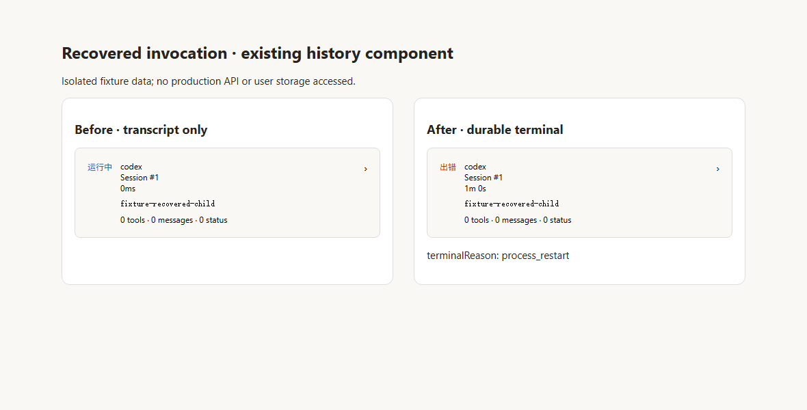

# Invocation history after startup recovery

Upstream issue: [#1556](https://github.com/zts212653/clowder-ai/issues/1556).

Startup recovery can interrupt a durable child execution without adding a terminal event to its session transcript. The sidebar already consumes the durable execution state, but invocation history and detail projected only transcript events and continued reporting `running`. This is separate from the Windows startup recovery fix in #1552: it also happens whenever a durable terminal record outlives an incomplete transcript.

Both history endpoints now reconcile transcript summaries with matching durable terminal records. A durable terminal supplies status, reason and lifecycle timestamps. Transcript events, counters and usage remain unchanged. Missing records and nonterminal records retain the existing transcript projection; a nonterminal ledger may lag an already completed transcript.

The existing response status vocabulary is preserved: succeeded becomes `done`, canceled becomes `cancelled`, and failed/interrupted becomes `error` or the existing timeout classification. No durable records or transcript files are written.

## Ownership and boundaries

Architecture cell: canonical invocation identity and trajectory reads.

Map delta: extend the existing canonical trajectory resolver with a shared terminal-summary reconciliation function, consumed by the list and detail routes.

Why: lifecycle authority belongs to the durable execution ledger; keeping the reconciliation in one resolver prevents the two endpoints from disagreeing.

Canonical source: `packages/api/src/domains/cats/services/session/CanonicalInvocationTrajectoryResolver.ts#resolveCanonicalInvocationSummaries` and `ITurnExecutionStore#get`.

Consumer evidence: `rg -n resolveCanonicalInvocationSummaries packages/api/src` finds the shared definition and its two route consumers, `invocation-trajectory-routes.ts` and `session-transcript.ts`.

Claim guard: ledger lifecycle data is used only when invocation, user, thread and cat identities match. The mismatch regression would expose a private terminal reason if any identity fence were removed. Existing thread/session authorization executes before reconciliation. The list reconciles only its filtered, paginated rows, bounding ledger reads to the response limit.

## Validation

Five terminal-state regression cases failed on the unmodified upstream build before the resolver change. They now pass alongside the identity and pagination checks.

```text
pnpm exec tsc -p packages/api/tsconfig.json
node --test packages/api/test/f299-invocation-trajectory.test.js packages/api/test/f299-canonical-request-generation-resolver.test.js packages/api/test/session-transcript-validation.test.js packages/api/test/thread-access-policy.test.js
```

The four test files passed 43 tests, with no failures or skips. Tests use isolated in-memory stores and cover startup interruption without a transcript terminal, success, failure, timeout, cancellation, conflicting transcript evidence, identity mismatches, legacy records, pagination, and existing access boundaries. Changed JavaScript/TypeScript files passed Biome checks.



The screenshot is a headless, isolated rendering of the existing `InvocationTrajectoryList` component using fixture summaries produced by the actual projector and resolver. The recovered case displays a terminal error instead of running, with the recovered duration. A DOM assertion verified this result. It does not constitute acceptance against a running Hub instance or production data.

Runtime activation and post-restart history acceptance remain separate from these candidate-branch checks. No API process was restarted for this validation.
