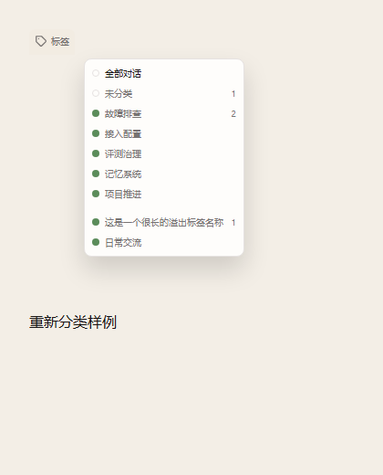

# Sidebar label counts

Issue: [#1561](https://github.com/zts212653/clowder-ai/issues/1561)

## Cause and change

On upstream base `b1fe2966fa0a97d1e3cd2e174ed59fd1477b4fc4`, only the Uncategorized count is calculated and passed to the label menu. Both named-label sections render names without counts.

The fix counts each assignable thread once per label and supplies those totals to both sections. Uncategorized uses the same right-aligned count span. Zero counts remain hidden; the selected trigger remains name-only. Search and tab selection do not change the totals. The existing `labelAssignableThreads` scope is retained.

Sidebar reads `projectSidebarRows` from `sidebarProjectionStore`, including pending commands. Counts derive from those rows, so command overlays, rollback and canonical snapshot refreshes use the same source as the displayed threads. No extra store, endpoint, persistence or runtime configuration is introduced.

Architecture cell: thread-navigation

Map delta: none

Why: this is an additional count projection of the existing label navigation source.

## Verification

- RED: the new menu regression on the upstream implementation fails with expected count `2`, received empty string.
- GREEN: five targeted test files, 37 tests passed. Coverage includes multiple labels, duplicate IDs, undefined/empty label arrays, both menu sections, zero counts, selected state, search independence, default-thread exclusion, successful/failed command reconciliation and label deletion.
- `pnpm --filter @cat-cafe/web exec tsc --noEmit --incremental false`: passed.
- Biome checks for changed source/test/evidence files and `git diff --check`: passed.
- `node scripts/check-sidebar-projection-boundary.mjs`: passed.
- The public checkout has no `check:architecture-ownership` script; ownership was checked against the existing thread-navigation cell instead.

Targeted regression command:

```sh
pnpm --filter @cat-cafe/web exec vitest run \
  src/components/ThreadSidebar/__tests__/thread-sidebar-label-counts.test.tsx \
  src/components/ThreadSidebar/__tests__/label-counts.test.ts \
  src/components/ThreadSidebar/__tests__/thread-sidebar-tab-redesign.test.tsx \
  src/stores/__tests__/label-store-delete-sync.test.ts \
  src/utils/__tests__/sidebar-commands.test.ts --silent
```

Browser verification used real `LabelFilterBar` and `countThreadsByLabel`, synthetic data and the project's Tailwind/CSS tokens in an isolated headless Chromium fixture. It checked both menu sections, long-name truncation without count overlap, hidden zero counts, selected-trigger text and live reclassification. There were no page errors. This verifies the changed component slice; the full Sidebar data/update path is covered by the integration tests above. No live user data was used for browser verification.



Measured bounds and browser checks: [browser.json](evidence/browser.json).

No matching `.pen` design exists in this checkout. The existing menu layout and styling were reused. Remote CI and maintainer acceptance are separate from these local checks.
