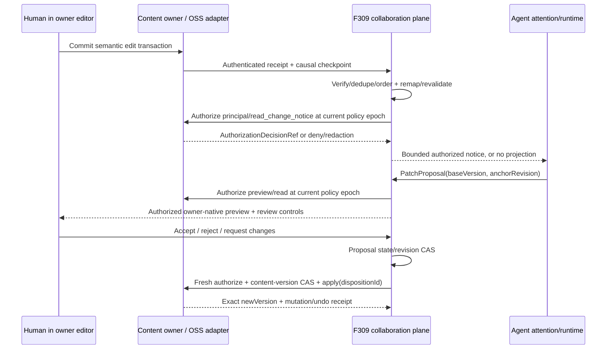

# F309: Collaborative Content Plane — 跨媒介内容协作平面

> **Status**: in-progress / Phase R 工程基线已交付，作品标注/评论体验改版进行中；Office/video 两媒介 Admission Gate 仍开放
> **Owner**: 小太阳·Maine Coon (@codex-sol, GPT-5.6 Sol)
> **Priority**: P1
> **Source thread**: `[thread-id]`
> **operator origin**: 从 F290 完整剥离 Office、富文本、图片、视频、画布的编辑、选区、批注与 Agent patch；“能用开源就用开源集成”；最终要支持人猫共同编辑，猫能感知人的编辑。来源：`private-source-id`。
> **operator final-state correction**: DOCX + video 必须优先直接集成成熟开源能力；禁止用 fake owner、最小编辑器或独立脚手架证明“可行”，开发从真实候选的最终宿主/内容边界起步。来源：`private-source-id`。
> **operator Workspace correction**: Office 不是孤立工具或多内核拼盘；家里只维护一条 Office 主线，把它嵌入现有浏览器 Workspace。人和具名猫都是同一实时内容模型里的第一等 writer，不能让猫离线改旧文件或借用人的光标、身份冒充共同编辑。来源：`private-source-id`、`private-source-id`。
> **operator plugin choice**: Office 是用户可选择安装/启用的 provider plugin，不是 core 默认重依赖；GenOffice 是第一个真实 admission candidate。第一轮只开 DOCX vertical slice，验证通过后 XLSX/PPTX/PDF 才在同一插件内逐项开放。来源：`private-source-id`。

Architecture cell: `collaborative-content-plane`

具名猫入口契约（2026-09-06，Host 已由 PR #4394 合入 main；production runtime 尚未加载）：
`cat_cafe_inspect_office_document` 按 Host 给出的 contentRef，或已打开文档的 workspace
`{worktreeId, path}`，只读定位同一份协作内容（不导入文件、不绑定或启用插件），返回 contentRef 与有 ownerRevision 的有界
段落 anchor、精确 quote 与 editable 状态；`cat_cafe_edit_office_document` 只接受同一目标上的
tracked-change / comment 和稳定 operationId。两入口共用 callback 身份、线程/owner 范围与
F202 live feature authority；作者从认证 principal 取得，不接受 caller author、人类 bearer 或整文件
替换。读取是 readonly 可用的数据入口，修改只在 write profile 暴露；文档正文始终是 untrusted data。
两者均消费已安装且启用的 provider，不自建内容、授权或保存回执真相。详细验收与发布证据见

Map delta: `new cell required` — F307 只拥有 Workbench topology，F290 只拥有 Collective domain，
现有 ownership map 没有跨媒介 anchor/annotation/patch mechanics 的 owner。

Canonical source: `packages/api/src/domains/collaborative-content/editor-surface-admission.ts#EditorSurfaceAdmissionV1`

Consumer evidence: `rg -n "EditorSurfaceLocatorPort|surfaceAdmissionMatchesSession|f202-content-editor-surface-admission" packages/api/src packages/web/src` → API resume route 只在 typed F202 admission 与 prepared F309 session 全字段匹配后轮换 bearer；Web 只消费该闭合 response shape。

Claim guard: “任意 HTTPS URL、stale package/grant/lifecycle、错误 entrypoint/framing/navigation policy 都不能获得 session bearer” → `packages/api/test/collaborative-content-routes.test.js` 的 `requires one typed F202 attestation...` + `packages/web/src/components/workbench/content-editor/__tests__/ContentEditorOwnerSurface.test.tsx` → 任一 authority 字段漂移或非 exact parent origin 时在 `sessions.resume` / iframe mount 前变红。

## Why

今天每种内容若各自发明“选中哪里、这里说了什么、猫准备怎么改、人在版本变化后还能不能找到
原位置”，F290 会被迫长成编辑器单体，F307 会被迫理解所有内容内部结构，批注也会在文本、图片、
视频和画布之间形成互不相认的孤岛。用户真正需要的是同一条可相信的协作旅程：精确指出内容，
让猫围绕该位置提修改，人能接受或拒绝；内容变化后系统要么有证据地迁移，要么诚实说位置失联。

F309 把这条协作关系做成公共 plane，同时守住两条边界：不自研 Office/媒体编辑器内核，不复制
内容 owner 的 canonical content/version。operator 的开源要求是交付约束，不是候选偏好：直接集成成熟
开源引擎的真实宿主与内容边界；先过 SDK/host seam、许可证、部署与长期维护 Gate，过不了就换候选，
不退回 fake owner、最小编辑器或独立 demo 自证可行。

## Vision / 终态远景

F309 的终态不是“聊天旁边多几个可看的附件”，也不是把所有媒介塞进一个新的万能编辑器。它要让
文档、表格、图片、视频、画布等内容都成为人和猫可以**共同看见、共同指向、共同修改、共同裁决**
的活内容：

1. **原生地编辑**：用户在内容 owner 提供的真实编辑器里直接编辑，不需要把正文复制回聊天框。
2. **精确地指向**：文字范围、表格区域、图片区域、视频片段和画布元素都能成为有版本的协作锚点。
3. **彼此感知变化**：人在编辑器里完成一次有意义的编辑事务后，猫能知道谁改了、哪个版本变成
   哪个版本、哪些锚点或待审 patch 受影响；不是定时重读整份内容，也不是把每次按键都变成一次调用。
4. **先审后改**：猫默认提交 owner-native、可预览的 patch；人能接受、拒绝、要求重做或撤销。
5. **并发不覆盖**：人在猫准备 patch 时继续编辑，旧 patch 会明确变成可继续、需重基、冲突或失效，
   绝不拿旧版本静默覆盖新内容。
6. **刷新后仍可信**：批注、patch、人的裁决和版本回执可追溯；位置能迁移就带证据迁移，找不准就
   `ambiguous/orphaned`，不假装仍然命中。
7. **开源集成即产品路径**：把成熟、可维护、许可证与部署边界可接受的开源 editor/annotation engine
   直接接进最终内容 owner/surface；公共契约通过 adapter 保持可替换，不让某个引擎反过来定义产品，
   也不另造一套最小 Office/Video 功能作为过渡交付。

“共同编辑”不等于默认允许猫绕过人直接写入。V1 默认仍是 reviewable patch；未来若某个 scope 获得
明确的 direct-apply authority，也必须经过 fresh owner authorization、proposal-state CAS、content-version
CAS、可见 attribution、owner receipt 与 undo，且用户可随时收回权限。

### 四层分工

| 层 | 回答的问题 | 不回答的问题 |
|---|---|---|
| F307 Workbench | 内容在哪里打开、如何 tab/split/focus/restore | 内容里改了什么、评论指哪里、猫是否该重基 patch |
| F309 Collaboration Plane | 人猫如何感知同一版本、指向同一位置、讨论、提改动并裁决 | canonical 内容是什么、如何渲染 Office/视频、何时唤醒模型 |
| 内容 owner / 开源引擎 adapter | 正文/媒体的 canonical version、原生编辑事务、resolve/apply/invert | Collective lineage、Workbench 布局、跨媒介协作账本 |
| F290 / Agent runtime consumers | 为什么在这个 Artifact/Channel 协作、谁有权限、哪个猫应关注与行动 | 通用 anchor/annotation/patch mechanics 与 editor store |

## Current State / 现状基线

| 证据 | 已成立 | 尚未成立 |
|---|---|---|
| [F307](F307-composable-workbench.md) | application-level working set、typed surface、tab/split/restore owner 已冻结 | 不解释内容选区、批注、patch 或版本重定位 |
| [F290](F290-ai-native-collective.md) | Artifact lineage、权限、Collective result target 与局部 true-frontend 协作旅程 | 不应继续拥有公共跨媒介协作契约 |
| [F063](F063-hub-workspace-explorer.md) | repo file/code 编辑与一次性 selection attachment | AC31 不承诺文件变化后的稳定 anchor；不覆盖 Office/media/canvas |
| [F138](F138-video-studio.md) | video spec、素材、配音、render pipeline | 无 time/frame-range annotation + patch lifecycle |
| [F202](F202-plugin-framework.md) | Host-owned package/install/grant/Broker authority；公开 beta.15 的 content editor contribution、静态 renderer 与隔离 materializer 已在 #4394 装配 | 不拥有内容、版本、选区或 owner settlement；不代表 production activation |
| F290 W4 Markdown consumer census | F307 已有 typed content surface mount；content-owner 层已有通用 bytes/revision/receipt primitives；F290 分支已有 authenticated Human/Collective membership 基础 | 尚无两个不同 Human 围绕同一 canonical Markdown 完成 read/annotate/propose/apply/version/revoke 的 owner-backed 路径；当前 Workspace editor 仅支持 DOCX 且绑定单一 Host owner |

关联检测已覆盖 feature graph、ownership docs、相关 threads 与语义检索，三路命中后无新的 canonical
anchor。结论：F309 不是 F307/F290/F063/F138 的 Phase 或 adapter 子任务，而是四者共同消费/实现的
独立 contract plane。

## Product and Architecture Boundary

### F309 拥有

- versioned `SelectionAnchorV1` envelope、anchor revisions 与 resolver result contract；
- `AnnotationThread`、`PatchProposalV1`、accept/reject/undo disposition 与 provenance；
- 上述用户可见协作 metadata 的 durable TTL=0 ledger；
- content adapter registry/ports：resolve、validate、preview、apply、invert/undo receipt；
- versioned `OfficeProviderBindingV1`：`contentRef → providerId + installationInstanceId + providerVersion + bindingRevision`
  的唯一 authoritative selection；
- owner-auth decision port 与 auditable `AuthorizationDecisionRefV1`：F309 在读取/投影、预览、裁决、
  direct apply 与 undo 时请求内容 owner 作最终授权，不保存第二套 policy truth；
- versioned `ContentChangeReceiptV1` 与 bounded change-awareness contract：把 owner 的完整编辑事务投影为
  actor、base/new version、affected targets 与 delta reference，并让待审 patch/anchor 重新判定；
- `PresenceProjectionV1` 的最小跨媒介投影契约，让人和猫看见“谁正在这里、正在关注哪一块”；presence
  是有界、可过期的现场，不是 canonical 内容或永久行为画像；
- 版本漂移后的 attached/moved/ambiguous/orphaned 诚实状态与 manual reanchor lineage；
- 面向 Agent 的 exact target + base version + authority handoff，不允许模型文本自证 apply 成功。

### F309 不拥有

- DOCX/XLSX/PPTX、富文本、图片、视频、画布、代码或表格的 canonical bytes/schema/version；
- Yjs、ONLYOFFICE、GenOffice、媒体工程等 editor-native collaboration/content store；
- 原始 keystroke、IME composition、鼠标轨迹或每帧 cursor firehose；这些留在 editor owner，只有完成的
  transaction/checkpoint 才形成 change receipt；
- Agent attention/admission、invocation、路由或“每次编辑都唤醒一只猫”；F309 只发布有权限、可去重的
  domain notice，是否进入模型上下文由 consumer/runtime 决定；
- ACL、RBAC、Collective permission 或内容 owner policy 的 canonical store/合并算法；F309 只调用
  owner-auth port，并保存不含敏感内容的 decision reference；
- 万能跨格式 diff/operation IR；公共层统一 lifecycle，操作 payload 由 adapter 类型化；
- F307 的 tab/split/focus/restore，也不注册第二套 working set；
- F290 的 Collective、Artifact lineage/permissions/result target 或团队记忆；
- F063/F138 的保存、render、export、媒体处理或领域 undo 规则；
- 在 Phase A candidate admission 前引入未经批准的第三方服务、依赖或生产 schema；获准后的实现必须
  走真实开源 owner/surface，不走 fake editor 或一次性原型壳。
- 插件 package identity、installation instance、effective grants、runtime lease 或启用状态；这些归 F202 Host
  inventory/Broker。F309 只定义 `content-editor-provider` 的领域 contribution 与 content binding，不把某个
  vendor 当 core 内建分支。

### Ownership contract

| Owner | Canonical truth | 与 F309 的边界 |
|---|---|---|
| 内容 owner（F063/F138/Office/Canvas 等） | content bytes/schema、version、editor transaction/presence state、最终 action authorization、apply/undo | 实现 adapter；以 F290 domain context 为约束输入；只消费带 `bindingRevision` 的 F309 provider-binding projection，在 transaction boundary 返回 auth/change/resolve/mutation receipt |
| F309 | anchors、annotation/patch/disposition ledger、Office provider binding authority、change-awareness projection、跨 owner lifecycle | 不复制内容、raw input 或 policy；验证 auth/receipt，重判 anchor/patch，CAS 调 owner adapter 并记录引用 |
| F307 | surface descriptor、working set、layout/focus/restore | mount F309-aware editor surface；不保存 anchor/thread/patch truth |
| F202 | package digest、installation、grants、runtime lease、Broker settlement | 承载 editor provider lifecycle；不拥有 content bytes、provider selection、selection/anchor、patch 或 owner receipt |
| F290 / runtime consumer | Collective object、Artifact lineage、domain permission context、result target、Agent attention/admission | 提供 domain context 但不能越过 content-owner deny；消费经 owner-auth 的协作投影与 bounded change notice |

### Office plugin contribution boundary

F309 的 Office 实现必须扩展 F202 external-package contract，新增 versioned
`content-editor-provider` contribution；不能把 GenOffice 塞进现有 `skill|mcp|limb|schedule` resource，也不能
在 core 按 vendor 写产品分支。

- contribution 声明 `providerId`、支持格式/capabilities、F307 surface entry、runtime mode 与请求的 Host grants；
- Host 以单个 typed surface admission 绑定 package digest、installation instance、effective grants、runtime lease、
  provider identity、renderer origin、entrypoint、framing policy 与 navigation policy；
  installed/configured/authorized/selected/live 是五种独立状态，任何一项不能替另一项报成功；
- `clowder-ai-plugins` 拥有公开 contribution schema/SDK/conformance 与 GenOffice-specific provider source；
  Clowder AI core 只实现可复用的 F202 Host adapter 和 F309/F307 domain ports；
- F309/F307 Host adapter 只允许 open/render、owner load/settle、named actor、resolve、preview、apply/invert、
  receipt 等窄 ports；插件不得获得任意文件系统、任意网络或 Clowder AI credentials；
- provider renderer 只能由 F202 从无 Clowder AI cookie/Host API 的 dedicated origin 提供，并以精确 Host origin
  的 framing policy + exact origin/window/nonce ready handshake 一次性交付 `MessagePort`；冻结 renderer 必须在
  upstream code 前以 Navigation API fail-closed 阻止 self-navigation 请求，缺该 API 就不得发 ready。后续 load
  仍撤权作为纵深防御，但不能冒充前置 egress fence；禁止 opaque-origin storage 假设、同 Host/API origin、
  `targetOrigin='*'`，或仅凭 URL 形状/`surfaceIntegrity` 字符串向任意 HTTPS origin 交付 bearer；
- F309 持久化唯一 authoritative `OfficeProviderBindingV1`；content owner 只缓存带 `bindingRevision` 的
  非权威 projection 用于 settlement fence，不得自行选择/迁移 provider。一个 `contentRef` 任一时刻只绑定
  一个 production provider；切换必须经 F309 显式转换/重开并产生新 lineage，禁止双引擎离线覆盖；
- plugin UI 只是 F307 owner surface 的实现；Workspace topology、Cat identity、canonical Office bytes/version、
  F309 ledger 与 mutation receipt 始终由 Host/owner 掌握。

## Contract Candidate

### `SelectionAnchorV1`

公共 envelope 固定为 `contentRef + contentVersion + anchorRevision + target + integrity + adapterHints?`。
`adapterHints` 可以帮助 resolver，但不能成为唯一 locator。

所有 target 都必须声明 owner-stable source identity、locator schema revision 与 integrity digest；范围统一
采用 half-open `[start, end)`。裸 index/offset/像素/毫秒只能是 hint，不能单独成为跨版本 locator。

| `target.kind` | V1 coordinate / identity invariants | 典型媒介 |
|---|---|---|
| `text_range` | stable block/node scope + boundary unit（UTF-16/code point/owner）+ half-open offsets + quote/context digest；raw offset 非唯一 locator | 富文本、代码、PDF text |
| `node` | owner-stable nodeId + node type/revision；ordinal path 只作 hint | block、inline object、document node |
| `spatial_region` | stable `spaceId` + source/page/frame identity + units/origin/axes + bounds + transform revision/digest + rect/polygon | image、PDF、video frame |
| `temporal_range` | stable `timelineId/sourceRef` + owner timebase（rational ticks）+ half-open start/end ticks；frame mapping 绑定 media revision | video/audio timeline、tracked region |
| `canvas_element` | stable canvasId + elementIds；sub-selection 必须引用同一 versioned spatial space | slide、whiteboard、diagram |
| `table_range` | stable table/sheet id + row/column IDs，或显式 resolver/context digest；ordinal bounds 只作 hint | spreadsheet、rich table、dataset |

这六类是小而稳定的 versioned union。某个 engine 的 cursor、transaction id、Yjs relative position、
OOXML id 或 tracking metadata 留在 adapter hints，不推动公共 union 按项目名膨胀。

adapter 必须提供 coordinate/timebase comparator 与 transform/resolver evidence。缺少 stable source/space/
timeline/table identity、单位、bounds、transform revision 或必要 causal mapping 时不得猜测；resolver 只能
返回 `ambiguous/orphaned`。插入行列、页面重排、视频 retime、crop/rotate 或 canvas transform 都必须经
owner resolver 重新定位，不能沿用旧 ordinal/像素/毫秒。

### Resolve / remap / orphan / reanchor

内容 owner 实现 `resolve(anchor, currentVersion)`，优先 engine-native mapping/stable id，再尝试
offset/context/digest fallback，只能返回：

1. `attached`：精确命中；
2. `moved`：唯一重定位，带 strategy/evidence/confidence；
3. `ambiguous`：多个候选，禁止自动挑选；
4. `orphaned`：无法定位，但保留原 version、excerpt/thumbnail/timecode 与 provenance。

manual reanchor 追加新 anchor revision 并引用旧 revision。低置信度、跨版本或多候选结果不得静默
retarget；刷新后看到 orphan 是诚实完成，不是系统失败。

### `AuthorizationDecisionRefV1`

内容 owner 是 content action 的最终授权 authority；F290 提供 Collective/domain permission context，
但不能把 owner 的 deny 变成 allow。F309 不合并两套 ACL，而是调用 owner-auth port：

`authorize(principalRef, contentRef, action, objectRef, domainContextRef?, targetDigest?, requestedAt)`。

action 至少区分 `read_receipt`、`read_change_notice`、`read_annotation`、`read_patch_preview`、
`publish_presence`、`read_presence`、`propose_patch`、`accept_patch`、`reject_patch`、`direct_apply`、
`undo_patch` 与 `manual_reanchor`。
返回的 decision reference 绑定 `decisionId`、`issuerRef`、principal/content/action/object、scope digest、
policy revision、revocation epoch、issued/expiry time、allow/deny 与 redaction class。F309 只持久化该
content-free reference/digest，不复制 policy、grant 或成员表。

验证点不是“授权一次永久有效”：

- receipt/annotation/patch/history/presence 的每次 projection/read 都重新校验当前 principal、action、
  policy revision、revocation epoch 与 expiry；presence 在撤权时立即清除；
- proposal、preview、accept/reject、direct apply、manual reanchor 与 undo 各自请求 action-specific decision；
- expired、epoch mismatch、issuer 无法验证、domain-scoped content 所需 context 缺失，或 owner-auth
  不可达时 fail closed；personal content 不伪造 F290 context；
- 撤权后 durable ledger 保留 content-free audit tombstone，但 delta、excerpt、thumbnail、preview 与 target
  内容由 owner 在 fresh allow 后按 redaction class 返回，F309 不从旧缓存继续披露；
- owner apply/invert 必须验证同一 decision reference；模型文字、F290 permission projection 或旧 allow
  都不能自证当前 action 已获授权。

F290 domain context 必须是可验证且未过期的约束输入；其中的 deny/expiry 使 owner-auth fail closed，
content policy 的 deny 同样不可被 domain allow 覆盖。最终 allow 只由 content owner 在同时消费两类约束
后签发，因此系统仍只有一个 action decision issuer，而不是 F290/F309/owner 三方各判一次。

### `PatchProposalV1`

公共 envelope 包含 `patchId`、`proposalRevision`、`stateRevision`、`contentRef`、`baseVersion`、
`anchorRevision`、agent、adapter-typed payload reference/digest、preview reference、status、provenance 与
receipts。preview/delta 内容仍在 owner 后方，读取时经过 fresh authorization。

每次裁决使用 immutable `DispositionV1`：`dispositionId`、patch/proposal revision、expected state revision/
status、action、actorRef、fresh authorization decision、expected content version、reason 与 timestamp。
F309 对 proposal state 做 CAS；content owner 以 `dispositionId` 幂等处理 mutation：

| 当前状态 | action | 成功后 | 失败/漂移 |
|---|---|---|---|
| `pending` | accept | `settling_accept → accepted`（仅 owner exact apply receipt 后） | `rebase_required/conflicted`，不写内容 |
| `pending` | reject | `rejected`，内容不变 | state CAS loser 返回 already-settled |
| `pending` | request changes | 追加新 proposal revision，旧 revision 不可再 settle | concurrent disposition 由 state CAS 拒绝 |
| `pending` | authorized direct apply | 仍创建 proposal + `direct_apply` disposition，再进入同一 settle/receipt 路径 | grant revoked/version drift → fail closed |
| `accepted` | undo | `settling_undo → undone`（仅 owner exact undo receipt 后） | `rebase_required/conflicted`，保持 accepted truth |

- double accept、重复 disposition 与 accept/reject race 只能有一个 proposal-state CAS winner；loser 不再调用 owner；
- accept/apply request 绑定 disposition ID、proposal revision/payload digest、anchor revision、expected content
  version 与 fresh authorization；base-version CAS 单独存在但不替代 proposal-state CAS；
- owner `applyReceipt` 必须回绑 disposition ID、payload digest、prior/new version、operation ref 与 undo token；
- process 在 `settling_accept/settling_undo` 中断或重启时，以同一 disposition ID 向 owner 查询/重放结果；
  不得回滚为 pending 后换 ID 重试。owner 已 apply 则返回同一 receipt，未 apply 才可安全继续；
- undo 绑定 original apply receipt、expected applied version 与 fresh authority。若后来发生人工编辑，默认
  返回 `rebase_required/conflicted`；只有 owner 给出不会覆盖后续编辑的 native semantic proof 才可 inverse；
- 只有 owner 返回与请求完全匹配的 `undoReceipt + newVersion` 才记录 `undone`，失败尝试只追加历史；
- patch payload 不进入万能 IR；adapter 必须提供 validate/preview/apply/invert 与 receipt verification。

### `ContentChangeReceiptV1` and awareness

内容 owner 在一个完整编辑事务结束后发布 owner-authenticated receipt，而不是流出原始输入。最小
envelope 包含：

- immutable `receiptId`、retry-stable `idempotencyKey`、payload digest、schema version；
- `issuerRef`、adapter/stream identity 与 owner-verifiable auth proof reference；
- opaque `baseVersion/newVersion`、transaction/actor refs、affected target refs、owner-scoped delta ref、
  occurredAt 与 provenance；版本不可按字符串、数字或 wall clock 自行排序；
- causal parents/token；total-order owner 另给 monotonic cursor，partial-order/CRDT owner 提供 causal token
  与 `compareVersion/compareReceipt` port，可返回 before/after/equal/concurrent/unknown。

F309 durable receipt record 保存 envelope identity、causal/version refs 与 digests；actor、affected target、
delta/summary 都是 owner-scoped references，只有 fresh `read_receipt/read_change_notice` allow 后才解引用，
撤权或 redaction 不能被历史缓存绕过。

事务边界由 adapter 显式给出，至少正确处理 IME composition、批量粘贴、拖拽/resize、autosave burst 与
collaborative-engine transaction；F309 不靠固定 debounce 猜“用户是否改完”。

delivery contract 是 **at-least-once + owner replay**，不是“收到一次就假设连续”：

- 先验证 issuer/schema/auth proof，再以 `(issuerRef, streamRef, receiptId/idempotencyKey)` 去重；同 ID 不同
  payload digest 进入 quarantine，不能任选一份；
- checkpoint、receipt ledger、anchor/patch revalidation 与 notice outbox 原子提交；restart 从 durable
  checkpoint 调 `replay(streamRef, afterCheckpoint)`，允许再次收到已处理 receipt；
- total-order cursor/parent 有 gap、owner comparator 返回 `unknown`、或 causal parents 缺失时，将该 content
  stream 标成 `stale`，暂停 definitive notice 和 “patch 仍 valid” 结论，先 replay；
- replay 无法补齐时请求 owner snapshot/current-version proof，对全部相关 anchor/patch 重新 resolve；只有
  连续性恢复后才清除 stale。合法 concurrent receipt 也必须由 owner comparator/resolve 汇合，F309 不
  人为排全序；
- delayed ancestor/duplicate 是 idempotent no-op；任何 gap/incomparability 都不得发一条看似确定的 change
  notice。consumer resume 使用 notice cursor/outbox，不依赖内存订阅。

收到 receipt 后，F309 原子地：

1. 保存与协作 lineage 有关的版本回执和 stream checkpoint；
2. 对受影响 anchor 运行 resolve，追加新 revision 或诚实状态；
3. 对 pending patch 标记 `valid / rebase_required / conflicted / invalidated`，不得静默沿用旧 preview；
4. 仅在 stream 非 stale 且 consumer fresh authorization 通过后，发布可去重、可合并的 change notice，
   供 UI、F290 或 Agent runtime 消费；notice 只持 receipt/decision refs 和 owner-redacted projection。

F309 不决定“哪只猫立即醒来”。consumer 依据当前任务、关注范围、权限和 attention budget 选择忽略、
聚合、进入下次上下文或发起新 invocation。这样猫能感知人的编辑，同时避免按键级调用风暴与越权窥探。

### Canonical event sequence

F307 只 mount 这个 editor surface 并保持现场；上图没有任何一步进入 Workbench reducer/store。

### Adversarial state Gate

这些反例是 Phase A 的手工 RED；Phase B 必须在真实开源 owner adapters 上把它们变成自动 contract
tests。测试可以隔离故障，但测试替身不能成为 Feature Phase、产品 surface 或集成可行性证据：

| 反例 | 唯一合法结果 |
|---|---|
| access revoked 后读取旧 receipt/preview | owner-auth deny；清 presence，内容 redacted，只留允许范围内的 audit tombstone |
| duplicate 或 delayed receipt | dedupe/idempotent no-op；同 ID 不同 digest quarantine |
| cursor gap、缺 parent、restart 后漏事件 | stream stale → replay/snapshot → full resolve；恢复前不发 definitive notice |
| CRDT versions concurrent/incomparable | owner comparator/resolve；未知因果不得按时间戳或字符串排序 |
| double accept 或 accept/reject 同时发生 | 一个 proposal-state CAS winner；至多一次 owner mutation |
| accept 后人又编辑，再请求 undo | expected applied version 不成立则 conflict；只有 owner semantic proof 可安全 inverse |
| direct-apply grant 在 settle 前撤回 | fresh authorization 失败，内容不变，保留 denied disposition evidence |
| spatial/time/table locator 缺 space/timebase/stable IDs | fail closed 为 ambiguous/orphaned，不沿用 ordinal/像素/毫秒 |

## What

### Phase A: Exact-source Research + Product/Architecture Design Gate

冻结 ownership、typed anchor/coordinate invariants、owner-auth/revocation、authenticated receipt
replay/order、change-awareness transaction boundary、resolve/orphan honesty、patch settlement/undo CAS、
open-source integration Gate 与第一条两媒介旅程。Terra 用 exact-source 做非作者攻击；operator 已批准
F309/F307/content-owner 边界，并指定 DOCX + video 直接走成熟开源终态集成、禁止 fake/minimal scaffold。
本 Phase 还需为 Office 与 video 各选一个能进入最终宿主的 exact-source candidate，闭合 license、host、
部署、数据与维护边界。operator 先授权 leading candidates 的真实 final-surface dependency/service admission，
但该授权不等于 adopted/admitted；只有 stable target、authoritative owner settlement 与跨会话 recovery 证据
闭合后才完成 AC-A4。operator 已选 GenOffice `v0.8.1039@e833fff` 作为第一个 Office plugin candidate，
并授权 Packet D 的隔离准入及后续交付、merge/npm 发布；当前公共包已发布，Host 已合入
[#4394](https://github.com/zts212653/clowder-ai/pull/4394)，合入后隔离 Alpha 的真实入口验收仍待完成。
准确来源及组合门禁证据见交付闭环记录。Office 只准入一条 production binding；SuperDoc、ONLYOFFICE、
Collabora 仅作退出路径，不并行演化成第二套 Office 产品。未闭合前，Office/video 共同编辑的 Phase B/C 保持关闭；
operator 已明确授权下面的 Phase R 在该门之前完整交付，不能用 R 的完成代替 AC-A4 或整个 Feature 完成。

### Phase R: Complete Immutable Artifact Review（2026-09-07 operator 授权先行）

**体验改版已授权准备并开工（2026-09-09）**：operator 用四张参考图指出标注/评论体验差距，要求把原消息、截图和作者思考挂回 F309 后开始工作。
原话 `[thread-id]#private-source-id`、开工指令 `#private-source-id`，

**已交付（2026-09-08）**：PR #4432、#4444、#4447 已合入；真实 Alpha 最终 cut 为
`8789118210ed72182960c25848d2fde0f1a14554`。Sonnet 主链验收 `private-source-id`
及最终有界验收 `private-source-id` 均通过。原图片/mp4 Task 已 typed closure，
记录独立技术审阅、实际 Alpha 和权限反例。PNG 最后经 Astra 明确提醒后续办，MP4 自动收口；
不把两者概括为全自动。此阶段完成不改变 Office、可编辑 video、AC-A4/B/C/D 或生产启用状态。

在原 F310 prepared Artifact 入口完成图片/mp4 的整轮审阅：固定真实 asset revision → 圈选批注与具名回复 →
明确提交/裁决 → 猫用新版本逐条回应 → 原 Task owner 续接与 typed closure。旧版、回复、身份与裁决均持久可恢复。

F309 拥有无原生评论资产的唯一 annotation/review-round truth；媒体 bytes/version/授权保留在实际内容 owner。
图片按原图像素空间定位；视频按真实 stream/timebase/tick range 与帧空间定位。新版本没有 transform proof
就保留旧锚点/history，不猜 moved。DOCX 原生评论正文仍归 owner bytes，本 Phase 不搬迁它。

只有真正需要人裁决的 review round 才产生 `f309.content_review`；reader/auth、owner adapter、
shared ID/schema、list/read/reevaluate、Task revision 绑定、producer catalog/join 与 exact action surface
必须在一个完整集成中交付。普通评论、猫已能执行的工作不制造提醒，review receipt 不自动关闭 Task。
F310 当前 Phase B 不扩 scope、不等待本 Phase；本 F309 执行单元 Astra 领实现，PM Sol 审 Task/catalog 边界。

此路径本身保留到终态；没有自研 Office/timeline editor，没有空 producer 或 fake asset owner。
权限、持久恢复、版本漂移、并发、真实 UI/窄屏、独立审阅、合入后 Alpha 是整条交付的共同条件。
授权/范围来源：`#private-source-id`；PM：`#private-source-id`；
已审决策包：`34f8e9465ee819825e23bd33aa10c1f08ace18ad`，review `#private-source-id`。

Phase R 的具名猫入口按上述授权登记为 `cat_cafe_prepare_artifact_review`（固定既有发布物并恢复同一审阅）、
`cat_cafe_read_artifact_review`（有界读取版本、批注、回应与审计）、`cat_cafe_act_artifact_review`
（经认证的猫批注/回复/请求人的裁决）和 `cat_cafe_respond_artifact_review`（新媒体版本逐条回应）。
它们沿用 callback/agent-key 的独立 principal；人类裁决仍只在认证的人类 surface，Task 更新/closure 仍归原 owner。
此登记是已批准完整审阅范围的工具映射，不是新的引擎准入、runtime 激活或交付完成结论。

### Phase B: Real Open-source Owner Foundations + Contract Kernel

把获准的真实开源 Office 与 video engines 直接接入其最终 content-owner surface，建立 canonical content/
version、semantic transaction、selection、authorization、resolve/apply/invert 的 adapter seam；同时实现
versioned contracts、TTL=0 collaboration ledger、durable stream/outbox checkpoint 与 receipts。自动测试消费
真实 adapter 产生或录制的 transactions/receipts；故障注入只服务确定性 contract test，不产生第二套
fake editor、demo-only owner 或可被误认成产品的最小实现。

F290 W4 的第一条 consumer slice 复用同一 Phase，不新增“共享文档平台”或第二套权限系统。责任与顺序冻结为：

1. F290 提供可验证、可过期的 Collective/Channel/Artifact domain context，以及两个认证 Human 的当前
   membership/visibility 约束；F290 只保存 Artifact lineage/result target，不保存 Markdown bytes。
2. canonical Markdown content owner 通过既有 content-owner port 持有 `text/markdown` bytes、opaque owner
   version、mutation/undo receipt 与最终 action authorization；它消费 F290 domain context，但任何 deny
   都不能被 F290 或 F309 覆盖。
3. F309 在同一 `contentRef` 上提供 fresh read、text-range annotation、version-bound proposal/preview、
   disposition/apply、history/version projection 与 revocation-safe session invalidation；apply 继续使用既有
   proposal-state/revision CAS + owner-version CAS + exact receipt，不为 Markdown 发明旁路状态机。
4. F307 只以 `contentRef + sessionRef` mount owner surface；revoke/expiry 后后续 read、projection 与 mutation
   fail closed，旧 preview/正文不再披露，只保留允许范围内的 content-free audit evidence。
5. owner 返回新 version/receipt 后，F290 只关联新的 Artifact lineage/result；它不接收 canonical bytes 副本。

2026-09-13 的独立代码普查没有找到已交付路径：F290 的 census 位于候选 commit
`7830a45ed2ad90bb8b0aade54270d3a48a555c75`（`feat/f290-default-prototype`，当时尚未合入 main；其
merge-base 为 `40fa28ab2f609e4f36dc654817c5c5e9938a6337`）。当前 `WorkspaceEditorService` / direct Human route /
`NamedCatContentService` 都是 DOCX + 单一 `ownerUserId` 边界；F063 的本地 worktree Markdown SHA CAS、
F232 read projection 与 F290 dev localStorage fixture 均不满足跨 Human authority/revocation。因此 W4
依赖被记录为 Phase B 的真实缺口，而不是把现有局部 primitive 包装成“已可用”。

### Phase C: Two-media Collaboration Lifecycle Completion

在上述两个真实开源 owner adapters 上完成同一条 DOCX text range + video temporal/frame range lifecycle：
human change awareness、annotation、patch preview、accept/reject、concurrent revalidation、apply/undo receipt、
replay/restart 与 remap/orphan。第一轮固定为 GenOffice DOCX provider；失败后才由 Phase A evidence 按冻结顺序
转 SuperDoc 或服务型 provider，不保留平行 production engine；video 同理。F138 继续拥有
Clowder AI video canonical project，不复制第三方 labeling/editor store。

### Phase D: Real Workbench/Collective Dogfood

在 F307 真实 Workbench mount 两个 owner surface；F290 Artifact/Channel 只提供 domain context。完成
真实 human edit awareness → annotation → Agent patch → human disposition → concurrent edit/version drift →
remap/rebase/conflict/orphan 旅程后再 KEEP。

## User Journey

### Primary Journey: 人猫在异质内容中共同编辑并审阅修改

- **Scope unit**: 一个 versioned content object 与其 annotation/patch lineage
- **Actor**: You + 一只具名猫
- **Entry**: 从 F307 Workbench 打开一个真实 DOCX，或从 F290 Artifact/F138 project 打开 owner surface
- **Flow**:
  1. You 和一只具名猫同时进入一个 DOCX 或视频 project，二者都是可归因的 writer；F307 只恢复
     surface/layout，owner 恢复内容、selection 与 editor-native presence，猫不借用人的光标或身份写入。
  2. You 改写 DOCX 一段文字，或调整视频 `00:43.200–00:48.700` 的字幕/区域。owner 在事务提交时从
     `v12` 产生 owner-authenticated `v13` receipt；F309 验证、去重和推进 checkpoint，猫只在 fresh
     read authorization 通过后得到“谁改了、哪里受影响、版本如何变化”的有界 notice。
  3. You 选中该文字或时间/帧区域写下精确批注。F309 保存 anchor revision 与 annotation thread；
     内容 owner 仍保存正文/媒体、current version 与原生 transaction。
  4. 猫针对 exact anchor/base version 提 patch；DOCX 显示替换 diff，视频显示 trim/caption/overlay 等
     经 fresh authorization 的 owner-native preview。proposal 不先改内容。
  5. 若 You 在预览期间继续编辑，pending patch 会显式变成 rebase-required/conflicted/invalidated，
     猫可基于新版本重提，旧 preview 绝不直接 apply。
  6. You 接受或拒绝。F309 先做 proposal-state/revision CAS，再用 fresh disposition authority 调 owner
     content-version CAS；接受只有 exact apply receipt 后成立，拒绝不改内容，两者都保留 immutable reason。
  7. 另一处人工编辑、刷新或版本更新后，resolver 返回 attached/moved/ambiguous/orphaned。系统只在
     唯一证据充分时迁移；否则展示历史上下文并允许 manual reanchor。
  8. You 可对已接受 patch 执行 undo；若接受后已有人工编辑，owner 必须返回 conflict 或 native semantic
     proof，不能覆盖新内容。只有 exact undo receipt 才形成新 version，协作历史仍可追溯。
- **Success evidence**: 两个获准开源引擎的真实宿主/mount + 同一合同测试 + 真实浏览器录屏 + durable
  ledger/checkpoint readback + owner auth/change/apply/undo receipts
- **Non-goals**: Office 全格式矩阵、按键级 Agent 调用、跨引擎统一 CRDT、完整 Label Studio/GenOffice
  移植、F307 视觉重做、fake owner/minimal editor、textarea/contenteditable 或独立 demo 冒充集成

### Primary Journey R — 成品审阅回到同一托付

- **Scope unit:** 一个原 Task、一个真实 immutable Artifact lineage、一轮 version-bound review。
- **Entry:** F310 已准备的图片或 mp4 Artifact → “审阅产物”，进入正式 Host surface。
- **Flow:** You 选中区域/时间段写批注 → 具名猫读取同一轮并回复、发布新版逐条回应 →
  需要人的不可替代判断时回到 Needs Me → You 明确裁决 → 原 owner 继续原 Task → typed evidence closure。
- **体验改版期望（operator 083/164）:** 先看到作品；分别进入画面标注或点位评论；点击画面上的标记继续同一讨论并看猫回应。版本/历史/回流按需展开，F307 的工作集合、聚焦和原处返回保留。
- **Success:** 两种媒介均可重开与回看旧版；身份、范围、回复和裁决有真实来源；无重复提醒/错误返回/自动关 Task。
- **Non-goals:** 修改媒体 bytes 的最小编辑器、DOCX 共同编辑替代品、复制 F232/Task/权限真相，或扩张正在施工的 F310 B。

### Supporting Journeys

| ID | Scope unit | Actor | Flow | Evidence |
|---|---|---|---|---|
| S1 | anchor revision | 人 | 编辑删除被批注段落 → comment 显示 orphan/history → 手动重锚 | resolver test + screenshot |
| S2 | patch proposal | 猫 + 人 | baseVersion 漂移 → accept 被 CAS 拒绝 → rebase preview → 再确认 | contract test + receipt |
| S3 | Collective Artifact | F290 consumer | Channel 打开 Artifact → 精确批注/patch → 新 owner version 回 exact Artifact lineage | E2E path |
| S4 | human edit awareness | 人 + 猫 | IME/粘贴/拖拽形成一个 owner transaction → 一份 version receipt → bounded notice → pending patch 重判 | adapter contract + event replay |
| S5 | explicit direct apply | 授权人 + 猫 | scope 明确授权 → 猫 CAS apply → attribution/receipt/undo 可见 → 人撤权后恢复 review-only | authority + receipt tests |
| S6 | revocation/redaction | 权限 owner + consumer | 读取过 preview → 撤权/epoch 前进 → presence 清除，旧 delta/preview 不再投影，audit tombstone 留存 | policy matrix + read replay |
| S7 | receipt recovery | content owner + F309 | duplicate/reorder/gap/restart → dedupe 或 stale → replay/snapshot → full re-resolve → resume notice cursor | stream replay tests |
| S8 | disposition race | 两个人/猫 | double accept 或 accept/reject race → 一个 state CAS winner → 至多一次 owner apply | deterministic race test |
| S9 | stale target | 人 + 猫 | 猫读完目标后人删除/改写该处 → 拒绝、唯一重定位或显式冲突 → 绝不命中相似段落 | stale-target test + screenshot |
| S10 | inactive human tab | 猫 | 用户关闭编辑 tab 后猫继续任务 → owner-backed server writer/专用 session 成功，或诚实返回 unavailable | close/reopen trace + receipt |
| S11 | shared Markdown Artifact | 两个认证 Human + 猫 | 两位成员读取同一 `contentRef` → B 精确批注并提 version-bound patch → 获授权的 A apply 得到新 owner version → B 被 revoke 后无法再读或写 | two-principal auth matrix + owner receipts + restart readback |

## Requirements Checklist

| ID | 需求点 | AC 编号 | 验证方式 | 状态 |
|---|---|---|---|---|
| R1 | 与 F307/F290/F063/F138 做关联检测并独立立项 | AC-A1 | recall source map + ownership review | [x] |
| R2 | GenOffice/TabTin 源码账本，并补成熟 Office 与 image/video 候选 | AC-A1 | exact SHA/path/license ledger | [x] |
| R3 | 公共 plane 与内容 owner/F307/F290 ownership 清晰 | AC-A2 | ownership map + non-author review | [ ] |
| R4 | 小而稳定且坐标/时间/表格身份可判定的跨媒介 typed anchor union | AC-A2, AC-B2 | schema review + exhaustive contract tests | [ ] |
| R5 | 编辑后的 remap/orphan/reanchor 必须诚实 | AC-A2, AC-B3, AC-C2 | mutation scenarios + browser evidence | [ ] |
| R6 | Agent patch 绑定 proposal revision、base version 与 immutable disposition，支持 diff/accept/reject/undo | AC-A2, AC-B3, AC-C1 | state/content CAS + race/receipt tests | [ ] |
| R7 | 开源优先，但不按 README 或许可证名义先选引擎 | AC-A3 | license/host feasibility report | [ ] |
| R8 | 第一条纵切片用两个异质媒介推翻文本偏置 | AC-A3, AC-C1 | DOCX + video E2E | [ ] |
| R9 | 研究与 Design Gate 先行；未获 bounded admission authorization 前不写产品实现，获准后的 AC-A4 只沿最终产品路径取证 | AC-A3, AC-A4 | 授权前 docs-only diff + 授权后 real-engine admission evidence | [ ] |
| R10 | 猫能感知人的有版本编辑事务，但不接收 raw keystroke firehose | AC-A2, AC-B4, AC-D1 | transaction/IME replay + notice admission evidence | [ ] |
| R11 | 人猫并发编辑时 pending patch 必须重判，禁止旧版本静默覆盖 | AC-B3, AC-B4, AC-C1 | concurrent edit + CAS/conflict tests | [ ] |
| R12 | 猫默认 review-only；direct apply 只在显式 scope authority 下成立且可撤销/undo | AC-A2, AC-B3 | authority matrix + mutation receipt tests | [ ] |
| R13 | 所有读取、投影和 mutation 由 content-owner auth decision 作最终裁决，撤权后不泄漏旧内容 | AC-A2, AC-B5, AC-D1 | revocation epoch/expiry/redaction matrix | [ ] |
| R14 | change receipt 支持认证、at-least-once 去重、因果顺序、gap/replay/resume 与 restart | AC-A2, AC-B4 | duplicate/reorder/gap/restart replay | [ ] |
| R15 | double disposition、accept/reject race 与 drift 后 undo 不得重复写入或覆盖后续人工编辑 | AC-A2, AC-B3 | deterministic race + human-edit-then-undo tests | [ ] |
| R16 | spatial/temporal/table 及 sibling anchor kinds 缺少 stable coordinate identity 时 fail closed | AC-A2, AC-B2, AC-C2 | insertion/retime/transform mutation matrix | [ ] |
| R17 | DOCX + video 从首个实现 commit 起使用获准的真实开源 owner engines；fake/minimal surface 不得作为 Phase 或可行性证据 | AC-A3, AC-A4, AC-B1 | dependency + mount + adapter claim + real-engine journey | [ ] |
| R18 | 人与具名猫是同一实时 owner/collaboration room 的第一等 writer；direct/tracked 修改、attribution 与 undo scope 必须属于真实 actor | AC-A4, AC-B1, AC-D1 | Chinese IME + named writer + direct/tracked + undo journey | [ ] |
| R19 | Agent 写入不能依赖人的当前光标或活跃 tab；无 server writer/专用 session 时必须诚实 unavailable | AC-A4, AC-B1 | close-tab + reconnect journey | [ ] |
| R20 | Office editor 只能通过 F202 Host-governed `content-editor-provider` contribution 接入；plugin/Host/content-owner/F309 各守自己的 truth | AC-A4, AC-B1 | manifest/contract + lifecycle/grant/receipt tests | [ ] |
| R21 | GenOffice 是首个 Office plugin candidate；第一轮只开放 DOCX，其他 surfaces 逐项过 Gate；一个 contentRef 同时只有一个 production provider | AC-A4, AC-B1, AC-D1 | exact package + binding/switch/fail-closed journeys | [ ] |
| R22 | 完整不可变图片/mp4 审阅先行交付，review round 与原 Task/Artifact 同源回流，保留共同编辑原 Gate | AC-R1, AC-R2, AC-R3, AC-R4, AC-R5, AC-R6 | 两媒介真实完整旅程 + 并发/恢复/权限反例 + Alpha | [x] |
| R23 | 作品优先、标注与评论各自清晰、图上直接接续讨论，并用可信内容和真实壳验证体验 | AC-R7, AC-R8, AC-R9, AC-R10, AC-R11, AC-R12 | operator 四图/243 → #4489 → Sonnet335/594真实Alpha原生输入、原Task版本回流及历史只读 | [x] |
| R24 | F290 W4 复用 F309/content-owner 边界：两个认证 Human 共享 canonical Markdown，F290 不保存 bytes，撤权立即失效 | AC-B6 | two-principal read/annotate/propose/apply/version/revoke + restart evidence | [ ] |

### 覆盖检查

- [x] 每个 operator 需求点映射到至少一个 AC。
- [x] 每个 AC 都有非作者可复核的验证方式。
- [x] 第一条用户旅程覆盖 human edit awareness → annotation → patch → disposition → concurrent drift → remap/rebase/conflict/orphan。

## Acceptance Criteria

### Phase A — Research and Design Gate

- [x] **AC-A1**：关联检测与 exact-source ledger 记录 GenOffice 初始审计 `583a0452` 并在 operator 改选后
  re-freeze `v0.8.1039@e833fff`、TabTin `38265b50`、ONLYOFFICE `f580eb58`（含 exact submodules）和
  Label Studio `3830034f` 的能力、host seam、license 与反证；未发现能力只写“无证据”。GenOffice 的
  Apache-2.0 core 与 Enterprise `ee/`、private workspace/Electron 形态、AI/network/privacy 边界分开记录。
- [x] **AC-A2**：非作者 exact-source review 与 operator Design Gate 冻结 ownership、六类 anchor coordinate/
  timebase invariants、owner-auth decision/revocation/redaction、ContentChangeReceipt authentication/
  dedupe/order/gap/replay、resolve 四态、manual reanchor lineage、proposal-state + content-version CAS、
  immutable disposition、drift-safe undo 与 review-only/direct-apply authority；ownership map/feature docs
  一致且 `pnpm check:architecture-ownership`、`pnpm check:features` 通过。证据：Terra exact-HEAD approval
  `private-source-id`；operator boundary approval `private-source-id`。
- [x] **AC-A3**：operator 选择 DOCX + video 作为首条异质纵切片，并把“开源优先”冻结为 final-state
  integration constraint：禁止 fake owner、最小编辑器、textarea/contenteditable 或独立脚手架冒充
  feasibility/product evidence。证据：`private-source-id`。
- [ ] **AC-A4**：Office 与 video 各有一个 exact-source 开源 candidate 通过 source/license、最终 host/mount、
  canonical content/version、transaction/selection、patch/apply/undo seam、部署/数据驻留、升级维护与退出路径
  Gate；operator 对实际第三方依赖/服务边界签字。签字只授权真实 final-surface admission，不自动让候选通过：
  - Office 只依赖 exact-source 或 public API 暴露的 bounded Host ports，把 selection 建成 uniquely scoped native target；insert/delete/reopen 后唯一
    re-resolve，duplicate/absent fail closed；Office owner 以 `expectedOwnerVersion` 原子持久化 bytes/version/
    settlement outbox，provider save/callback/retry 只是输入；一个人类 editor surface + 一只具名猫 writer
    session 的 crash/replay 不产生 stale receipt；
    中文 IME 输入中猫可改另一处而不打断 composition，human/cat interleave 不丢写；direct/tracked 两模式保留
    猫的 writer identity，猫只撤销自己的 operation；用户 tab 关闭后走 owner-backed writer/专用 session，
    不具备就明确 unavailable。
  - Video owner 持久化 serialized real-engine project、asset refs 与 owner revision；local engine preview/history
    只是 provisional session projection，只有 expected-revision CAS winner 产生 receipt/notice；两个真实 sessions
    覆盖 crash/reload、CAS reject + authoritative restore/rebase、duplicate/replay，undo 绑定 owner apply receipt，
    不把 local engine undo 当跨会话安全保证。
  任一候选必须长期依赖 private/internal API、复制 editor 内核或无法闭合上述证据，就换开源候选，不自研
  替代内核。

### Phase R — Complete Immutable Artifact Review

- [x] **AC-R1**：从现有 prepared Artifact 打开真实 owner-backed 图片/mp4，绑定原 Task/Artifact lineage、
  asset identity/digest/revision 与 fresh read authority；不隐式迁移 raw uploads 或另存媒体 bytes。
- [x] **AC-R2**：图片空间及视频 stream/timebase/half-open ticks/帧区域完整且可校验；圈选、批注、回复、
  编辑/解决/重开与历史持久化，作者由认证 principal 产生；新版本无 owner proof 不静默搬锚。
- [x] **AC-R3**：review round 从起草/交流到明确提交、人的裁决、新版逐条回应与再审完整闭合；稳定 operationId、
  round revision CAS 与审计回执防重复/竞态；评论状态、review 决定和整个 Task 状态互不代偿。
- [x] **AC-R4**：真实 `f309.content_review` producer、reader、shared ID/schema、list/read/reevaluate、
  Task revision 绑定、catalog/join 与 exact action surface 一体落地；原 owner typed update/closure 回流，
  同轮只一份有效 attention receipt，版本/权限/Task 变化或裁决后由 owner 重判/退休。
- [x] **AC-R5**：两媒介各覆盖刷新/崩溃/重启、重复/乱序、并发提交/裁决、资产换版、Task 漂移、撤权及
  跨 owner/thread 读取反例；用户可恢复数据 TTL=0，权限 fresh deny 不披露旧 preview/正文。
- [x] **AC-R6**：正式 Hub 主旅程、默认/空/错误状态、390px 与主题/真实人猫身份全部验收；图片/mp4 各从
  原 Task 到审阅、新版回应、owner 续接和 typed closure 跑通。独立技术审阅、合入与真实 Alpha 证据齐全，
  才称 Phase R 交付；原 AC-A4/B/C/D 与整个 Feature 不因 R 完成而自动打勾。

#### 作品标注/评论体验改版（2026-09-09，原工程基线之上的新增验收）

- [x] **AC-R7**：在原 prepared Artifact/F307 路径中让作品与主要动作占首屏；支持可预测的聚焦/返回，版本和流程信息按需展开，390px 不靠长表单进入核心动作。
- [x] **AC-R8**：标注与评论是明确的两种模式；画笔、基本形状、文字、颜色、删除标记、撤销/重做有真实行为，视觉标记不强制伪造评论正文。
- [x] **AC-R9**：可从画面点位/区域发起评论，也可直接点击或键盘聚焦已存在标记打开同一讨论；人/猫身份、回复、草稿、保存状态与持久化来源真实。
- [x] **AC-R10**：图片/视频缩放、定位与圈画仍使用真实媒体坐标及已呈现帧 proof；视频时间范围可直接操作，精确数值按需调整；保留 VFR/旋转/暂停帧/切版反例。
- [x] **AC-R11**：新增标记/点位与旧记录的版本、恢复、并发、未知写结果、历史只读、Task 漂移和撤权语义完整；TTL=0、既有 owner/媒体 bytes/原任务回流边界不变。
- [x] **AC-R12**：使用可信作品/真实参考截图与陌生输入在正式 F307 壳走完整交互；operator 确认主旅程、默认态、窄屏方向，非作者技术验证和合入后 Alpha 齐全后才称本次体验改版完成。

### Phase B — Real Open-source Owner Foundations and Contract Kernel

- [ ] **AC-B1**：两个获准开源 engines 从真实产品入口进入最终 content-owner surface；人与具名猫进入
  同一 owner/collaboration lineage，并实现
  `human_edit / selection_anchor / annotation / patch_review / version_undo` adapter contract；依赖 manifest、
  mount/import chain、真实陌生内容编辑与 owner version/receipt 证明成立。fake owner、原生 textarea/
  contenteditable、独立 `/dev` 壳或 demo-only store 一律不能推进 Phase。
- [ ] **AC-B2**：versioned schema 对六类 anchor exhaustive，未知 kind fail closed；所有 range 使用 half-open
  semantics，text unit、spatial space/transform/bounds、temporal timebase/source、canvas/table stable IDs 完整；
  ordinal/offset/像素/毫秒和 adapter hints 不可作为唯一 locator，且无 engine/project name 进入公共 union。
- [ ] **AC-B3**：durable TTL=0 ledger 在真实 owner adapters 上证明 propose 不变内容；proposal-state/revision CAS 使
  double accept、重复 disposition 与 accept/reject race 只有一个 winner；owner apply 再做 content-version
  CAS 并回 exact receipt；undo 绑定 original apply receipt/expected version，人工编辑漂移后 conflict，只有
  native semantic proof 可安全 inverse；direct-apply 撤权 fail closed。
- [ ] **AC-B4**：IME composition、批量粘贴、autosave burst 与 media drag/resize 各按真实 engine adapter transaction
  形成一次 owner-authenticated version receipt；duplicate/delayed/reordered/conflicting duplicate、cursor/
  causal gap、CRDT concurrent/unknown、replay、snapshot fallback、restart/resume 全部可重放。F309 原子提交
  checkpoint + revalidation + outbox；stale 恢复前不发 definitive notice。raw keystroke 不落 F309；录制/
  故障注入 fixture 只能复现真实 adapter envelope，不能充当另一个 editor implementation。
- [ ] **AC-B5**：owner-auth port 对 receipt/annotation/preview/history/presence read、proposal、disposition、
  direct apply、manual reanchor 与 undo 返回可验证 decision reference；expired/revoked/epoch mismatch/issuer
  unknown/owner unavailable 一律 fail closed。撤权后清 presence、owner 内容 redacted，F309 只留
  content-free audit tombstone；F290 domain context 不能覆盖 owner deny。
- [ ] **AC-B6**：在正式 F307 owner surface 上，以两个不同的 authenticated Human principal 打开同一个
  canonical `text/markdown` `contentRef`：两者均经 fresh owner authorization 读取；其中一人创建精确
  text-range annotation 与 version-bound proposal，另一位获授权的人通过 proposal-state/revision CAS +
  expected owner version apply，得到唯一新 owner version/receipt。撤销前一人的 Collective/content access 后，
  其已有 session、重放 read 与任何 mutation 均 fail closed，且 restart 后仍成立。证据同时证明 F307 只
  mount、F290 只持 Artifact lineage/domain context、F309 ledger 不含 canonical Markdown bytes。

### Phase C — Two-media Adapters

- [ ] **AC-C1**：真实 DOCX text range 与 F138 video temporal/frame range 共享一套 annotation/patch
  lifecycle；两者各自产生 owner version/receipt，不复制 Office bytes、video spec 或 editor collab store。
- [ ] **AC-C2**：每个媒介至少重放 insert/delete/move、refresh、version drift 和 manual reanchor；只有
  exact/unique evidence 可 `moved`，多候选 `ambiguous`，无候选 `orphaned`，不存在 silent retarget。
  DOCX 另覆盖 row/column insertion 与 text-unit drift，video 另覆盖 retime/crop/transform/timebase change；
  缺 stable identity/transform evidence 时 fail closed。

### Phase D — Dogfood

- [ ] **AC-D1**：You 与具名猫在真实 F307 Workbench/F290 consumer 路径完成两媒介共同编辑旅程：
  human transaction 被感知、pending patch 在并发编辑后诚实重判、接受/拒绝/undo 与 remap/orphan 可回放；
  中途重启/漏 receipt 能 replay，撤权后旧 preview 不再披露，double disposition/漂移 undo 不覆盖内容。
  录屏、ledger/checkpoint、auth/change/apply/undo receipts 与 notice trace 齐全后，对 abstraction、Office
  posture 与默认 UX 给 KEEP/TUNE/SUNSET。

## Dependencies

- **Evolved from**: F290（剥离原挂在 Collective Artifact 上的通用 selection/annotation/patch contract）。
- **Related**: F307（surface host）、F063（file/code content owner）、F138（video content owner）、F310（原 Task/Artifact 与 Needs Me 消费）。
- **Phase R sequencing**: 已获 operator `private-source-id` 授权先行，独立于下述 Office/editable-video admission；F310 当前 B 继续原范围。
- **F290 W4 consumer**: 依赖 Phase B 的 AC-B6 shared Markdown slice；F290 的 W3 Meeting/Needs Me 与 W5 可独立推进，不以 F063 owner-local edit token、F232 read projection 或 localStorage fixture 代偿本依赖。

## Risk

| 风险 | 缓解 |
|---|---|
| 文本 anchor 被包装成“跨媒介” | 第一条切片强制 DOCX + video，Design Gate 可直接证伪 |
| F309 变成内容单体或第二真相源 | ledger 只存协作 metadata；内容 mutation 必须 owner receipt |
| fallback 静默错锚 | resolver 四态 + ambiguity fail closed + anchor revision lineage |
| 万能 diff IR 失控 | 统一 lifecycle，不统一 adapter payload/apply/invert 语义 |
| README/License 幻觉导致集成债 | exact-source seam + license/部署 Gate；包级与 root license 冲突即阻断 |
| Office/video 开源候选带来许可证、数据与运维成本 | Phase A 先做 exact-source admission；operator 批准实际依赖/服务边界后才引入，不写替代内核 |
| fake owner 或最小 demo 被包装成“抽象可行” | Phase B/C 只认真实开源 engine dependency、最终宿主 mount、陌生内容编辑与 owner receipts；测试替身不算产品证据 |
| “感知编辑”退化成按键级调用风暴或隐私泄漏 | owner transaction boundary + bounded notice + permission scope；runtime 自主 admission |
| 人与猫并发导致旧 patch 或 undo 覆盖新内容 | receipt 触发重判；proposal-state + content-version CAS；undo 绑定 apply receipt/expected version |
| presence 被误当永久画像或内容真相 | presence projection 可过期；只有版本、裁决、receipt 与协作 lineage durable |
| 双重权限来源导致撤权后仍可读/写 | content owner 作最终 action authority；F290 只供 domain context；每次 projection/mutation fresh validate |
| durable ledger 在撤权后泄漏旧 delta/preview | F309 只存 content-free refs/digests；owner fresh allow 后才投影，deny 时只留 audit tombstone |
| receipt 重复/乱序/漏投使 patch 被错误判为 valid | authenticated at-least-once stream、dedupe/checkpoint/gap stale/replay/snapshot |
| 像素、毫秒或行号在 transform/retime/insertion 后静默漂移 | stable space/timebase/table IDs + owner resolver；缺 evidence 直接 ambiguous/orphaned |

## Open Questions / Design Gate

| # | 问题 | 推荐 | 状态 |
|---|---|---|---|
| OQ-1 | 第一切片是否用 DOCX + video | 是；两个媒介均直接走成熟开源终态集成 | ✅ operator `private-source-id` |
| OQ-2 | 哪个 Office/video 开源组合能通过最终 host、license、部署、数据与维护 Gate | Office 顺序已裁决：GenOffice `v0.8.1039@e833fff` 是首个 plugin pre-admission，SuperDoc v2 是 DOCX 退出路径，ONLYOFFICE/Collabora 是服务型 suite 退出路径；一个 contentRef 只绑定一个 production provider。Video：Elah 是 leading pre-admission | 🟨 GenOffice alpha.1 已发布、Host #4394 已合入；合入后 Alpha 与完整两媒介 AC-A4 仍待闭合 |
| OQ-3 | TabTin root AGPL 与 package MIT 的实际发布/复用边界 | 必须上游/法务澄清 | ⬜ 外部证据 |

当前唯一可授权的 dependency/runtime scope 见
历史 Packet C 已 superseded，不得作为执行授权。

## Key Decisions

| # | 决策 | 理由 | 日期 |
|---|---|---|---|
| KD-1 | F309 是 contract/adapter plane，不是新的内容单体 | 四类引擎都有局部内核，统一价值在协作 lifecycle | 2026-08-27 |
| KD-2 | F309 持久化协作 metadata ledger，content/editor collaboration store 留给 owner | 既能统一审阅历史，又不制造第二内容真相源 | 2026-08-27 |
| KD-3 | V1 采用六类 typed anchor target，engine 细节进 hints | 保持小而稳定，同时覆盖文本/空间/时间/画布/表格 | 2026-08-27 |
| KD-4 | remap 只有 attached/moved/ambiguous/orphaned，manual reanchor 追加 revision | 错锚比 orphan 更危险，历史不可重写 | 2026-08-27 |
| KD-5 | PatchProposal 统一 lifecycle 与 receipts，不发明万能 operation IR | accept/reject/undo 可一致，内容语义仍由 owner 负责 | 2026-08-27 |
| KD-6 | 开源优先是 integration posture，不是预选引擎 | 可维护 seam、license 与部署成本比 README 功能数重要 | 2026-08-27 |
| KD-7 | F307 只 host surface；编辑器集成、change awareness、anchor/annotation/patch 都归 F309 + content owner | 布局状态不应理解内容事务或决定 patch 是否过期 | 2026-08-27 |
| KD-8 | 猫感知人的编辑以 owner semantic transaction/version receipt 为边界，不以 raw keystroke 为边界 | 同时满足及时协作、隐私、成本与 invocation 稳定性 | 2026-08-27 |
| KD-9 | Agent 默认 reviewable patch；direct apply 只在显式 scope authority 下开放 | “共同编辑”不能变成静默越权写入 | 2026-08-27 |
| KD-10 | content owner 是 action authorization 最终 authority；F290 只提供 domain context，F309 只存可审计 decision ref | 避免双 policy truth，并让撤权/expiry/redaction 可在每次读取和 mutation 判定 | 2026-08-27 |
| KD-11 | change receipt 使用 owner-authenticated at-least-once stream；opaque version 只经 owner comparator 判断因果 | 支持重复、乱序、断线、restart 与 CRDT，不拿字符串/时间戳猜顺序 | 2026-08-27 |
| KD-12 | patch settlement 同时需要 proposal-state CAS 与 content-version CAS；undo 绑定 exact apply receipt | 防 double disposition，也防撤销覆盖接受后的人工编辑 | 2026-08-27 |
| KD-13 | anchor union 统一 identity/coordinate invariants，不统一引擎 operation IR | 在保持小 union 的同时消除 pixel/ms/ordinal 静默漂移 | 2026-08-27 |
| KD-14 | DOCX + video 直接集成获准的成熟开源 engines；fake owner/minimal editor 不作为 Phase、feasibility 或产品证据 | 面向最终状态开发，避免用一次性脚手架证明自己刚写的抽象 | 2026-08-28 |
| KD-15 | Workspace 只维护一条 Office 生产主线；人和具名猫是同一 owner lineage 的第一等 writer | 避免多内核产品债，也避免“猫离线覆盖文件”冒充实时共同编辑 | 2026-09-01 |
| KD-16 | Office editor 是 F202 Host-governed `content-editor-provider`，不是 core 默认依赖或现有四类 manifest resource | 让用户选择安装/启用，同时保留 Host 的 package/grant/runtime 与 owner 的内容真相 | 2026-09-03 |
| KD-17 | GenOffice 是第一个 Office plugin admission candidate；第一轮只开 DOCX，其他格式逐项 Gate | 先验证效果最强候选的真实人猫路径，又不把完整 monorepo 一次性变成产品负担 | 2026-09-03 |
| KD-18 | 完整 immutable image/mp4 review 作为 Phase R 先交付；Office/video 共编与 AC-A4 保持原门，producer/reader/catalog/join 一次完整集成 | operator `private-source-id` 明确批准；独立终态路径不应共同等待引擎选型 | 2026-09-07 |
| KD-19 | F290 W4 的 shared Markdown 复用既有 F309 lifecycle + canonical content-owner port；F290 只提供 domain context/Artifact lineage，F307 只 mount | 用最少的新概念补齐真实 consumer：不复制 Markdown bytes、不把 owner-local SHA CAS 或 fixture 冒充跨 Human authority | 2026-09-13 |

## Thread Topology（执行载体，不是真相源）

1. **指挥与理论 thread**：当前 source thread；责任猫维护验收后的 vision、边界与 Phase 状态，并持续驱动下一步。
2. **Phase execution threads**：每个 Phase 单独承载实现、证据与 review，不在指挥 thread 堆执行噪音。
3. **runtime 重启后的验收 thread**：只消费已合入 main 的 exact SHA，在隔离验收环境复跑真实用户旅程。

Feature、Research、ownership、commit/PR 与 task 状态仍是 canonical truth；thread 只是协作载体。这里复用家里
现有 Feature/Phase/验收概念，不新增 Stage、Queue、Registry 或另一套状态机。

## Review Gate

- Phase A: exact-source、公开契约/包、Host authority 与后续修复均已有对应非作者审阅；公开 #49
  已合入并发布 beta.15/alpha.1。Terra R4 批准 `73d61f05d2`；15 个作者 patch 的等价 rebase 与
  Sol 的 API 44/44、Workspace 21/21 补验覆盖最终 `7944b1b0c7`，已由 #4394 合入。
  原 canonical run `93eaa939…` 保留 RED/unknown；完整 native check、六个绿色产品阶段及
  gate owner 独立 237/237 复验组成已接受的验证证据，不声称单次全门禁变绿。隔离 Alpha 验收仍待完成。
  逐轮 exact HEAD/continuity 与 operator 授权来源见
- Phase B/C: 按行为/数据/契约风险重新选择非作者 reviewer；第三方服务/依赖需 operator 授权。

## Tips Contribution (F244)

Phase A 已贡献 developer-facing admission tip：接入 Office provider 时，F202 必须在 F309 轮换 bearer 前
精确核验 installation/grant/runtime、renderer origin/entrypoint、SRI、framing 与 navigation policy。该 tip
只教实现者守住准入边界。GenOffice alpha.1 与 Host #4394 已落地，feature worktree 真实引擎验收通过；
隔离 Alpha 与 Phase D dogfood 仍待完成，因此不提前发布稳定“共同编辑”入口的使用 tip。

Phase D KEEP 后，真实入口还必须贡献一条 operator-facing 场景 tip：从任意 F309-aware surface 精确选中内容、
@猫提改动，以及在人猫并发编辑后查看 patch 的 rebase/conflict 状态；若 SUNSET，则删除候选 tip，
不能保留死引导。
