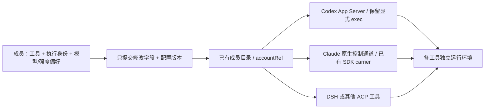

# #1466 配置阶段交付与独立体验环境

> 2026-10-10 用户体验复核后的修订见 [配置体验修订](./issue-1466-configuration-ux-revision.md)。其中真实模型目录、连接措辞、下拉继承及分层字段替代本文初版界面描述。

## 本轮范围

用户确认按「配置优化 → 引导 → 一键安装」顺序交付，本轮只实施第一阶段。
唯一集成分支为 `feat/onboarding-first-run` / PR #1519，#1453 不再作为依赖或交付线。
本轮吸收旧 native 实现的必要配置、启动与 ACP 能力，保留已有全局 Claude carrier 和显式 Codex carrier。
没有切换正式 runtime，没有删除旧 worktree、会话或数据库。

## 用户可见变化

| 入口 / 场景 | 本轮行为 |
| --- | --- |
| 设置 → 猫猫团队 → 成员与运行时 | 使用真实 F322 宿主；成员详情为一页编辑，替代该入口的旧弹窗 |
| 添加伙伴 | 猫模板提供身份与个性，可空白添加；职责可选；模板只推荐工具，不固定模型、强度、认证 |
| 模型与接入 | 选择 Codex、Claude Code 或已有 ACP 工具；默认跟随工具；模型与强度可独立覆盖 / 恢复 |
| 执行身份 | 唯一 `accountRef`；恢复模型或强度不会清空账号；新增账号链接进入唯一账户管理页 |
| 草稿 | 按 API 实例、用户、项目、成员隔离；往返账号页保留字段与所在分区；保存时校验配置版本 |
| 冲突 | 旧版本返回 409，保留草稿；用户可以读取最新基线并保留本地修改，再核对保存 |
| 低频配置 | 身份 / 外观、语音、上下文策略、高级接入独立分区；不修改的字段不写回 |
| Codex 专属 | 保留具名 OAuth 的速度档位编辑；高级页折叠沙箱、审批与认证兼容模式，标明全局作用范围；全局草稿参与底部保存，部分失败保留未完成项 |
| 历史 ACP | 保留程序、完整 argv、profile、transport 与 pool；改名字不会取整重写 TTL |
| 窄屏 | 设置总导航默认折叠；成员目录横向滚动；实际账号名换行显示；保存栏保持可达 |
| 状态表述 | 分开显示已保存偏好、下次预览；没有当前回合回执时明确说明未知 |

## 自检证据

- 前端定向回归覆盖成员 payload、草稿合并、旧编辑器兼容、原生工具、空账号状态、设置深链、原生账号摘要及聊天入口；本轮基础 106 项，审查修复新增 ACP 嵌套字段与聊天入口检查。
- API 24 项原生配置 / 启动 / ACP 配置 / 续接 / 配置版本 / cookie 测试通过。
- ACP stdio / HTTP stream 56 项回归测试通过。
- API `tsc` 与 Web `tsc --noEmit` 通过；修改文件 Biome 检查无 error，仍有复杂度与 hook 等 warning。
- 真实浏览器：Codex 强度 low → 账号页 → 返回保留草稿 → 保存 → 单独恢复跟随；模板创建「配置体验伙伴」成功。
- 真实浏览器：DSH 高级页保留既有 node 路径、`--profile acp`、stdio 与 pool；中文 / 英文、390×844 窄屏人工检查。
- 本机探测：Codex `0.161.0`、Claude Code `2.1.295`、DSH `0.2.0-rc.2`。
- DSH 真实 ACP：initialize、session/new、model 与 reasoning_effort 的 session/set_config_option 回读一致。
- DSH 真机补验：high → low → 恢复跟随 high，恢复前后 session ID 一致，无模型 prompt；修复了 resume-only agent 拒绝重复激活同一会话的问题。
- Windows managed launcher 的 5 秒租约实测到期后状态为 stopped，没有遗留监听进程。
- 上述探测不等于已验证三种工具的完整真实回复、压缩会话换号续聊。

## 独立环境

| 项目 | 独立实例 | 原环境 |
| --- | --- | --- |
| Web | `http://localhost:5122` | 3003，PID 26692 未变 |
| API | `http://localhost:3122` | 3004，PID 3720 未变 |
| Redis | 6378，新进程，新 AOF / RDB 目录 | 6399，PID 4328 未变 |
| 登录 cookie | `cat_cafe_issue1466_preview` | 保持默认 cookie |
| 数据与配置 | `artifacts/issue1466-config-preview/instance/` | 未引用原环境数据库 |

本机入口：`http://localhost:5122/settings?s=members&shell=v2`。
启动脚本、探测结果、保护文件哈希、截图保存在本机 `G:/AIwork/clowder-ai/artifacts/issue1466-config-preview/`。
目录含私有 CLI 配置副本，不提交或上传整个目录；PR 只包含代码和此脱敏记录。

CLI 配置复制至独立 HOME。最终回读确认原 Codex `auth.json`、Claude settings、DSH credentials 与正式 cat-catalog 的哈希未改变。
原 `.codex/config.toml` 在 16:03:34 出现变化；与隔离副本做去除 MCP/hooks 的结构比较后，差异为 `service_tier`。本轮脚本对原文件仅作读取复制，运行使用独立 `CODEX_HOME`，不能据此确定该变化的写入者，也不回滚它或声称原文件哈希全部不变。
应用账号库是全新的；没有复制原环境的项目账号库或历史会话。DSH 只复制启动描述和必要原生 profile 配置。
三个服务由仓库 managed launcher 托管，Windows provenance 为 `detached`，租约 8 小时。
这只证明 launcher 退出后服务可达；跨回合长期存活仍以随后 status/HTTP 结果为准。

环境准备中修复了该 worktree 的 OpenTelemetry 安装版本混杂：原目录保留备份，链接到本 worktree lockfile 对应的依赖。
完整 `pnpm --filter @cat-cafe/api build` 被已有 collective-client 的 Windows `rm` 命令阻断；本轮使用 API `tsc` 与现有 workspace 依赖验证。

## 尚未宣称完成的总议题

- 独立订阅账号的隔离登录与换号续聊依赖 F320 公开接口，当前不能伪装成已实现；原生模式禁用不受支持的具名 OAuth 切换。
- 当前会话实际采用回执未提供给设置页，UI 不把候选 / 本机可读配置标成实际采用值。
- 首启引导、一键安装、默认固定入口策略属于后续阶段；本次不是 #1466 的最终关闭报告。
- 在用户验收与独立 review 完成前，不合入、不切换正式 runtime。

## 独立审查修复

非作者首次审查要求修改五项，本轮逐项复现后修正：ACP 显式账号进入进程环境且账号变化轮换进程池；恢复默认模型/强度回写原会话；单独改进程数保留原始 TTL；Codex 装配和 API 共用 carrier 规则；聊天头像进入同一设置详情页。

ACP 的默认值来自未覆盖的 session/new 回执，按实际 client 代次、cwd、模型缓存；重启后可建立不发送 prompt 的探测会话，支持 close 的工具随后关闭它，再恢复原历史会话。活跃会话接收 setter 与 config_option_update 的完整状态更新。cwd/MCP 结构变化或未确认取消的会话不会静默续用，也不会因该错误新建空白历史；当前提示显式开启新会话。

复审补充了合法空字符串默认 sentinel：协议层仅把 `undefined` 当作未指定，保留模型与强度的空字符串 wire value。新增回归验证恢复时在原 session 发送该值，避免配置页已显示跟随而实际仍沿用旧覆盖。

回退逻辑检查触发了计数提示。逐类核对后，新增分支分别承担原生/历史配置契约、缺失能力的明确报错、草稿存储失败提示和可读名称投影；不以默认账号替换未知账号，不以猜测模型掩盖缺失回执。配置失败与真正的 session/load 失败已分离，前者不会退回空白会话。
