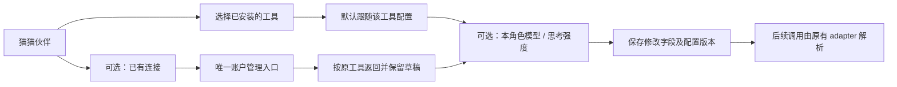
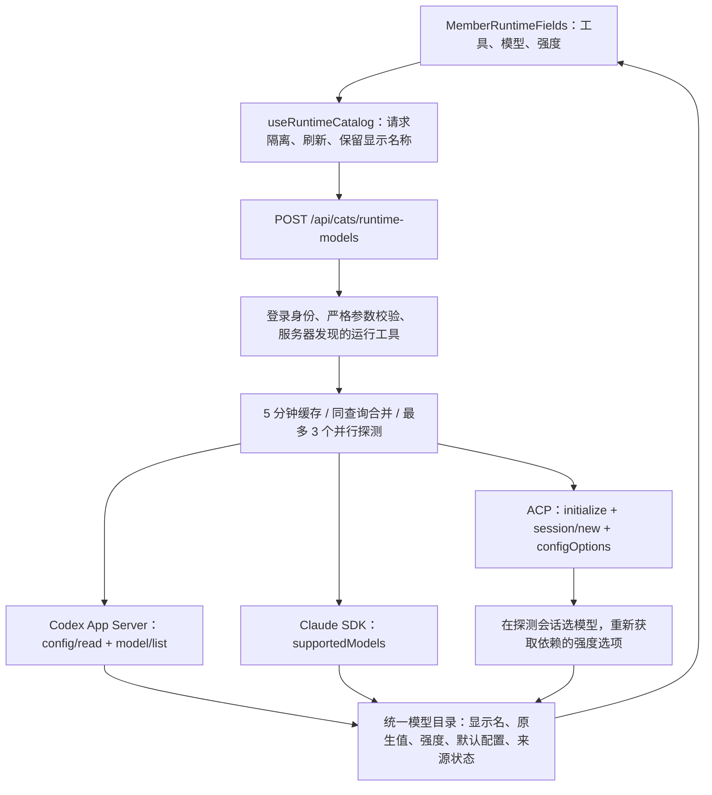

# #1466 配置体验修订：从填写参数变成选择工具与偏好

本轮沿用 PR #1519 / `feat/onboarding-first-run`，解决用户在 5122 实际页面发现的问题。
用户已授权实施并重启同一测试环境。仍只交付配置阶段；首启引导和一键安装按原顺序后续完成。
本文件补充并修订上一版交付说明中“执行身份”、手工模型输入与独立恢复按钮的界面设计。

## 1. 问题与本轮决定

| 用户遇到的问题 / 附件建议 | 决定及实际变化 |
| --- | --- |
| “执行身份”需要学习，单账号也要求选择 | 主区显示“使用工具”；已有连接放在次级区域，单一工具配置不出现空洞账号选择器；多个连接才显示“使用连接” |
| 将执行身份理解为运行工具 | 不采纳这个等同关系。工具与账号仍独立：Codex 可用不同连接，恢复模型不改 `accountRef`；界面改称“连接” |
| 模型、强度得自己填，下拉无实用选项 | 新增运行工具能力目录接口。Codex 读取 App Server `model/list`，Claude 读取 SDK `supportedModels()`，DSH 读取 ACP `configOptions`；不靠静态全模型表 |
| 用 `codex model list --format json` / `claude model list --format json` | 不采用未经证实的命令。使用已在本机读通的控制协议 / SDK；不发送模型 prompt |
| 跟随与恢复有多余按钮 | 每个选择器第一项就是“跟随 X 设置”；模型与强度分别恢复。继承保存为空偏好，不复制当前工具值 |
| 应支持搜索、自定义、清晰选中态 | 模型可按名称、ID、分组搜索，勾选表示当前选择；自定义模型藏在菜单末尾。未知强度保留高级手工入口，已报告的档位优先选择 |
| 选中项使用绿色确认 | 不用绿色暗示覆盖比继承更正确。两者都用相同选中样式，真实请求错误才使用错误状态 |
| 所有 option 塞进版本、安装、认证、默认模型 | 部分采纳：工具选项只带安装状态；模型目录与默认配置放摘要。诊断与来源放折叠详情，认证状态不通过安装/目录结果推断 |
| 刷新就应让旧会话采用配置 | 不采纳。保存提示明确“正在运行的回合不变，后续调用使用新设置”；模型目录读取不是运行回执 |
| 其他配置页退化成文本字段 | 职责/个性多行输入，别名/擅长使用标签；语音基础项与高级项分开；会话阈值恢复为百分比滑块，只在混合策略显示压缩次数；高级接入保留原有能力 |
| 页面反复展示内部实现概念 | 成员列表减少内部 ID、native 协议和 Session Chain 的重复徽标；路由记录默认折叠；添加模板缩为紧凑选项；当前页语言切换降低视觉优先级 |

## 2. 用户操作与数据边界

- 模型和强度没有显式偏好时，继续跟随工具；改名字、语音等不重写运行配置。
- 已安装、成功读取模型目录、成功执行一次调用是不同事实。主区显示已取得的事实，详情说明边界。
- 目录失败保留已有值；可刷新或继续继承。未知旧模型不会被自动替换，自定义输入保留。
- 显式连接只展示该连接保存的模型清单，不拿工具当前登录环境的目录冒充该连接能力。
- 自定义启动参数和 HTTP stream 等尚不能按同一环境探测的情况，明确退回配置清单，不执行浏览器传入的任意程序。

## 3. 技术方案

接口只接收 `runtimeId`、成员/连接引用、已选模型及刷新标志。程序、argv、cwd 从服务端已有配置解析；用户不能提交任意命令、环境变量或工作目录。

探测连接有 20 秒时限、输出上限和进程回收；禁止响应代理提出的文件、终端及批准请求。Claude 查询不发送用户消息、不持久化对话。错误不返回代理 stderr 或认证数据。

Codex 强度属于每个模型的能力；Claude 区分“不支持”和“没有报告”；Claude `[1m]` 仅在能力匹配时关联原别名，保存值不被改写。ACP 提交原生 opaque value，显示模型名称和分组，不要求用户输入其 JSON 编码。

ACP 切换模型期间保留显示名称，但清掉上一个模型的强度选项；切换工具、成员或连接后不复用旧目录。过期响应不会覆盖当前选择。尚未列出的旧模型不强行用于探测会话，保留手动配置兼容性。

## 4. 兼容性与未扩大范围

- 不改认证拥有权，不修改 cc-switch、原生 CLI 认证或正式 runtime；Codex App Server、Claude 已有 carrier、DSH ACP 的调用架构沿用 #1466 决议。
- 保存仍沿用成员差量 PATCH 与配置版本冲突检查，不另建模型/账号数据库。
- 历史 `accountRef`、自定义模型/强度、完整 ACP argv/profile/transport/pool、语音和上下文配置保留。
- `ultra`、`xhigh`、`off` 等工具原生值可以原样保存，不能被旧公共预设表裁掉。
- 没有新增一键安装、登录向导或 provider 管理体系；已有账户认证弹窗的推荐清单不属于本轮原生能力目录。
- 三个本机 client 已验证能力读取；这不宣称它们的完整真实生成、长会话续接或所有第三方连接已经验收。

## 5. 作者验证与体验入口

入口：`http://localhost:5122/settings?s=members&shell=v2&lang=zh`。
对应 worktree：`G:/AIwork/clowder-ai/worktrees/feat-onboarding-first-run`。
Web 5122 / API 3122 / Redis 6378，延续独立 HOME、项目配置、cookie 与数据目录；重启只针对测试 Web/API，Redis 数据保留。

已经在真实浏览器操作：Codex 搜索并选择模型、选择 `ultra`、保存、分别恢复；Claude 默认 `opus[1m]` 显示 SDK 强度，带草稿往返账户页，新增连接弹窗预选 Claude；DSH 切模型后刷新强度、选择 `off` 并保存。身份、语音、阈值、高级接入逐页查看。

本机工具目录回读：Codex 7 项、Claude 5 项、DSH 初始 3 项；DSH 切换模型后可重新返回不同清单，以工具响应为准。

自动化回归覆盖目录解析、缓存去重/失败、请求身份与命令拒绝、子进程超时/回收、不执行代理反向请求、原生档位往返、选择器恢复、跨连接过期响应、旧配置和草稿保留。
截图、脱敏模型目录回读及运行保护记录保存在本机 `artifacts/issue1466-config-preview/ux-*`；不提交含 CLI 配置副本的实例目录。

## 6. 独立复审与补验

非作者复审 `4edffc4cc` 提出两项 P2，均已用组件失败用例复现后修复：

1. 显式连接缺失 / 没有模型清单时，禁止退回本机工具模型；缺失连接由 API 明确报告不可读取。
2. 语音保留预设选择，同时在高级区提供自定义语言代码；切换预设后可以重新填回历史语言码。

非作者已复核代码 HEAD `be57b4ed9566d3f1c78a354710939b3efd12076c`，两项 P2 关闭，结论为 `approved`；复核独立运行 API 6/6、Web 9/9。后续提交仅补充本文验证记录，不改变已审代码。

作者针对本轮的 API 20 项、Web 原 29 项及新增 3 项均通过；修复后重跑相关 API 6 项、Web 9 项通过。API 类型检查通过；Web 首次增量检查遇到 Vitest Reporter 的重复路径类型冲突，在可读取 Windows junction 的执行环境运行完整 `tsc --noEmit --incremental false` 后通过，未改依赖或跳过诊断。Biome 检查无错误，仍有复杂度等警告。

390×844 实际浏览器检查：页面无横向溢出，模型菜单、搜索、继承与手动入口均可达；窗口尺寸已恢复。
测试环境主题页虽然标记 Dark 为选中，页面 `data-theme` 仍为 `light`，因此不将该截图当作暗色验证通过；已恢复原 Light。本轮未改主题系统。
重启后 Web / API 均返回 200，正式 3003 / 3004 / 6399 的监听 PID 与原交付记录一致；补验前后原 Codex 配置/认证、Claude settings、DSH credentials、正式成员目录哈希不变。

## 7. 用户验收后的细节打磨

用户确认整体体验改善，要求先提交保护，再自行截图排查重复状态和类似细节。实施前确认上一轮已提交并推送至 `385ebae78`，本轮继续同一分支。

| 实际截图 / 操作发现 | 修订 |
| --- | --- |
| “已启用”徽标与启停开关重复，分布在两处 | 合成一个带文字的状态开关，整块可点击；保存时显示等待、禁止重复点击，读屏可取得 checked/busy 状态。只读卡片仍显示状态 |
| 列表有两句近义说明，添加按钮独占下一行 | 保留页头说明，将添加入口移入页头 |
| 多个呼叫别名紧挨着 | 增加清晰分隔，不修改实际别名 |
| 侧栏“跟随工具”只看模型，忽略思考强度覆盖 | 删除这一重复且可能误导的摘要；两个字段各自表达自己的值 |
| “全局默认猫 / 新 thread”及语音页的“语音”输入含糊 | 改为“默认回复伙伴 / 新对话”和“音色”；上下文页删除泛化重复说明，保留压缩阈值仅观测的必要提示 |
| 卡片能聚焦却不能键盘打开 | Enter / Space 打开成员；子操作不会误触打开；没有编辑回调时不显示假按钮语义 |
| 390px 下操作区把成员名称挤到几乎不可读 | 仅成员卡片在窄屏把操作放到下一行；默认回复选择器上下排列。共享行组件默认布局不变 |

Architecture cell：现有成员设置与设置行组件；Map delta：none。未改变认证、调用协议、目录探测或持久化契约。

验证：新增 4 个行为测试均先 RED 后 GREEN，覆盖状态、保存中、只读及键盘隔离；相关 6 套测试共 30 项通过。真实 5122 页面完成配置体验伙伴停用 → 键盘重新启用，最终恢复启用；回车打开成员、页头进入添加、详情各分区和 390×844 截图检查。窄屏页面宽与视口均为 390，名称与开关完整可见。截图位于本机 `artifacts/issue1466-config-preview/ux-polish-*`。不操作删除，不改变正式环境。

最后补验共享行组件、语音、高级配置 6 项通过（本轮合计 36 项），完整 Web 类型检查通过。能力提示检查器自身 13 项测试通过，但默认基于 `origin/main` 的全分支提示检查报告 22 项未通过，位于本轮未修改的历史 feature/guide 文件；不将该全分支门禁记为通过，也不为 UI 去重引入新的教学提示。

按本轮 `385ebae78..10e33f8c8` 的 13 个实际变更文件检查能力提示，错误为 0（全局历史引用警告仍存在）。非作者复审指出保存中点击禁用开关的子元素会冒泡到卡片；补验确实触发了 3 次编辑，随后用控件外层捕获保护隔离，相关 10 项回归通过。此保护保留原生 disabled 和正常启停行为，不修改共享行的点击规则。

非作者复核最终代码 HEAD `53ef0cebca70acbe4ee09550453895c44eb3f1ed`，结论 `approved`，上述 P2 关闭，独立 9 项检查通过；后续只补本文回执。最终 Web 类型检查通过，测试前端 5122 重启加载该版本，API / Redis 及正式实例继续保持原进程。
