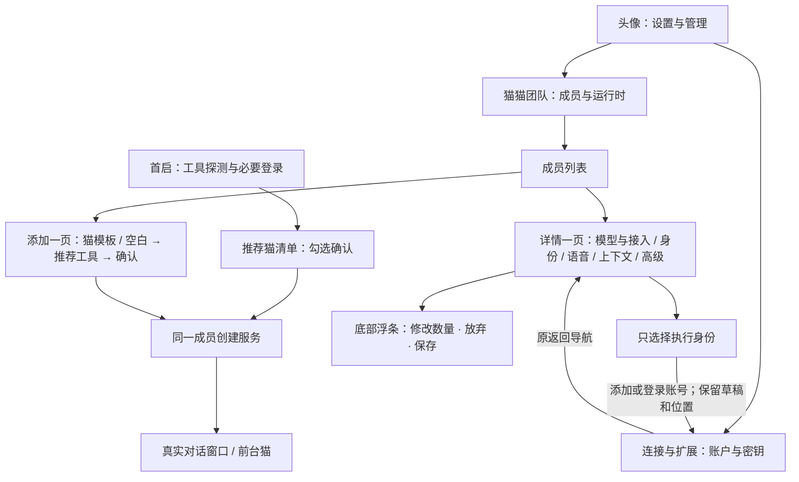
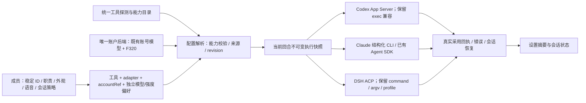

# #1466 最终意见收敛方案（待用户审核）

目标：新用户选熟悉的猫、复用已有工具即可开始协作；日常调整能看懂、能恢复、不丢已有设置；首启最终获得真实回复。以同一成员、账号和运行时契约闭环 #1466。

2026-10-10 用户已确认体验方向并授权实施：以 PR #1519 为唯一主线，不再推进/依赖 #1453；配置优化、#1466 首启引导、一键安装依次交付。本轮先完成猫猫配置优化，在全新应用数据、配置目录和独立 Redis 进程中启动供用户验证，不更新现有 runtime。F320 尚缺上游源码的部分仍如实登记，不把模拟结果算作生产完成。

## 1. 决策来源与优先级

1. [#1466 原始需求](https://github.com/zts212653/clowder-ai/issues/1466)：第 1–5 步演示、第 6 步工具配置、第 7 步真实窗口与前台猫、第 8 步 F155 引导，以及品牌素材。
2. [zts 最终意见，6094825401](https://github.com/zts212653/clowder-ai/issues/1466#issuecomment-6094825401)：布局、模板、唯一账户入口、六条旅程、F320 实际接口与待定钉选策略；本次核查时为最新回复。
3. [mind 字段和 adapter 契约，6094662266](https://github.com/zts212653/clowder-ai/issues/1466#issuecomment-6094662266)：折叠不删能力，工具、adapter、启动配置分离，保留旧字段。
4. [F322 已落地宿主与导航约束](../features/F322-everyday-work-experience.md)：复用现有设置宿主、section ID、深链、主题和返回导航。

最终意见覆盖我们 v2 中的 A/B/C 布局待选、成员页直接管理账号、独立 identityRef 示意。旧原型留作研究与回归证据，不再作为实施规格。

配套文档：[技术契约及模块改动](./issue-1466-implementation-contracts.md) · [分支收敛与冗余审计](./issue-1466-worktree-convergence.md) · [验收、依赖和交付顺序](./issue-1466-acceptance-matrix.md) · [2026-10-10 配置体验修订](./issue-1466-configuration-ux-revision.md)。

## 2. 用户体验究竟改什么

| 当前问题或已有原型局限 | 审核后实施的行为 | 用户能直接感知的改善 |
|---|---|---|
| 角色、工具、provider、认证一起要求选择 | 先选猫模板或从空白开始，再确认工具；默认复用工具环境 | 会选 Codex/Claude/DSH 即可入门，不必理解供应商 |
| 新伙伴默认叫“Codex 助手” | 模板带出名字、头像、职责、个性；工具只是推荐，可改 | 建立持续的伙伴身份，换工具不换猫 |
| 三个工具需要重复填写添加表单 | 首启一次展示推荐成员清单，勾选后批量确认 | 多工具配置不重复劳动，创建仍由用户确认 |
| 用途卡片成为独立必经步骤 | 用途作为可选角色信息 | 快速进入对话，仍能表达分工 |
| 多套设置外壳与重复账号入口 | 沿用“成员与运行时”“账户与密钥” | 登录、账号管理、角色配置位置稳定 |
| 详情弹窗、高级字段分散 | 一页详情、左侧目录，第一节“模型与接入” | 常用项先看到，低频能力可折叠且能找到 |
| 草稿随切成员丢失；保存需滚到底 | 每成员草稿、底部保存浮条、保留或明确放弃 | 随时看见修改数量，登录或切成员不丢输入 |
| 账号选择与 native 模式相互排斥 | 公司号/私人号与模型、强度独立 | 公司号也可跟随工具模型，只覆盖强度 |
| 恢复跟随可能清账号或其他字段 | 模型、强度各自恢复；只 patch 编辑过的字段 | 小改动不会破坏语音、ACP、上下文和外观 |
| “当前生效”混入尚未执行的设置 | 分开已保存偏好、下次调用预览、当前会话采用值 | 知道保存了什么、下次会用什么、这次实际用了什么 |
| 390px 隐藏账号名、状态字过小 | 摘要保留“Codex · 公司号”，可换行；操作触达不靠 hover | 手机也能确认身份和保存，不靠教学猜含义 |
| 可用旧账号显示危险红色 | 有效旧账号显示正常状态，错误才提示恢复 | 老用户能继续用，不被催促迁移 |
| 出错后重配或暗中降级 | 原位重试/登录/修改；显式工具、账号、模型不静默替换 | 错误可恢复，用户选择可信 |

以上是设计目标，未宣称转化率或耗时已改善。通过真实宿主操作和真实调用取证，验收标准见配套矩阵。

## 3. 确定的页面与导航

- 保留 `/settings?s=members`、`/settings?s=accounts`、`/settings?s=members&cat=<id>` 深链语义。
- 添加页拟用 `/settings?s=members&view=add`；这是待实现子状态，不新增一级侧栏。
- `SettingsShell` / `SettingsShellV2` 共用内容；新版壳仍按既有选择启用，不借 #1466 更改全局默认壳或重排全部设置。
- 详情左目录定位分节；窄屏改可触达的分节导航，顶部身份摘要常在。折叠节显示当前摘要，低频选项无需首启填写。
- 保存浮条固定在内容视口底部，避开输入法和安全区；桌面 1440×900、手机 390px 均可操作。
- 中英文使用本切片文案键与宿主现有语言约定；不以浏览器自动翻译算通过。若宿主缺全局语言状态，补本切片接点，不扩成全站国际化重写。

## 4. 为什么采用统一契约与多种原生接入

统一的是用户意图、能力、状态与错误；各 harness 继续执行自己的 agent loop。App Server 与 ACP 都可用 stdio JSON-RPC，但不是同一协议。无需为已有 Codex 再包 ACP；Claude SDK 也不是 CLI 的格式选项。

源码核查纠正两点：

1. 原生角色分支会在 payload 清空 `accountRef`，后端遇到 `native_tool` 又跳过绑定解析。必须改为“执行身份与默认值继承正交”，只换 UI 不够。
2. `ClaudeSdkAgentService` 和 carrier 的 `agent_sdk` 分支已经存在。欠缺的是本次成员级入口、完整继承与兼容验收；不能再写“SDK 尚未实现”，也不能由 `native_tool` 无条件强制改成 CLI。

默认工具身份由原生配置负责；指定账号仍以已有 `accountRef` 解析。cc-switch 等外部工具继续管理原生配置，Clowder 仅应用成员级覆盖，不写回它们的全局模型或认证文件。继承是持续策略，不是读取一次后复制成覆盖。

Architecture cell：成员目录/配置解析 → account authority → adapter → invocation/session；设置和首启是同一契约的消费者。
Map delta：不新增账号权威；增加统一配置投影、每成员草稿及采用回执接点。Why：消除 native 与 account 互斥、重复探测和多套表单状态造成的歧义。

## 5. 研究结论如何进入本方案

这是沿用既有固定源码研究，不是本轮重新测评竞品，也不声称所有参考产品都满足本项目场景。

| 参考及固定依据 | 采用的设计 | 本项目边界 |
|---|---|---|
| [Magpie 字段 adapter](https://github.com/yetone/magpie/blob/62b1c995ffaebb223ad040b4c54ebabab0078c7a/internal/agent/agent.go#L76) | 能力驱动的模型快捷项、折叠高级项、来源反馈 | 不接管 CLI 全局配置写入或网关 |
| [CC Switch 应用类型](https://github.com/farion1231/cc-switch/blob/b4a079430ce85a604e10d97d4b7530774e00e112/src-tauri/src/app_config.rs#L402) | 区分工具与供应商，快捷配置与高级字段共用来源 | 不把供应商卡或密钥复制到成员 |
| [Multica 角色草稿](https://github.com/multica-ai/multica/blob/10a7e519da96e8e1819934c24f89bc55a71f88b5/packages/core/agents/draft.ts#L44) | 角色绑定 runtime，探测、继承与能力目录 | 保留模型/强度独立覆盖；不替换用户 DSH profile |
| Codex App Server、本地 `CodexAppServerClient` | 结构化配置与会话接入 | 目录推荐值不当作用户已选择或会话实际采用值 |
| DSH/ACP，本地 `AcpClient` 与既有探针记录 | 协商能力、配置项 ID、恢复和取消 | 不假设所有 ACP 工具同能力，不改已有 DSH 启动配置 |
| [Zed external agents](https://zed.dev/docs/ai/external-agents#configuration-boundaries) | 外部 agent 拥有自己的原生设置 | 应用 provider 设置不自动成为外部 agent 认证 |

后续加工具时注册安装描述、能力和 adapter 契约，不重做角色表单或另建身份库。新增原生协议仍需实现 adapter；新增 ACP 工具仍需验证握手、参数、权限、取消、续聊与错误，不能承诺零开发接入。

Multica 固定研究提交登记 25 种，加派生 `omp` 共 26 种：claude、codex、codebuddy、copilot、opencode、codearts、deveco、openclaw、pi、omp、cursor、antigravity、qwen、dsh、hermes、kimi、reasonix、kiro、qoder、qoderclicn、traecli、grok、dim、qwenpaw、mcode、zeroclaw；不是全部 ACP。见[注册源码](https://github.com/multica-ai/multica/blob/10a7e519da96e8e1819934c24f89bc55a71f88b5/server/pkg/agent/agent.go#L364)及[派生项](https://github.com/multica-ai/multica/blob/10a7e519da96e8e1819934c24f89bc55a71f88b5/server/pkg/agent/builtin_runtimes.go#L86)。这是该快照的覆盖，不代表本项目本轮全部支持。

## 6. 实施边界与主线

使用 `feat/onboarding-first-run` / [PR #1519](https://github.com/zts212653/clowder-ai/pull/1519) 作为唯一主线；不再以 [PR #1453](https://github.com/zts212653/clowder-ai/pull/1453) 为依赖。必要探测能力在本主线按最小范围复用；原生角色分支按功能吸收，研究和 A/B/C 冻结为证据。不再新建同目标 worktree。

完整关闭范围保留演示、前台猫 F229、F155、品牌统一；不能用成员配置完成代替全部 #1466。当前首启分支有两套组件，实际入口仍为 `FirstRunQuestWizard`；拟收敛同一生产编排器，吸收另一套有价值片段后移除重复状态。详见收敛文档。

F320 登录及换绑代码尚缺公开同步，这是明确依赖。先做真实宿主内、诚实标注的模拟接口旅程供体验确认；生产阶段接维护者现有账号实现，不另写第二套 OAuth。

本轮不新增 Claude 多账号、项目自动选号、远程 runtime、全量 schema 重构，不清理用户全局工具配置。旧 API-key、provider/endpoint、ACP、SDK、MCP、权限、语音和会话策略继续兼容。

## 7. 审核时唯一尚未统一的产品选择

**建议：新安装默认不钉选成员/密钥，用首次 F155 非阻塞引导指出入口，保留用户手动钉选及既有 pin。**

- 依据：zts 最终意见倾向这一方案，F322 当前设计也默认不钉。
- 收益：开源首启和 Workspace 使用同一规则，减少特殊迁移逻辑。
- 代价：首次用户需要通过一次就地引导发现设置入口。
- 备选：仅开源首次安装默认钉选两项；须显式约定安装识别、幂等写入和已有 pin 不变，不能变成全局重置。
- 状态：**待用户确认，不擅自把 issue 原第 8 步划为已对齐。** 其余布局与契约按最终意见落实，不再重开 A/B/C 选择。

按用户最新排序：猫猫配置优化及独立环境体验 → #1466 首启引导 → 一键安装。每段保留测试与独立 review；本轮不部署现有 runtime，不把第一段完成当作整个 #1466 已完成。
