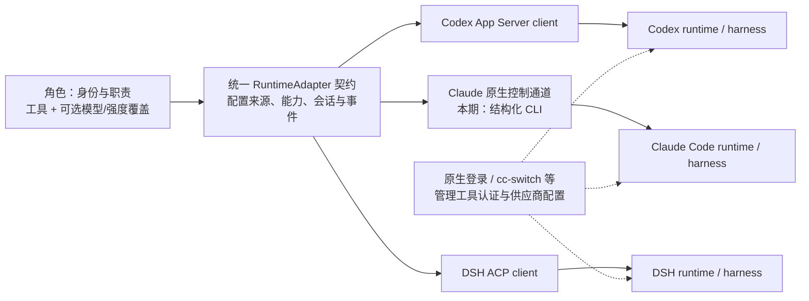
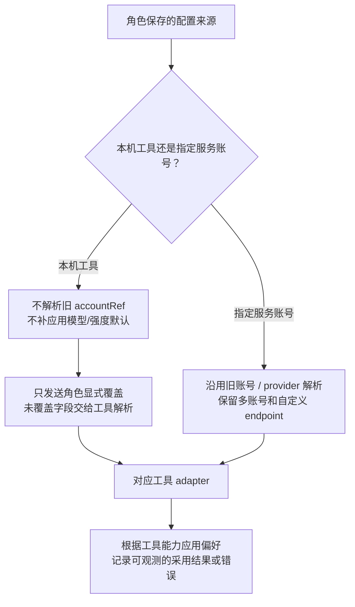

## 角色配置整改方案：选运行工具，复用其配置；通过适配层统一角色体验

@zts212653 想讨论 #1466 第 6 步「复用本机 client 配置」的底层方案，以及它在日常成员设置中的复用。这条评论已重新按问题、架构、选择依据和兼容策略组织，替换之前将方案与实验细节混在一起的版本。架构图、低保真和参考清单均内嵌，不依赖本机附件或未发布文档。

**建议：普通用户选择 Codex / Claude Code / DSH，默认继承该工具的认证、模型与思考强度；需要时只为某个角色覆盖模型或强度。Clowder 统一角色配置、能力和会话契约，各 adapter 使用工具适合的原生接入面。**

这是 #1466 的配置切片，覆盖成员新建、编辑，以及首启配置可复用的语义。首启演示、登录引导和整个 issue 的交付仍按原范围验收。

### 1. 问题：已经配好的工具，为什么进入 Clowder 后还要重新配一次？

典型场景：用户已安装 Codex，通过原生配置或 cc-switch 完成直连/中转及登录，终端可以使用；进入 Clowder 编辑角色，却仍需要理解 client、provider、账号、认证方式、模型和强度，界面还可能显示历史 kitcoding 绑定。

这里有三个问题：

| 用户遇到的问题 | 背后的原因 | 本方案需要改变什么 |
|---|---|---|
| 已配好 Codex，角色仍要求选择服务账号 | 角色执行默认经过应用的账号解析与注入链 | 明确提供「本机工具配置」来源，绕过应用账号注入 |
| 以为留空会跟随 CLI，实际仍出现项目默认模型/强度 | 模板、getter 和启动参数把未配置值补成了显式覆盖 | 继承必须贯穿保存、解析、启动和会话控制，不能只改 UI |
| 不同工具的模型、启动参数和会话行为混在一个表单里 | 工具、连接协议、供应商和角色偏好没有清楚分层 | UI 统一用户任务；adapter 处理协议差异和能力限制 |

历史标签本身不能证明当前实际请求走了哪个供应商；要以配置解析、执行参数和工具回执判断。所以仅把 kitcoding 改名为「直连」，无法解决配置来源与执行行为不一致的问题。

本次要形成的结果是：**已配好的工具可以直接复用；角色仍可独立调整模型/强度；换工具不重建角色身份；旧用户的配置继续可用。**

### 2. 架构：统一配置契约，按工具连接其 harness

先区分四层：角色是 Clowder 的身份、职责和偏好；runtime/harness 是执行 agent loop 的工具；client/adapter 是 Clowder 连接工具的代码；provider 是工具最终调用的模型服务。



图中的 RuntimeAdapter 表示统一的设计边界。本轮基于已有 AgentService、CodexAppServerClient 和 ACP client 改造，不宣称已完成一个覆盖所有工具的新 RuntimeAdapter 类或插件注册系统。

**ACP 是跨工具协议；App Server 是 Codex 原生集成接口。** 它们都能使用 stdio JSON-RPC，但方法、能力和会话生命周期不同。Codex 的 CLI、客户端等界面可复用官方 harness，不代表它们是通过 ACP 共用底层。[Codex 源码中的 App Server 配置层](https://github.com/openai/codex/blob/4bad6d78e9b50f9fa8bd941f1db012ed491ad2da/codex-rs/app-server/src/config_manager_service.rs#L119)、[codex-acp 转接 App Server 的实现](https://github.com/agentclientprotocol/codex-acp/blob/51f78d67e46c3a96ee8d8bf4e43fc917ab21c73e/src/CodexJsonRpcConnection.ts#L17)。

Clowder 继续负责身份注入、协作调度、权限、MCP、回调和审计；工具继续负责自身 agent loop、认证和原生配置解析。复用 harness 可以保留它已有的工具调用与会话能力，而不是在 Clowder 里重新实现每家 agent loop。

### 3. 每个工具怎么接，为什么这样选择？

| 工具 | 本期接入方案 | 选择理由与优势 | 需要守住的边界 |
|---|---|---|---|
| **Codex** | 启动已安装的 `codex app-server`，复用已有 `CodexAppServerClient` | 原生提供结构化会话、配置、模型与事件接口；项目已有实现，可直接修正继承语义，减少转接层 | 用户无需另外维护常驻 server；继承时不注入模型/强度或旧 provider。旧 exec 路径按原配置兼容 |
| **Claude Code** | 保留现有 `claude -p` 的结构化 stream-json 通道 | 沿用已有执行、回调与认证路径，先解决配置来源问题；官方 Agent SDK 可作为同一边界内的替代封装，便于以后升级 | 本轮不强制切 SDK，也不因此改变认证方式；显式加载应使用的配置范围。SDK 的配置默认和动态清除行为需另行验证 |
| **DSH** | 复用现有安装、启动 command/argv 和 ACP profile，经现有 ACP client 连接 | DSH 提供官方 ACP 接口；项目已有通用 ACP 基础，可使用 session 配置与回执，保留已经可用的安装 | 不重装、不自动换版本、不改用户 profile。继承的是当前 **ACP 启动环境/profile** 默认，不能冒称与 TUI/web 默认完全相同 |

接口依据：[Codex App Server 官方文档](https://learn.chatgpt.com/docs/app-server)、[Claude Agent SDK 与 Claude Code 的关系](https://code.claude.com/docs/en/agent-sdk/overview)、[DSH 官方 ACP 文档](https://github.com/deepseek-ai/deepseek-harness/blob/master/packages/acp/acp/README.md)。

旧成员也可能是 `openai/anthropic + ACP` 的组合：它们必须继续明确显示「现有 ACP 启动配置」，不能仅因 clientId 是 openai 就显示为 Codex App Server。用户显式选择原生 Codex/Claude 通道后，才切换相应执行路径。

统一 UI 不要求统一 wire protocol。这样既能利用 Codex 的原生接口，也能让支持 ACP 的新工具复用通用实现；工具特有行为留在 adapter 内。

### 4. 用户只配置什么？谁负责默认值？

普通路径：**选择已安装工具 → 保存成员 → 开始新对话**。模型和强度默认分别继承，不要求再次填写 provider、key、endpoint 或 OAuth 类型。

```text
设置 → 成员 → 新建 / 编辑
  配置来源：[本机工具 ▾]      高级选项：指定服务账号
  运行工具：[Codex ▾]         Claude Code / 已配置的 DSH
  模型与思考强度：跟随工具配置

  ▸ 此角色的高级覆盖
      模型：     [留空：跟随工具]
      思考强度： [留空：跟随工具]
      [恢复跟随工具]

  保存偏好后，下次新对话采用。
  [取消]                       [保存]
```

例子：审阅角色选择 Codex、只把强度设为 `low`，模型仍由 Codex 解析；实现角色可指定另一个模型，强度继续继承。两个角色的覆盖只作用于各自调用，不写 Codex 的全局配置文件。



需要分清三个状态：**保存的角色偏好、下一次调用的配置预览、当前会话实际采用值**。已发现安装不等于已登录；文件里看到的模型不等于当前 session 已采用。首期候选来自可读配置和已有角色，不声称它是完整的实时模型目录；原生模型/别名可手填，ACP 覆盖则按当前 session 公布的选项校验。

继承是持续的策略，不是读取一次默认值后把它复制到角色。cc-switch 修改工具配置后，新执行环境应读取新配置；常驻进程和旧会话是否需要重建，必须按 adapter 判断。**本轮不承诺监听 cc-switch 后所有会话立即热更新。**

### 5. 历史兼容：保留能力，改变普通入口

现有选项并非都没有意义。它们分别来自不同需求：

- [F127：账户与角色分离](https://github.com/zts212653/clowder-ai/blob/main/docs/features/F127-cat-instance-management.md)，解决 API-key 成员、多账号、动态创建与别名配置。
- [F161：通用 ACP carrier](https://github.com/zts212653/clowder-ai/blob/main/docs/features/F161-acp-carrier-generalization.md)，解决新 ACP 工具每次都要改专用路由的问题，保留 command/profile 等配置。
- [F171：首位伙伴配置](https://github.com/zts212653/clowder-ai/blob/main/docs/features/F171-first-partner-onboarding.md)，提供模板、client、账号和模型的冷启动流程。

现在的问题是：这些专业能力累积后成为所有用户的必经项，缺少「工具已经配好了，直接复用」的入口。

| 配置类型 | 兼容处理 |
|---|---|
| 旧角色，无新增来源字段 | 完全沿用旧模式；不批量解绑账号、不自动换模型 |
| 用户主动把旧角色改为本机模式 | 展示变化摘要；切断该角色旧账号绑定及旧覆盖，确认保存后生效；取消不写入，共享账号不删除 |
| 已有 DSH 或自定义 ACP | 保留安装、command、argv、profile 和传输信息；带空格 Windows 路径要往返保存，不用新探测结果覆盖旧入口 |
| 仍需要独立账号、私有 endpoint 的角色 | 继续使用「指定服务账号」高级模式；原有能力保留 |
| 其他现有 client、受保护的云端成员 | 沿用现有执行路径与身份保护，本轮不批量迁移 |
| 已有会话与正在执行的回合 | 不打断回合、不无声换成新对话；清除覆盖先承诺下次新对话生效，旧会话更新需该工具的明确契约 |

技术上新增可选 `configurationSource: native_tool | managed_account`；缺失按旧行为处理。本机模式下模型空白、强度缺失分别表示继承，应用的模板和 getter 不得再回填。

兼容不只涉及字段：ACP 必须识别真实的恢复方法、分组选项和 opaque 值，模型变化后重新校验强度，读取采用回执。恢复成功后的配置拒绝不能误当恢复失败而丢弃历史；显式覆盖失败必须返回错误，不能悄悄换默认模型继续。[ACP 配置选项规范](https://agentclientprotocol.com/protocol/v1/session-config-options)。

### 6. 对比了哪些项目与方案，采纳了什么？

以下比较基于固定源码和官方文档；没有运行这些产品的完整 UI 用户试验，因此体验优势是设计判断，未宣称具体提速比例。

| 参考 | 观察到的方案 | 对 Clowder 的借鉴 | 不直接照搬的部分 |
|---|---|---|---|
| **Magpie** | Agent 字段 adapter、模型/强度候选、展开高级项、配置漂移与恢复记录 | 能力驱动控件、快捷配置和清楚的生效反馈 | 它还负责 CLI 全局配置写入及网关接入；角色覆盖不应承担这两项职责。其 Default/Disconnect 也不等于清除角色覆盖 |
| **CC Switch** | 区分应用与供应商，按 client 投影配置，支持模型搜索/手填与原始配置同步 | 工具与 provider 分层；快捷字段和高级编辑共用一个结构化来源 | 不复制供应商卡、key 或 auth 文件到角色，不建立第二套认证管理器 |
| **Multica** | 角色绑定 runtime，探测工具，空值继承，多种原生/ACP adapter | runtime 与角色分离、能力状态、目录刷新与失效值可清除 | 它限制 Codex 模型继承时单独调强度；这不是 Codex 协议限制。本方案保留独立覆盖。它的 DSH 用专有 multica profile，不必跟随该选择 |
| **Codex 原生 App Server** | 通过结构化配置、模型、thread/turn 接口接入 harness | 直接复用现有 App Server client，由工具解析默认值 | 目录推荐值不能代替用户配置；读取配置不能证明旧会话已更新 |
| **codex-acp / ACP** | 在 Codex App Server 外增加 ACP 转接，配置选项可带关联能力 | 通用能力和会话配置契约，为其他 ACP 工具复用 | Codex 已有原生接入，不为统一名称再加一层转接；不能误用适配器捆绑的另一版 Codex |
| **Zed external agents** | 外部 agent 管自身认证与原生设置 | 普通用户按工具开启会话，配置所有权清楚 | Zed 自身 provider 设置不自动成为外部工具认证；具体继承仍取决于启动环境 |

源码依据：[Magpie 字段 adapter](https://github.com/yetone/magpie/blob/62b1c995ffaebb223ad040b4c54ebabab0078c7a/internal/agent/agent.go#L76)、[Magpie 默认与断开](https://github.com/yetone/magpie/blob/62b1c995ffaebb223ad040b4c54ebabab0078c7a/internal/agent/codex.go#L597)、[CC Switch 应用类型](https://github.com/farion1231/cc-switch/blob/b4a079430ce85a604e10d97d4b7530774e00e112/src-tauri/src/app_config.rs#L402)、[CC Switch 模型输入](https://github.com/farion1231/cc-switch/blob/b4a079430ce85a604e10d97d4b7530774e00e112/src/components/providers/forms/shared/ModelInputWithFetch.tsx#L34)、[Multica 角色草稿与继承](https://github.com/multica-ai/multica/blob/10a7e519da96e8e1819934c24f89bc55a71f88b5/packages/core/agents/draft.ts#L44)、[Zed 配置边界](https://zed.dev/docs/ai/external-agents#configuration-boundaries)。

因此选择「统一上层契约 + 多原生 adapter」。另外两种方案的取舍是：全部转 ACP 会增加已有 Codex 路径的转接和版本负担，且仍不能消除工具自己的继承差异；继续让每个角色配置 provider/key 虽兼容旧能力，却保留了普通用户重复配置的问题。

### 7. 未来为什么容易扩展？扩展仍需要做什么？

统一契约围绕六个对象演进：**安装描述、执行环境、角色偏好、能力描述、模型选项、会话绑定与采用回执**。HOME/profile、cwd 和工具版本属于执行环境；模型与强度属于角色偏好；供应商配置留给工具或显式账号模式。

| 新需求 | 在这套边界中怎么扩展 | 带来的优势 |
|---|---|---|
| 加入新的 ACP 工具 | 注册安装/启动描述、声明能力，复用 ACP 会话与事件转换，并补契约测试 | 不再为每个工具增加 provider 表单和专用认证流程 |
| 加入新的原生协议工具 | 实现相同配置/会话/事件契约的 adapter | 前端成员设置和角色持久化语义可复用 |
| 提升模型快捷配置 | adapter 提供模型目录、支持的强度、版本和来源；共用 UI 展示 | 不把所有工具写死成同一份模型或强度枚举 |
| 同工具多个角色、不同模型 | 偏好在角色/会话层应用，安装与认证保持独立 | 避免多个角色并发改同一份全局 CLI 配置 |
| 以后支持多设备、多 profile | 让角色绑定具体运行环境，并按环境发现能力 | 不需要把设备身份或 profile 混成模型供应商 |

这是扩展方向，不是「任意工具零开发接入」或本轮已交付的完整远程 runtime 系统。新工具仍需验证认证继承、模型/强度、恢复/取消、权限和回调。能力不支持应明示；能力未知应显示未知，不能制造假统一。

<details>
<summary>Multica 适配范围：作为后续工具覆盖参考</summary>

研究固定提交 `10a7e519da96e8e1819934c24f89bc55a71f88b5` 中，SupportedTypes 注册 25 种，加派生 `omp`，共 26 种：claude、codex、codebuddy、copilot、opencode、codearts、deveco、openclaw、pi、omp、cursor、antigravity、qwen、dsh、hermes、kimi、reasonix、kiro、qoder、qoderclicn、traecli、grok、dim、qwenpaw、mcode、zeroclaw。

它们混合使用原生 JSON/stream-json、App Server、专有 JSONL 和 ACP；不是全部 ACP，也不代表都支持相同模型覆盖。Gemini 不在该提交注册清单中，不能凭注释算支持。[注册清单](https://github.com/multica-ai/multica/blob/10a7e519da96e8e1819934c24f89bc55a71f88b5/server/pkg/agent/agent.go#L364)、[派生 runtime](https://github.com/multica-ai/multica/blob/10a7e519da96e8e1819934c24f89bc55a71f88b5/server/pkg/agent/builtin_runtimes.go#L86)。

</details>

### 8. 当前做到哪里，怎样判定方案真正走通？

已在独立 feature worktree 实施本机来源、角色独立覆盖、旧模式兼容和三种接入路径；作者已验证相关 API 131 项、Web 101 项及 TypeScript、生产 Web 构建。真实设置入口已完成创建 Codex、单独改强度、恢复继承、迁移取消与移动端检查；三种已安装工具已只读探测，DSH 已经本项目 ACP client 验证配置回执及 resume 重放。

**尚未完成验收或合入。** 无 prompt 的探测证明不了真实认证和模型回复；非作者审查还发现继承值、恢复会话和既有 ACP 组合的边界，正在修复，完成复验前不更新正式 runtime。扩大 provider 回归有 10 项失败，未改动基线存在完全相同的失败，不把它们算通过。

完成标准按问题验收：已登录工具无需重新选认证即可真实对话；模型/强度可分别覆盖并恢复；两个角色不互相改全局配置；旧账号角色和既有 DSH 仍可使用；恢复会话不丢历史，覆盖失败有明确错误。安装探测、配置控制、真实推理和完整业务调用分别给证据。

实施路径保持 **issue → 确定方案 → 技术方案文档 → 代码实施 → 测试验证 → PR → 独立 review → 合入**；本地更新 runtime 是用户验收环节，保留其现有修复与数据，不批量迁移生产角色。#1463 的探测能力以及相关 PR #1453 / #1519 要对齐同一 descriptor 和创建语义，避免首启与成员设置各自维护一套配置规则。本切片不会自动关闭 #1466。

### 希望维护者一起确认的决策

1. 是否认可普通入口采用「本机工具」，指定服务账号保留为高级模式，并只对旧角色做显式迁移？
2. 是否认可 Codex App Server / Claude 结构化 CLI / DSH ACP 的接入组合，以统一契约收敛体验？
3. 是否认可首期清除覆盖承诺为「下次新对话生效」，旧会话动态重置与外部配置热更新须逐 adapter 验证？
4. 探测 descriptor 与角色创建语义如何在 #1463、#1453、#1519 和本切片之间归口，避免重复实现？