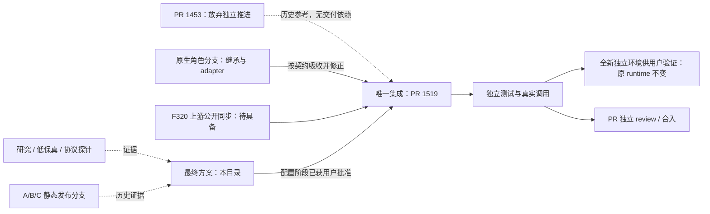

# #1466 worktree 关系、重叠与收敛

> 最新用户决定：采用 #1519 唯一主线，放弃继续推进 #1453 工作线；下文“#1453 先合上游/堆叠依赖”为已撤销的历史建议。其成果只按必要能力参考，不整体合并。实施顺序为配置优化→首启引导→一键安装，本轮在独立新环境体验，不部署已有 runtime。此决定不授权删除研究证据或有修改的目录。

实施前核查时间：2026-10-10。当时只读执行 `git worktree list --porcelain`、各目录 `git status --porcelain`、merge-base/diff/log 及 GitHub PR 查询；fetch 仅更新 upstream/main 引用。随后的配置实施已在 #1519 主线完成；没有合入上游、切换原 runtime、删除目录或清理未跟踪文件。

工作区：`G:/AIwork/clowder-ai`。origin 为 `whutzefengxie-ops/clowder-ai`，upstream 为 `zts212653/clowder-ai`。共有 **18 个已注册 worktree**，另有 **1 个未注册残留目录**；Git clean 只说明被跟踪文件状态，不证明无忽略文件或无人使用。

下列 HEAD/status、重叠统计及其余 worktree 状态为实施前审计快照。配置阶段的当前结果见 [交付与验证记录](issue-1466-configuration-delivery.md)。后续接手须重查状态，不按本文旧 HEAD 覆盖新工作。

## 1. 与 #1466 直接相关的工作线

| 工作目录（相对工作区） | 分支 / 核查 HEAD | 当前作用 | 建议定位 |
|---|---|---|---|
| `worktrees/feat-onboarding-first-run` | `feat/onboarding-first-run`；表中其余 SHA 为实施前快照 | 配置优化及后续引导、安装；[PR #1519](https://github.com/zts212653/clowder-ai/pull/1519) | **唯一产品集成主线**；本轮配置代码和测试均在此处 |
| `worktrees/feat-cli-autodetect` | `feat/cli-autodetect` / `373256c35` | 历史探测实现；[PR #1453](https://github.com/zts212653/clowder-ai/pull/1453) | **放弃独立推进，不再是依赖**；目录保留溯源，不整体合并 |
| `worktrees/feat-native-agent-role-config` | `feat/native-agent-role-config` / `cbab6e1fc` | 原生继承、三工具 adapter、角色编辑；v1/v2 原型与附件 | **已按契约吸收的实现来源**；不再并行演进第二套正式设置 UI |
| `worktrees/research-issue-1466-magpie` | `research/issue-1466-magpie` / `d1dbed36e` | 固定源码研究、低保真、探针与协议证据 | 研究归档；引用必要成果，不把研究脚本变成生产依赖 |
| `worktrees/verify-native-agent-baseline` | `test/native-agent-role-baseline` / `3add05c16` | 临时基线对照；与当前本地 main 同提交，无独有提交 | **明确的代码快照冗余候选**；核对忽略文件/使用者后才可清理 |
| `clowder-ai-runtime` | `runtime/upstream-main-20261010` / `3e70e1d68` | 用户当前运行现场，与已 fetch 的 upstream/main 同提交 | 部署目的地，不是开发分支；保留用户修复现场 |

前四条有不同成果，不能只因都提到 #1466 就判断可删除。原生角色和研究分支未查询到对应开放 PR；附件发布分支 `design/issue-1466-ux-prototypes-20261010` 只是发布载体，不是第七条生产实现线。

## 2. 真正的代码重叠

比较口径：对每分支使用 `git merge-base upstream/main <branch>` 的唯一公共祖先，再比较该祖先到该分支的文件变化。**不能把旧 CLI 分支直接与今天 upstream/main 做双点 diff，当成它修改了数千文件。** 以下统计包含 docs/tests，不等于生产代码体量。

| 分支 | 公共祖先 | 该分支变更文件数 |
|---|---|---:|
| CLI 探测 | `6b6fbbaa863ced704081f0ddc718d797b619f8c2` | 44 |
| 原生角色 | `3e70e1d6805be24672e8f841861f180d20b184c2` | 77 |
| 首启 | `3e70e1d6805be24672e8f841861f180d20b184c2` | 97 |

重叠是“同文件被双方改动”，不是已发生的 Git 冲突，也不能证明语义冲突已解决。

| 两条工作线 | 同改文件 | 收敛责任 |
|---|---|---|
| 探测 × 原生角色：5 | `ClaudeAgentService.ts`、`CodexAgentService.ts`、`routes/cats.ts`、`hub-cat-editor-advanced.tsx`、`hub-cat-editor.model.ts` | 统一可执行程序解析；保留原生继承/旧接入；表单不丢原字段 |
| 探测 × 首启：9 | `env-registry.ts`、`first-run-quest/client-detection.ts`、`routes/cats.ts`、`routes/first-run-quest.ts`、`test/first-run-quest.test.js`、`FirstRunQuestWizard.tsx`、`__tests__/first-run-quest-wizard.test.tsx`、`first-run-quest/ConfigStep.tsx`、`ProfileCard.tsx` | 统一安装权威；保留首启认证状态、幂等创建、恢复与选择确认 |
| 原生角色 × 首启：3 | `runtime-cat-catalog.ts`、`invocation/invoke-single-cat.ts`、`routes/cats.ts` | 无损条件 patch 与持久化串行；账号解析、原生继承、调用身份快照共同验收 |

## 3. 吸收、复用、废弃的具体清单

| 来源 | 复用 | 必须改正或停止沿用 |
|---|---|---|
| 原生角色实现提交 `a138f0ab8`、`196cb155a` | 默认继承、覆盖清除、ACP 配置与会话修复、对应测试 | native 清空/忽略 accountRef；native 强制 Claude CLI；不能直接整分支合入后声称符合最终意见 |
| 原生角色后续四个 docs/prototype 提交 | 字段账、研究比较、原型回归案例、发布溯源 | 不再 A/B/C 选壳；不把模拟身份 store 变成生产后端 |
| CLI 探测 #1453 | descriptor、registry、路径解析、只读诊断 | 不复制第三套 PATH 检测；旧基线需先与当前上游协调 |
| 首启 #1519 已有实现 | 同旅程稳定成员 ID、Idempotency-Key、catalog 锁、按用户线程幂等、真实回复服务端完成同步、只读 auth 状态 | 不沿用“自动创建无需确认”；不把静态 demo 卡片算真实消息演示 |
| 首启 `components/onboarding/OnboardingJourney.tsx` | 适用的展示片段/文案 | 目前无生产 import；不能把它当已经替换入口。移除重复旅程状态前先迁移必要行为与测试 |
| 首启 `docs/design/onboarding-redesign-2026-10-09.md` | 历史讨论依据 | 配置先行、任务代替演示、未登录仅文字指引等与最终目标冲突；标记历史，不再按其施工 |
| 首启打包/CI 变更 | 逐项证明与 #1466 品牌或必要测试相关者 | `.github/workflows/build-mac-dmg.yml`、`build-windows-desktop.yml`、`ci.yml`、信号脚本需范围复核；#1459 安装正确性不混算 #1466 完成 |

## 4. 合并与评审顺序（审核后执行）

1. 先确认三个工作目录没有新提交、在跑修改或未交接工作；保存确切 SHA 与基线。当前只读审计不代表未来仍可直接操作。
2. 以 #1519 为集成入口，保留既有 PR 讨论。先审计无关打包改动是否已在其他 PR/上游覆盖；按内容拆分，不 force-reset 整个分支。
3. #1453 停止独立推进；#1519 不等待、不堆叠该 PR。探测与配置能力在唯一集成线上验证，旧目录保留来源证据。
4. 将原生角色的两笔实现按功能吸收，并同时修正最终意见冲突；不无审查 merge 整分支，也不复制其旧 UI 壳。保留作者和源 SHA 溯源。
5. F320 取得公开同步代码后接同一 accountRef 链路；未具备时继续可独立的宿主/契约工作，但真实换号验收不能签通过。
6. 新测试集中在集成线；原生角色线冻结新增正式 UI，研究与静态附件线冻结为证据。新文档和 issue/PR 只指向一份当前实施方案。
7. 当前 PR #1519 的状态是 OPEN、MERGEABLE、REVIEW_REQUIRED，尚无正式 review；MERGEABLE 不代表可合入。按最终 diff 更新标题/正文、独立 review 后才能合入。

本地 main 为 `3add05c16`；首启与本地 main 的 merge-base 有两个（`3e70e1d68`、`2374ca5c7`），不能把它画成简单的线性父子分支。审计固定上游 SHA 和实际内容差异，后续评审报告写清当时 base/head。

## 5. 其余 worktree 完整盘点

下面 12 项加第 1 节 6 项为全部 18 项。无“全部 clean 所以可删”的推断。

| 目录（除 main 外均在 worktrees 下） | HEAD | 本轮观察 / 处理 |
|---|---|---|
| `clowder-ai-main` | `3add05c16` | main；有未跟踪 `.claude/skills/`；不开发、不改动 |
| `ci-desktop-install-smoke` | `49cd6f7f8` | 独立安装 CI；tracked clean，保留 |
| `ci-desktop-mac-probe` | `bc3520a54` | 独立 mac 探测；tracked clean，保留 |
| `docs-gh-comment-utf8-guard` | `24ded87c4` | 中文发布规约；tracked clean，非重复产品线 |
| `feat-auto-detect-portable-redis` | `f5f5993ba` | Redis 安装探测，不能与 agent CLI 探测混为一条 |
| `feat-desktop-install-hardening` | `a7558e045` | #1459 相关；保留独立安装范围 |
| `fix-1260-codex-semantic-drain` | `57b163c29` | Codex 调用缺陷修复，非 #1466 UI 分支；保留 |
| `fix-chat-scroll-bottom-anchor` | `bf619efef` | 聊天滚动修复，保留 |
| `fix-default-opus5-routing` | `4531edb35`，detached | **有暂存修改和 `mention-ack.test.js` 未解决冲突**；保持现场，不能清理 |
| `fix-secret-scanner-false-positive` | `e1ebc34db` | 独立扫描器修复，保留 |
| `fix-windows-process-group-kill` | `53f37dfb1` | Windows 进程修复，保留 |
| `research-harness-landscape-20260801` | `fc428bc3e` | 早期广泛研究；不是本次 Magpie 研究副本，保留 |

另外 `worktrees/fix-anthropic-account-defaults` 不在 Git worktree 注册表，目录内仍有 node_modules、packages、review-notes 等；属于需单独核查的残留目录，不算活动分支，本轮不删除。

相关现场还包括：runtime 的 incidents/重启备份脚本/试验文件；原生角色的 `artifacts/`；首启的 `Microsoft/` 与 `packages/web/Microsoft/`。本轮审计前都是未跟踪文件，不能被吸收到本次 docs commit，也不能被清理工具误删。

## 6. 冗余结论与保留策略

- **已经收敛的是工作职责**：配置代码、测试与体验环境全部来自 #1519；原生角色分支是已吸收的来源，#1453 不再承担依赖，F320 接入仍按公开接口推进。
- **当前明确冗余候选是基线验证目录**：代码与 main 完全一致；实际清理前仍检查忽略文件、进程、使用者与备份。
- **可在交付后归档的是研究/原型/已吸收分支**：前提是证据有稳定位置、唯一提交已保留、未跟踪文件有备份。分支可留作来源，不以删目录证明闭环。
- **必须保留的是 runtime 和有冲突/未交接现场**。本轮未进行任何 archive、remove、reset、clean 或数据迁移。

这些是手工创建的 Git worktree，本任务应用附件列表为空；不能假称已通过应用的 archive_worktree 产生恢复快照。清理作为后续独立动作，不是用户审核技术方案的前提。
