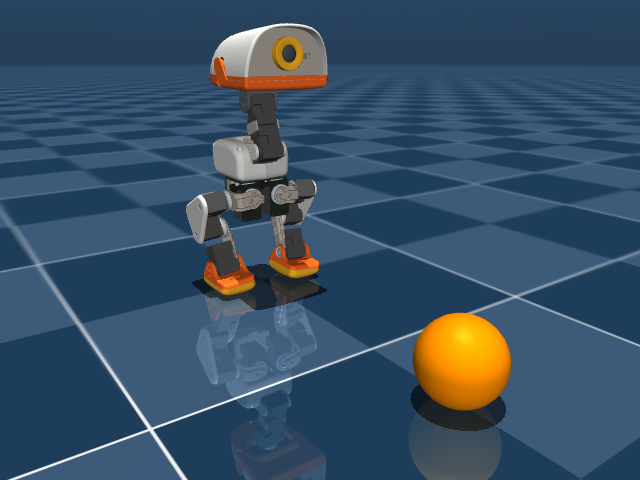

# 足球环境：已核实的起点

**当前 F311 绑定的行走场景没有球；同一上游版本已有可用的带球场景。** 后者的编译、球运动、接触与位置读取已由 T1 做过本地 smoke，尚未接入 F311 的环境绑定、数据记录、足球评估或候选。这不是踢球成功或训练结果。

## 来源与核查范围

- T1 producer：Sol；原请求 `[thread-id]#private-source-id`。
- 结果：`[thread-id]#private-source-id`；原调查 coordination `coord-3aa4a28a-4d98-49eb-ad36-4a0e30759f0e` 已 terminal。
- 官方源码：`pollen-robotics/microduck_rl@29e887ecfbf5d37144759e5a9f8a176dfb83d547`。
- 总交付 Astra 独立核过 checkout 的 exact HEAD 与 clean 状态、下表全部文件 SHA、scene/include 原文、`infer_policy.py` 的球地址/摆球/踢球策略参数入口，以及截图内容。下述编译、运动和接触数值来自 T1 的执行回执；总交付未重复该物理实验。
- 旧 walking 场景、环境配置、公开 receipt 与 captures 均未改写。

## 当前绑定与可复用场景

路径前缀均为 `src/mjlab_microduck/robot/microduck/`。

| 文件 | SHA-256 | 内容 |
|---|---|---|
| scene.xml | `9a85461121ba8273083c482c166f27e143ca386993b3ec8f8d97eb09aa257d31` | F311 当前绑定；只 include robot_groundcontact.xml，无球 |
| robot_groundcontact.xml | `99d23867e46e9d4748ff1398016b850f09fb6cf02a558c0272743b39ce3acf15` | 两个场景共用的机器人，无继续 include |
| scene_ball.xml | `3a6e69457fe68af692823c46da9e081021e3bf4be6c5381018446762acd20265` | include robot_groundcontact.xml 与 ball.xml；当前未绑定 |
| ball.xml | `54a455bf454a9b6167655381df91593bbca86695d8d71e29fb6af69454c7c865` | 直径 70 mm、质量 15 g 的 sphere，freejoint；初始位置 [0.3, 0, 0.035] |

| T1 本地检查 | 当前 scene.xml | 另一个 scene_ball.xml |
|---|---|---|
| MuJoCo 编译 | 16 body / 82 geom / 15 joint，nq=21、nv=20 | 17 body / 83 geom / 16 joint，nq=28、nv=26 |
| 球名称解析 | ball / ball_geom / ball_free 均 -1 | body=16、geom=82、joint=15 |
| 球状态 | 不存在 | qpos[21:28]、qvel[20:26] 可读取 |

T1 使用 Python 3.12.12、MuJoCo 3.10.0、NumPy 2.4.1。给球初始 x 速度 0.5 m/s，运行 50×0.002 s 后，位置由 [0.3,0,0.035] 到 [0.3322326377,≈0,0.0346421283]，状态 finite。另一次浅穿透接触探针中，ball geom 82 与左脚 collision geom 29 的 `mj_forward` 接触距离为 -0.0011177762 m，ncon=2。**手工设置初速度和浅穿透只检查物理通路，不能算鸭鸭踢动了球。** T1 报告 checkout、compile、motion/contact 与 offscreen render 均 exit 0；具体执行上下文保存在上述结果来源中。

## 截图与控制入口

- 本文截图为 T1 的 `mujoco.Renderer` 640×480 本地渲染，PNG SHA-256 `56432b23f095737a3f016f6f5f1d84f1c0f81d283bb1fb0c2386732bb15c220e`；共享副本与原文件字节一致。
- `scripts/infer_policy.py` 在传入 `--kick-left` / `--kick-right` 时选择带球场景，并有球 freejoint 地址、摆球与策略切换入口。这两个参数要求提供相应 ONNX 路径；源码有入口不等于模型文件已经取得或 F311 已运行踢球策略。
- 上游任务代码的球状态可供 critic 使用，不应据此宣称当前 walking actor 能观察球。当前 F311 capture 没有球位姿、球接触或射门结果。

## 尚需完成

足球目标下的版本化环境绑定、球位姿/接触/位移记录、控制或策略候选及可复验评估仍未交付。既有踢球策略模型的可获得性与实际效果尚待核实；不预设必须新训练，也不以本 smoke 冻结“推球 0.2 m / 8 秒”的提案。正式目标、采用与独立评估边界继续由同一总交付记录管理。
