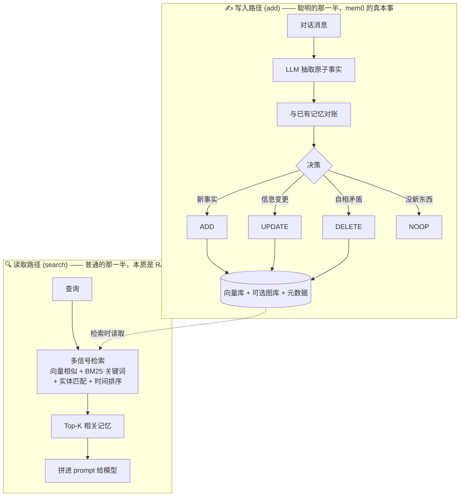
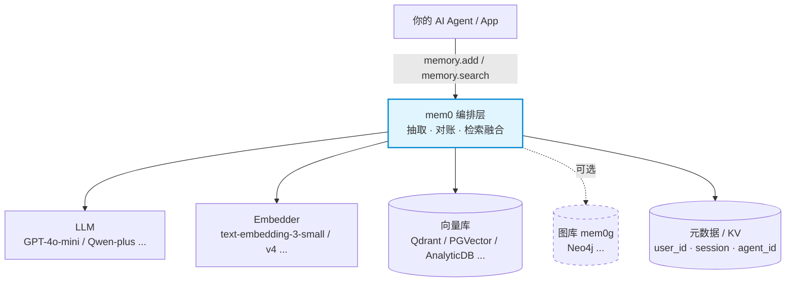

# Mem0 深度学习笔记：AI Agent 的「记忆层」

> **这是什么**：开源项目 mem0 的学习笔记，面向"对项目零背景"的读者，讲清楚 **mem0 是什么、基本原理、以及优劣势判断**。
>
> | | |
> |---|---|
> | **讨论日期** | 2026-06-20 |
> | **证据等级** | 基于 README / 官网 / 阿里云文档（一手，**vendor 自述，未经源码验证**）+ 第三方批评搜索。**benchmark 数字为 vendor 自测，按"方向性参考"对待，见 §6。** |

---

## TL;DR（30 秒看懂）

> **Mem0 = "给对话事实做的 RAG，外加一个会自我对账的写入大脑"。**

它给 AI Agent 加一层**记忆中间件**：不让模型把整段聊天硬塞进上下文，而是用一次额外的 LLM 提取，把对话**蒸馏成结构化事实**存进向量库，下次只把相关的几条翻出来递给模型。

- **真本事**：① 写读分离的架构方向正确；② "提取-对账"写入逻辑（你换工作了 → 它去 UPDATE 而非新增矛盾记录）是它真正卖的东西；③ provider 全可插拔，工程整洁——这也是云厂商爱它的原因。
- **水分与命门**：① benchmark 数字虚高且不可直接复现；② "省 90% token"只算检索侧、藏了提取成本；③ **写入路径每条消息一次 LLM 调用且会出错——错记忆会二次污染后续检索**；④ ADD-only 只增不删，存储膨胀、检索退化；⑤ 有真实生产翻车案例。
- **核心 tradeoff**：用"写时一次 LLM 提取成本 + 概率性正确"换"读时 context 瘦身 + 跨会话持久记忆"。**读写比越高越划算，反之不划算。**

---

## 一、Mem0 是什么

**一句话**：mem0（读作 "mem-zero"）是给 AI Agent / App 用的**记忆层（memory layer）**，让 AI 跨会话、跨 Agent 记住用户，同时不撑爆上下文。

**打个比方**：它像一个**秘书**——边听边记笔记、笔记过时了就改、用的时候只翻出相关那一页递给你，而不是把整段录音重放一遍。

**它解决的问题**，本质是两个极端之间的中庸：

```
全记（把整段历史塞进上下文）          mem0（记结构化事实，按需召回）          全忘（无状态，每次从零）
   ├ 贵、慢、撞上下文上限                 ├ 像人脑：记的不是录音带，               ├ 便宜、简单
   └ 上下文越长，信噪比越差               └  而是一组会被不断改写的事实             └ 但 Agent 永远"失忆"
```

mem0 走中间这条路。**这就是它全部的设计哲学。**

---

## 二、核心原理：只有两条管道

理解 mem0，抓住这张图就懂了 80%——整个系统只有**写入**和**读取**两条管道：



### 写路径（add）——真正的创新在这里

1. 对话消息进来；
2. **LLM 抽取**出一条条原子"事实"（fact）；
3. **与已有记忆对账**，做出四选一决策：
   - `ADD`（新事实）/ `UPDATE`（信息变了，如换工作）/ `DELETE`（自相矛盾）/ `NOOP`（没新增）；
4. 写进向量库（+ 可选图库 + 元数据如 `user_id` / `session` / `agent_id`）。

> **关键认知**：mem0 真正的创新**不在存储**（向量库 + RAG 是大路货），而在写入侧那个**"抽取事实 + 和旧记忆对账"**的步骤。其他全是水管。

### 读路径（search）——本质就是 RAG

查询向量化 → **多信号检索**（语义向量 + BM25 关键词 + 实体匹配 + 时间排序，并行打分融合）→ 取 Top-K → 拼进 prompt。多信号融合比纯向量召回更鲁棒（纯 embedding 会漏掉精确关键词/实体匹配）。

> ⚠️ **版本演进提醒（重要，影响成本判断）**：
> - **论文版（arXiv:2504.19413）/ 阿里云落地版**用的是经典的**全量对账**（ADD/UPDATE/DELETE/NOOP）；
> - **当前 GitHub README** 提到最新版正转向 **"single-pass ADD-only"单次抽取**——一次 LLM 调用、只追加不覆盖，用准确性换速度/成本。
>
> 概念核心还是"抽取 + 召回"，但实现在迭代。**本文涉及"写入成本/正确性"的判断同时覆盖两个版本，具体差异需源码 confirm（见 §8）。**

---

## 三、架构解剖：它是「层」，不是「库」

mem0 没有去造一个数据库，而是造了一个**架在现有数据库之上的、可插拔的薄层**。这是它最漂亮的设计抉择。



| 部件 | 干什么 | 默认实现 / 可替换 |
|------|--------|------|
| **LLM** | 写入时抽事实、判断冲突；读取一般不用 | GPT 系列 / 可换 Qwen 等 |
| **Embedder** | 把文本变向量 | text-embedding-3-small / 可换 |
| **向量库** | 语义存储与检索（**核心承重**） | Qdrant / PGVector / AnalyticDB… 几十种可插拔 |
| **图库（mem0g）** | 存实体之间的关系（**可选**） | Neo4j 等 |
| **K-V / 元数据** | 按 `user_id` / `session` 过滤；三层 scope：User / Session / Agent | — |
| **API** | `memory.add(messages, user_id)` / `memory.search(query, ...)` | Python + TS SDK |

### 活证据：阿里云服务化 = "可插拔"的最佳证明

阿里云基于 mem0 做服务化时，**根本没动 mem0 框架，只是把零件换成自家的**：

```python
config = {
    "llm":          {"provider": "bailian",   "config": {"model": "qwen-plus"}},
    "embedder":     {"provider": "bailian",   "config": {"model": "text-embedding-v4", "embedding_dims": 1536}},
    "vector_store": {"provider": "aliyun_adb","config": {"host": "...", "database": "mem0"}},
}
```

LLM 换 Qwen-plus、Embedder 换 text-embedding-v4（1536 维）、向量库换 AnalyticDB for MySQL（余弦相似度）。

> **架构师视角**：云厂商爱 mem0，正因为它是个能让你顺便买它"数据库 + 模型"的**漏斗**。这是"做层"的甜蜜——但也是软肋（见 §5.8）。
> 另一个硬证据：**阿里云落地版是纯向量、没上图库**。这告诉你生产里真正承重的是哪块（见 §5.6）。

---

## 四、优势（站得住的真本事）

1. **设计品味好在"做层，不做库"**。可插拔抽象干净，上层 `add()/search()` 接口不变即可切换全部后端——阿里云案例是活证据。
2. **"提取-检索"分离方向正确**，符合记忆系统第一性原理：记忆的价值在"压缩 + 按需召回"，不在堆历史。
3. **写入侧的"对账逻辑"是真创新**：自动处理 UPDATE/DELETE 冲突，避免记忆库里堆满自相矛盾的记录。这是 mem0 区别于"普通 RAG"的核心。
4. **多信号融合检索 > 纯向量召回**：补上了关键词与实体的精确匹配，是实战经验。
5. **持久、结构化、跨会话/跨 Agent 的状态**——这是**再长的上下文也给不了**的价值（见 §5.5 的判断）。

---

## 五、劣势与风险（必须戳破的部分）

### 5.1 benchmark 数字虚高，且不可直接复现 🔴
招牌数字（LoCoMo ~91.6–92.5、LongMemEval ~94.4–94.8、"比 OpenAI 记忆好 26%"、"省 90% token"）**全是 mem0 自测**。专门搜独立第三方评测，结果"基本都是 mem0 自家声明与转载，缺独立复现"。同赛道的 Zep 曾宣称 LoCoMo 84%，被独立复现只有 **58.44%**——这是整个记忆赛道的系统性"自报虚高"病。**结论：数字只能当方向性参考，不能当采购依据。**

### 5.2 成本账藏了一半 🔴
"省 90% token"只算**检索侧**，没算**提取 pipeline 自己烧的 LLM 调用**（100 轮对话可能多出约 200 次 LLM call）。第三方实测**净节省约 40%**。**写多读少的场景，提取成本可能反而亏。**

### 5.3 写入路径的正确性——最大的、没人营销的命门 🔴
写入每条消息都要一次 LLM 调用，**且会出错**：抽错、错误合并、甚至幻觉出一条不存在的"事实"。**一条错记忆比没记忆更糟——它会悄悄污染之后所有检索。** 更狠的是**二次污染（compounding error）**：错记忆被检索出来后，会进入下一轮"和旧记忆对账"的 LLM 输入，扭曲后续提取决策——误差是**放大**而非仅线性累积。讽刺的是 mem0 主打医疗/心理等高风险垂直，恰恰是最不该信任自动写入的场景。

### 5.4 ADD-only 模式的存储膨胀 🔴
最新算法转向"只追加不覆盖"（single-pass ADD-only），代价是记忆库随交互持续累积、膨胀，**衰减 / 去重 / 清理的全部负担被甩给检索层**。大规模、长周期部署下，检索质量可能随记忆数量增长而退化。当前 README 未提及任何 TTL / 衰减评分 / 压缩机制——需源码 confirm（→ §8）。

### 5.5 "省 token"卖点会随长上下文 + prompt 缓存变便宜而贬值 🟡
mem0 真正耐打的价值不是省钱，而是**结构化、可查询、跨会话的持久状态**。判断一个项目要看它哪个价值"长上下文杀不死"——省 token 不是，持久结构化记忆才是。

### 5.6 图库（mem0g）"听起来强"但生产里常被砍 🟡
README 仅"implied through entity linking"，**阿里云落地版纯向量、没上图**。图能力的真实成熟度存疑，列入待验证（§8）。

### 5.7 生产稳定性有真实翻车案例 🟡
Scira AI 公开从 mem0 切走，理由：延迟"super bad"、索引不可靠、context recall 失败。单点样本，但是真实信号——**它不是即插即用的银弹**。

### 5.8 商业软肋：价值会被下层数据库主人截胡 🟡
"做层"的代价：mem0 公司的价值能被它依赖的数据库/模型厂商（如 ADB / Qwen）顺势吃掉。技术上是优点，商业上是风险。

---

## 六、证据分级：挤掉营销水分（claim ledger）

| Claim | 来源 | 裁定 |
|---|---|---|
| LoCoMo 91.6 / LongMemEval 94.8 等 | mem0 自测 | ⚠️ **方向性参考**。managed 平台含专有优化，开源 SDK 拿不到同样数字 |
| "省 90% token" | mem0 官网 | ⚠️ 只算检索侧；含提取后净值约 40% |
| "比 OpenAI 记忆好 26%" | mem0 博客 | ⚠️ 拿别人黑盒 vs 自家优化版，对象适用性存疑 |
| provider 可插拔 | README + 阿里云案例 | ✅ **可信**（阿里云换全套零件是活证据） |
| "抽取式记忆比全上下文省 token" | 常识 + 自测 | ✅ 方向正确（具体比例由你的数据形态决定） |
| graph memory / mem0g 能力 | README "implied" | ❓ **存疑**，落地版未采用，待源码验证 |

---

## 七、场景适用性判断

| 场景 | 适配度 | 为什么 |
|------|--------|--------|
| 个人助理 / 长期陪伴 / coaching | ✅ **甜区** | 多会话、事实会变（偏好/工作/状态），UPDATE 逻辑在此才值钱 |
| 客服 / CRM（回头客） | ✅ 好 | 跨会话记住用户 = 直接体验提升 |
| 文档型 RAG / 知识库问答 | ❌ 用错地方 | 那是普通 RAG，不是 mem0 的活 |
| 一次性问答 / 单会话短任务 | ❌ 过度设计 | 直接塞上下文更简单更准 |
| 写极频繁的高吞吐场景 | ⚠️ 警惕 | 每条消息触发 LLM 提取 = 调用成本爆炸 + add 同步成瓶颈 |
| 医疗 / 金融等高风险 | ⚠️ 谨慎 | 自动抽取的错记忆有真实危害，需人审 + 可追溯 |

**一句话**：读多写少、事实会变、跨会话个性化 = 甜区；写极频、强一致/审计、极低延迟、成本极敏感 = 慎用。

---

## 八、待验证清单（下一步源码级 teardown 要 confirm 的点）

本文止步于 README / 官网 / 文档级理解。若要从"看懂"进到"看透"，需 clone 源码验证：

- [ ] "single-pass ADD-only extraction" 到底几次 LLM 调用？与论文版全量对账的真实差异？
- [ ] 多信号融合检索的**打分/融合公式**具体怎么算？
- [ ] graph memory（mem0g）是不是真的图存储，还是仅 entity linking 包装？
- [ ] 写入路径的错误处理 / 幂等 / 冲突消解的代码实现与可靠性。
- [ ] 提取 pipeline 的真实 token / 延迟成本量化。
- [ ] ADD-only 模式下是否有 TTL / 衰减评分 / 记忆压缩或清理机制？无衰减 → 量化长周期部署的存储膨胀与检索退化风险。
- [ ] 多租户隔离的粒度与安全性：`user_id` / `agent_id` / `metadata` 过滤能否被 `search` 跨租户泄漏？向量库的隔离是逻辑过滤还是物理分片？

---

## 附录 A：mem0 的架构定位——它和数据库中间件 DDM 的异同

> 背景：一个常被问到的问题——"mem0 像 AI 上下文记忆的中间件？和分布式数据库中间件 DDM 什么关系？能放在 DDM 那一层吗？"

### A.1 直觉对在哪：同属"访问中间件"范式

"mem0 = AI 上下文记忆中间件"定性精准。而且 mem0 和 DDM 是**同一种架构物种**——**access middleware（访问中间件）**：架在应用与存储之间，对上统一抽象、对下编排多后端、对应用透明、provider 可插拔。

- **DDM**：应用像操作单机库一样操作分布式库，不关心分片数（透明）；后端 = 多个 MySQL 实例。
- **mem0**：agent 用 `add()/search()`，不关心底层是 Qdrant 还是 ADB（透明）；后端 = 向量库/图库/LLM。

"像"是真的——范式骨架同构，所以两者都走"可插拔 + 对上透明"。

### A.2 本质正交：同构的是"形"，正交的是"质"

| 维度 | DDM（数据分片中间件） | mem0（语义记忆中间件） |
|---|---|---|
| 解决的瓶颈 | **物理容量/性能**：单库装不下 | **认知容量**：上下文记不住 |
| 抽象的轴 | **水平扩展**（数据切片散到多库） | **语义压缩**（长对话蒸馏成事实） |
| 处理的数据 | 结构化数据，精确 | 对话 → 提取的事实，概率性 |
| 核心操作 | SQL 路由、分库分表、读写分离 | LLM 提取、记忆对账、多信号检索 |
| 确定性 | **确定性**（SQL 进 SQL 出，无损） | **概率性**（LLM 会抽错，检索是相似度） |
| 对数据的态度 | **搬运工**：透传，不改语义 | **加工厂**：LLM 提取/改写，重塑数据 |
| 一致性 | 强一致（分布式事务） | 最终一致 + 概率性（无事务） |
| 栈中位置 | 数据访问层（低） | 应用/语义层（高） |

**点透**：DDM 是**搬运工**（透传+路由，不理解内容），mem0 是**加工厂**（理解+提取+改写）。最锋利那条线——**DDM 不需要理解你的数据，mem0 必须读懂你的对话**：DDM 把一行路由到分片 3，不关心它什么意思；mem0 把"我换工作了"提取成事实去 UPDATE 旧记录，必须读懂语义。这条线划开"数据中间件"与"认知中间件"。

### A.3 能放在 DDM 这一层吗？——不能替换，但能叠放

- **当同一类东西 / 互相替换**：❌ 职责正交，混为一谈 = 架构错位。
- **调用栈位置**：不是同一层，而是**上下游两层**，正确姿势是 stack（叠放）：

```
   Agent / App
       │  add() / search()
       ▼
  ┌─ mem0 ── 语义记忆层（认知中间件）
  │   LLM 提取 · 记忆对账 · 多信号检索编排
       │  存 / 取（向量 + 元数据）
       ▼
  ┌─ 向量库 / 图库 / 元数据库 ── 存储层
       │  （数据量大到要分片时）
       ▼
  ┌─ DDM ── 数据分片层（数据中间件）
  │   分库分表 · 读写分离 · SQL 路由
       │
       ▼
   多个物理 DB 实例
```

mem0 在上、DDM 在下，**互补两层，不是竞争同一层**。mem0 底层数据大到单库扛不住时，DDM（或存储自带分片）垫在下面解决扩展。

**实践 caveat（接 §3 阿里云方案）**：向量库（Qdrant 等）通常自带分布式分片，不一定需要 DDM（DDM 主要面向 MySQL 协议关系库）。阿里云用 **AnalyticDB for MySQL** 做向量库，ADB 本身就是分布式 MPP、**分片内建**——那个栈里"DDM 该干的活"已被 ADB 吸收，无需再叠 DDM。对 mem0 而言它只要"一个能扩展的后端"，扩展由谁提供对它透明。

### A.4 一个能带走的心智模型

按操作的**抽象层级**排谱系：

| 抽象层 | 中间件 | 操作对象 | 类型 |
|---|---|---|---|
| 认知（高） | **mem0** | 事实 / 对账 / 召回 | 认知记忆访问中间件 |
| 语义（中） | 向量库 | embedding / 相似度 | 语义向量存储中间件 |
| 数据（低） | DDM / Vitess / ShardingSphere | 行 / 列 / SQL | 关系数据访问中间件 |

它们沿"**数据 → 语义 → 认知**"阶梯向上，mem0 站最上一级。**类比成立**因共享 access-middleware 范式骨架；**不能划等号**因站在不同台阶。

> **总结**：mem0 是中间件，和 DDM 同"物种"（access middleware）、不同"亚种"——DDM 管**数据怎么放得下**（物理扩展），mem0 管**上下文怎么记得住**（语义压缩）。架构上不是把 mem0 塞进 DDM 那层，而是 mem0 **叠在** DDM 之上，各管一段。

> DDM 定义来源：[华为云 · 分布式数据库中间件 DDM](https://support.huaweicloud.com/productdesc-ddm/ddm_01_0001.html)

---

## 信息源

- [GitHub · mem0ai/mem0](https://github.com/mem0ai/mem0)
- [mem0.ai 官网](https://mem0.ai/)
- [阿里云 · AnalyticDB for MySQL × mem0 实践指南](https://www.alibabacloud.com/help/zh/analyticdb/analyticdb-for-mysql/analyticdb-for-mysql-mem0-practice-guide)
- [mem0 论文 · arXiv:2504.19413](https://arxiv.org/abs/2504.19413)
- [Zep LoCoMo 复现争议 · getzep/zep-papers#5](https://github.com/getzep/zep-papers/issues/5)
- [VentureBeat 报道](https://venturebeat.com/ai/mem0s-scalable-memory-promises-more-reliable-ai-agents-that-remembers-context-across-lengthy-conversations)
- [Mem0 三 scope 成本分析 · CrabTalk](https://openwalrus.xyz/blog/mem0-memory-architecture)
- [InfoWorld 报道](https://www.infoworld.com/article/4026560/mem0-an-open-source-memory-layer-for-llm-applications-and-ai-agents.html)

> **benchmark 数字均为 mem0 自测，缺独立第三方复现；本文已按"方向性参考"处理。**

---

*mem0 技术学习笔记 · 2026-06。示意图为 Mermaid 源码，可在 GitHub / VS Code / Typora 等渲染。*
