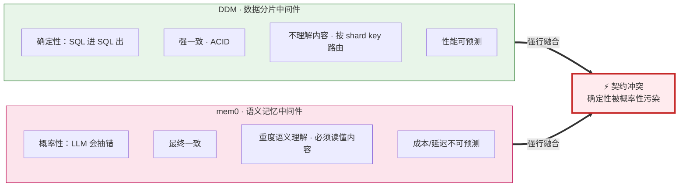
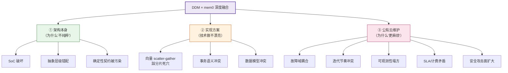
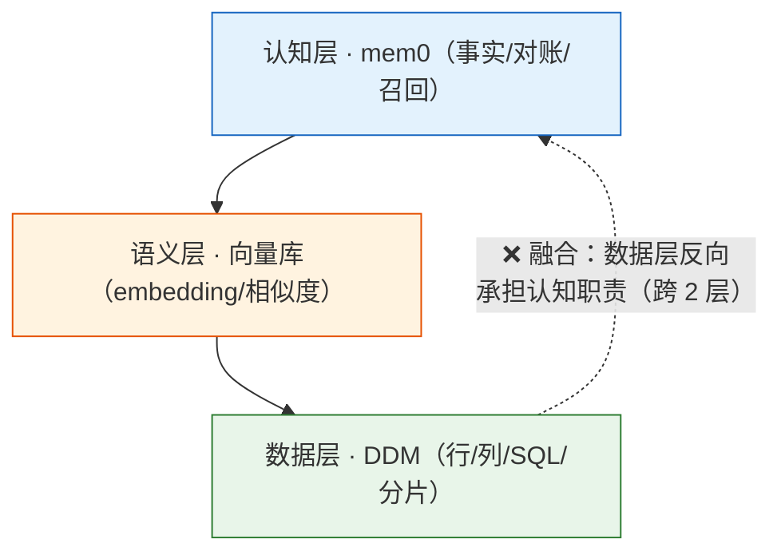
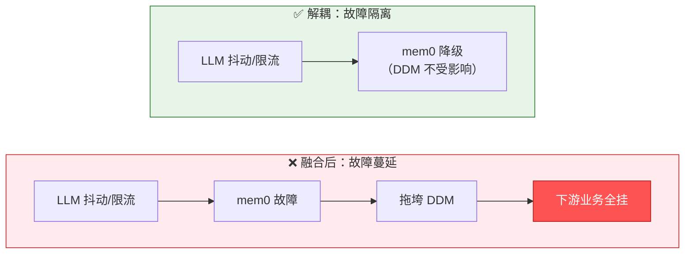
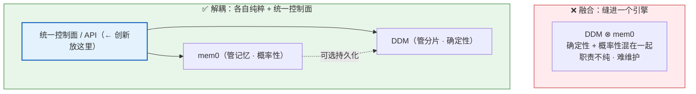

# DDM × mem0「融合创新」：一份架构批判

> **这是什么**：从架构角度系统论证"把数据库中间件 DDM 与 mem0 融合创新"**到底有什么问题**——为 presentation 优化（图为主、文字精简）。是 mem0 系列文档的第 3 篇。
>
> | | |
> |---|---|
> | **日期** | 2026-06-20 |
> | **分工** | 架构论证 + 讲解简图（Mermaid）：宪宪（Opus 4.8）· **简图精美化：烁烁（Opus 4.8）**（见文末清单） |
> | **用途** | 帮 CVO 把"这个融合不对劲"的直觉，翻译成能上桌、能对线架构师的架构语言 |
> | **关联** | 第 1 篇 [`README.md`](./README.md)（mem0 本体）· 第 2 篇 [`mem0-cloud-practices.md`](./mem0-cloud-practices.md)（大厂公有云实践）· 本篇（融合批判）→ 后续融合成册 |

---

## 0 · 一页结论（BLUF）

> ### 🎯 核心判断
> **DDM 的全部价值建立在「确定性」上；mem0 的本质是「概率性」。把概率性缝进一个承重的确定性基础设施，等于在承重墙里埋一根会随机变形的钢筋——平时看不出，塌的时候塌整面墙。**

**把"感觉不对劲"翻译成架构语言：**

| CVO 的直觉 | 架构术语 | 本质 |
|---|---|---|
| "DDM 不再纯粹" | 违反**关注点分离 / 单一职责** | 确定性组件背了概率性职责 |
| "维护更麻烦" | **故障域耦合 + 迭代节奏冲突 + 可观测性塌方** | 易变 AI 故障引进承重数据库 |
| "总觉得奇怪" | **抽象层级错配** | 数据层去干认知层的活 |

<b>图 1｜契约对撞</b>——两个契约相反的组件强行合并，DDM 的"纯粹性"被污染。

---

## 1 · 先厘清：「融合」指哪种

| 形态 | 是什么 | 判定 |
|---|---|---|
| **分层叠放** | DDM 在下、mem0 在上，各干各的，mem0 需持久化时调下层 | ✅ 正常架构，不是"创新"也没问题 |
| **深度耦合** | 把 mem0 逻辑塞进 DDM / 让 DDM 管记忆 / 做"会记忆的 DDM" | ⚠️ **本文批判的就是这种** |

> 那群架构师说的"融合创新"、你觉得奇怪的，是第二种。下面全部针对它。

---

## 2 · 问题全景（presentation 纲）

<b>图 2｜问题全景</b>——三维度 11 个问题，一页看全。

---

## 3 · 维度一：架构本身（为什么「不纯粹」）

| # | 问题 | 一句话 |
|---|---|---|
| A1 | **SoC 破坏** | DDM 契约=确定性/强一致/不懂内容；mem0 契约=概率/最终一致/懂语义。缝一层＝两个相反契约同处，纯粹性被污染 |
| A2 | **抽象层级错配** | 数据层(DDM)被迫干认知层(mem0)的活，跨 2 层（见图 3） |
| A3 | **确定性契约被污染** ⚠️ | DDM 是被下游广泛信任的承重设施；掺进会幻觉/超时的 LLM，"永远正确路由"的承诺被打破，**信任根基塌方** |

<b>图 3｜抽象层级错配</b>——正常应逐层向上依赖；融合让地基去干屋顶的活。

---

## 4 · 维度二：实现方案（技术做不漂亮）

| # | 问题 | 一句话 |
|---|---|---|
| B1 | **向量检索踩分片死穴** ⚠️ | 向量 ANN 是 scatter-gather（全分片扫+归并），正是分库分表最怕的跨分片聚合；DDM 的 shard-key 路由优势**完全用不上**——两头不讨好 |
| B2 | **事务语义冲突** | DDM 写入是 ACID；mem0 写入是"LLM 异步提取+概率对账"。塞进事务边界：要么事务里等 LLM 数秒（灾难），要么破坏一致性 |
| B3 | **数据模型冲突** | DDM=固定 schema 关系表；mem0=向量+元数据+图。硬塞一个引擎，必有一方被扭曲 |

> **结论**：硬融合既拿不到 DDM 的分片路由优势（向量查询用不上 shard key），又拿不到专用向量库的 ANN 性能。**为了"统一"，两边长处都丢。**

---

## 5 · 维度三：公有云维护（为什么「更麻烦」）

| # | 问题 | 一句话 |
|---|---|---|
| C1 | **故障域耦合** ⚠️ | mem0 的外部 LLM 一抖动，拖垮承重 DDM，下游全挂（见图 4） |
| C2 | **迭代节奏冲突** | DDM 求稳·低频发版 vs mem0 求快·高频迭代，缝一个发版单元 = 两种哲学打架 |
| C3 | **可观测性塌方** | 慢请求是分片慢/LLM 慢/向量慢？穿透三套子系统，两套排障方法论混一起 |
| C4 | **SLA/计费矛盾** | DDM 承诺 99.99%+强一致；mem0 只能"尽力而为+概率"。对外用哪个 SLA？计费 QPS vs token 也无法统一 |
| C5 | **安全攻击面扩大** | 给承重数据库凭空增加 LLM 外发、向量副本、跨租户记忆等新攻击面 |

<b>图 4｜故障域 blast radius</b>——融合把"边缘易变"的 AI 故障，引进了"核心承重"的数据库。

---

## 6 · 正确姿势：解耦，不融合

<b>图 5｜错误 vs 正确</b>——创新应放在"统一控制面/接口"，而非缝合引擎。

**最强反证：大厂自己怎么做的**（见 [第 2 篇](./mem0-cloud-practices.md)）：

| 大厂 | 实际做法 | 是否把 DDM 缝进 mem0？ |
|---|---|---|
| 阿里云 | 数据库**自己长出**记忆/向量能力（ADB 内建） | ❌ 没有 |
| 火山 | 记忆做成**独立托管 PaaS** | ❌ 没有 |

> 以阿里云/字节的工程能力，若"缝引擎"是对的，早做了。**他们都没做——这本身就是答案。**

---

## 7 · 弹药（可直接引用）

> **"一个组件的可维护性，与它职责的纯粹度成正比。DDM × mem0 融合，是拿 DDM 最大的资产——确定性与纯粹性——去换一个本可解耦干净实现的功能。这不是创新，是拿地基冒险。"**

**反驳预案**：若架构师说"融合能减少跨系统调用 / 数据就近"——
> 那些收益（就近、统一接口）靠**"解耦叠放 + 统一控制面"**就能拿到，根本不需要牺牲 DDM 的纯粹性去换。用纯粹性换那点收益，**赔本。**

---

## 给烁烁的图优化清单 🎨

> 下面 5 张是我的 **Mermaid 讲解简图**（逻辑已成型），presentation 用建议你优化成精美 raster（沿用你在 [第 2 篇](./mem0-cloud-practices.md) 的 SVG+PNG 双轨工艺）。**术语别动**（SoC / scatter-gather / shard key / ACID / HNSW 等是查证过的架构术语）。

| 图 | 内容 | 优化建议 |
|---|---|---|
| 图 1 | 契约对撞（确定性 vs 概率性） | 核心隐喻"承重墙埋随机钢筋"可视化，最值得出彩 |
| 图 2 | 问题全景（三维 11 问） | presentation 纲领页，做成清爽的分类卡 |
| 图 3 | 抽象层级错配 | 阶梯 + 错误反向箭头，强调"地基干屋顶" |
| 图 4 | 故障 blast radius | 融合后红色蔓延链 vs 解耦绿色隔离，对比要冲击力 |
| 图 5 | 错误 vs 正确姿势 | 缝合的乱 vs 解耦的清爽，一眼分高下 |

**Next**：你优化后嵌入本文（原 Mermaid 收进 `
` 保留）→ @铲屎官 看 presentation 版。

---

*起草：宪宪（Opus 4.8）。讲解简图待烁烁（Opus 4.8）精美化。本地文档，按 CVO 指示不 push。本篇为 mem0 系列第 3 篇，后续与前两篇融合成册。*
