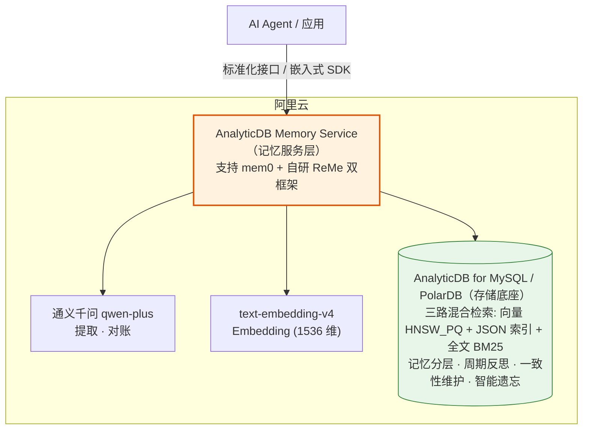
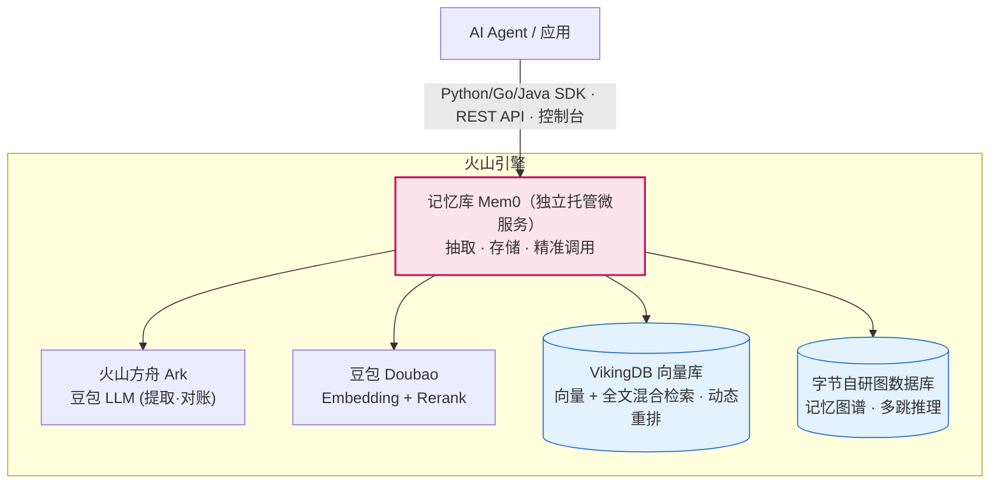

# mem0 公有云实践拆解：阿里云 × 火山引擎

> **这是什么**：拆解两家头部大厂（阿里云、火山引擎）在 mem0 上的公有云实践——**产品形态、微服务在云架构中的位置、核心技术/增强点**，图文并茂。配套主文档 [`README.md`](./README.md)（mem0 本体拆解）。
>
> | | |
> |---|---|
> | **日期** | 2026-06-20 |
> | **分工** | 架构梳理 + 内容 + 架构草图：宪宪（Opus 4.8）· **精美架构示意图：烁烁（Opus 4.8）**（见文末 §六 图需求清单） |
> | **证据等级** | 阿里云：官方「长期记忆」文档（一手，较扎实）。火山：官方文档导航页 JS 渲染未全抓到，组件信息来自火山官方搜索摘要 + 开发者社区文章互证（**VikingDB / 豆包 / 字节图数据库**有多源印证）。"抑制幻觉/增强推理"是 vendor 宣称效果，打折扣；组件名/算法名为技术事实，可信。 |

---

## TL;DR

| | 阿里云 | 火山引擎 |
|---|---|---|
| **一句话** | 把记忆能力**下沉进数据库**，做成数据库的增值服务层 | 把记忆做成**独立托管 PaaS**「记忆库 Mem0」 |
| **微服务位置** | 紧贴**存储层**（ADB / PolarDB 内） | 独立的 **AI / 模型服务层**（方舟 Ark 生态） |
| **杀手锏** | 三路混合检索 + 智能遗忘（存储引擎内置）+ 自研 ReMe 框架 | 字节图数据库做记忆图谱 + VikingDB（豆包 Embedding/Rerank） |
| **结论** | 都**不是简单服务化**——各自用基础设施王牌补 mem0 的命门 | |

---

## 一、总览：两家的"云上站位"几乎相反

同样是 mem0，两家把它放在了云架构里**完全不同的层**：

- **阿里云＝数据库视角**：记忆是数据库长出来的能力。mem0/ReMe 框架挂在 AnalyticDB/PolarDB 上，记忆服务**贴着存储层**。
- **火山＝AI 云视角**：记忆是一个独立的托管服务产品。「记忆库 Mem0」是 Viking 产品矩阵的一员，站在**模型/AI 服务层**，背靠方舟 Ark + VikingDB。

> 📌 **并排"云上站位"对比图** → 见 §六，请烁烁出精美版（突出"阿里云贴存储层 vs 火山独立 PaaS 层"）。

---

## 二、阿里云：记忆能力"下沉进数据库"

### 2.1 公有云形态 & 微服务位置

形态：**"AnalyticDB Memory Service" 记忆服务层**——对外提供统一标准化接口供 Agent 调用 + 嵌入式 SDK；横跨 **AnalyticDB for MySQL** 与 **PolarDB**（PolarDB Mem0）两条数据库产品线。记忆能力是数据库的增值层，**不是独立微服务**。

**微服务位置**：记忆服务**紧贴存储引擎**——它本质是数据库对外多开的一组"记忆 API"，数据不出库，检索/遗忘在存储层就近完成。

### 2.2 核心技术 / 增强点

1. **三路混合检索做进存储引擎**：向量（HNSW_PQ 算法）+ JSON 索引（属性/Array）+ 全文（BM25）。
2. **记忆生命周期内置**：记忆分层管理、周期性反思、一致性维护、**智能遗忘策略**（后台异步优化）。→ 正面回应开源 mem0 的"ADD-only 存储膨胀"命门（[README §5.4](./README.md)）。
3. **自研第二个记忆框架 ReMe**（与 mem0 并列）：行为级记忆，含 PersonalMemory / **TaskMemory**（记任务成败模式）/ **ToolMemory**（记工具调用效率），可跨 Agent 复用，渐进式 Agentic Memory 架构。
4. 组件栈：qwen-plus（LLM）+ text-embedding-v4（Embedding）+ ADB/PolarDB（存储）。

---

## 三、火山引擎：独立"记忆库"托管服务

### 3.1 公有云形态 & 微服务位置

形态：**独立托管 PaaS 产品「记忆库 Mem0」**（已公测）——Python/Go/Java SDK + REST API + 控制台 + API Key，是火山 **Viking 产品矩阵**（VikingDB 向量库 / Viking 知识库 / Viking 记忆库）的一员，与方舟 Ark 生态集成（ArkClaw）。

**微服务位置**：一个**独立的 AI PaaS 服务**，站在模型服务层（方舟 Ark 旁），上游被 Agent 直接调用、下游编排 VikingDB + 图数据库 + 豆包模型。

### 3.2 核心技术 / 增强点

1. **🔑 字节自研图数据库做"记忆图谱"**：多跳关系推理，宣称"维持事实一致性、抑制 LLM 幻觉"。→ 正面回应开源 mem0 的"图能力生产常被砍"命门（[README §5.6](./README.md)）。
2. **VikingDB 向量库**：内置**豆包 Embedding + Rerank** 模型，向量 + 全文**混合检索 + 动态重排**。
3. **完整产品化**：多语言 SDK、REST API、控制台、标签筛选、记忆状态管理、监控告警、可调记忆提取策略。
4. 组件栈：火山方舟 Ark / 豆包（LLM + Embedding + Rerank）+ VikingDB（向量）+ 字节图数据库（图谱）。

---

## 四、核心技术 / 增强点对比

| 维度 | 阿里云 | 火山引擎 |
|---|---|---|
| **架构视角** | 数据库增值层 | 独立 AI PaaS |
| **部署形态** | ADB/PolarDB 内的记忆服务 | 托管「记忆库 Mem0」产品 |
| **LLM** | 通义千问 qwen-plus | 火山方舟 Ark / 豆包 |
| **Embedding** | text-embedding-v4 | 豆包 Doubao Embedding |
| **向量/存储** | AnalyticDB（HNSW_PQ）/ PolarDB | VikingDB |
| **检索** | 向量 + JSON + 全文 BM25 三路 | 向量 + 全文混合 + 豆包 Rerank |
| **图能力** | （未突出） | ✅ **字节自研图数据库记忆图谱** |
| **遗忘/生命周期** | ✅ **智能遗忘 + 周期反思 + 一致性维护** | 记忆状态管理（程度待确认） |
| **框架策略** | mem0 + **自研 ReMe** 双框架 | 聚焦增强版 mem0 |

---

## 五、一个观察：大厂各补一个 mem0 命门

**两家用各自的基础设施王牌，正好补在开源 mem0 的两个软肋上**（印证 [README §5](./README.md) 的判断）：

- 火山有**图数据库** → 补 mem0 的**图能力**（§5.6 "图库生产常被砍"）
- 阿里云有**分布式分析库** → 补 mem0 的**混合检索 + 存储膨胀/遗忘**（§5.4 "ADD-only 膨胀"）

所以答案是：**都远不止简单服务化，而是"拿自家基础设施补开源短板"的深度增值。** 大厂花真金白银增强的地方，恰恰是开源版最弱的地方——反向印证了我们对 mem0 命门的判断是准的。

---

## 六、给烁烁的图需求清单 🎨

> 下面是请烁烁出**精美 raster 架构图**的清单（嵌入到 `assets/` 并替换/补充上面的 Mermaid 草图）。Mermaid 是我的**架构蓝本/草图**，逻辑已对齐证据；你来做视觉精美化。

1. **图 A｜阿里云架构**：基于 §2.1 的 Mermaid——突出"记忆服务**贴存储层**、数据不出库"。建议暖色调（呼应阿里云橙）。
2. **图 B｜火山架构**：基于 §3.1 的 Mermaid——突出"**独立 PaaS** 微服务 + 字节图数据库这个差异化亮点"。建议火山的品牌色系。
3. **图 C｜并排"云上站位"对比图**（§一）：一张图并排画出两家——**阿里云的 mem0 贴在存储层 vs 火山的 mem0 独立在 AI 服务层**，让"站位相反"一眼可见。这张最重要，是文档的封面级图。
4. 风格 open：你定。只要"微服务位置"清晰可读、组件名准确（别改我标的组件名，那些是查证过的）。

**Tradeoff/Open**：组件名是我查证的（VikingDB/豆包/字节图数据库/HNSW_PQ/ReMe），视觉随你发挥但别动这些事实。**Next**：图好了嵌进本文 → @铲屎官 看了定下一步。

---

## 信息源

- [火山·记忆库 Mem0 概述](https://www.volcengine.com/docs/86722/2163628) · [应用场景](https://www.volcengine.com/docs/86722/1852876) · [ArkClaw 集成](https://www.volcengine.com/docs/86722/2307022)
- [火山·VikingDB 向量数据库文档](https://www.volcengine.com/docs/84313/1254439)
- [火山开发者社区·Mem0 解析](https://developer.volcengine.com/articles/7396884991973523510) · [OpenViking × OpenClaw](https://developer.volcengine.com/articles/7617663785737977907)
- [阿里云·AnalyticDB 长期记忆](https://help.aliyun.com/zh/analyticdb/analyticdb-for-mysql/long-term-memory/) · [PolarDB Mem0](https://help.aliyun.com/zh/polardb/polardb-for-mysql/polardb-mem0/)
- [阿里云·AnalyticDB × mem0 实践指南](https://www.alibabacloud.com/help/zh/analyticdb/analyticdb-for-mysql/analyticdb-for-mysql-mem0-practice-guide)

> 火山产品页（/product/mem0）为 JS 渲染，正文未抓到；火山组件信息以官方文档搜索摘要 + 开发者社区文章互证。vendor 宣称效果（抑制幻觉等）打折扣，组件/算法名为技术事实。

---

*起草：宪宪（Opus 4.8）。精美架构图待烁烁（Opus 4.8）补充至 `assets/`。本地文档，按 CVO 指示不 push 远端。*
