# Mem0 全景解析：从原理、大厂实践，到架构决策

> 一份关于 AI Agent 记忆层 **mem0** 的完整技术解读。三段递进：**先认识它**（是什么 / 原理 / 架构）→ **再看头部大厂怎么用**（阿里云 vs 火山引擎）→ **最后落到架构决策**（一个真实演进议题：现状轻量 proxy → MaxScale 式可插拔 proxy、扩协议、乃至集成 mem0，从架构可行度 / 方案复杂度 / 公有云商业 / 运维四角度综合判断）。以图文解说为主。
>
> | | |
> |---|---|
> | **版本** | 2026-06 整合版 |
> | **阅读地图** | 第一部分（原理）≈ 10 分钟 · 第二部分（大厂实践）≈ 8 分钟 · 第三部分（架构决策）≈ 14 分钟 |
> | **证据等级** | 一手：GitHub README / 官网 / 阿里云·火山官方文档；第三方：批评性搜索与独立评测。**benchmark 数字均为厂商自测，按"方向性参考"对待。** vendor 宣称效果（"抑制幻觉"等）打折扣，组件名 / 算法名为技术事实。 |

---

## TL;DR（30 秒全局）

1. **mem0 是什么**：给 AI Agent 的「记忆中间件」——用一次额外的 LLM 提取，把对话蒸馏成结构化事实存进向量库，下次只取相关的几条递给模型。真本事在"写入侧的提取-对账逻辑"，软肋在 benchmark 水分、提取成本、写入正确性。
2. **大厂怎么做**：**阿里云**把记忆能力**下沉进数据库**（ADB/PolarDB 增值层）；**火山引擎**做成**独立托管 PaaS**（记忆库 Mem0）。两家都不是简单服务化，而是各用基础设施王牌补 mem0 的命门。
3. **从现状 proxy 到 MaxScale 演进、乃至集成 mem0**：现状轻量 proxy（继承 MyCat、阉割分片、仅 MySQL）沿 MaxScale 可插拔模式演进做**多协议平台 ✅ 是正道**；但**集成对话记忆 mem0 ❌ 不成立**——proxy 通路走 SQL 流量、mem0 吃对话语义，两条通路不相交（"改双链路"也只是绕回并列模块）。四角度判断：架构可行度（协议 ✅ / mem0 ✗）、复杂度（旁路低 / 嵌入高）、公有云商业（多协议 ✅、注意 MaxScale BSL 许可证）、运维（嵌入则故障域 / SLA 全面恶化）。要 AI 就走**旁路 SQL 智能**，别把对话记忆缝进数据通路。旁证：阿里云、火山都没把记忆塞进 proxy 层。

---
---

# 第一部分 · 认识 mem0：是什么、原理、架构

## 1.1 一句话与它解决的问题

**mem0（读作 "mem-zero"）是给 AI Agent / App 用的记忆层（memory layer）**，让 AI 跨会话、跨 Agent 记住用户，同时不撑爆上下文。

打个比方，它像一个**秘书**——边听边记笔记、笔记过时了就改、用时只翻出相关那一页递给你，而不是把整段录音重放一遍。

它解决的是两个极端之间的中庸：

| 路线 | 做法 | 问题 |
|---|---|---|
| **全记** | 把整段历史塞进上下文 | 贵、慢、撞上下文上限，信噪比差 |
| **mem0（中庸）** | 记结构化事实，按需召回 | 像人脑：记的不是录音带，而是会被不断改写的事实 |
| **全忘** | 无状态，每次从零 | Agent 永远"失忆" |

## 1.2 核心原理：只有两条管道

理解 mem0，抓住两条管道就懂了八成：**写入（add）** 与 **读取（search）**。

  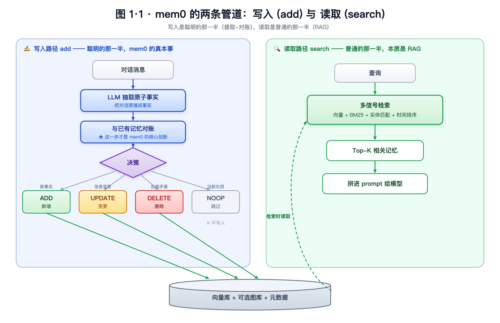

<b>图 1·1｜mem0 的两条管道</b>——写入 (add) 是聪明的那一半（提取 → 对账 → ADD/UPDATE/DELETE/NOOP 决策 → 写入存储）；读取 (search) 是普通的那一半（多信号检索 → Top-K → prompt）；存储在检索时反向供给读取。

📐 流程图源码（Mermaid，可编辑）

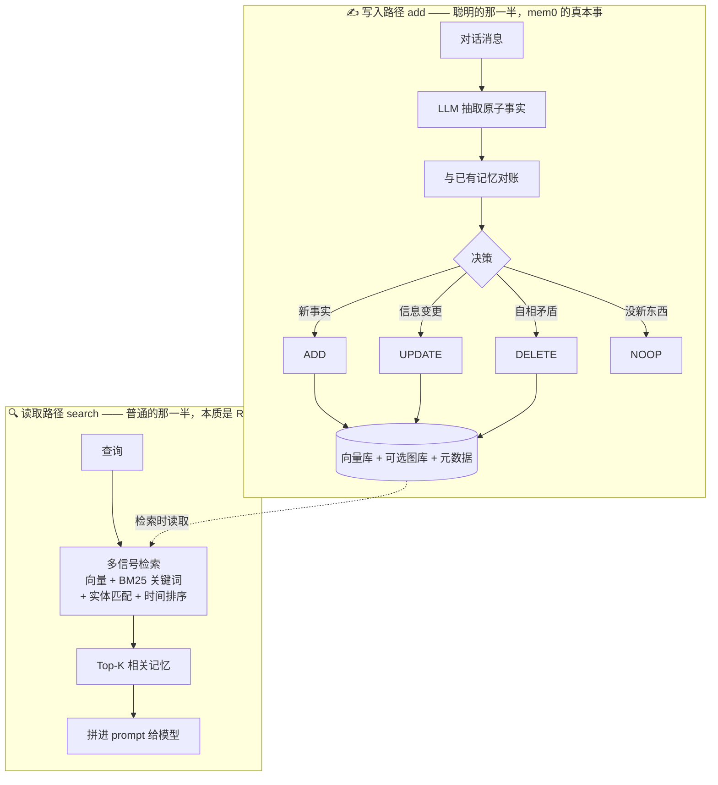

- **写路径（add）**：对话进来 → LLM 抽取原子"事实" → 与已有记忆**对账**，做四选一决策（`ADD` 新增 / `UPDATE` 变更 / `DELETE` 矛盾 / `NOOP` 无新增）→ 写入向量库（+ 可选图库 + 元数据）。
- **读路径（search）**：查询向量化 → **多信号检索**（语义向量 + BM25 关键词 + 实体匹配 + 时间排序，并行打分融合）→ 取 Top-K → 拼进 prompt。

> **关键认知**：mem0 真正的创新不在存储（向量库 + RAG 是大路货），而在写入侧那个**"抽取事实 + 和旧记忆对账"**的步骤——"你说过在 A 公司，现在说换工作了 → 它 UPDATE 旧记录而非新增矛盾"。这个对账逻辑才是它卖的东西。
>
> ⚠️ **版本演进**：论文版用经典的全量对账（ADD/UPDATE/DELETE/NOOP）；当前 README 转向 **"single-pass ADD-only"单次抽取**（用准确性换速度/成本）。这一点影响后文对"写入成本/存储膨胀"的判断。

## 1.3 架构：它是「层」，不是「库」

mem0 没有去造数据库，而是造了一个**架在现有存储之上、可插拔的薄层**。这是它最漂亮的设计抉择，也是大厂能轻松接管它的根本原因。

  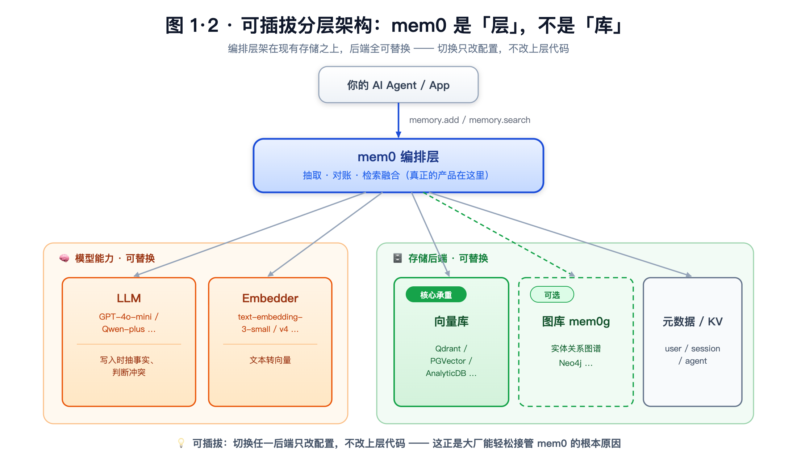

<b>图 1·2｜可插拔分层架构</b>——mem0 编排层（抽取·对账·检索融合）架在可替换的「模型能力（LLM/Embedder）」与「存储后端（向量库/图库 mem0g 可选/元数据）」之上；切换后端只改配置，不改上层代码。

📐 架构图源码（Mermaid，可编辑）

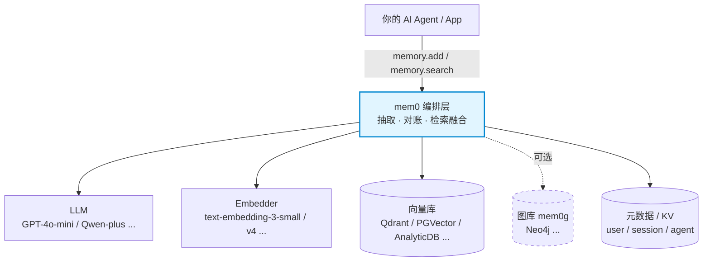

| 部件 | 干什么 | 可替换 |
|---|---|---|
| **LLM** | 写入时抽事实、判断冲突 | GPT 系列 / Qwen 等 |
| **Embedder** | 文本转向量 | text-embedding-3-small / v4 等 |
| **向量库** | 语义存储与检索（核心承重） | Qdrant / PGVector / AnalyticDB… 几十种 |
| **图库（mem0g）** | 实体关系（**可选**） | Neo4j 等 |
| **元数据 / KV** | 三层 scope：User / Session / Agent | — |

## 1.4 优势（站得住的真本事）

1. **设计品味好在"做层不做库"**：可插拔抽象干净，切换后端只改配置不改代码。
2. **"提取-检索"分离方向正确**：记忆的价值在"压缩 + 按需召回"，不在堆历史。
3. **写入侧"对账逻辑"是真创新**：自动处理 UPDATE/DELETE 冲突，避免记忆库堆满矛盾记录。
4. **多信号融合检索 > 纯向量召回**：补上关键词与实体的精确匹配。
5. **持久、结构化、跨会话的状态**——这是再长的上下文也给不了的价值。

## 1.5 软肋与风险（挤掉营销水分）

| # | 风险 | 说明 |
|---|---|---|
| 🔴 | **benchmark 数字虚高且不可直接复现** | 招牌数字（LoCoMo ~91.6、LongMemEval ~94.8）全是厂商自测、managed 平台成绩，开源 SDK 拿不到。同赛道 Zep 曾宣称 LoCoMo 84%，被独立复现仅 **58.44%**——整个赛道系统性"自报虚高" |
| 🔴 | **成本账藏了一半** | "省 90% token"只算检索侧，没算提取 pipeline 自己烧的 LLM 调用；第三方实测净节省约 **40%**。写多读少场景可能反而亏 |
| 🔴 | **写入正确性是命门** | 每条消息一次 LLM 调用且会出错（抽错/错误合并/幻觉）。**一条错记忆比没记忆更糟，还会二次污染**——错记忆进下一轮对账输入，误差放大而非线性 |
| 🔴 | **ADD-only 存储膨胀** | 只增不删 → 记忆库随交互膨胀，衰减/清理负担全甩给检索层，长周期检索质量退化 |
| 🟡 | **"省 token"会贬值** | 随长上下文 + prompt 缓存变便宜，省 token 不再是核心价值；真正耐打的是结构化持久状态 |
| 🟡 | **图能力生产常被砍** | README 仅"implied"，落地多为纯向量 |
| 🟡 | **生产稳定性有真实翻车** | 有团队公开从 mem0 切走，称延迟"super bad"、索引不可靠、recall 失败 |
| 🟡 | **商业软肋：价值可被下层截胡** | "做层"的代价——mem0 的价值能被它依赖的数据库/模型厂商顺势吸收。云厂商青睐 mem0，部分正因为它能让用户顺带采购其数据库 + 模型（见第二部分），既是甜蜜也是风险 |
| 🟡 | **多租户隔离是逻辑过滤、非物理分片** | user_id / agent_id 过滤是查询时的逻辑过滤，非存储层物理隔离——理论上存在跨租户泄漏风险（search 绕过过滤）。这是 mem0 自身的安全软肋，与任何物理隔离的承重数据设施融合时都需额外补隔离设计 |

## 1.6 场景适配

| 场景 | 适配 | 为什么 |
|---|---|---|
| 个人助理 / 长期陪伴 / coaching | ✅ 甜区 | 多会话、事实会变，UPDATE 逻辑值钱 |
| 客服 / CRM（回头客） | ✅ 好 | 跨会话记住用户 = 体验提升 |
| 文档型 RAG / 知识问答 | ❌ 用错地方 | 那是普通 RAG |
| 一次性问答 / 单会话 | ❌ 过度设计 | 直接塞上下文更准 |
| 写极频繁的高吞吐 | ⚠️ 警惕 | 每条触发 LLM 提取 = 成本爆炸 |
| 医疗 / 金融等高风险 | ⚠️ 谨慎 | 自动抽取的错记忆有真实危害 |

> **核心 tradeoff**：用"写时一次 LLM 提取成本 + 概率性正确"换"读时 context 瘦身 + 跨会话记忆"。**读写比越高越划算，反之不划算。**

---
---

# 第二部分 · 大厂怎么做：阿里云 vs 火山引擎

同样是 mem0，两家头部大厂把它放在了云架构里**完全不同的层**——而且**都不是简单服务化**，是各用自家基础设施王牌做深度增值。

## 2.1 两家的"云上站位"几乎相反

  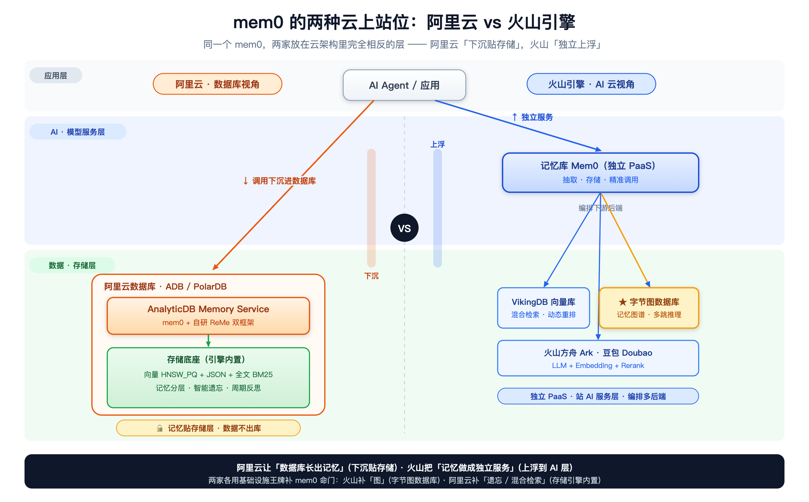

<b>图 2·1｜两种"云上站位"对比</b>——阿里云的 mem0 <b>下沉贴存储层</b>、数据不出库；火山的 mem0 <b>独立上浮到 AI 服务层</b>、编排多后端。同一个 mem0，站位相反。

- **阿里云＝数据库视角**：记忆是数据库长出来的能力，框架挂在 ADB/PolarDB 上，记忆服务**贴着存储层**。
- **火山＝AI 云视角**：记忆是独立托管服务产品（Viking 产品矩阵的一员），站在**模型/AI 服务层**。

## 2.2 阿里云：记忆能力"下沉进数据库"

形态：**"AnalyticDB Memory Service" 记忆服务层**——统一标准化接口 + 嵌入式 SDK，横跨 AnalyticDB for MySQL 与 PolarDB 两条产品线。记忆是数据库的增值层，**不是独立微服务**。

  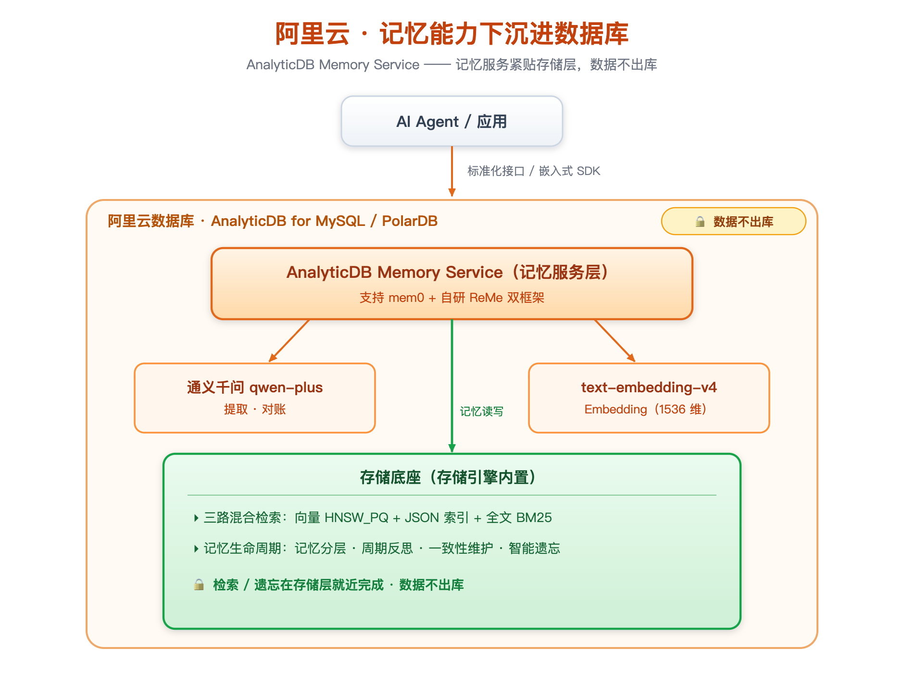

<b>图 2·2｜阿里云架构</b>——记忆服务被 ADB/PolarDB 容器包裹，"下沉进数据库、数据不出库"。

**核心技术 / 增强点：**
1. **三路混合检索做进存储引擎**：向量（HNSW_PQ）+ JSON 索引 + 全文（BM25）。
2. **记忆生命周期内置**：分层管理、周期反思、一致性维护、**智能遗忘**（后台异步）——正面回应 mem0 的"存储膨胀"命门。
3. **自研第二个记忆框架 ReMe**（与 mem0 并列）：行为级记忆，含 TaskMemory（记任务成败）/ ToolMemory（记工具调用效率），跨 Agent 复用。
4. 组件栈：qwen-plus + text-embedding-v4 + ADB/PolarDB。

## 2.3 火山引擎：独立"记忆库"托管服务

形态：**独立托管 PaaS「记忆库 Mem0」**（已公测）——Python/Go/Java SDK + REST API + 控制台 + API Key，与火山方舟 Ark 生态集成。

  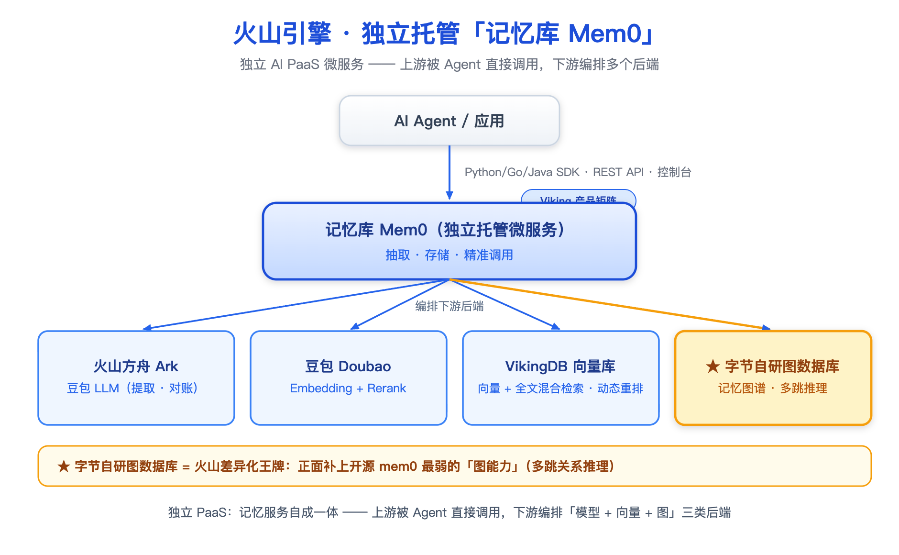

<b>图 2·3｜火山引擎架构</b>——独立 PaaS 自成一体，编排"模型 + 向量 + 图"三类后端；★ 字节自研图数据库为差异化王牌。

**核心技术 / 增强点：**
1. **🔑 字节自研图数据库做"记忆图谱"**：多跳关系推理——正面回应 mem0 的"图能力生产常被砍"命门。
2. **VikingDB 向量库**：内置豆包 Embedding + Rerank，向量 + 全文混合检索 + 动态重排。
3. **完整产品化**：多语言 SDK、REST API、控制台、标签筛选、记忆状态管理、监控告警。

## 2.4 技术对比 & 一个关键观察

| 维度 | 阿里云 | 火山引擎 |
|---|---|---|
| **架构视角** | 数据库增值层 | 独立 AI PaaS |
| **部署形态** | ADB/PolarDB 内的记忆服务 | 托管「记忆库 Mem0」 |
| **LLM** | 通义千问 qwen-plus | 火山方舟 Ark / 豆包 |
| **向量/存储** | AnalyticDB（HNSW_PQ）/ PolarDB | VikingDB |
| **检索** | 向量 + JSON + 全文 BM25 三路 | 向量 + 全文 + 豆包 Rerank |
| **图能力** | （未突出） | ✅ 字节图数据库记忆图谱 |
| **遗忘/生命周期** | ✅ 智能遗忘 + 周期反思 | 记忆状态管理 |
| **框架策略** | mem0 + 自研 ReMe 双框架 | 聚焦增强版 mem0 |

> **🎯 关键观察：两家用各自的基础设施王牌，正好补在开源 mem0 的两个命门上。**
> - 火山有**图数据库** → 补 mem0 的**图能力**
> - 阿里云有**分布式分析库** → 补 mem0 的**混合检索 + 存储膨胀/遗忘**
>
> 大厂花真金白银增强的地方，恰恰是开源版最弱的地方——这反向印证了第一部分对 mem0 命门的判断。

---
---

# 第三部分 · 落到决策：从现状 proxy，到 MaxScale 演进与 mem0 集成的综合判断

> 把前两部分的认知，落到一个**具体的架构演进议题**上：现状是一个**轻量级数据库 proxy**（只做读写分离、仅支持 MySQL）；设想沿 **MariaDB MaxScale 这类可插拔 proxy** 的模式演进——**扩展更多协议**（PostgreSQL / Oracle？），**乃至把 mem0 这类 AI 记忆能力集成进来**。可行吗？值不值得？下面从 **架构可行度 / 方案复杂度 / 公有云商业模式 / 运维** 四个角度做综合判断。

## 3.1 现状与议题：一个"被阉割的分片中间件"，想长成"带记忆的数据访问平台"

**现状的 proxy**：典型的云数据库轻量 proxy（如华为云 RDS for MySQL 代理）架构上**继承自 MyCat**——而 MyCat 本身是个**分库分表中间件**（阿里 Cobar 血统，对外伪装成一台 MySQL）。但它**把分片能力阉割掉，只留下轻量读写分离，且仅支持 MySQL 协议**。所以现状这层 proxy，本质是**一个被阉割的分片中间件残体**：功能固定、协议单一、封闭无扩展点。

| 能力 | 现状 proxy 做什么 |
|---|---|
| **读写分离** | 写请求 → 主库；读请求 → 只读节点（按读权重 / 活跃连接数路由） |
| **连接池** | 会话级连接复用，削短连接频繁建连的开销 |
| **事务拆分** | 事务内"写之前的读"也甩给只读节点，降主库负载 |
| **会话一致性** | 保证同会话读到自己刚写的数据 |
| 分库分表 | ❌ 继承自 MyCat，但**被阉割掉了** |
| 多协议 / 插件 / AI 扩展点 | ❌ 仅 MySQL、固定功能、封闭 |

**议题（设想的演进路径）**：换到 **MaxScale 这类可插拔智能 proxy**（protocol / router / filter 模块运行时加载）→ **扩展协议**（PG / Oracle）→ **乃至集成 mem0**。换 MaxScale 的动机成立：现状 proxy 是"为分片而生、又被砍成单协议"的封闭件，MaxScale 是开放可插拔的。但"扩协议"和"集成 mem0"是**两件性质完全不同的事**，必须分开评判。

先把 proxy、分片中间件（MyCat / DDM）、mem0 三者的定位摆清楚：

  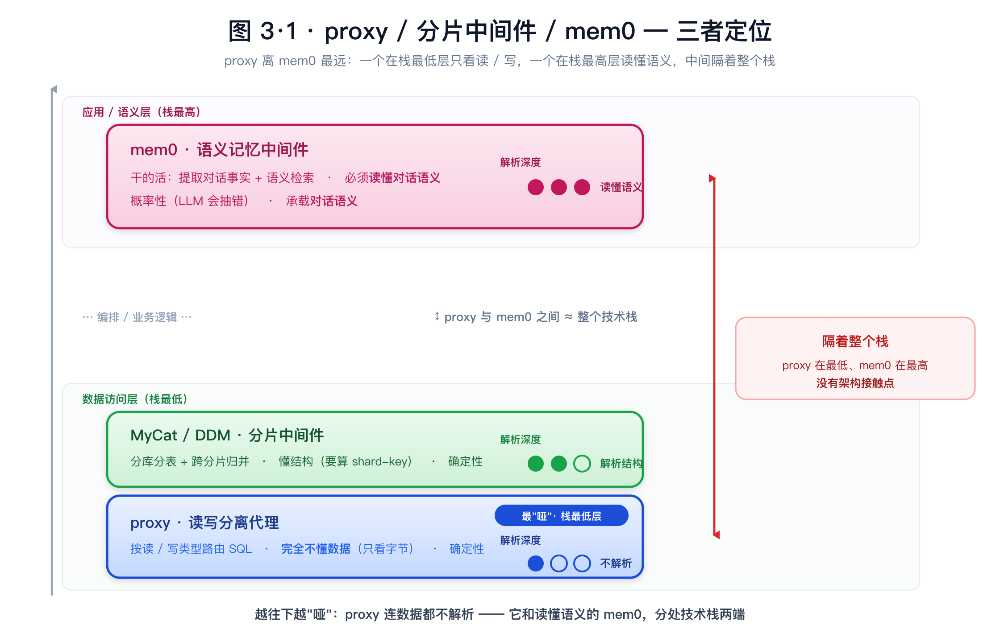

<b>图 3·1｜三者定位</b>——proxy 是最"哑"的 SQL 流量路由器（只看读 / 写，解析深度 ●○○），分片中间件 MyCat / DDM 懂分片结构（●●○），mem0 必须读懂对话语义（●●●）；proxy 在数据访问层最低、mem0 在应用 / 语义层最高，中间隔着整个栈，没有架构接触点。

| 维度 | proxy（读写分离代理） | 分片中间件（MyCat / DDM） | mem0（语义记忆中间件） |
|---|---|---|---|
| 干的活 | 按读写类型路由 SQL | 分库分表 + 跨分片归并 | 提取对话事实 + 语义检索 |
| 懂不懂数据 | **完全不懂**（只看读 / 写） | 懂结构（要算 shard-key） | **必须读懂**（理解对话语义） |
| 确定性 | 确定性（路由规则固定） | 确定性（分片规则固定） | 概率性（LLM 会抽错） |
| 承载的流量 | **SQL 流量** | **SQL 流量** | **对话语义** |
| 栈中位置 | 数据访问层（最低） | 数据访问层（低） | 应用 / 语义层（高） |

> 注意：现状 proxy、MaxScale、MyCat / DDM 都在"SQL 流量层"，唯独 mem0 在最上面的应用 / 语义层。**演进 proxy（横向在 SQL 层做宽）和集成 mem0（纵向跨到语义层）根本不是一个方向。**

## 3.2 角度一 · 架构可行度

**① 演进到 MaxScale 多协议平台：✅ 架构上可行**
从单一 MySQL 读写分离，演进成支持多协议（MySQL / PostgreSQL / Redis 等）、统一接入治理的**数据访问平台**——这是把 proxy 最擅长的"稳、快、确定性的数据访问"做宽，**和 AI 无关**，是站得住的方向；MaxScale 的可插拔架构正是为此设计。
- **PG**：✅ 可行，MaxScale 官方 roadmap 上就有 PG 协议（MXS-4574）。
- **Oracle**：⚠️ 泼冷水。Oracle wire protocol 私有闭源，让 proxy"讲 Oracle 协议"是数量级更大的工程 + 合规风险（别和 MariaDB Server 的 `sql_mode=ORACLE` **SQL 方言**兼容混了，那是 server 层、不是 proxy 协议）。建议 **MySQL + PG 先行、Oracle 单独立项**。

**② 集成 mem0：根本障碍是"不在同一条数据通路"**
这是整个议题的命门。proxy（含 MaxScale）通路里流的是 **SQL 流量**，mem0 吃的是 **对话语义**——两条**完全不相交的数据通路**：

  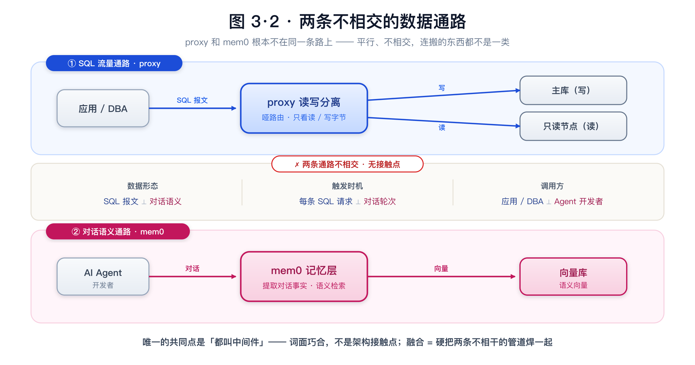

<b>图 3·2｜两条不相交的数据通路</b>——上：应用 → proxy → 主 / 从库，承载 SQL 流量；下：AI Agent → mem0 → 向量库，承载对话语义。两条管道平行不相交，数据形态 / 触发时机 / 调用方三处全不同——唯一共同点"都叫中间件"只是词面巧合。

`SELECT * FROM orders WHERE uid=42` 里**没有对话语义**可供 mem0 提取。MaxScale 可插拔（filter 能挂东西）也不改变这一点——**filter 挂的是 SQL 流，不是对话**。

> **关键分水岭："集成 mem0"要的是哪种"记忆"？** (A) 字面 mem0 = **对话记忆**（吃对话语义、不流经 proxy）→ 进数据通路就是错配；(B) **SQL 操作智能**（语义缓存 / 慢查询 / 索引建议，吃的就是 SQL 流）→ proxy 层合理，但那**不是 mem0**，且要走旁路（见 §3.3）。

> **"那把 MaxScale 改造成支持两条数据链路、给 mem0 喂对话输入呢？"** —— 技术上不是不可行，但它**绕回了原点**：第二条"对话链路"和 SQL 链路**协议 / 后端 / 客户端 / 路由全不共享**，等于在 proxy 进程里**塞一个独立 AI 网关**——这就是下面的 **B1 并列模块**，是"合租"不是"融合"。何况对话本来就在 AI 应用层，让它**绕经一个 DB proxy** 再到 mem0 是**纯多余的一跳**（proxy 对对话流量啥也做不了）。所以"双链路"不创造价值，只是把简单的 B1 复杂化。

把"平台化"愿景拆成两个子命题，可行度一目了然：

  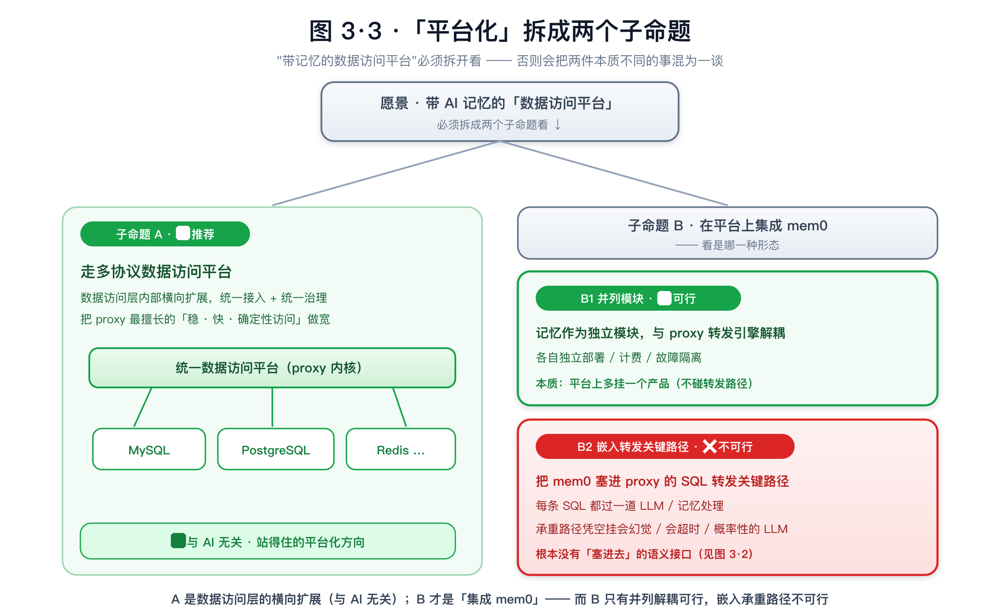

<b>图 3·3｜「平台化」拆成两个子命题</b>——A 多协议数据访问平台 ✅（数据访问层横向扩展，与 AI 无关）；B 集成 mem0 分两路：B1 并列模块 ✅（与转发引擎解耦）vs B2 嵌入 SQL 转发关键路径 ❌（承重路径上凭空挂 LLM）。

| 子命题 | 是什么 | 架构可行度 |
|---|---|---|
| **A 多协议平台** | proxy 横向扩展协议（MySQL / PG / …） | ✅ 可行，正道 |
| **B1 并列模块** | 记忆作为平台上**独立模块**，与转发引擎解耦 | ✅ 可行（本质"平台上多挂一个产品"） |
| **B2 嵌入关键路径** | 把 mem0 / LLM 塞进 **SQL 转发关键路径** | ❌ 不可行（通路错配，没有"塞进去"的语义接口） |

## 3.3 角度二 · 方案复杂度

复杂度的关键，看 AI 挂在**哪条路径**上——同一套可插拔机制，旁路对、嵌入错：

  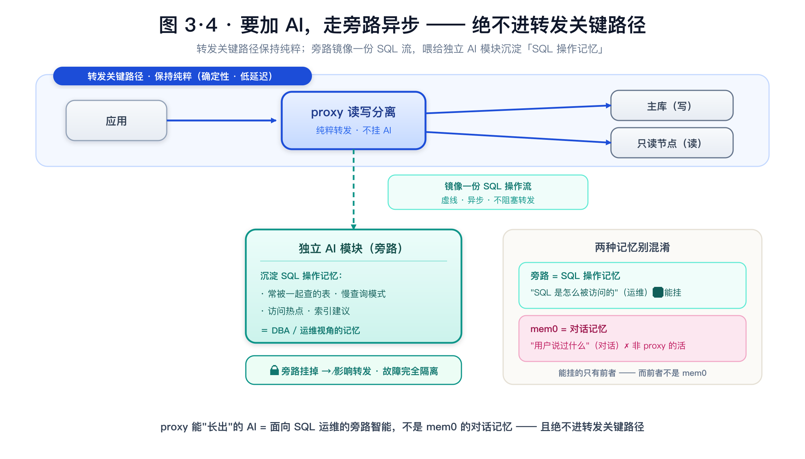

<b>图 3·4｜旁路异步架构</b>——proxy 转发关键路径（应用 → proxy → 主 / 从库）保持纯粹；旁路镜像一份 SQL 操作流（虚线、异步、不阻塞）喂给独立 AI 模块，沉淀 SQL 操作记忆（运维视角）。铁律：旁路挂掉 ↛ 影响转发；能挂的是"SQL 操作记忆"，不是 mem0 的"对话记忆"。

**低复杂度正解 = 旁路 + 异步**：proxy 旁路**镜像**一份 SQL 操作流（不阻塞转发）喂给**独立 AI 模块**，沉淀 **SQL 操作记忆**（哪些表常一起查、慢查询、索引建议——DBA / 运维视角）。MaxScale 原生就给了原语——**tee filter** 异步复制到旁路（官方明说 branch target 是 asynchronous、不阻塞主响应）。铁律：**旁路挂掉 ↛ 影响转发**，故障完全隔离。

**高复杂度灾难 = 嵌入查询链（B2）**：

  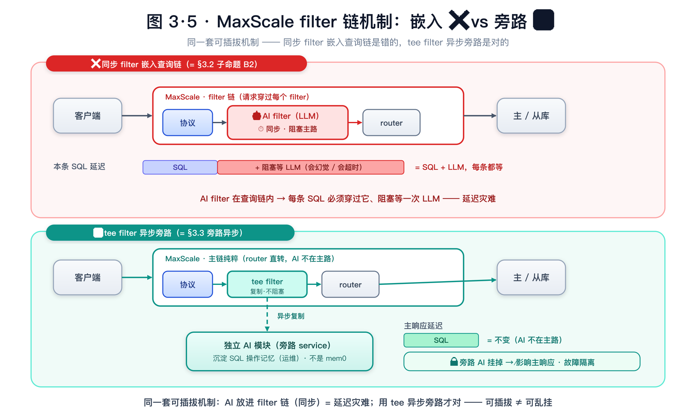

<b>图 3·5｜MaxScale filter 链机制：嵌入 ❌ vs 旁路 ✅</b>——上（❌ 同步 filter）：AI filter 挂在查询链内，每条 SQL 必须穿过它、阻塞等一次 LLM（= §3.2 子命题 B2），延迟 = SQL + LLM；下（✅ tee filter）：tee 把请求异步复制到旁路 service，主响应不阻塞、延迟不变，旁路 AI 模块挂掉也 ↛ 影响转发。同一套可插拔机制，旁路对、嵌入错。

把 AI 做成**同步 filter** 挂在查询链里，每条 SQL 都要阻塞等一次 LLM——p99 延迟爆炸。而上一节说的 **"双数据链路"改造**复杂度同样高：等于在 MaxScale 里从零搭一个对话 / AI 网关 + 公有云多租户隔离 + 接 mem0，**工程量大、产出还是 B1**，投入产出严重错配。

> **复杂度结论**：真要在 proxy 平台上长 AI，**旁路 SQL 智能**是低复杂度、收益清晰的；**嵌入对话 mem0**（无论同步 filter 还是双链路改造）是高复杂度、且方向错的。

## 3.4 角度三 · 公有云商业模式

**① 是运营价值，不是技术协同**：proxy 和 mem0 技术上没有协同点（不同流量、不同通路）。"集成"能产生的价值几乎全在**运营 / 商业**层面——统一控制台、统一计费、买 proxy 顺带采购记忆。这是真价值，但**别把运营捆绑包装成技术创新**。

**② 入口错配**：proxy 是**数据库的流量入口**（DBA / 应用连库）；mem0 是 **AI 应用的入口**（Agent 开发者）。两拨人、两个场景、两种心智，硬塞一个产品里谁都不顺手。

**③ 许可证（公有云对外服务的硬约束）**：若"基于 MaxScale"= **直接用它的代码**做公有云公共 proxy——MaxScale **v25.01 前是 BSL**（Business Source License，**设计初衷就是拦云厂商拿它去卖竞品托管服务**）、**v25.01 起转闭源商业**。这对公有云商业化**大概率是 showstopper**，须法务先评。若 = **借鉴架构自研**（或用真开源的 ProxySQL / ShardingSphere-Proxy），则无此问题。

**④ 大厂旁证**：

| 大厂 | 记忆放在哪 | proxy 层有记忆吗 |
|---|---|---|
| 阿里云 | **下沉进数据库**（ADB / PolarDB 增值层） | ❌ proxy 仍是纯读写分离 / 连接池 / 事务拆分 |
| 火山引擎 | **独立托管 PaaS**（记忆库 Mem0） | ❌ 记忆不在任何 proxy / 数据通路里 |

> 阿里云、火山**自己就是公有云**，记忆能力要么沉进**数据库引擎**、要么做成**独立 PaaS**，**没有一家塞进 proxy / 读写分离层**。以阿里 / 字节的工程力，若"proxy 缝记忆"商业上对，早做了。

## 3.5 角度四 · 运维

公有云 proxy 是**多租户共享的承重设施**，把概率性、依赖外部 LLM 的 mem0 塞进**共享 SQL 转发路径**，运维代价全面放大：

| 运维维度 | 嵌入 mem0 到转发路径的后果 |
|---|---|
| **故障域 / blast radius** | 一个租户的 LLM 抖动 / 超时，拖垮承重 proxy → **所有租户**的 SQL 路由受害 |
| **SLA / 确定性契约** | proxy 承诺强一致低延迟，mem0 只能"尽力而为 + 概率"，一个 SLA 罩不住 |
| **可观测性** | 慢请求穿透"路由 / LLM / 向量"多套子系统，排障方法论混在一起 |
| **迭代节奏** | proxy 求稳低频发版 vs mem0 求快高频迭代，缝一个发版单元 = 两种哲学打架 |
| **安全攻击面** | 承重数据库代理凭空增加 LLM 外发、向量副本、跨租户记忆等新攻击面 |
| **内聚稀释** | "什么都能做"的 proxy 丢了它最该有的"稳 / 快 / 确定性"定位——边界感本身就是价值 |

> 走**旁路异步**（§3.3）则以上全部规避：旁路模块与承重转发**故障隔离、SLA 解耦、各自迭代**。

## 3.6 综合判断与建议

  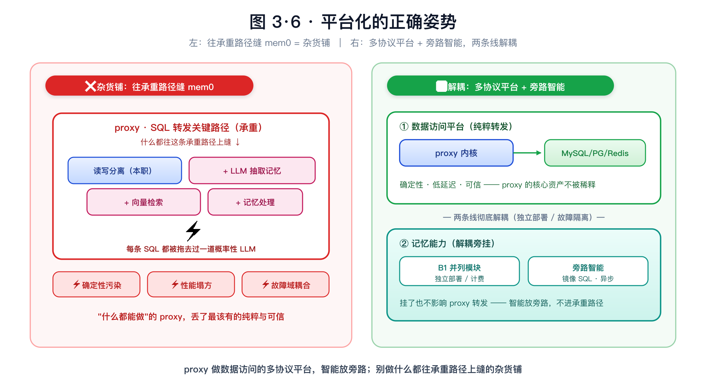

<b>图 3·6｜平台化的正确姿势</b>——左（❌）：往 proxy 承重转发路径上缝 mem0，做成"杂货铺"，确定性污染 / 性能塌方 / 故障域耦合；右（✅）：proxy 做多协议数据访问平台（纯粹转发）+ 记忆走 B1 并列模块 / 旁路智能，两条线彻底解耦。

| 维度 | 演进到 MaxScale 多协议平台 | 集成"对话记忆 mem0"进通路 | proxy 层做"SQL 旁路智能" |
|---|---|---|---|
| **架构可行度** | ✅ 可行（PG 行 / Oracle 单独评） | ❌ 通路错配 | ✅ 可行 |
| **方案复杂度** | 中（协议模块工程） | 高（双链路改造仍绕回 B1） | 低（tee 旁路原生支持） |
| **公有云商业** | ✅ 正道（注意 BSL 许可证） | ⚠️ 只剩运营捆绑 + 入口错配 | ✅ 增值清晰 |
| **运维** | 可控 | ❌ 故障域 / SLA / 安全全面恶化 | ✅ 故障隔离 |

  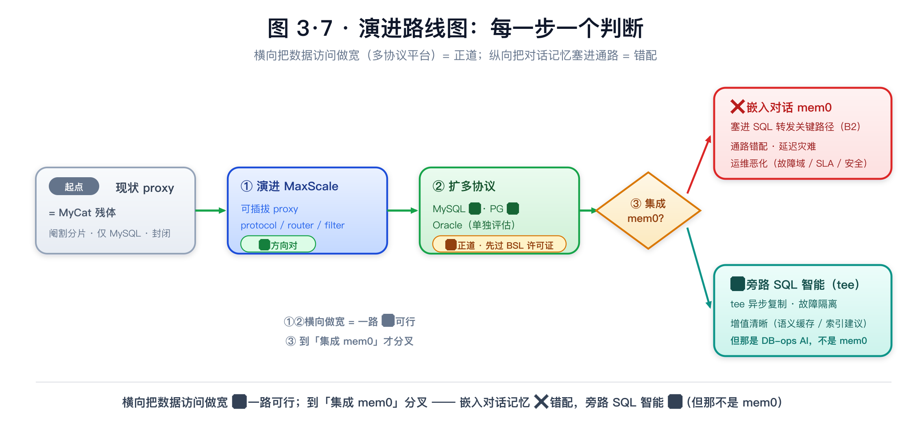

<b>图 3·7｜演进路线图：每一步一个判断</b>——现状 proxy（MyCat 残体：阉割分片 / 仅 MySQL / 封闭）→ ① 演进 MaxScale 可插拔 ✅ → ② 扩多协议（MySQL / PG ✅，Oracle 单独评估，先过 BSL 许可证）✅ → ③ 到「集成 mem0」才分叉：嵌入对话 mem0 进 SQL 转发关键路径 ❌（通路错配 / 延迟灾难 / 运维恶化）vs 旁路 SQL 智能（tee）✅（但那是 DB-ops AI，不是 mem0）。横向把数据访问做宽是正道，纵向把对话记忆塞进通路是错配。

**建议**：
- ✅ **做**：proxy 沿 MaxScale 模式演进成**多协议数据访问平台**（先 MySQL + PG，Oracle 单独评估；"用代码 vs 借鉴自研"先过许可证）。
- ✅ **可做**：要在平台上加 AI，走 **B1 并列模块 + 旁路异步**（tee 镜像 → 独立模块沉淀 **SQL 操作智能**），与转发引擎彻底解耦。真要"一个产品同时给 SQL 和记忆"，正解是**上面加一层薄控制面统一入口 / 计费、下面 MaxScale 管 SQL + mem0 独立管记忆**——不是把对话塞进数据引擎。
- ❌ **别做**：把**对话记忆 mem0** 嵌进 proxy 的 SQL 转发关键路径（B2），或为它改造"双数据链路"——通路错配、复杂度高、运维恶化，绕一圈还是 B1。

> **一句话**：**横向把数据访问做宽（多协议平台）是正道；纵向把对话记忆塞进数据通路是错配。** 要 AI，请放在旁路，且明确那是 SQL 运维智能，不是 mem0 对话记忆。

> 📌 **遗留点（开放问题）**：「把 mem0 这类对话记忆集成进数据访问平台，除运营捆绑外是否有独立价值」——本文判断其技术协同价值有限，但作为产品 / 商业层面的判断保留开放，留待结合具体业务场景进一步探讨。

---
---

## 结语

mem0 是"记忆能力"走完"裸做 → 框架 → 托管服务"这条标准服务化之路的产物：它把记忆逻辑抽象成可复用的层，消除了每个工程重复造轮子的负担。它的工程价值是真的，水分在 benchmark 的百分比和"图很强"的叙事里，命门在写入路径的正确性与成本。

头部大厂的实践给了最好的注脚——**没有谁把它塞进 SQL 读写分离的 proxy 转发层，而是各自用基础设施优势做"解耦的增值"**（阿里沉进数据库、火山做成独立 PaaS）。这也正是"proxy 要不要演进、要不要集成 mem0"这个问题的答案：**让专业的层做专业的事——横向把数据访问做宽（多协议平台）是正道，纵向把对话记忆塞进数据通路是错配；记忆走旁路 / 独立模块，把边界感本身当成价值。**

---

## 信息源

- [GitHub · mem0ai/mem0](https://github.com/mem0ai/mem0) · [mem0.ai 官网](https://mem0.ai/) · [mem0 论文 arXiv:2504.19413](https://arxiv.org/abs/2504.19413)
- [Zep LoCoMo 复现争议](https://github.com/getzep/zep-papers/issues/5) · [VentureBeat 报道](https://venturebeat.com/ai/mem0s-scalable-memory-promises-more-reliable-ai-agents-that-remembers-context-across-lengthy-conversations)
- [阿里云·AnalyticDB 长期记忆](https://help.aliyun.com/zh/analyticdb/analyticdb-for-mysql/long-term-memory/) · [PolarDB Mem0](https://help.aliyun.com/zh/polardb/polardb-for-mysql/polardb-mem0/)
- [火山·记忆库 Mem0](https://www.volcengine.com/docs/86722/2163628) · [VikingDB](https://www.volcengine.com/docs/84313/1254439)
- [华为云·RDS for MySQL 数据库代理（读写分离）简介](https://support.huaweicloud.com/usermanual-rds-mysql/rds_11_0016.html) · [代理内核版本升级](https://support.huaweicloud.com/intl/zh-cn/usermanual-rds-mysql/rds_11_0024.html) · [约束与限制](https://support.huaweicloud.com/usermanual-rds-mysql/rds_11_0044.html)
- [阿里云·RDS 数据库代理（读写分离）](https://help.aliyun.com/zh/rds/apsaradb-rds-for-mysql/what-are-database-proxies) · [华为云·DDM（分片中间件，对比参考）](https://support.huaweicloud.com/productdesc-ddm/ddm_01_0001.html)
- [MariaDB MaxScale·架构与插件模型](https://mariadb.com/docs/maxscale/maxscale-architecture/mariadb-maxscale-guide) · [PG 协议工单 MXS-4574](https://jira.mariadb.org/browse/MXS-4574) · [Tee Filter（异步旁路）](https://mariadb.com/docs/maxscale/reference/maxscale-filters/maxscale-tee-filter) · [MaxScale BSL 许可证 FAQ](https://mariadb.com/bsl-faq-mariadb/)
- [MyCat（分库分表中间件，Cobar 血统）](https://github.com/MyCATApache/Mycat2)

> benchmark 数字均为厂商自测，缺独立第三方复现；本文已按"方向性参考"处理。

