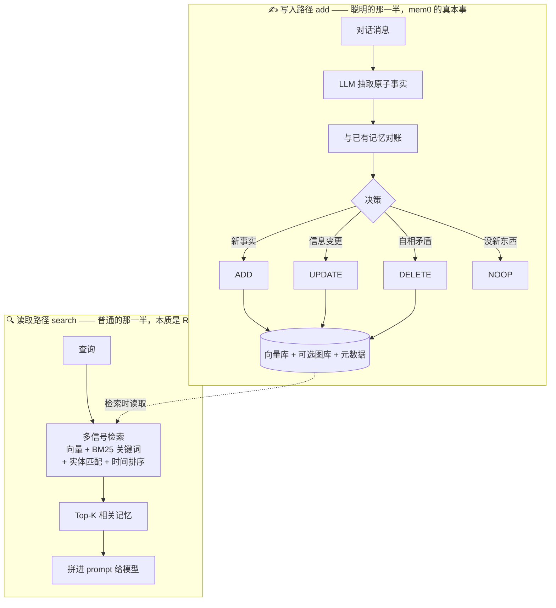
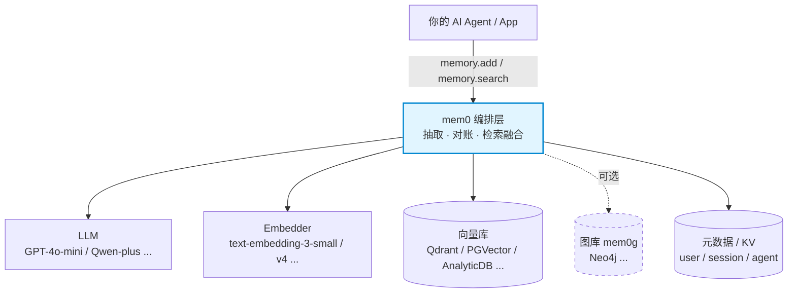
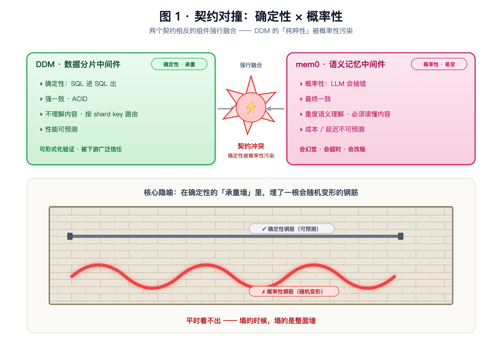
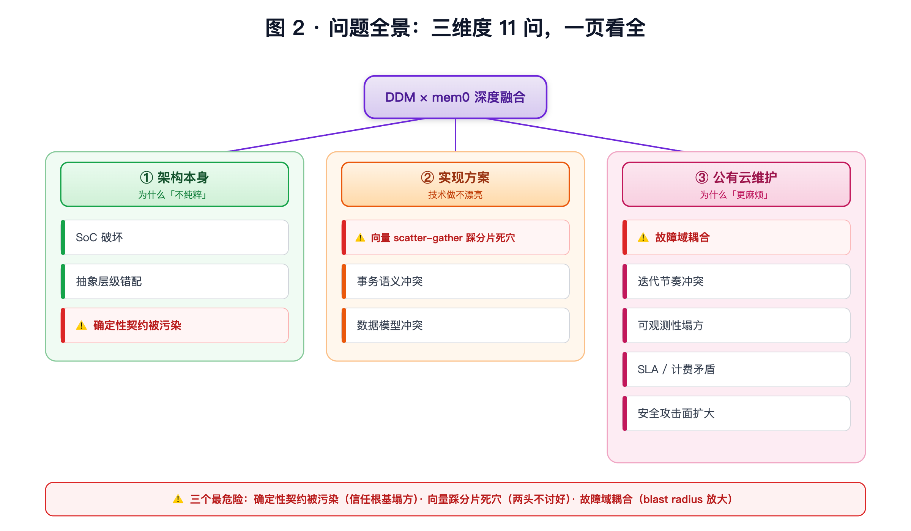
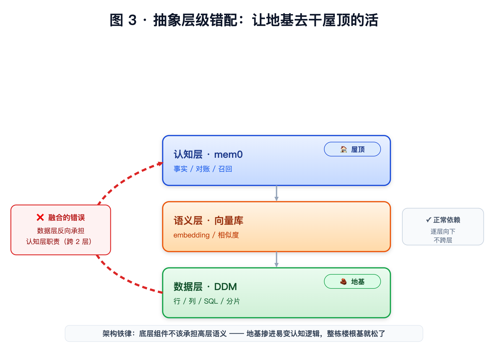
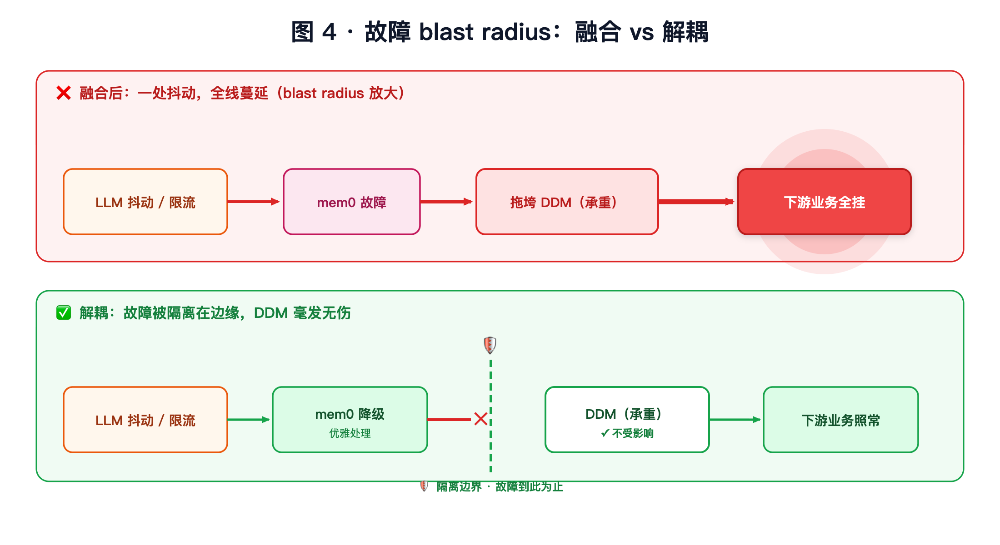
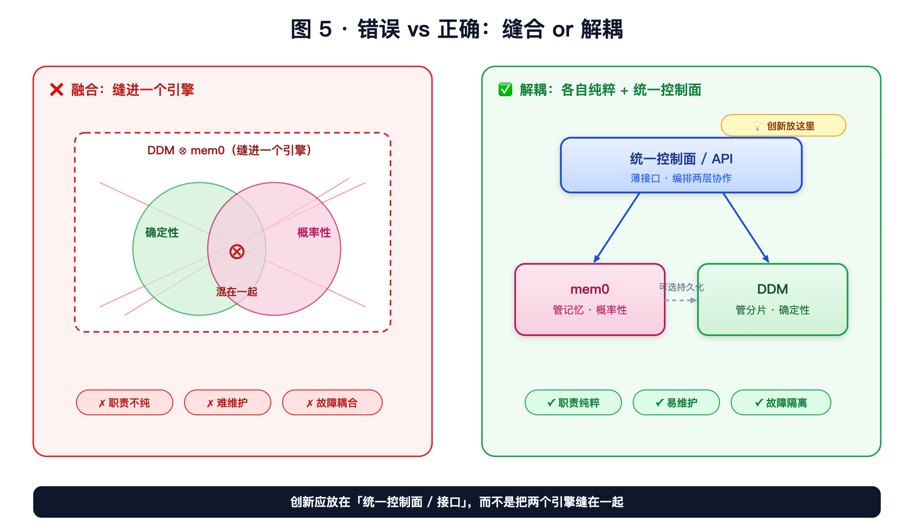

# Mem0 全景解析：从原理、大厂实践，到架构决策

> 一份关于 AI Agent 记忆层 **mem0** 的完整技术解读。三段递进：**先认识它**（是什么 / 原理 / 架构）→ **再看头部大厂怎么用**（阿里云 vs 火山引擎）→ **最后落到架构决策**（要不要把它和数据库中间件 DDM 结合）。以图文解说为主。
>
> | | |
> |---|---|
> | **版本** | 2026-06 整合版 |
> | **阅读地图** | 第一部分（原理）≈ 10 分钟 · 第二部分（大厂实践）≈ 8 分钟 · 第三部分（架构决策）≈ 10 分钟 |
> | **证据等级** | 一手：GitHub README / 官网 / 阿里云·火山官方文档；第三方：批评性搜索与独立评测。**benchmark 数字均为厂商自测，按"方向性参考"对待。** vendor 宣称效果（"抑制幻觉"等）打折扣，组件名 / 算法名为技术事实。 |

---

## TL;DR（30 秒全局）

1. **mem0 是什么**：给 AI Agent 的「记忆中间件」——用一次额外的 LLM 提取，把对话蒸馏成结构化事实存进向量库，下次只取相关的几条递给模型。真本事在"写入侧的提取-对账逻辑"，软肋在 benchmark 水分、提取成本、写入正确性。
2. **大厂怎么做**：**阿里云**把记忆能力**下沉进数据库**（ADB/PolarDB 增值层）；**火山引擎**做成**独立托管 PaaS**（记忆库 Mem0）。两家都不是简单服务化，而是各用基础设施王牌补 mem0 的命门。
3. **要不要和 DDM 结合**：mem0 与 DDM 同属"访问中间件"范式但**职责正交**（一个概率性语义、一个确定性分片）。**结论：可叠放，不可深度融合**——把概率性缝进确定性的承重基础设施，是拿地基冒险。

---
---

# 第一部分 · 认识 mem0：是什么、原理、架构

## 1.1 一句话与它解决的问题

**mem0（读作 "mem-zero"）是给 AI Agent / App 用的记忆层（memory layer）**，让 AI 跨会话、跨 Agent 记住用户，同时不撑爆上下文。

打个比方，它像一个**秘书**——边听边记笔记、笔记过时了就改、用时只翻出相关那一页递给你，而不是把整段录音重放一遍。

它解决的是两个极端之间的中庸：

| 路线 | 做法 | 问题 |
|---|---|---|
| **全记** | 把整段历史塞进上下文 | 贵、慢、撞上下文上限，信噪比差 |
| **mem0（中庸）** | 记结构化事实，按需召回 | 像人脑：记的不是录音带，而是会被不断改写的事实 |
| **全忘** | 无状态，每次从零 | Agent 永远"失忆" |

## 1.2 核心原理：只有两条管道

理解 mem0，抓住两条管道就懂了八成：**写入（add）** 与 **读取（search）**。

  

<b>图 1·1｜mem0 的两条管道</b>——写入 (add) 是聪明的那一半（提取 → 对账 → ADD/UPDATE/DELETE/NOOP 决策 → 写入存储）；读取 (search) 是普通的那一半（多信号检索 → Top-K → prompt）；存储在检索时反向供给读取。

📐 流程图源码（Mermaid，可编辑）

- **写路径（add）**：对话进来 → LLM 抽取原子"事实" → 与已有记忆**对账**，做四选一决策（`ADD` 新增 / `UPDATE` 变更 / `DELETE` 矛盾 / `NOOP` 无新增）→ 写入向量库（+ 可选图库 + 元数据）。
- **读路径（search）**：查询向量化 → **多信号检索**（语义向量 + BM25 关键词 + 实体匹配 + 时间排序，并行打分融合）→ 取 Top-K → 拼进 prompt。

> **关键认知**：mem0 真正的创新不在存储（向量库 + RAG 是大路货），而在写入侧那个**"抽取事实 + 和旧记忆对账"**的步骤——"你说过在 A 公司，现在说换工作了 → 它 UPDATE 旧记录而非新增矛盾"。这个对账逻辑才是它卖的东西。
>
> ⚠️ **版本演进**：论文版用经典的全量对账（ADD/UPDATE/DELETE/NOOP）；当前 README 转向 **"single-pass ADD-only"单次抽取**（用准确性换速度/成本）。这一点影响后文对"写入成本/存储膨胀"的判断。

## 1.3 架构：它是「层」，不是「库」

mem0 没有去造数据库，而是造了一个**架在现有存储之上、可插拔的薄层**。这是它最漂亮的设计抉择，也是大厂能轻松接管它的根本原因。

  

<b>图 1·2｜可插拔分层架构</b>——mem0 编排层（抽取·对账·检索融合）架在可替换的「模型能力（LLM/Embedder）」与「存储后端（向量库/图库 mem0g 可选/元数据）」之上；切换后端只改配置，不改上层代码。

📐 架构图源码（Mermaid，可编辑）

| 部件 | 干什么 | 可替换 |
|---|---|---|
| **LLM** | 写入时抽事实、判断冲突 | GPT 系列 / Qwen 等 |
| **Embedder** | 文本转向量 | text-embedding-3-small / v4 等 |
| **向量库** | 语义存储与检索（核心承重） | Qdrant / PGVector / AnalyticDB… 几十种 |
| **图库（mem0g）** | 实体关系（**可选**） | Neo4j 等 |
| **元数据 / KV** | 三层 scope：User / Session / Agent | — |

## 1.4 优势（站得住的真本事）

1. **设计品味好在"做层不做库"**：可插拔抽象干净，切换后端只改配置不改代码。
2. **"提取-检索"分离方向正确**：记忆的价值在"压缩 + 按需召回"，不在堆历史。
3. **写入侧"对账逻辑"是真创新**：自动处理 UPDATE/DELETE 冲突，避免记忆库堆满矛盾记录。
4. **多信号融合检索 > 纯向量召回**：补上关键词与实体的精确匹配。
5. **持久、结构化、跨会话的状态**——这是再长的上下文也给不了的价值。

## 1.5 软肋与风险（挤掉营销水分）

| # | 风险 | 说明 |
|---|---|---|
| 🔴 | **benchmark 数字虚高且不可直接复现** | 招牌数字（LoCoMo ~91.6、LongMemEval ~94.8）全是厂商自测、managed 平台成绩，开源 SDK 拿不到。同赛道 Zep 曾宣称 LoCoMo 84%，被独立复现仅 **58.44%**——整个赛道系统性"自报虚高" |
| 🔴 | **成本账藏了一半** | "省 90% token"只算检索侧，没算提取 pipeline 自己烧的 LLM 调用；第三方实测净节省约 **40%**。写多读少场景可能反而亏 |
| 🔴 | **写入正确性是命门** | 每条消息一次 LLM 调用且会出错（抽错/错误合并/幻觉）。**一条错记忆比没记忆更糟，还会二次污染**——错记忆进下一轮对账输入，误差放大而非线性 |
| 🔴 | **ADD-only 存储膨胀** | 只增不删 → 记忆库随交互膨胀，衰减/清理负担全甩给检索层，长周期检索质量退化 |
| 🟡 | **"省 token"会贬值** | 随长上下文 + prompt 缓存变便宜，省 token 不再是核心价值；真正耐打的是结构化持久状态 |
| 🟡 | **图能力生产常被砍** | README 仅"implied"，落地多为纯向量 |
| 🟡 | **生产稳定性有真实翻车** | 有团队公开从 mem0 切走，称延迟"super bad"、索引不可靠、recall 失败 |
| 🟡 | **商业软肋：价值可被下层截胡** | "做层"的代价——mem0 的价值能被它依赖的数据库/模型厂商顺势吸收。云厂商青睐 mem0，部分正因为它能让用户顺带采购其数据库 + 模型（见第二部分），既是甜蜜也是风险 |
| 🟡 | **多租户隔离是逻辑过滤、非物理分片** | user_id / agent_id 过滤是查询时的逻辑过滤，非存储层物理隔离——理论上存在跨租户泄漏风险（search 绕过过滤）；与 DDM 的分片物理隔离形成对比，深度融合时租户安全模型不一致 |

## 1.6 场景适配

| 场景 | 适配 | 为什么 |
|---|---|---|
| 个人助理 / 长期陪伴 / coaching | ✅ 甜区 | 多会话、事实会变，UPDATE 逻辑值钱 |
| 客服 / CRM（回头客） | ✅ 好 | 跨会话记住用户 = 体验提升 |
| 文档型 RAG / 知识问答 | ❌ 用错地方 | 那是普通 RAG |
| 一次性问答 / 单会话 | ❌ 过度设计 | 直接塞上下文更准 |
| 写极频繁的高吞吐 | ⚠️ 警惕 | 每条触发 LLM 提取 = 成本爆炸 |
| 医疗 / 金融等高风险 | ⚠️ 谨慎 | 自动抽取的错记忆有真实危害 |

> **核心 tradeoff**：用"写时一次 LLM 提取成本 + 概率性正确"换"读时 context 瘦身 + 跨会话记忆"。**读写比越高越划算，反之不划算。**

---
---

# 第二部分 · 大厂怎么做：阿里云 vs 火山引擎

同样是 mem0，两家头部大厂把它放在了云架构里**完全不同的层**——而且**都不是简单服务化**，是各用自家基础设施王牌做深度增值。

## 2.1 两家的"云上站位"几乎相反

  

<b>图 2·1｜两种"云上站位"对比</b>——阿里云的 mem0 <b>下沉贴存储层</b>、数据不出库；火山的 mem0 <b>独立上浮到 AI 服务层</b>、编排多后端。同一个 mem0，站位相反。

- **阿里云＝数据库视角**：记忆是数据库长出来的能力，框架挂在 ADB/PolarDB 上，记忆服务**贴着存储层**。
- **火山＝AI 云视角**：记忆是独立托管服务产品（Viking 产品矩阵的一员），站在**模型/AI 服务层**。

## 2.2 阿里云：记忆能力"下沉进数据库"

形态：**"AnalyticDB Memory Service" 记忆服务层**——统一标准化接口 + 嵌入式 SDK，横跨 AnalyticDB for MySQL 与 PolarDB 两条产品线。记忆是数据库的增值层，**不是独立微服务**。

  

<b>图 2·2｜阿里云架构</b>——记忆服务被 ADB/PolarDB 容器包裹，"下沉进数据库、数据不出库"。

**核心技术 / 增强点：**
1. **三路混合检索做进存储引擎**：向量（HNSW_PQ）+ JSON 索引 + 全文（BM25）。
2. **记忆生命周期内置**：分层管理、周期反思、一致性维护、**智能遗忘**（后台异步）——正面回应 mem0 的"存储膨胀"命门。
3. **自研第二个记忆框架 ReMe**（与 mem0 并列）：行为级记忆，含 TaskMemory（记任务成败）/ ToolMemory（记工具调用效率），跨 Agent 复用。
4. 组件栈：qwen-plus + text-embedding-v4 + ADB/PolarDB。

## 2.3 火山引擎：独立"记忆库"托管服务

形态：**独立托管 PaaS「记忆库 Mem0」**（已公测）——Python/Go/Java SDK + REST API + 控制台 + API Key，与火山方舟 Ark 生态集成。

  

<b>图 2·3｜火山引擎架构</b>——独立 PaaS 自成一体，编排"模型 + 向量 + 图"三类后端；★ 字节自研图数据库为差异化王牌。

**核心技术 / 增强点：**
1. **🔑 字节自研图数据库做"记忆图谱"**：多跳关系推理——正面回应 mem0 的"图能力生产常被砍"命门。
2. **VikingDB 向量库**：内置豆包 Embedding + Rerank，向量 + 全文混合检索 + 动态重排。
3. **完整产品化**：多语言 SDK、REST API、控制台、标签筛选、记忆状态管理、监控告警。

## 2.4 技术对比 & 一个关键观察

| 维度 | 阿里云 | 火山引擎 |
|---|---|---|
| **架构视角** | 数据库增值层 | 独立 AI PaaS |
| **部署形态** | ADB/PolarDB 内的记忆服务 | 托管「记忆库 Mem0」 |
| **LLM** | 通义千问 qwen-plus | 火山方舟 Ark / 豆包 |
| **向量/存储** | AnalyticDB（HNSW_PQ）/ PolarDB | VikingDB |
| **检索** | 向量 + JSON + 全文 BM25 三路 | 向量 + 全文 + 豆包 Rerank |
| **图能力** | （未突出） | ✅ 字节图数据库记忆图谱 |
| **遗忘/生命周期** | ✅ 智能遗忘 + 周期反思 | 记忆状态管理 |
| **框架策略** | mem0 + 自研 ReMe 双框架 | 聚焦增强版 mem0 |

> **🎯 关键观察：两家用各自的基础设施王牌，正好补在开源 mem0 的两个命门上。**
> - 火山有**图数据库** → 补 mem0 的**图能力**
> - 阿里云有**分布式分析库** → 补 mem0 的**混合检索 + 存储膨胀/遗忘**
>
> 大厂花真金白银增强的地方，恰恰是开源版最弱的地方——这反向印证了第一部分对 mem0 命门的判断。

---
---

# 第三部分 · 落到决策：和 DDM 结合的思考与建议

> 一个常被提出的"创新"设想：把数据库中间件 **DDM**（分布式数据库中间件，做分库分表 / 读写分离 / SQL 路由）和 mem0 结合。下面从架构角度系统分析它的可行性与风险。

## 3.1 先厘清：mem0 和 DDM 的架构定位

两者其实是**同一种架构物种**——**access middleware（访问中间件）**：架在应用与存储之间，对上统一抽象、对下编排多后端、对应用透明、provider 可插拔。

但**同"形"、异"质"**——范式骨架同构，职责却正交：

| 维度 | DDM（数据分片中间件） | mem0（语义记忆中间件） |
|---|---|---|
| 解决的瓶颈 | 物理容量：单库装不下 | 认知容量：上下文记不住 |
| 抽象的轴 | 水平扩展（数据切片散到多库） | 语义压缩（长对话蒸馏成事实） |
| 确定性 | **确定性**（SQL 进 SQL 出，无损） | **概率性**（LLM 会抽错，检索是相似度） |
| 对数据的态度 | **搬运工**：透传，不改语义 | **加工厂**：LLM 提取/改写，重塑数据 |
| 栈中位置 | 数据访问层（低） | 应用/语义层（高） |

> **最锋利的那条线**：**DDM 不需要理解数据，mem0 必须读懂对话**。DDM 把一行路由到分片 3，不关心它什么意思；mem0 把"我换工作了"提取成事实去 UPDATE，必须读懂语义。这条线划开了"数据中间件"与"认知中间件"。

## 3.2 「融合」指哪种

| 形态 | 是什么 | 判定 |
|---|---|---|
| **分层叠放** | DDM 在下、mem0 在上，各干各的 | ✅ 正常架构，没问题 |
| **深度耦合** | 把 mem0 逻辑塞进 DDM / 让 DDM 管记忆 | ⚠️ 下面批判的就是这种 |

## 3.3 深度融合的问题

> **核心判断：DDM 的全部价值建立在「确定性」上；mem0 的本质是「概率性」。把概率性缝进一个承重的确定性基础设施，等于在承重墙里埋一根会随机变形的钢筋——平时看不出，塌的时候塌整面墙。**

  

<b>图 3·1｜契约对撞</b>——两个契约相反的组件强行合并，DDM 的"纯粹性"被污染。

问题分三个维度，共 11 项：

  

<b>图 3·2｜问题全景</b>——三维度 11 个问题；③ 公有云维护问题最多，⚠️ 标出三个最危险。

### 维度一 · 架构本身（为什么"不纯粹"）

- **SoC 破坏**：两个契约相反的职责同处一层，DDM 的纯粹性被污染。
- **抽象层级错配**：数据层被迫干认知层的活，反向跨 2 层。
- **确定性契约被污染** ⚠️：DDM 是被下游广泛信任的承重设施，掺进会幻觉/超时的 LLM，"永远正确路由"的承诺被打破，信任根基塌方。

  

<b>图 3·3｜抽象层级错配</b>——融合让地基（数据层 DDM）去干屋顶（认知层 mem0）的活。

### 维度二 · 实现方案（技术做不漂亮）

- **向量检索踩分片死穴** ⚠️：向量 ANN 是 scatter-gather（全分片扫 + 归并），正是分库分表最怕的跨分片聚合；DDM 的 shard-key 路由优势完全用不上。
- **事务语义冲突**：DDM 写入是 ACID，mem0 写入是"LLM 异步提取 + 概率对账"，塞进事务边界两难。
- **数据模型冲突**：DDM 固定 schema 关系表 vs mem0 向量 + 元数据 + 图，必有一方被扭曲。

> 硬融合既拿不到 DDM 的分片路由优势，又拿不到专用向量库的 ANN 性能——**两边长处都丢。**

### 维度三 · 公有云维护（为什么"更麻烦"）

- **故障域耦合** ⚠️：mem0 的外部 LLM 一抖动，拖垮承重 DDM，下游全挂。
- **迭代节奏冲突**：DDM 求稳·低频发版 vs mem0 求快·高频迭代，缝一个发版单元 = 两种哲学打架。
- **可观测性塌方**：慢请求穿透"分片 / LLM / 向量"三套子系统，两套排障方法论混在一起。
- **SLA / 计费矛盾**：DDM 承诺强一致，mem0 只能"尽力而为 + 概率"，对外无法用一个 SLA。
- **安全攻击面扩大**：给承重数据库凭空增加 LLM 外发、向量副本、跨租户记忆等新攻击面。

  

<b>图 3·4｜故障域 blast radius</b>——融合把"边缘易变"的 AI 故障引进"核心承重"的数据库；解耦则把故障挡在隔离边界外。

## 3.4 正确姿势：解耦，不融合

  

<b>图 3·5｜错误 vs 正确</b>——创新应放在"统一控制面 / 接口"，而非缝合引擎。

- **DDM 保持纯粹**（只管数据分片），**mem0 独立**（管记忆），两者**叠放但不耦合**。
- 真要创新，创新点放在**让两层协作更顺滑的接口 / 控制面**（统一 API、统一控制台、数据就近），而不是把两个引擎缝在一起。

**最强反证：大厂自己怎么做的**（见第二部分）：

| 大厂 | 实际做法 | 把 DDM 缝进 mem0？ |
|---|---|---|
| 阿里云 | 数据库**自己长出**记忆/向量能力 | ❌ 没有 |
| 火山 | 记忆做成**独立托管 PaaS** | ❌ 没有 |

> 以阿里云 / 字节的工程能力，若"缝引擎"是对的，早做了。**他们都没做——这本身就是答案。**

## 3.5 结论与建议

> **一个组件的可维护性，与它职责的纯粹度成正比。DDM × mem0 深度融合，是拿 DDM 最大的资产——确定性与纯粹性——去换一个本可解耦干净实现的功能。这不是创新，是拿地基冒险。**

- ✅ **推荐**：分层叠放 + 统一控制面。各自纯粹，创新放在接口层。
- ❌ **不推荐**：把 mem0 逻辑缝进 DDM 引擎。
- 💡 若有人主张"融合能减少跨系统调用 / 数据就近"——那些收益靠"解耦叠放 + 统一控制面"就能拿到，不需要牺牲 DDM 的纯粹性去换。

---
---

## 结语

mem0 是"记忆能力"走完"裸做 → 框架 → 托管服务"这条标准服务化之路的产物：它把记忆逻辑抽象成可复用的层，消除了每个工程重复造轮子的负担。它的工程价值是真的，水分在 benchmark 的百分比和"图很强"的叙事里，命门在写入路径的正确性与成本。

头部大厂的实践给了最好的注脚——**没有谁去把它和数据库中间件缝成一个引擎，而是各自用基础设施优势做"解耦的增值"**。这也正是"要不要和 DDM 结合"这个问题的答案：**让专业的层做专业的事，把创新放在接口，而不是混淆边界。**

---

## 信息源

- [GitHub · mem0ai/mem0](https://github.com/mem0ai/mem0) · [mem0.ai 官网](https://mem0.ai/) · [mem0 论文 arXiv:2504.19413](https://arxiv.org/abs/2504.19413)
- [Zep LoCoMo 复现争议](https://github.com/getzep/zep-papers/issues/5) · [VentureBeat 报道](https://venturebeat.com/ai/mem0s-scalable-memory-promises-more-reliable-ai-agents-that-remembers-context-across-lengthy-conversations)
- [阿里云·AnalyticDB 长期记忆](https://help.aliyun.com/zh/analyticdb/analyticdb-for-mysql/long-term-memory/) · [PolarDB Mem0](https://help.aliyun.com/zh/polardb/polardb-for-mysql/polardb-mem0/)
- [火山·记忆库 Mem0](https://www.volcengine.com/docs/86722/2163628) · [VikingDB](https://www.volcengine.com/docs/84313/1254439)
- [华为云·分布式数据库中间件 DDM](https://support.huaweicloud.com/productdesc-ddm/ddm_01_0001.html)

> benchmark 数字均为厂商自测，缺独立第三方复现；本文已按"方向性参考"处理。

